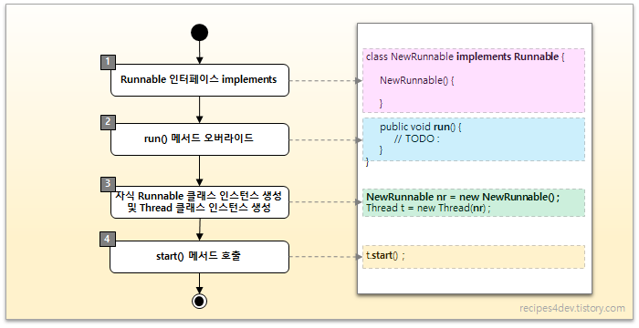
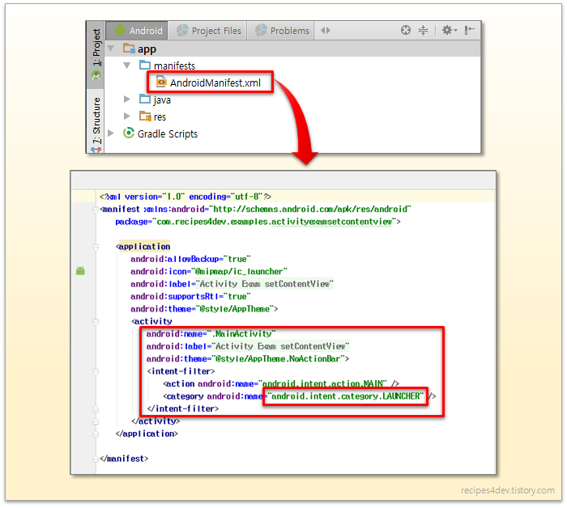
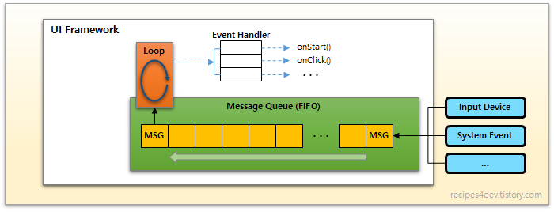
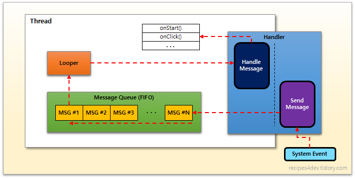
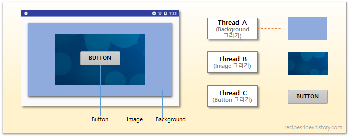
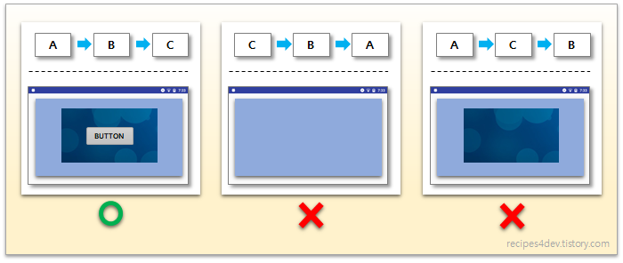

# Android Thread

> 스레드란, 프로세스 내에서 "순차적으로 실행되는 실행 흐름"의 최소 단위이다.
>
> 프로그램의 main() 함수부터 시작되는 최초 실행 흐름 또한 하나의 스레드이며, 이를 메인 스레드 라고 한다.


> 안드로이드 앱에서 메인 스레드는 메시지 큐 (Message Queue) 수신을 대기하는 루프를 실행하며, 사용자 입력과 시스템 이벤트, 화면 그리기 등의 메시지가 수신되면 각 메시지에 매핑된 핸들러의 메서드를 실행한다.


- 프로그램 : 명령과 데이터로 구성되어 저장 장치에 저장된 형태의 실행코드
- 프로세스 : 운영체제에 의해 메모리에 적재되어 실행 중인 프로그램
- 스레드 : 프로세스 내에서 실행되는 각각의 독립적인 실행 흐름


안드로이드 앱을 만들 때 스레드 관련 기능을 구현하기 위해서는 `Thread` 라는 클래스를 사용하여 구현한다.


`Thread` 클래스를 사용하여 새로운 스레드를 생성하고 실행하는 방법은 두 가지가 있다.

1. `Thread` 클래스 상속하여 run() 메서드 오버라이드 하는 것
2. `Runnable` 인터페이스를 구현한 클래스를 선언 후 run() 메서드 작성하는 것


공통적으로 각 방법을 통해 생성된 클래스 객체의 run() 메서드를, `Thread` 클래스의 start() 메서드를 통해 실행해줌으로써 스레드의 생성 및 실행 과정이 완료된다.


## Thread 클래스 상속 (extends)

`Thread` 클래스 상속한 클래스를 만들고 run() 메서드 오버라이드 한 다음, 인스턴스 생성 후 start 메서드 호출


```kotlin
class NewThread : Thread(){
	override fun run(){
		// 실행코드 
	}
}

val newThread = NewThread()
newThread.start()

```


`Thread` 상속, run() 메서드구현, start() 메서드 호출


## Runnable 인터페이스 구현 (implements)

`Runnable` 인터페이스를 구현하는 클래스 선언 후 run() 메서드 구현, 인스턴스를 `Thread` 클래스 인스턴스의 생성자에 전달하고, `Thread` 인스턴스의 start() 메서드 호출



```kotlin
class NewRunnable : Runnable {
    override fun run(){
        // 실행코드
    }
}

val newRunnable = NewRunnable()
val newThread = Thread(newRunnable)

newThread.start()

```


`Runnable` 인터페이스 구현, run()메서드 구현, `Thread` 인스턴스 생성자에 인터페이스 구현 인스턴스 입력, start() 메서드 호출


## Thread vs Runnable 

> 단순히 run() 메서드만 구현 -> `Runnable` 인터페이스
>
> `Thread` 클래스 기능 오버라이드 및 확장 -> `Thread` 상속

`Thread` 상속해서 만든 스레드와 `Runnable` 인터페이스 구현해서 만든 스레드는, 

작성된 run() 메서드 코드의 실행과 성능이 동일하다.

구현 과정이 차이가 날 뿐이다. 


객체 지향 프로그래밍에서 클래스를 상속한다는 것은, 부모 클래스의 특징을 물려받아 재사용 하는 것을 기본으로, 부모의 기능을 재정의 하거나, 새로운 기능을 추가하여 클래스를 확장하는 것을 의미한다.

이 내용을 달리보면, 클래스의 기능을 재정의 하거나 확장할 필요가 없다면, 굳이 클래스를 상속하지 않아도 된다.


두 가지 방법 중 어떤 것을 선택할 것인지는 `Thread` 클래스 기능의 확장 여부에 따라 결정할 수 있다.

단순히 run() 메서드만을 구현하는 경우라면 `Runnable` 인터페이스를 구현하고,

그 외 `Thread` 클래스가 제공하는 기능을 오버라이드 혹은 확장해야 한다면 `Thread` 클래스 상속한다.

| 항목 | Runnable 인터페이스 구현                    | Thread 클래스 상속                                |
| ---- | ------------------------------------------- | ------------------------------------------------- |
| 코드 | implements Runnable                         | extends Thread                                    |
| 범위 | 단순히 run() 메서드만 구현하는 경우.        | Thread 클래스의 기능 확장이 필요한 경우.          |
| 설계 | 논리적으로 분리된 태스크(Task) 설계에 장점. | 태스크(Task)의 세부적인 기능 수정 및 추가에 장점. |
| 상속 | Runnable 인터페이스에 대한 구현이 간결.     | Thread 클래스 상속에 따른 오버헤드.               |


## Android Main Thread


### 시작점 (entry point)

프로세스의 시작점인 main() 함수에서 시작되는 스레드를 프로세스의 주 실행 흐름, 메인 스레드라고 한다.


안드로이드 스튜디오를 통해 생성한 안드로이드 앱 프로젝트 소스를 보면 main() 함수를 찾을 수 없다.

JVM이 프로그램 실행 시, 프로그램의 시작점이 main() 함수를 찾아서 실행하는 데, 안드로이드 프로젝트에서는 개발자가 직접 main() 함수를 구현할 필요가 없다.

대신, 앱에 포함된 액티비티 중 하나를 런처(Launcher)로 지정함으로써, 해당 액티비티를 앱의 시작점 (entry point)로 만들 수 있다.


액티비티를 런처로 지정하는 코드는, AndroidManifest.xml 파일에서 할 수있다.




개발자가 main() 함수를 직접 구현하지 않아도 된다고해서, 안드로이드에 main() 함수가 존재하지 않거나 앱이 실행 될 때 아무런 준비 과정 없이, 무작정 런처로 지정된 액티비티가 실행되는 것은 아니다.

개발자가 main() 함수를 구현하지 않아도 된다는 것일 뿐, main() 함수와 그 실행 코드는 안드로이드 프레임워크에 이미 구현되어 있다.


main() 함수는 "android.app.ActivityThread" 클래스에 구현되어 있다.

`ActivityThread` 의 main() 함수에는 안드로이드 프레임워크 상에서 앱의 동작에 필요한 여러 준비 동작을 수행하는데, 그 중 가장 중요한 과정이 바로 메인 UI  스레드 (Main UI Thread)를 실행하는 것이다.

그리고 런처로 지정된 액티비티를 찾아서 실행한다.


### Main UI Thread


사용자의 입력(키보드, 마우스, 터치 등)이 중요하게 취급되는 기기에서 하나의 프로그램이 실행되면, main() 함수의 시작부터 종료까지 선형적으로 실행되고 끝나는 경우는 거의 없다.

사용자 입력이 필수인 프로그램에서는 사용자 입력 이벤트를 처리하기 위한 루프(Loop)가 실행되어야 한다.


하지만 루프를 실행한다고해서, 무작정 for, while 문을 실행하는 것이 아니다.

푸르 안에서 입력이 들어올 때 까지 대기해야 한다면 다른 이벤트를 처리할 수 없고, 사용자 입력이 존재하는지 여부를 체크만하고 지속적인 루프 실행을 반복한다면 그 자체가 시스템 자원을 소모 시킬 수 있기 때문에, 루프의 코드는 신중하게 작성되어야 한다.


이런 경우를 위해, UI 프레임워크는 메시지 큐(Message Queue)를 사용하여 루프의 코드를 작성하도록 가이드한다.

메시지 큐는 FIFO (First In First Out) 형시으로 동작하는 자료구조로, 메시지는 사용자 입력을 포함한 시스템의 모든 이벤트를 전달할 때 사용하는 객체이다.

그러므로 스레드 관점에서 메시지 큐는 시스템 이벤트를 발생 순서대로 전달받아 처리하기 위해 사용하는 구조를 의미한다.


시스템 또는 프로세스에서 발생한 새로운 메시지(Message)가 메시지 큐(Message Queue)에 수신되면, 메시지가 담고 있는 내용에 따라 적절한 핸들러 (Handler) 메서드가 호출된다.




여기까지가 일반적인 UI 프레임워크에서의 메인 UI 스레드 기본 동작에 대한 내용이다.

안드로이드 앱의 메인 UI 스레드 동작 또한 이 범주를 벗어나지 않는다.


루프 (Loop), 핸들러 (Handler)의 역할을 수행하는 클래스 구현을 통해 메인 UI 스레드를 작성할 수 있게 해준다.


안드로이드 앱에서 시스템 이벤트를 처리하기 위한 루프(Loop)는 `Looper` 라는 클래스를 통해 실행된다.

`Looper` 클래스의 주 역할은 루프를 실행하고 그 루프 안에서 메시지 큐(Message Queue)로 전달되는 메시지가 존재하는 지 검사하는 것이다. 그리고 새로운 메시지 도착 시, 해당 메시지를 처리할 핸들러(Handler) 메서드를 실행한다.


안드로이드의 핸들러(Handler)는 `Handler` 클래스가 담당한다.

통상적인 개념에서 핸들러는 메시지 수신 시 그 처리를 담당하는 역할만 수행하는데, 안드로이드에서 `Handler` 는 메시지를 보내는 역할까지 포함한다.

안드로이드의 `Handler`는 `Looper` 가 가진 메시지 큐(Message Queue)를 다를 수 있기 때문에, 새로운 메시지를 보내거나, 수신된 메시지에 대한 처리르 담당하는 주체가 되는 것이다.




좀 더 자세한 안드로이드 메인 UI 스레드 코드 구현은 안드로이드 SDK 프레임워크 소스 core/java/android/app/ActivityThread.java 파일의 내용확인


### 화면 그리기

GUI (Graphical user Interface)를 가진 프레임워크가 수행해야 할 가장 중요한 기능 중 하나는 "다양한 구성 요소들을 화면에 그리는 것"이다.

프레임워크의 "그리기 기능"은 반드시 메인 UI 스레드에서만 실행되어야만 한다.


ex)

한 화면을 그리기 위해 여러 스레드를 사용 시

배경에 지정된 색을 칠하는 스레드 A,

이미지를 그리는 스레드 B,

버튼을 그리드 스레드 C






UI를 제대로 표시하기 위해서는 각 요소를 그리는 순서가 절대적으로 중요하기 때문에 반드시 하나의 스레드, 즉 메인 UI 스레드에서 순차적으로 그리도록 만들어야 하는 것이다.


----

참고 사이트

개발자 레시피 티스토리 : https://recipes4dev.tistory.com/143?category=768056