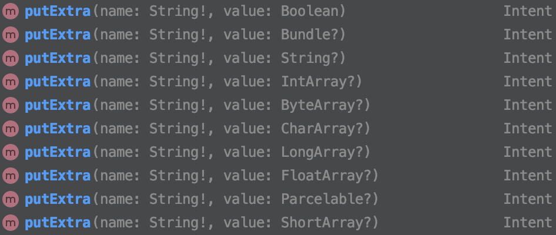

# Bundle

> Activity 간에 데이터를 주고 받을 때 Bundle 클래스를 사용하여 데이터 전송
>
> Activity 중단 시 임시적으로 데이터 저장 및 데이터 호출


Bundle 사전적의미 : 꾸러미, 묶음, 보따리


Bundle이란 Map 형태로 구현된 데이터의 묶음 이다.

Map형태라 Key 값이 String이며, value값에는 Int, String 과 같은 간단한 타입부터 Serializable, Parcelable 같은 복잡한 타입이 들어 올 수 있다.


## 안드로이드에서 Bundle 사용

Android 에서는 Bundle을 다음의 활동에 사용한다.


### Activity의 상태 저장 및 복구

> onSavedInstanceState, onRestoreInstanceState

Bundle은 데이터 저장 객체로 상태 저장 및 복구에 사용된다.


Activity가 onStop() 되기 전에 onsavedInstanceState에서 저장할 데이터를 저장시키며,

onStart() 이후에 onRestoreInstanceState에서 복구 시킨다.

```kotlin
override fun onRestoreInstanceState(savedInstanceState: Bundle){
    val savedProject : Project? = savedInstanceState.getParcelabe("project")
    super.onRestoreInstanceState(savedInstanceState)
}
```

*Activitiy에서 저장된 데이터 복구시키기*


### Intent의 extras를 이용하여 다른 컴포넌트에 데이터 전달

> Intent에서 putExtra메서드를 이용해 데이터를 입력



이 때 입력되는 Extra가 바로 Bundle 객체이다.


## Parcel


Parcel 사전적의미 : 소포, 꾸러미


Parcel은 짐을 싸듯이 객체를 싸는 클래스

Parcel 클래스는 직렬화시 Container역할을 하는 클래스로 말 그대로 꾸러미이다.


### Parcel이 필요한 이유


안드로이드에서 프로세스간 통신을 위해 Bundle 클래스를 사용하는 데, 이러한 Bundle 클래스 는 Map으로 Key, Value가 있는 형태의 클래스 이다.

Bundle은 Int, String 과 같은 간단한 데이터는 그래도 Value 값으로 넣을 순 있지만, data class와 같은 것들은 내부에 많은 데이터가 들어 있기 때문에 Map에 Value로 입력하는 것이 어렵다.


이러한 문제점을 개선하여 Bundle에 Value 값으로 입력될 수 있는 것이 바로 Parcel 이다.


