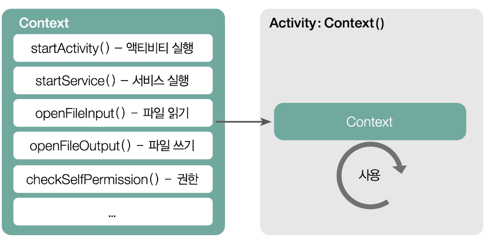

# Context

> 시스템을 사용하기 위한 정보(프로퍼티)와 도구(메서드)가 담겨 있는 클래스
>
> 앱에 관하여 시스템이 관리하고 있는 정보에 접근
>
> 안드로이드 시스템 서비스에서 제공하는 API 를 호출할 수 있는 기능

> 실행주체, 앱과 OS를 연결해주는 매개체 역할
>
> ex) 핸드폰의 파일 기능을 쓰는데, OS에게 누가 (쓰는 주체) 쓰는지 알려주기 위함

사전의미

context : 맥락, 전후 사정, 문맥

Google Developer 문서

> 애플리케이션 환경에 대한 글로벌 정보에 대한 인터페이스로 안드로이드 시스템에서 구현을 제공하는 추상클래스 입니다.
> 이를 통해 애플리케이션 별 리소스 및 클래스 액세스 할 뿐만 아니라 활동 시작, 인텐트 브로드 캐스트 수신등과 같은 애플리케이션 수준 작업에 대한 상향 호출이 가능하다.

## 이것이 안드로이드다 책

> context 는 시스템을 사용하기 위한 정보(프로퍼티)와 도구(메서드)가 담겨 있는 클래스 이다.

대부분의 context 는 컴포넌트 실행 시 함께 생성되고, 생성된 컴포넌트가 가지고 있는 메서드를 호출해서 각각의 도구를 사용 할 수 있다.

안드로이드에서의 context는 앱을 실행하기 위해 잘 짜여진 설계도의 개념으로 앱에서 사용하는 기본 기능이 담겨 있는 기본 클래스 이다.

Activity는 context 를 상속받아 구현된다.

Activity 처럼 context를 상속받은 컴포넌트들은 코드상에서 baseContext를 호출하는 것만으로 안드로이드의 기본 기능을 사용 할 수 있다.

ex)

Activity 안에서 startActivity() 메서드를 통해 다른 Activity를 호출 할 수 있는 것도 모든 Activity가 startActivity() 가 설계되어 있는 Context를 상속받아서 구현되기 때문이다.

### Context 종류

> Application Context 와 Base Context 가 있다.

1. **Application Context**

   애플리케이션과 관련된 핵심 기능을 담고 있는 클래스 이다.

   앱을 통들어서 하나의 인스턴스만 생성된다.

   Activity 나 Service 같은 컴포넌트에서 applicationContext를 직접 호출해서 사용 할 수 있는데, 호출하는 지점과 관계 없이 모두 동일한 Context가 호출된다.

2. **Base Context**

   각 컴포넌트의 Context

   |                             | Application | Activity | Service | Content Provider | Broadcast Receiver |
   | --------------------------- | ----------- | -------- | ------- | ---------------- | ------------------ |
   | Show a Dialog               | X           | O        | X       | X                | X                  |
   | Start an Activity           | X           | O        | X       | X                | X                  |
   | Layout Inflation            | X           | O        | X       | X                | X                  |
   | Start a Service             | O           | O        | O       | O                | O                  |
   | Bind to a Service           | O           | O        | O       | O                | X                  |
   | Send a Broadcast            | O           | O        | O       | O                | O                  |
   | Register Broadcast Receiver | O           | O        | O       | O                | X                  |
   | Load Resource Values        | O           | O        | O       | O                | O                  |

## [검색] Android Context 란?

> 안드로이드 개발자 사이트 Context Class Overview
>
> **Class Overview**Interface to global information about an application environment. This is an abstract class whose implementation is provided by the Android system. It allows access to application-specific resources and classes, as well as up-calls for application-level operations such as launching activities, broadcasting and receiving intents, etc.
>
> 어플리케이션 환경에 관한 글로벌 정보를 접근하기 위한 인터페이스. Abstract 클래스이며 실재 구현은 안드로이드 시스템에 의해 제공된다. Context 를 통해, 어플리케이션에 특화된 리소스나 클래스에 접근할 수 있을 뿐만 아니라, 추가적으로, 어플리케이션 레벨의 작업 - Activity 실행, Intent 브로드캐스팅, Intent 수신 등, 을 수행하기 위한 API 를 호출 할 수도 있다.

Context 는 크게 두 가지 역할을 수행하는 Abstract 클래스 이다.

- 앱에 관하여 시스템이 관리하고 있는 정보에 접근하기
- 안드로이드 시스템 서비스에서 제공하는 API를 호출 할 수 있는 기능

Context 인터페이스가 제공하는 API 중, getPackageName(), getResource() 등 보통 get 이라는 접두어로 시작하는 메서드들은 "앱에 관하여 시스템이 관리하고 있는 정보에 접근하기" 를 수행하는 대표적인 메서드 들이다.

그 외, startActivity(), bindService() 와 같은 메서드들은 "안드로이드 시스템 서비스에서 제공하는 API를 호출할 수 있는 기능"

### 왜 Context가 필요한가?

> 전역적인 앱 정보에 접근하거나
>
> 어플리케이션 연관된 시스템 기능을 수행하기 위해, 시스템 함수를 호출

다른 플랫폼은 위의 정보를 가지고 오기 위해서 직접적으로 시스템 API 호출한다.

안드로이드에서는 Context 라는 인스턴스화된 매개체를 통해야한 수행할 수 있다.

다른 플랫폼은 어떻게 정적 함수(static) 호출을 통해서 앱에 관한 정보를 가져오고, 시스템 함수를 호출 할까? 

-> 앱이 프로세스와 아주 긴밀하게 연결되어 있다.

​	OS 커널의 가장 중요한 일 중 하나는 프로세스를 관리하는 것인데, 특정 프로세스가 특정 앱과 맵핑 된다면, 별 다른 매개체 없이 시스템에 직접 프로세스의 정보에 관하여 물어 볼 수 있고, 프로세스와 연관된 시스템 함수를 호출 할 수 있다.

안드로이드는 어플리케이션과 프로세스와의 관계는 서로 독립적으로 존재한다.

-> 그 이유 : https://blog.naver.com/huewu/110085391353

ex)

안드로이드 플랫폼에서 프로세스가 없는 상황에도 앱이 살아 있는 거처럼 사용자에게 표시되기도 하고, 메모리가 부족한 상황이 될 경우, 작동중이던 프로세스가 강제로 종료되고, 해당 프로세스에서 작동 중이던 앱에 관한 일부 정보만 별도로 관리하고, 이 후에 메모리 공간이 확보되면 저장되어 있던 앱 정보를 바탕으로 새로운 프로세스를 시작하는 등의 신기한 일이 벌어진다.

안드로이드에서도 프로세스는 커널에서 관리된다.

앱과 프로세스가 별도로 관리되고 이다면, 앱 정보는 어디에서 관리하고 있을 까?

-> 안드로이드 시스템 서비스 중 하나인 ActivityManagerService 에서 그 책임을 진다.

ActivityManagerService 는 어떤식으로 앱을 관리할까?

-> 특정 토큰을 키값으로 'Key - Value' 쌍으로 이루어진 배열을 이용해 현재 작동중인 앱 정보를 관리한다.

Context 는 앱과 관련된 정보에 접근하거나 앱과 연관된 시스템 레벨의 함수를 호출하고자 할 때 사용한다.

그런데 안드로이드 시스템에서 앱 정보를 관리하고 있는 것은 시스템이 아닌,

ActivityManagerService 라는 일종의 또 다른 앱이다.

따라서 일반적인 플랫폼과는 달리, 안드로이드에서는 앱과 관련된 정보에 접근하고자 할 때는 ActivityManagerService를 통해야만 한다.

안드로이드 플랫폼 상에서의 관점으로 살펴보면 Context 는

- 자신이 어떤 앱을 나타내고 있는지 알려주는 ID 역할
- ActivityManagerService에 접근할 수 있도록 하는 통로 역할

### Context 는 언제 태어날까?

앱이 태어날 때 Context 는 태어난다.

그렇다면 하나의 앱을 구성하는 각종 컴포넌트 (액티비티, 서비스, 브로드캐스트리시버 ..) 들은 모두 동일한 Context 를 공유해서 사용하고 있을까?

Activity 와 Service 가 생성될 때 만들어지는 Context와

BroadcastReceiver 가 호출될 때( onReceive() ) 전해지는 Context 는 모두 서로다른 인스턴스이다.

**즉, Context는 앱이 시작될 떄와 앱 컴포넌트들이 생성될 떄 마다 태어나는 셈**

## 언제 Context와 appContext를 사용할까?

대부분의 경우 현재 작업 중인 것을 둘러싸는 컴포넌트에서 직접 사용할 수 있는 context를 사용한다.

참조가 해당 컴포넌트의 라이프사이클을 넘어서지 않는 이상 참조를 안전하게 유지 할 수 있다.

액티비티나 서비스 이외의 객체에서 Context 에 대한 참조를 저장해야 하는 할 때 appContext를 사용 하자

---

참고사이트

티스토리 블로그 : https://arabiannight.tistory.com/284

네이버 블로그 : https://blog.naver.com/huewu/110085457720

네이버 블로그2 : https://blog.naver.com/huewu/110085391353

Shinjekim 깃헙 : https://shinjekim.github.io/android/2019/11/01/Android-context%EB%9E%80/