# Fragment

> Activity는 User와 App이 상호작용하는 진입점이며, 하나의 화면을 구성하는 것이고, Fragment는 Activity 안에서 화면의 일부를 구성하는 것이다.

> 부분 화면


## 주요특징

- Activity는 User와 App이 상호작용하는 진입점이며, 하나의 화면을 구성하는 것이고, Fragment는 Activity 안에서 화면의 일부를 구성하는 것이다.
-  App의 전체 UI에서 어딘가에 반복적으로 재사용 가능한 부분을 말한다.
- 단일 화면이나 화면 일부에 관한 UI를 정의하는데 적합하다.


- 자체 레이아웃(xml 파일을 정의할수  있음)을 가질 수 있고 자체 생명 주기를 보유한다.
- 입력 이벤트를 받아 처리 할 수 있다.


- 독립적으로 존재할 수 없고, 반드시 Activity 나 다른 Fragment에 호스팅 되어야 한다.
  - Fragment를 갖고 있는 Activity or Fragment를 Host Activity, Host Fragment 라고 한다.
- Activity 내에서 실행 중 추가, 제거 가능하다.
- Fragment의 view 계층 구조는 Host view 계층 구조의 일부가 된다.


- Android Jetpack 라이브러리 중 Navigation, BottomNavigationView, ViewPager2 등 Fragment와 호환되도록 설계 되어 Fragment가 해당 라이브러리와 자주 사용된다.


## 재사용성

프래그먼트의 존재 이유는 UI 중에서 재사용 가능한 부분을 재사용 하기 위함이다.


프래그먼트는 자체 UI를 개별적인 청크로써 사용할 수 있다.

개별 청크 단위로 다른 곳에서 재사용할 수 있다.


청크 - 멀티미디어 파일 형식에서 사용되는 정보 조각


## Activity와 Fragment 목적성

- Activity : App 전체적인 UI에 포함될 요소들을 배치하는 곳
- Fragment : 단일 화면, 화면 일부에 관한 UI를 정의하는데 적합

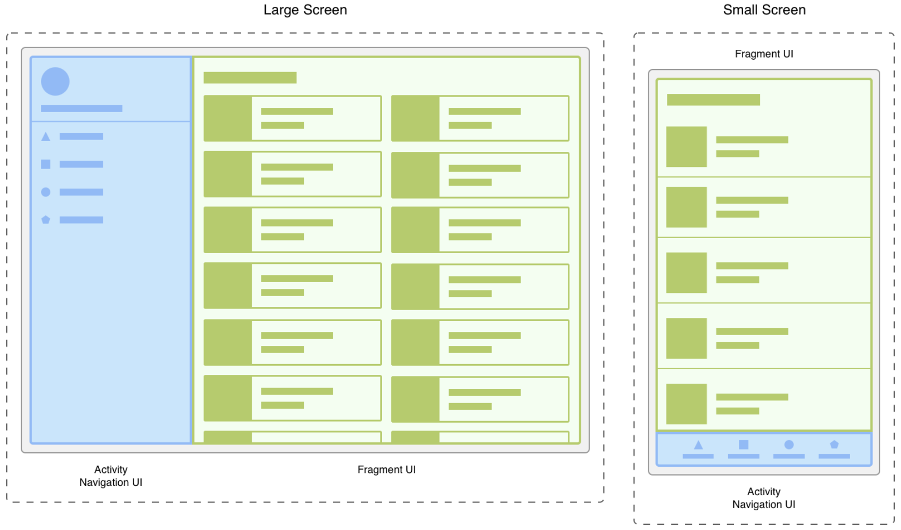

하늘색 박스 부분은 Activity에 배치된 NavigationView

연두색 박스 부분은 Fragment 자체 UI

Activity는 Fragment를 호스팅 하고 있다.


## Fragment 장점

- App의 단일화면 이나 부분 화면 을 Fragment로 구현해서 실행 시 UI 모습을 사용자와 상호작용하면서 실시간으로 수정 할 수 있다.
  - Fragment 추가/교체/삭제 등의 작업이 실행됨으로 화면이 바뀌는 것처럼 보임
- Fragment를 사용하여 런타임 동안 UI를 실시간으로 바꿀 시 Host Activity의 수명 주기가 STARTED 상태 이상에 있는 동안에만 가능하다.
- 런타임 동안 Fragment의 변경사항(추가/교체/삭제)이 발생하면 FragmentManager 가 관리하는 Fragment BackStack에 변경 사항 히스토리를 저장하여 기록할 수 있다.
- Fragment BackStack에 저장된 변경 사항들에 한에서 사용자 '뒤로' 버튼을 눌렀을 경우 '변경 사항 취소'가 되어 '되돌리기'  작업을 진행할 수 있다.


## Fragment 주의점

- Fragment는 재사용 가능한 자체 UI를 가지기 때문에 어느 Activity 에나 호스팅 될 수 있고 어느 Fragment에나 호스팅 될 수 있다.

- 따라서, Fragment Class에는 자체 UI를 관리하는 로직만 구현해야 하고 다른 Activity 나 Fragment를 직접 조작하는 로직을 포함해서는 안된다. (모듈성, 재사용성을 해치게 됨)

  = Fragment가 다른 Activity, Fragment에 의존하면 안된다.


## Fragment Class 만드는 방법

> 프래그먼트를 어떻게 만드는지,
>
> 어떻게 Acitivity에 호스팅 시키는지


### 환경설정

> 프래그먼트 클래스를 만들기전, 안드로이드 프로젝트에 Jetpack Fragment 라이브러리 종속성을 추가

Android 라이브러리는 Google Maven Repository 에서 찾을 수 있으므로 build.gradle 파일(프로젝트 수준)에 Google Maven 저장소를 먼저 추가해야 한다

```xml
  // build.gradle(Project 수준) 파일
  buildscript {
      ...

      repositories {
          google()
          ...
      }
  }

  allprojects {
      repositories {
          google()
          ...
      }
  }
```


프로젝트에 Google Maven 저장소를 추가했다면 build.gradle 파일(app 수준)에 JetPack Fragment 라이브러리 종속성을 추가하면 된다.

```xml
  // build.gradle(App 수준) 파일
  dependencies {
      // 최신 버전 대입
      def fragment_version = "1.2.5"

      // Java language implementation(개발 언어 별 선택)
      implementation "androidx.fragment:fragment:$fragment_version"
      // Kotlin(개발 언어 별 선택)
      implementation "androidx.fragment:fragment-ktx:$fragment_version"
  }
```


### 클래스 생성

- 프래그먼트 클래스를 생성한다는 것은 해당 프래그먼트의 자체 UI 조작을 담당하는 클래스를 생성한다는 것

- 프래그먼트 클래스는 위 과정에서 추가한 Jetpack Fragment 라이브러리에서 제공하는 Fragment 클래스를 상속하는 클래스를 상속하는 클래스를 구현함으로 생성

  

- 프래그먼트 클래스의 생성자 함수는 두 가지 종류가 있다. 하나는 default 생성자, 다른 하나는 default 생성자 대안책

- 대안책으로 사용할 수 있는 생성자 함수를 사용하여 프래그먼트 클래스의 인스턴스를 생성할 경우 장점이 존재하다. Default 생성자 함수를 사용하여 프래그먼트 클래스의 인스턴스를 생성하는 경우에는 클래스 내부에 onCreateView(LayoutInflater, ViewGroup, Bundle) 메소드를 구현해야 한다. 하지만 대안책으로 사용할 수 있는 생성자 함수를 사용하여 onCreateView() 구현을 생략할 수 있다.

  - onCreateView() 메소드 내에서 프래그먼트 자체 UI 레이아웃을 inflate 하는 코드를 작성한다.

    ​	inflate 하다 = xml 파일에 정의된 뷰들을 메모리에 객체화하는 것

    ​	즉, xml 파일에 정의된 뷰들을 객체화해서 코드에서 사용하기 위함이다.

    Inflate 하여 뷰들을 객체화한 후에야 클래스 내부의 코드에서 사용할 수 있으므로 프래그먼트 클래스와 프래그먼트 자체 UI를 붙인다 라고 이해

- 프래그먼트 코드

  ```kotlin
  import androidx.fragment.app.Fragment
  
  class ExampleFragment : Fragment(){
    // TODO (onCreateView 메소드 구현)
  }
  
  class ExampleFragment2 : Fragment(R.layout.example_fragment){
    // Alternate 생성자 함수 사용
    // 생성자 함수 인자로 프래그먼트 자체 UI 레이아웃이 정의된 xml 파일의 id값을 전달
  }
  ```

  이렇게 생성한 클래스 내에서 상속한 Fragment 클래스에 포함된 메소드들을 override 하여 해당 프래그먼트가 담당할 로직들을 구현


### Activity에 프래그먼트 호스팅

- 프래그먼트는 독립적으로 존재할 수 없고, 반드시 Activity 나 다른 프래그먼트에 호스팅 되어야 한다.

- 프래그먼트를 Activity에 호스팅 시키려면 해당 Activity가 FragmentAcitivity를 상속하는 Activity 여야 한다. 그래야 해당 Activity 레이아웃 일부분에 프래그먼트 자체 UI를 배치할 수 있다.

- 만약 Activitiy가 이미 AppCompatActivitiy 클래스를 상속하고 있다면 FragmentActivity를 따로 상속할 필요가 없다.

  

​		해당 클래스는 이미 FragmentActivity를 상속하는 클래스 이기 때문이다.

- 호스팅 시키는 2가지 방법
  - Activity UI 레이아웃 안에 프래그먼트 존재를 정의하여 Activity UI가 Activity 클래스에 inflate 될 때 프래그먼트 자체 UI도 자동으로 프래그먼트 클래스에 inflate 시키는 방법
  - Activity UI 레이아웃 안에 프래그먼트 컨테이너 (= 이 위치에 프래그먼트 자체 UI가 배치 될 것이라고 위치를 지정해두는 것)를 정의하고 프로그래밍적으로 해당 컨테이너 안에 프래그먼트를 추가 하는 방법
- 2가지 방법 모두 Activitiy UI 레이아웃 안에 FragmentContainerView를 정의함으로써 해당 프래그먼트가 배치될 위치를 정의해야 한다는 점
- FragmentContainerView는 FrameLayout에서 제공하지 않는 조작 관련 사항이 추가된 새로운 뷰이다. 따라서 Activity UI 레이아웃 내에서 프래그먼트 자체 UI 위치를 지정할 때는 FragmentContainerView를 사용하는 것이 권장사항


#### 첫번째 방법 (Activity UI가 inflate 될 때 프래그먼트 UI도 inflate)

```xml
  <!-- activity_main.xml 파일 -->
  <androidx.constraintlayout.widget.ConstraintLayout 
      ...>

      <!-- FragmentContainerView 배치 -->
      <androidx.fragment.app.FragmentContainerView
          android:id="@+id/fragment_container_view"
          android:layout_width="match_parent"
          android:layout_height="match_parent"
          app:layout_constraintTop_toTopOf="parent"
          app:layout_constraintStart_toStartOf="parent"
          app:layout_constraintBottom_toBottomOf="parent"
          app:layout_constraintEnd_toEndOf="parent"
          android:name="com.example.fragment.ExampleFragment"/>

  </androidx.constraintlayout.widget.ConstraintLayout>
```

- FragmentContainerVeiw 내 android:name 속성을 통해 FragmentContainerView에 추가될 프래그먼트 클래스를 지정, 이 속성을 지정 시 자동으로 일련의 내부 동작이 실행된다.
- Android:name 속성의 내부 동작은 Acitivity UI 레이아웃이 inflate되는 과정에서 FragmentContainerView가 inflate 될 때 자동으로 android:name 속성에 지정된 프래그먼트를 새로운 인스턴스로 생성
- 지정된 프래그먼트의 인스턴스가 생성되면 프래그먼트 수명 주기 메소드 중 onInflate() 메소드가 호출된다. 이 메소드 호출된 후, 해당 프래그먼트 자체 UI를 FragmentContainerView 위치에 추가하는 FragmentTransaction이 실행


#### 두번째 방법 (Activity UI 레이아웃 안 Container 안에 프래그먼트 추가)

```xml
  <!-- activity_main.xml 파일 -->
  <androidx.constraintlayout.widget.ConstraintLayout
      ...>

      <!-- FragmentContainerView 배치 -->
      <androidx.fragment.app.FragmentContainerView
      android:id="@+id/fragment_container_view"
      android:layout_width="match_parent"
      android:layout_height="match_parent"
      app:layout_constraintTop_toTopOf="parent"
      app:layout_constraintStart_toStartOf="parent"
      app:layout_constraintBottom_toBottomOf="parent"
      app:layout_constraintEnd_toEndOf="parent" />

  </androidx.constraintlayout.widget.ConstraintLayout>
```

- android:name 속성 지정하지 않음으로써 Activity UI 레이아웃 안에서 프래그먼트 컨테이너의 위치만 배치
- 두번째 방법 사용 시 Activity가 running 상태일 동안 프래그먼트 컨테이너 안에 프로그래밍적으로 프래그먼트를 추가/교체/삭제
- 프로그램이적으로 프래그먼트를 추가/교체/삭제하려면 프래그먼트를 호스팅하는 Activitiy 내에서 FragmentManager 클래스를 인스턴스화해야한다.
- FragmentManager를 인스턴스화 하는 이유는 프래그먼트 추가/교체/삭제 작업을 제공하는 FragmentTransaction 클래스를 사용하기 위함이다.
- FragmentManager 클래스를 인스턴스화 하는 방법은 FragmentActivitiy 클래스에 제공되는 getSupportFragmentManager() 함수 호출
- FragmentManager 인스턴스화 한 후, Acitivity의 onCreate() 메소드내에서 FragmentTransaction 클래스가 제공하는 add() 함수를 호출하여 프래그먼트 컨테이너 위치에 추가하고자 할 프래그먼트 자체 UI를 추가


## FragmentManager

> 백 스택(Back Stack)에 프래그먼트 추가/교체/삭제 작업에 의한 변경 사항을 push, pop 작업을 담당하는 클래스


- 프래그먼트를 관리하는 더 좋은 방법 -> JetPack Navigation 라이브러리 사용하면 FragmentManager를 직접 다뤄야 할 일이 적어져 편하다.

- Navigation 라이브러리 내부 동작에 FragmentManager를 사용한 작업이 구현되어 있기 때문이다.

- FragmentManager가 중요한 이유

  - Navigation 라이브러리도 결국 내부 동작에 FragmentManager를 사용할 만큼 프래그먼트를 사용하는 앱에서는 FragmentManager 사용이 빈번하다.
  - 그러므로 FragmentManager가 무엇이고, 어떻게 작동하는지 파악하는 것이 중요

- FragmentManager 인스턴스화

  - 런타임 시에 프래그먼트 추가/삭제/교체 작업 등을 하려면 먼저 FragmentManager 클래스를 인스턴스화 해야 한다.
  - 인스턴스화 방법은 2가지 경우에 따라 다르다.
    - Activity 클래스에서 인스턴스화하는 경우
    - Fragment 클래스에서 인스턴스화하는 경우
  - Activity 클래스에서 FragmentManager 인스턴스화
    - FragmentActivitiy 클래스를 상속하는 모든 서브 클래스에서 getSupportFragmentManager() 함수 호출
  - Fragment 클래스에서 FragmentManager 인스턴스화
    - 프래그먼트는 Acitivity에 호스팅되거나 다른 프래그먼트에 호스팅 되어야 한다.
    - 프래그먼트가 하위 프래그먼트를 호스팅하는 경우 호스트 프래그먼트 내에서 getChildFragmentManager() 함수를 호출하여 하위 프래그먼트에 관한 FragmentManager 를 인스턴스화
    - 하위 프래그먼트에서 호스트 프래그먼트를 관리하는 FragmentManager를 인스턴스화를 getParentFragmentManager() 함수 호출

- Fragment와 FragmentManager 관계

  

  - 연두색으로 표시된 Activity는 하늘색으로 표시된 프래그먼트의 호스트 Activity 이다. 이 Activity에는 BottomNavigationView가 배치되어 있고 Home/Profile 탭 변경 시 하늘색으로 표시된 프래그먼트를 교체하여 사용자에게 앱 탐색 경험을 제공한다.
  - Example1 에서 하늘색으로 표시된 프래그먼트는 하위 프래그먼트 2개를 호스팅하는 호스트 프래그먼트 이다. 하위 프래그먼트 2개를 통해 화면을 분할하고 있다.
  - Example2 에서 하늘색으로 표시된 프래그먼트는 ViewPager2(스와이프 뷰)를 구현하는 하위 프래그먼트 1개를 호스팅 하는 프래그먼트 이다.
  - 

- 인스턴스화된 FragmentManager 사용

  - FragmentManager 는 프래그먼트 추가/교체/삭제 작업을 제공하는 FragmentTransaction 클래스를 구현
  - 

  - supporFragmentManager를 호출하여 FragmentManager 인스턴스하고 commit{} 블록을 호출한 코드
  - commit{} 블로 안에 프래그먼트 추가/교체/삭제 작업을 명시

- FragmentManager 사용 - 기존 프래그먼트 찾기

  - FragmentManager가 제공하는 findFragmentById() 함수를 사용하여 프래그먼트 컨테이너 내의 현재 프래그먼트 참조를 가져올 수 있다.
  - 또는 프래그먼트에 고유한 태그를 부여한 후 findFragmentByTag() 함수를 호출하여 해당 태그가 부여된 프래그먼트 참조를 가져올 수 있다.
  - findFragmentById()는 UI를 제공하는 프래그먼트를 참조할 때 사용하고 findFragmenyByTag() 는 UI를 제공하지 않는 프래그먼트를 참조할 때 사용한다.

- 하위 프래그먼트

  - 일반적으로 안드로이드 앱은 단일 or 소수의 Activitiy로 구성하는 것이 좋다.
  - 주로 Activity에는 최상위 탐색 뷰 (Navigation 같은 뷰)가 배치된다.
  - 이 외의 Activitiy를 구성하는 개별 UI는 프래그먼트를 사용하여 구현한다.
  - 여러 프래그먼트를 한 번에 하나의 Activity에 표시하려면 분할 뷰 프래그먼트와 하위 프래그먼트를 사용한다.
  - 

  - 하늘색으로 표시된 부분이 분할 뷰 프래그먼트이고 하얀색으로 표시된 부분이 하위 프래그먼트 2개

- 하위 프래그먼트 고려사항

  - 특정 시점에서 프래그먼트 백 스택을 제어하는 데에는 프래그먼트 관리자 1개만 허용된다.
  - 앱에서 여러 하위 프래그먼트를 동시에 화면에 표시하거나 사용하려는 경우 프래그먼트 관리자 한 개를 지정하여 앱의 기본 탐색을 처리해야 한다.
  - 앱의 기본 탐색이란
    - Activity를 탐색의 가장 바깥쪽 레이어로 간주하고 하위 프래그먼트의 각 레이어를 바깥쪽 레이어 아래에 매핑한다. 이 때 각 레이어에는 기본 탐색 프래그먼트가 하나씩 있어야 한다. '뒤로' 이벤트가 발생하면 가장 먼저 가장 안쪽 레이어에서 탐색 동작을 컨트롤한다. '뒤로' 이벤트가 발생했을 때 가장 안쪽 레이어에 다시 표시할 프래그먼트 트랜잭션이 더 이상 없으면 탐색 컨트롤은 다음 바깥 레이어로 옮겨진다. 이 프로세스는 Activity에 도달할 때 까지 반복된다.
  - 프래그먼트 트랜잭션 내에서 기본 탐색 프래그먼트를 지정하려면 FragmentTransaction 클래스에 제공하는 setPrimaryNavigationFragment() 함수를 호출하여 childFragmentManager에 기본 컨트롤이 있어야 하는 프래그먼트의 인스턴스를 전달한다.


## FragmentTransaction

- Android Jetpack Fragment 라이브러리에서 제공하는 클래스
- 이 클래스는 프래그먼트 추가/교체/삭제 작업을 제공
- 이 외에도 프래그먼트 관리자가 수행할 단일 단위, 하나의 FragmentTransaction 단위 내에 FragmentTransaction 클래스가 제공하는 프래그먼트 추가/교체/삭제 작업 등을 명시하면된다.
- 하나의 FragmentTransaction 단위 내에 작성된 프래그먼트 관련 작업들은 해당 FragmentTransaction이 수행될 때 모두 실행된다.


- FragmentTransaction 인스턴스 생성

  - FragmentTransaction 인스턴스는 FragmentManager로부터 생성할 수 있다.
  - FragmentManager 클래스에서 제공하는 beginTransaction() 함수 호출을 통해 인스턴스 생성

  - ```kotlin
    //FragmentTransaction 인스턴스 생성 예시
    val fragmentManager = supportFragmentManager
    val fragmentTransaction = supportFragmentManager.beginTransaction()
    ```

  - 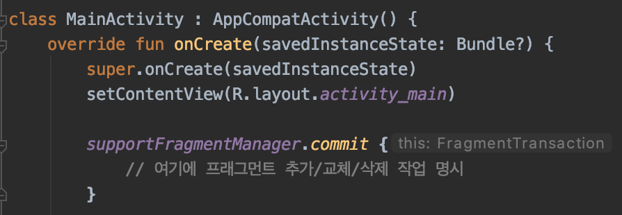

  - FragmentManager의 beginTransaction() 함수를 통해 트랜잭션을 생성하는 코드는 위와 같은 코드로 대체 할 수 있다. FragmentManager 를 인스턴스화 후 commit{} 블록을 호출하면 FragmentTransaction이 생성되고 모든 프래그먼트 조작 작업의 마지막에 호출해야하는 commit() 함수까지 한 번에 호출

- FragmentTransaction 수행과 Activity의 상태와의 관계

  - FragmentTransaction은 호스트 Activity가 자신의 상태(RESUMED, STOPPED 등의 상태)를 저장하기 전에 생성되고 커밋되어야 한다.
  - 호스트 Activity 는 사용자가 화면을 회전 시 Activity가 종료되고 재생성되는 데 종료되기 직전에 수명 주기 메소드 중 onSaveInstanceState() 메소드를 호출하여 자신의 상태를 저장하고 종료하도록 한다. 종료된 Activity가 재성성될 때 저장된 상태를 불러와 이전 상태를 그대로 유지하도록 할 수 있다.
  - 만약 호스트 Activity가 onSaveInstanceState() 메소드를 호출한 후에 FragmentTransaction이 커밋된다면 에러가 발생
  - 에러가 발생하는 이유
    - 호스트 Activity의 상태가 저장될 때 자신에게 호스팅되어 있는 프래그먼트의 상태도 저장하게 되는 데 이러한 상태 저장 후 FragmentTransaction에 의해 프래그먼트 추가/교체/삭제 작업이 일어나면 Activity가 저장한 프래그먼트 상태와 달라지기 때문이다.

- FragmentTransaction 사용 시 반드시 마지막에 commit 하기

  - FragmentTransaction을 생성하여 프래그먼트 추가/교체/삭제 작업을 명시한 후에는 반드시 commit 해줘야 한다.
  - commit은 FragmentTransaction 클래스에서 제공하는 commit() 함수 호출을 통해 실행
  - commit() 함수를 호출해야만 FragmentManager가 해당 FragmentTransaction 수행을 예약한다.
  - commit() 함수가 비동기로 처리되는 함수이기에 commit() 함수 호출 시점에서 즉시 수행이 아닌 메인 쓰레드에 예약 된다.
  - 메인 쓰레드가 예약된 트랙잭션을 수행할 준비가 되면 비로소 그 때 트랜잭션이 수행되어 명시한 프래그먼트 조작 작업들이 실행
  - 

  - Kotlin의 commit{} 블록을 사용하여 FragmentTransaction이 생성되는 작업과 커밋하는 작업을 한꺼번에 호출


### Fragment 추가 (Add)

> FragmentTransaction에서 제공하는 프래그먼트 조작 작업 중 '프래그먼트 추가' 작업
>
> FragmentTransaction 클래스의 add() 함수 호출


add() 함수 호출을 통해 수행되는 '프래그먼트 추가' 작업은 호스트 Activity의 수명 주기에 프래그먼트 수명 주기를 추가하는 것이다.

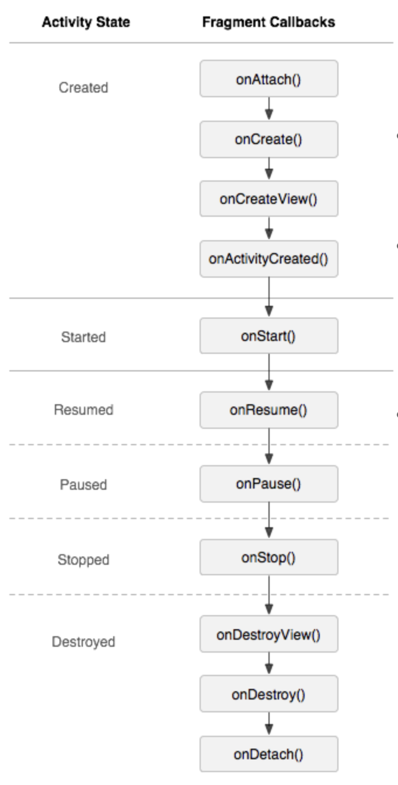

- 호스트 Activity의 수명 주기에 프래그먼트가 추가되면 위와 같은 순서로 Activity 수명 주기와 프래그먼트 수명 주기 간의 관계가 형성된다.
- 프래그먼트 수명 주기 중 onCreateView() 콜백 메소드가 호출 될 때 프래그먼트 자체 UI가 inflate되고 프래그먼트 컨테이너 위치에 보이게 된다.
- 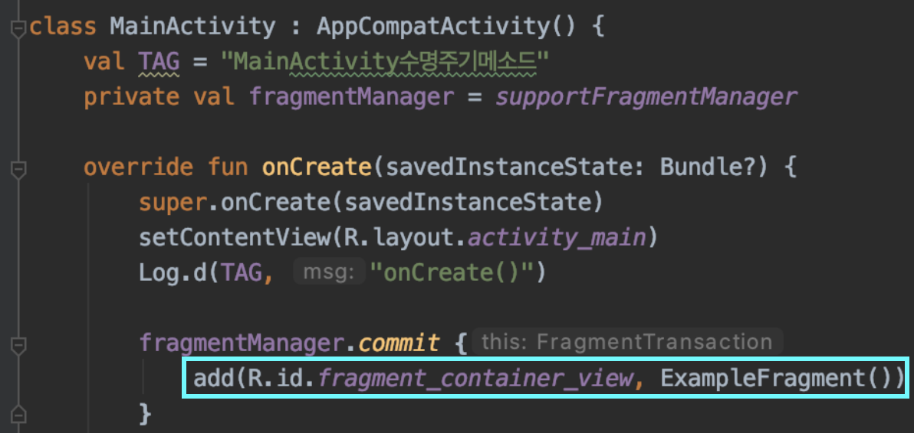

- ExapmleFragment 클래스와 자체 UI 레이아웃을 만든 후, MainActtivity의 onCreate() 콜백 메소드 안에 FragmentTransaction이 생성했다. Transaction 내부에 add() 함수를 호출
- 수명 주기 메소드 로그
  - 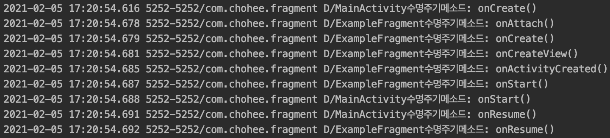

- 프래그먼트 2개를 add() 함수 호출하여 호스트 Activity에 추가
- 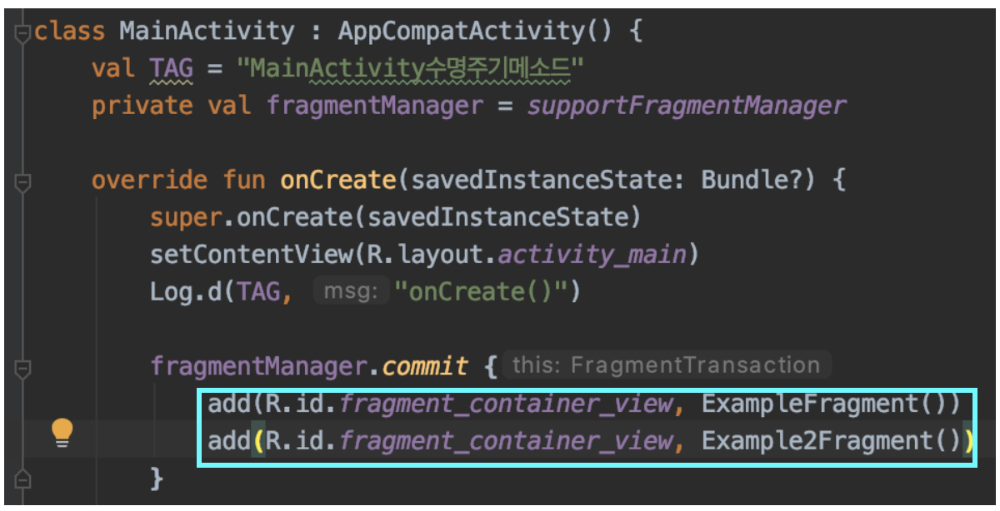

- 수명 주기 메소드 로그
  - 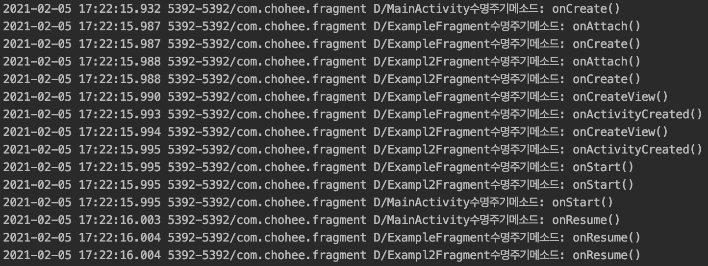


### Fragment 제거 (Remove)

> FragmentTransaction에서 제공하는 프래그먼트 조작 작업 중 '프래그먼트 제거' 작업
>
> FragmentTransaction 클래스의 remove() 함수 호출


remove() 함수의 인자에는 호스트 Activity에 생성되어 있는 프래그먼트 중 제거할 프래그먼트의 참조를 넣으면 된다. (findFragmentById() 나 findfragmentByTag() 함수로 프래그먼트를 참조)

호스트 Activity에서 해당 프래그먼트를 떼어낸다.

만약 해당 프래그먼트의 자체 UI가 프래그먼트 컨테이너에 추가되어 있다면 자체 UI도 프래그먼트 컨테이너로 부터 제거된다.

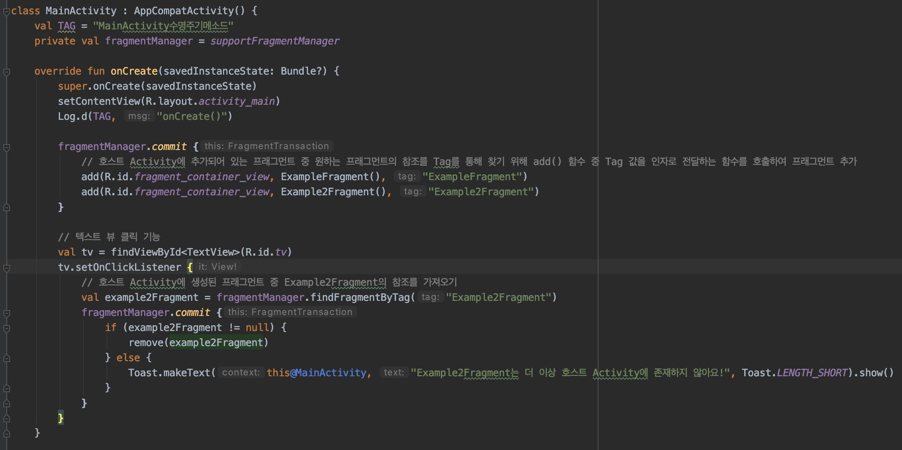

위 코드는 호스트 Activity에 추가되어 있는 프래그먼트 중 원하는 프래그먼트를 TAG를 통해 찾기 위해 add() 호출 시 인자에 TAG를 추가로 전달했다.

MainActivity에는 새로운 텍스트 뷰를 배치했고 findFragmentByTag() 함수로 Example2Fragment 프래그먼트의 참조를 가져와 remove() 함수 인자로 전달했다.


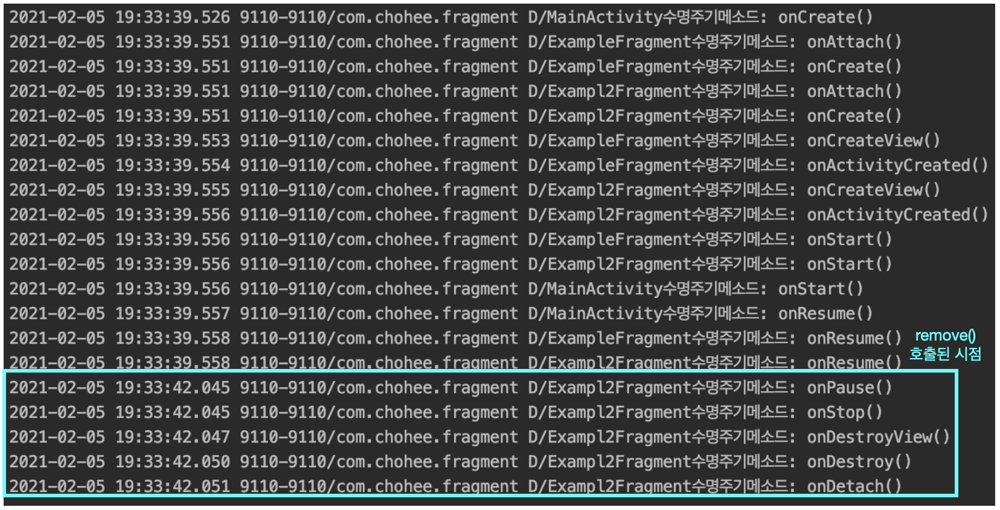

remove() 함수가 호출되는 순간 onPause() 부터 onDetach() 까지 호출된다.


### Fragment교체 (replace)

> FragmentTransaction에서 제공하는 프래그먼트 조작 작업 중 '프래그먼트 교체' 작업
>
> FragmentTransaction 클래스의 replace() 함수 호출

replace() 함수 호출 시 호스트 Activity에 생성되어 있는 프래그먼트 중 replace() 함수의 인자로 지정된 프래그먼트를 제외한 나머지 모든 프래그먼트가 제거(remove()) 된다. 따라서 프래그먼트 컨테이너에 남아있는 프래그먼트 자체 UI 레이아웃은 replace() 함수의 인자로 지정된 프래그먼트 뿐이기 떄문에 사용자의 눈에 해당 프래그먼트가 보이게 된다.

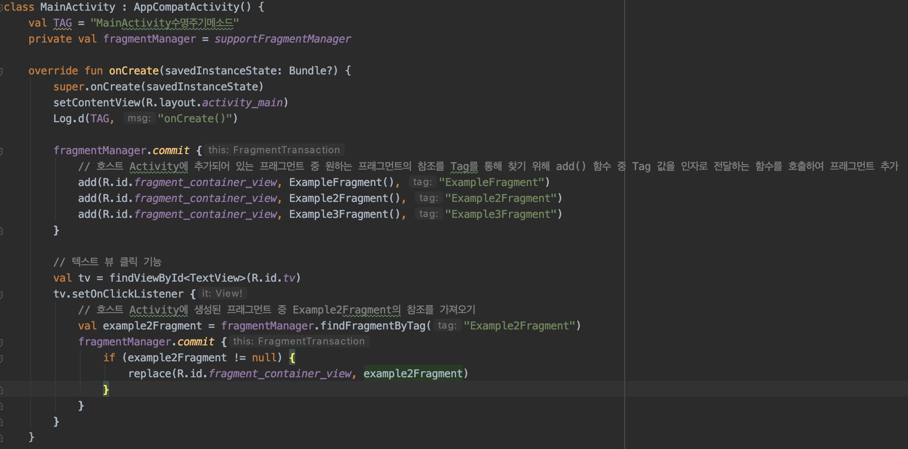

위 코드를 보면 서로 다른 프래그먼트인 ExampleFragment 1,2,3 을 동일한 프래그먼트 컨테이너에 추가한다.

텍스트 뷰를 누르면 ExampleFragment2가 교체되도록 된다.


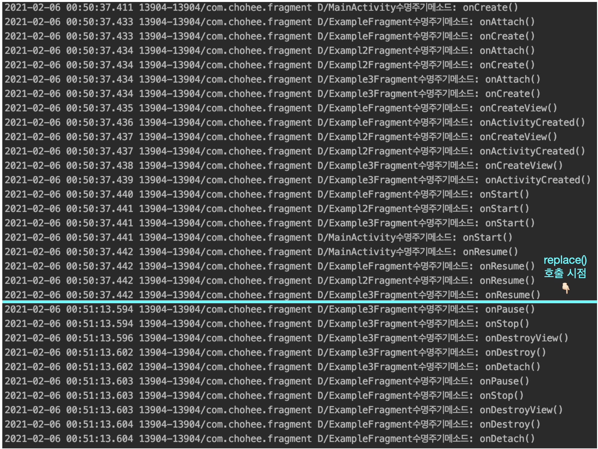

수명 주기 순서를 보면 처음에는 3개의 프래그먼트가 호스트 Activity에 생성된다.

텍스트 뷰를 눌러 replace() 함수가 호출되면 교체 대상으로 지정한 ExampleFragment2를 제외한 나머지 두 프래그먼트가 차례로 제거된다. (제거되는 순서는 프래그먼트 컨테이너에 가장 위쪽에 쌓였던 프래그먼트 부터 차례로 제거)


결과만 본다면 replace()를 호출하는 것은 호스트 Activity에 생성되어 있는 모든 프래그먼트를 제거(remove())한 후, replace() 함수의 인자로 지정한 프래그먼트를 새로 추가(add()) 하는 것과 같다.


### 백 스택에 FragmentTransaction 기록

안드로이드 플랫폼에서는 백 스택(back stack) 이라는 자료 구조를 통해 Activity의 히스토리를 저장한다. (스택 = Late In First Out 방식으로 저장되는 자료 구조)

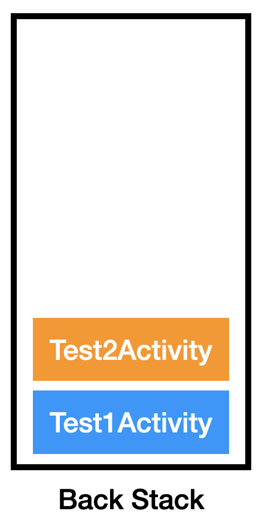

위 그림을 보면 앱이 실행되자마자 생성되는 Activity가 먼저 생성되어 백 스택에 저장된다. 먼저 생성된 Activity에서 어떤 이벤트로 Test2Activity로 전환되는 작업에 의해 Test2Activity가 생성되고 이것도 백 스택에 저장된다.

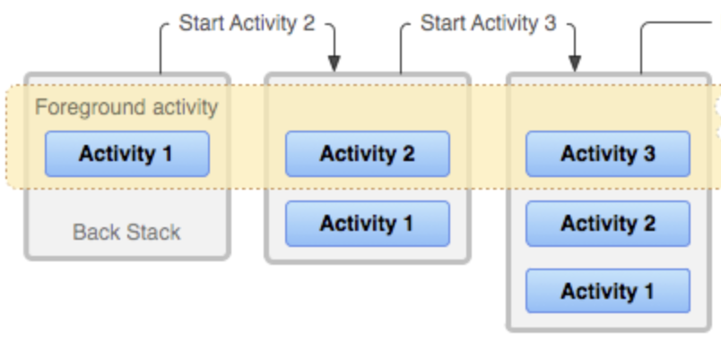


위 그림을 보면 백 스택에 저장된 Activity 중ㅇ 가장 최상단 Activity가 현재 foreground에서 실행되고 있어 사용자에 보이는 Activity 이다.

백 스택에 저장함으로써 사용자가 '뒤로' 버튼 눌렀을 때, '되돌리기' 작업을 실행할 수 있다.

만약 Activity2가 사용자 눈에 보이고 있는 상황에서 '뒤로' 버튼을 눌렀다면 백 스택에서 가장 최상단에 있는 Activity2가 pop되어 사라진다. 이로써 최상단을 차지하게 된 Acitivity1이 다시 실행되어 사용자의 눈에는 '되돌리기' 작업 처럼 보인다.


FragmentManager는 Activity가 관리하는 이러한 백 스택에 FragmentTransaction을 기록한다.

FragmentTransaction을 백 스택에 기록하는 이유도 사용자가 '뒤로' 버튼을 눌렀을 때 '되돌리기' 작업을 실행하기 위함이다.

**Activity는 백 스택에 기록되는 작업이 자동으로 되지만 프래그먼트는 자동으로 되지 않는다.**

**FragmentTransaction 내부에 백 스택에 기록하겠다는 함수를 호출해야만 해당 FragmentTransaction이 기록된다.** 

또한 백 스택에 기록되는 것은 프래그먼트가 아닌 FragmentTransaction 이다.


FragmentTransaction 클래스가 제공하는 addToBackStack() 함수를 호출하면 해당 FragmentTransaction이 백 스택에 push되어 기록된다.


FragmentManager 클래스가 제공하는 popBackStack() 함수를 호출하면 백 스택에 저장되어 있는 FragmentTransaction 중 스택의 가장 최상단에 존재하는 트랜잭션이 pop 되어 사라진다. (FragmentManager가 백 스택을 관리하는 역할을 한다.)


사용자 '뒤로' 버튼을 눌렀을 때에도 내부적으로 popBackStack() 함수가 호출된다.


예시)

```kotlin
// MainActivity.kt 파일
override fun onCreate(savedInstanceState: Bundle?) {
    super.onCreate(savedInstanceState)
    setContentView(R.layout.activity_main)
    Log.d(TAG, "onCreate()")

    // 텍스트 뷰 클릭시 TestActivity로 전환하기
    val tv = findViewById<TextView>(R.id.tv)
    tv.setOnClickListener {
        val intent = Intent(this, TestActivity::class.java)
        startActivity(intent)
    }
}
```

MainActivty를 텍스트뷰 클릭시 TestActivity로 전환되도록 코드 작성


```kotlin
// TestActivity.kt 파일
override fun onCreate(savedInstanceState: Bundle?) {
    super.onCreate(savedInstanceState)
    setContentView(R.layout.activity_test)
    Log.d(TAG, "onCreate()")

    fragmentManager.commit {
        setReorderingAllowed(true)
        add(R.id.fragment_container_view_test_activity, ExampleFragment(), "ExampleFragment")
    }

    // 텍스트 뷰 클릭시 작업
    val tv = findViewById<TextView>(R.id.tv)
    tv.setOnClickListener {
        fragmentManager.commit {
            setReorderingAllowed(true)
            add(R.id.fragment_container_view_test_activity, Example2Fragment(), "Example2Fragment")
        }
    }
}

```

TestActivity는 onCreate() 콜백 메소드가 호출되면 ExampleFragment가 추가(add) 된다.

텍스트뷰 클릭 시 Example2Fragment가 추가(add) 된다.


백 스택에 push 하지 않은 경우 '뒤로' 버튼 누르기 테스트를 진행하기 위해 각 FragmentTransaction 내부에 addToBackStack() 함수를 호출하지 않았다.

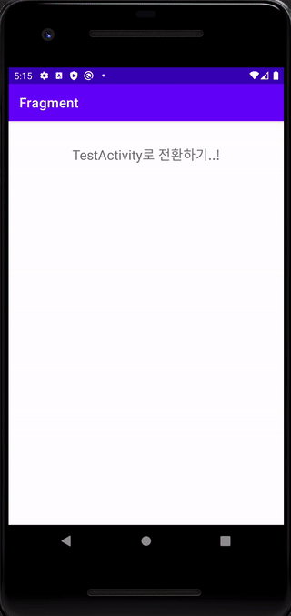

MainActivity 에서 텍스트뷰 클릭 -> TestActivity 생성 및 전환, ExampleFragment 추가

TestActivity 에서 텍스트뷰 클릭 -> Example2Fragment 추가 

이 상태에서 '뒤로' 버튼 클릭 시 다시 MainActivity로 돌아가게 된다.

Acitivity는 자동으로 백 스택에 전환되기 때문에 가장 최상단에 있던 TestActivity가 pop 되고 MainActivity가 최상단 Activity가 된다.

여기서 다시 '뒤로' 버튼 클릭 시 MainActivity가 pop 되고 백 스택에 아무 것도 없기에 앱이 종료된다.


```kotlin
// TestActivity.kt 파일
override fun onCreate(savedInstanceState: Bundle?) {
    super.onCreate(savedInstanceState)
    setContentView(R.layout.activity_test)
    Log.d(TAG, "onCreate()")

    fragmentManager.commit {
        setReorderingAllowed(true)
        add(R.id.fragment_container_view_test_activity, ExampleFragment(), "ExampleFragment")
        // 백 스택에 트랜잭션 저장
        addToBackStack(null)
    }

    val tv = findViewById<TextView>(R.id.tv)
    tv.setOnClickListener {
        fragmentManager.commit {
            setReorderingAllowed(true)
            add(R.id.fragment_container_view_test_activity, Example2Fragment(), "Example2Fragment")
            // 백 스택에 트랜잭션 저장
            addToBackStack(null)
        }
    }
}
```

TestActivity에서 실행되는 FragmentTransaction에 addToBackStack() 함수를 호출하여 FragmentTransaction을 백 스택에 저장하면 어떻게 달라질까?

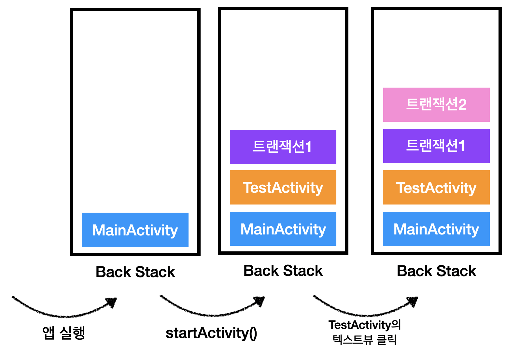

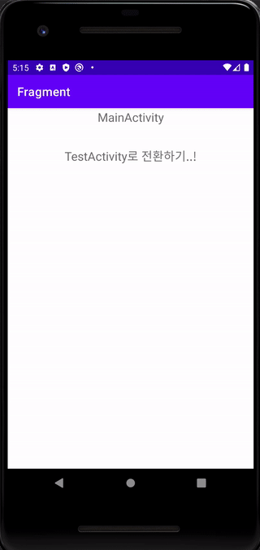


첫번째 '뒤로' 버튼 클릭시 최상단 트랜잭션인 Example2Fragment를 추가하는 트랜잭션 pop 되고

최상단 트랜잭션은 ExampleFragment를 추가하는 트랜잭션이 차지하게 된다.

백 스택의 최상단 데이터가 foreground에서 실행되고 사용자가 보는 화면은 ExampleFragment이다.


두번째 '뒤로' 버튼 클릭 시 최상단 트랜잭션 pop 되어 TestActivity가 최상단을 차지

foreground 화면도 TestActivity가 보인다.


세번째 '뒤로' 버튼 클릭 시 최상단 Activity가 pop 되어 MainActivity가 최상단을 차지

foreground 화면도 MainActivity가 차지


네번째 '뒤로' 버튼 클릭 시 최상단 Acitivity가 pop되고 백 스택은 비어진다.

이 때 앱은 종료


**백 스택에 FragmentTransaction을 기록하는 이유는 '뒤로가기' 작업을 실행될 경우 '되돌리기' 작업을 구현하기 위함**

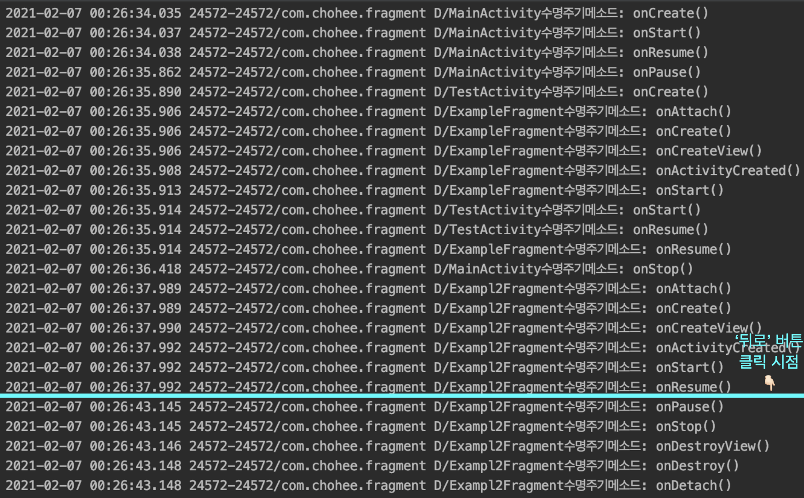

첫번째 '뒤로' 버튼 클릭 시 수명 주기 변화를 보면 백 스택에서 pop되는 트랜잭션에 포함된 Example2Fragment의 추가(add)와 반대로 Example2Fragment가 제거(remove) 됨을 알 수 있다.


## LifeCycle

> 화면을 보이는 것을 기준으로 생명 주기 메서드를 가지는데
>
> 생성 관련 5개, 소멸 관련 5개를 가지고 있다.

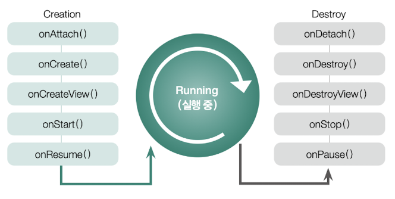

**생명 주기**

생성과 관련된 메서드가 5개나 이지만

프래그먼트를 포함하고 있는 액티비티가 화면에 계속 나타나고 있는 상태에서 onAttach() 부토 onResume() 까지 메서드가 모두 한번에 호출된다.

1. onAttach()

   프래그먼트 매니저를 통해 액티비티에 프래그먼트가 추가되고 commit 되는 순간 호출

2. onCreate()

   프래그먼트가 생성됨과 동시에 호출, UI인 뷰와 관련된 것을 제외한 프래그먼트 자원(주로 변수)을 초기화 할 때 사용

3. onCreateView()

   UI와 관련된 뷰를 초기화

4. onStart()

   프래그먼트가 새로 추가 되거나

   화면에서 사라졌다가 다시 나타나면 onCreateView()는 호출되지 않고 onStart()만 호출

   주로 화면 생성 후 화면에 입력될 값을 초기화 하는 용도

5. onResume()

   onStart()와 같은 용도로 사용

   다른 점은 소멸 주기 메서드가 onPause() 상태에서 멈췄을 때(현 프래그먼트 일부가 가려지지 않았을 떄)는 onStart()를 거치지 않고 onResume()이 바로 호출

**소멸 주기**

현재 프래그먼트 위로 새로운 프래그먼트가 추가 되거나

현재 프래그먼트를 제거하면 소멸 주기와 관련된 메서드가 순차적으로 호출된다.

1. onPause()

   현재 프래그먼트가 화면에서 사라지면 호출

   주로 동영상 플레이어를 일시정지하거나 현재 작업을 잠시 멈추는 용도로 사용

2. onStop()

   onPause()와 다른 점은 현재 프래그먼트가 화면에 일부분이라도 보이면 onStop()은 호출되지 않는다.

   동영상 플레이를 예로 들면 일시정지가 아닌 정지를 하는 용도

3. onDestoryView()

   뷰의 초기화를 해제하는 용도

   이 메서드 호출된 후 생성 주기 메서드인 onCreateView()에서 인플레이터로 생성한 View가 모두 소멸

4. onDestory()

   액티비티에는 아직 남아있지만 프래그먼트 자체는 소멸

   프래그먼트에 연결된 모든 자원을 해제하는 용도

5. onDetach()

   액티비티에서 연결이 해제

---

참고 사이트

김초희 깃헙 : https://choheeis.github.io/newblog//articles/2021-02/fragment

김초희 깃헙2 : https://choheeis.github.io/newblog//articles/2021-02/fragment2