# Navigation

> 사용자가 앱 내의 여러 콘텐츠를 자유롭게 탐색 할 수 있는 앱을 구현할 때 도움이 되는 라이브러리


안드로이드 플랫폼에서 Navigation 이라는 단어는

사용자가 앱 내의 여러 콘텐츠를 여기 저기 왔다 갔다하며 탐색하는 동안 일어나는 상호작용 이라는 뜻으로 사용


Android Jetpack의 Navigation은 이러한 Navigation의 의미에 맞게 사용자가 앱 내를 자유롭게 탐색 할 수 있는 앱을 구현할 때 도움이 되는 라이브러리


모바일 앱 사용자 환경이 끊어지지 않도록 앱을 개발하는 것이 중요하다.

이러한 모바일 앱 사용자 환경은 대부분 사용자의 앱 내 다양한 화면 및 콘텐츠를 탐색하는 흐름에 의해 만들어지기 때문에 앱 개발에 있어서 사용자의 앱 내 탐색을 고려하는 것은 매우 중요하다.


## Single Activity Multi Fragment

> 하나의 액티비티를 두고 나머지 화면을 모두 프래그먼트로 구성하는 아키텍처


**장점**

1. 하나의 Activity에 Fragment를 사용하여 다양한 View를 보여줄 수 있다.
2. UI의 재사용이 용이하다.
3. 한 Activity 내의 데이터 전달로 같은 프로세스 안의 통신으로 성능 향상
4. 기존 Activity 전환 시 화면 전체가 교체되는 낭비 해결
5. 공통적인 부분 개발의 편의성

---

참고 사이트

1. https://oozou.com/blog/reasons-to-use-android-single-activity-architecture-with-navigation-component-36
2. https://handnew04.github.io/posts/2020-11-15/

----


## 구성 요소

>  3가지 구성 요소
>
> 사용자가 앱을 탐색하는 동안 NavGraph에서 특정 경로를 따라 이동할지, 특정 destination으로 직접 이동할지 NavController에게 알려준다.
>
> 그러면 NavController가 NavHost에 적절한 대상을 표시하게 된다.


### NavGraph

> destination들과 action들로 이루어진 xml 파일로 앱의 모든 탐색 경로를 시각적으로 한 눈에 볼 수 있다.
>
> action으로 각 화면을 연결함으로써 사용자가 한 destination에서 다른 destination으로 이동할 수 있는 방법을 쉽게 파악 할 수 있다.

Navigation Graph


Navigation 탐색과 관련된 모든 정보를 모아 놓은 것이다.

Navigation이 등장하면서 새롭게 생긴 resource이고, xml 파일로 표현된다.


Navigation 탐색과 관련된 모든 정보를 하나의 Navigation Graph 라는 xml 파일에 모아 놓고, 시각적으로 탐색의 모든 정보를 볼 수 있다.

이 파일 내에 **destination** 이라고 하는 **사용자가 탐색 가능한 앱 내의 모든 개별 컨텐츠를 표시하고, 사용자가 앱 내에서 탐색 할 수 있는 모든 경로**를 나타낸다.

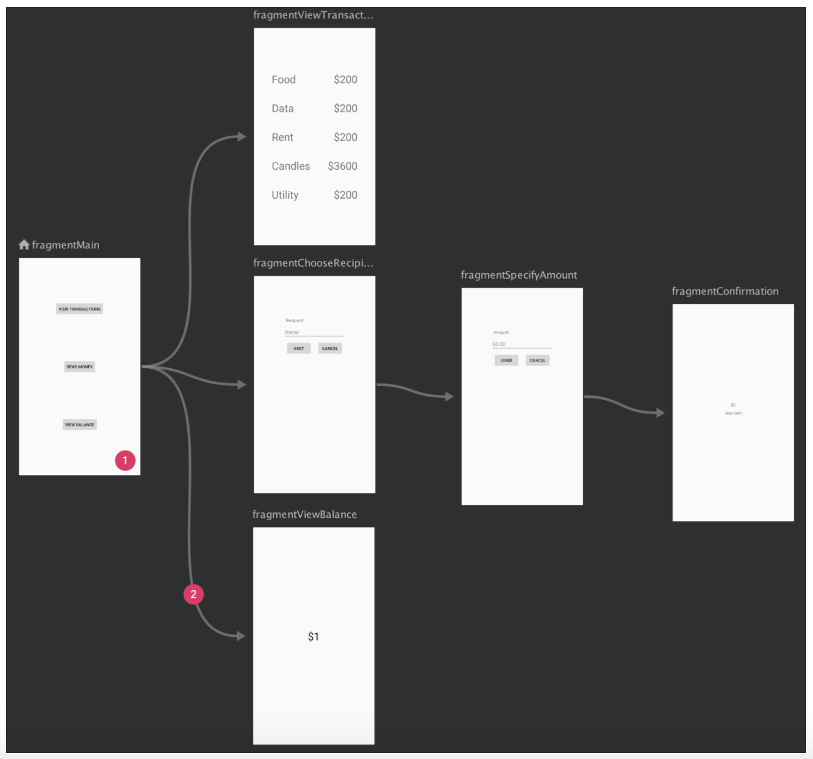

위 그림에서 볼 수 있는 각 화면들은 사용자가 탐색하며 볼 수 있는 화면이다.

즉, 각각의 Fragment들이고, 이 화면들은 미리보기 이미지로 보인다.


**이 각 화면**을 Navigation 에서는 **destination**(목적지) 라고 부른다.


**위 그림에서 볼 수 있는 화살표들은 각 destination 들을 연결하고 탐색 순서**를 나타낸다.

이 화살표들을 **action** 이라고 부른다.

이러한 action을 통해 사용자가 앱을 탐색할 때 취할 수 있는 경로를 시각적/논리적으로 표현 할 수 있다.


destination들과 action들로 이루어진 xml 파일로 앱의 모든 탐색 경로를 시각적으로 한 눈에 볼 수 있다.

action으로 각 화면을 연결함으로써 사용자가 한 destination에서 다른 destination으로 이동할 수 있는 방법을 쉽게 파악 할 수 있다.


### NavHost

> Navigation Graph에서 destination 이라 불리는 개별 컨텐츠가 표시되는 컨테이너

NavHost는 Navigation Graph에서 destination 이라 불리는 개별 컨텐츠가 표시되는 빈 컨테이너 이다.


빈 컨테이너란 다음 그림과 같이 HavHost라는 빈 컨테이너에 탐색 대상이 되는 destination 들이 넣어졌다, 빠졌다 하기 때문에 NavHost 를 빈 컨테이너라고 하는 것이다.

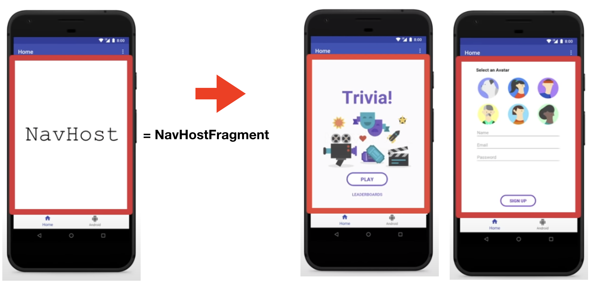

NavHoast 라고 불리는 것은 NavHostFragment로 구현된다.


### NavController

> 이동을 담당하여 관리한다.

NavController는 앱 탐색을 직접 관리하는 객체

즉, 앱 내에서 사용자가 개별 컨텐츠(=destination)들을 탐색하며 이동할 때 NavHost에서 destination의 전환을 NavController를 통해 조율한다.


## Navigation 장점

1. 프래그먼트 전화의 처리
2. up and back 작업에 대한 올바른 처리
3. 애니메이션과 화면 전환에 대한 표준화된 리소스 제공
4. deep link 구현 및 처리
5. navigation drawers, bottom navigation에 대한 ui 패턴을 최소한의 품으로 사용 할 수 있게 해준다.
6. Safe Args 라는 플러그인 사용, 화면 간의 데이터 전달에 대한 안전성 제공
7. viewModel 서포트 (AAC Viewmodel)
8. navigation edtior를 통하여 gui로 확인


## 사용자가 앱 내부를 탐색 시 순서


로그인 화면 같은 조건부 화면을 제외하고 사용자가 앱 내부를 탐색할 때 어떤 순서로 탐색하는 지

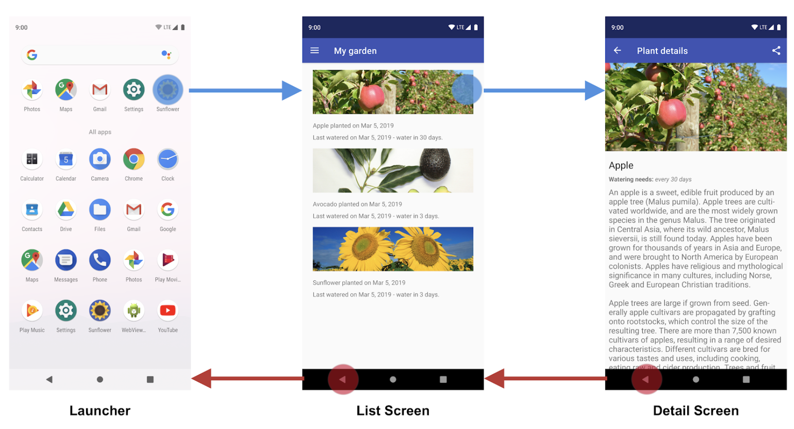

위 그림처럼 가장 먼저 사용자는 런처(launcher)에서 앱 아이콘을 터치하여 앱을 실행시킬 것이다.

그 다음, 로그인 화면 같은 조건부 화면이 바로 나올 수도 있지만 사용자 탐색 흐름을 고려할 때는 조건부 화면을 고려하지 않을 것이다.

따라서 앱을 실행시킨 후에는 첫번째 파란색 화살표가 가르키는 화면 같은 메인 화면을 탐색하게 될 것이다.

(SunFlower 라는 앱이고, 해당 앱에서 메인 화면은 My garden 이라는 화면에서 보이는 List Screen)


그 다음으로 사용자는 메인 화면에서 세부 화면으로 들어가며 탐색할 것이다.


사용자는 세부 화면에서 다시 메인 화면으로 돌아오기 위해 위 그림의 빨간색 화살표가 가르키는 것 처럼 back버튼이나 back 화살표 버튼을 클릭하여 탐색한 경로 그대로 뒤돌아 나오게 된다.


## stack으로 표현되는 탐색 상태

사용자가 탐색할 때 Android는 사용자의 화면 탐색 히스토리를 Stack 이라는 자료 구조 형태로 저장한다.

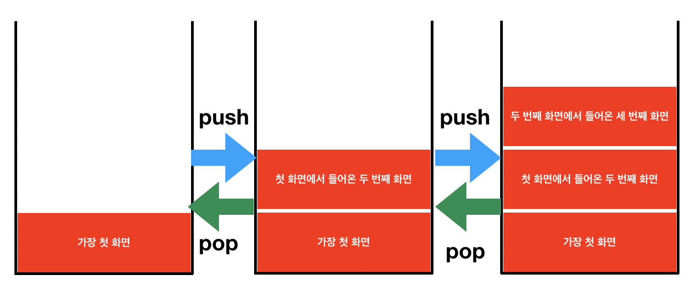

스택의 가장 상단에 있는 화면이 현재 보여지고 있는 화면이다.

따라서 사용자가 back 버튼 클릭 시 스택 상단에 있던 화면이 pop되어 사라지고, 한 단계 바로 아래에 있던 화면이 스택의 최상단이 되면서 사용자에게 이전 화면이 보이게 되는 것이다.


## Navigation 사용


### Navigation 라이브러리 종속성 추가

Navigation은 Jetpack에 속해 있는 라이브러리이기 때문에 프로젝트에 아래 코드와 같이 라이브러리 종속성 추가

```xml
 dependencies {
 def nav_version = "2.3.0"

 // Java language implementation
 implementation "androidx.navigation:navigation-fragment:$nav_version"
 implementation "androidx.navigation:navigation-ui:$nav_version"

 // Kotlin
 implementation "androidx.navigation:navigation-fragment-ktx:$nav_version"
 implementation "androidx.navigation:navigation-ui-ktx:$nav_version"

 // Feature module Support
 implementation "androidx.navigation:navigation-dynamic-features-fragment:$nav_version"

 // Testing Navigation
 androidTestImplementation "androidx.navigation:navigation-testing:$nav_version"
 }
```


### NavGraph 만들기


Navigation의 첫 시작은 NavGraph 만들기

프로젝트에 NavGraph를 추가하려면 res 폴더에서 New -> Android Resource File 선택 후, 파일 이름 입력(ex- nav_graph.xml)

그 다음, Resource Type을 Navigation으로 선택한 후 파일 생성을 완료 하면 된다.


이렇게 navigation 파일을 생성하면 res 폴더 안에 자동으로 navigation 이라는 폴더가 생성되고 그 안에 새로 만든 NavGraph 파일이 위치한다.

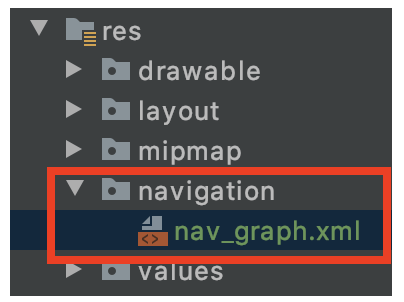


NavGraph 파일을 열면 아래와 같은 탐색 그래프 편집기가 열린다.

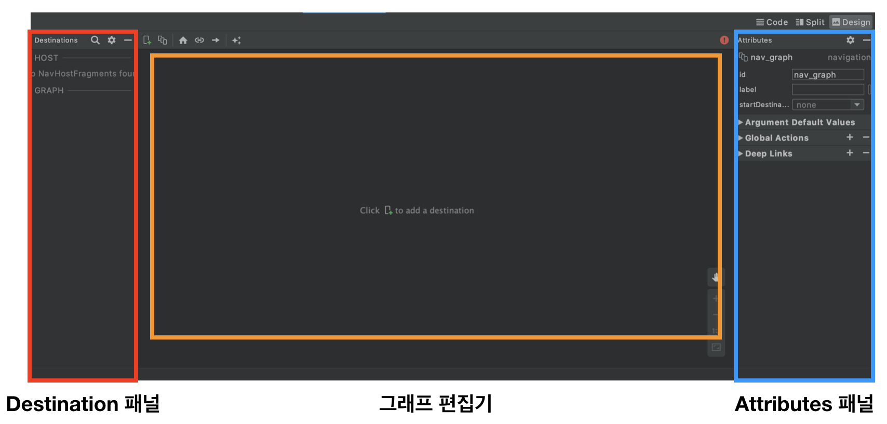

- Destination 패널 : 현재 그래프 편집에 있는 NavHost와 모든 action들을 나열
- 그래프 편집기 : NavGraph가 시각적으로 표시되는 곳
- Attributes 패널 : NavGraph에서 현재 선택된 항목의 속성들을 보여준다.


이렇게 시각적인 편집기로도 NavGraph가 작성 가능하지만,

Code 버튼을 눌러 코드로 직접 작성 할 수 있다.


### NavHost 추가

NavGraph 생성 후 NavHost를 적합한 곳에 추가해야 한다.

예시로 activity_main.xml에 NavHost를 위치시킬 것이다.

NavHost는 NavHostFragment 라는 뷰로 구현하는 데, 구현 방법은 아래와 같다.

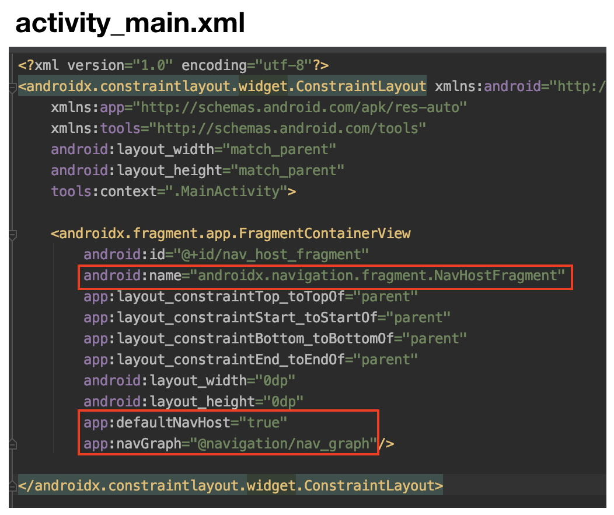

위 코드처럼 FragmnetContainerView 라는 뷰를 작성하고 name을 코드와 같이 "androidx.navigation.fragment.NavHostFragment" 라고 작성하면 NavHostFragment가 생성된다.

또 defaultNavHost 속성을 사용 시 안드로이드 시스템의 뒤로 가기 버튼이 차단된다.

navGraph 속성에는 이 NavHostFragment가 연결되어야 할 NavGraph를 작성해줘야 한다.


### NavGraph에 Destination 추가

NavGraph에 탐색 대상이 되는 Destination 들을 추가

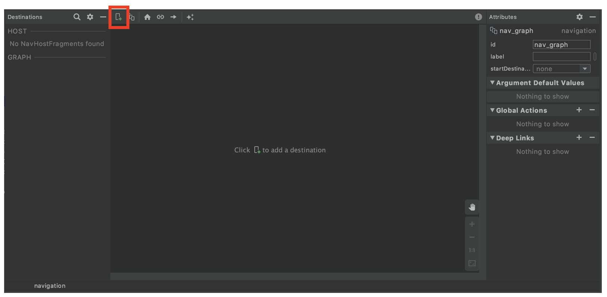

위에서 생성한 nav_graph.xml 을 열면 나오는 편집기에서 좌측 상단에 위치한 New Destination 버튼 클릭 후, Create New Destination 클릭

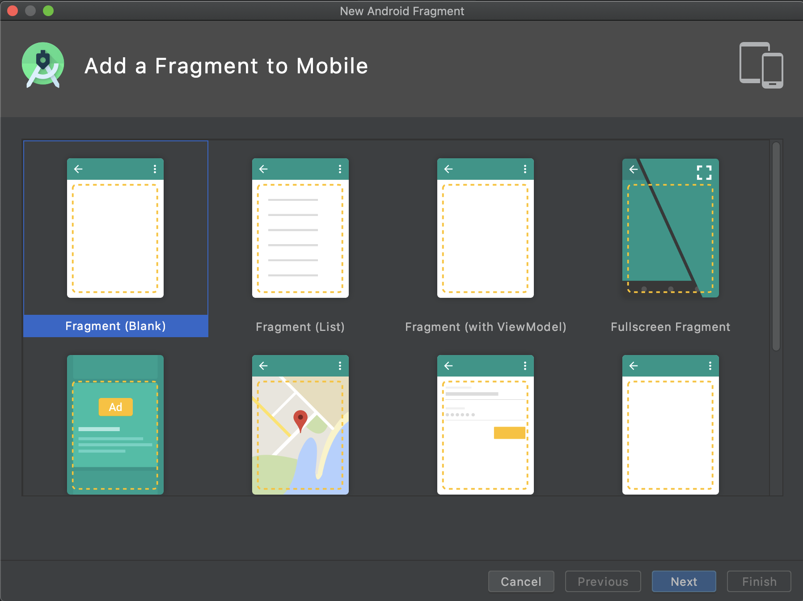

프래그먼트 클릭 후, 프래그먼트 파일의 이름 설정하고 완료

그러면 Fragment 하나가 생성되고, NavGraph에도 시각적으로 방금 만든 Fragment가 나타난다.

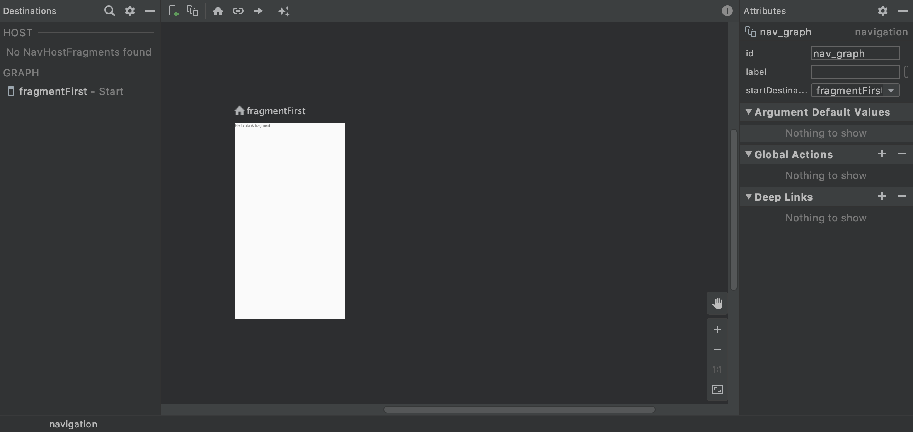

nav_graph.xml 파일을 Code로 보면 방금 만든 Fragment 추가되어 있을 것이다.

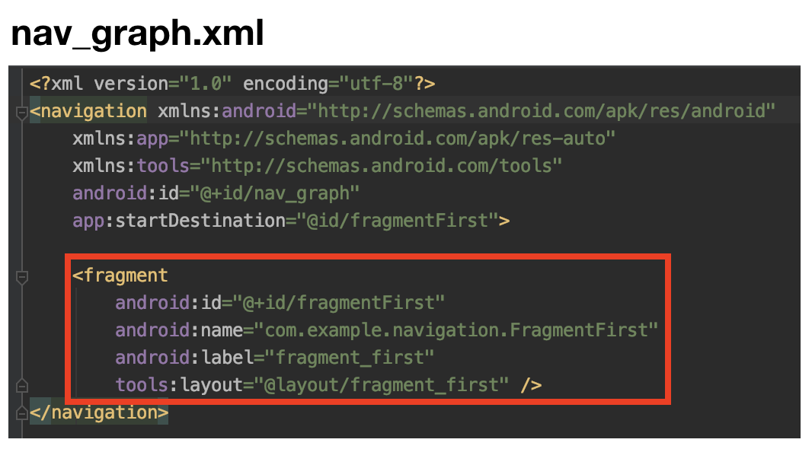


### Destination들 연결 = action 만들기

탐색의 대상이 되는 Destination을 만들었다면 탐색 흐름과 순서를 나타내는 화살표인 action을 만들어 각 destination들을 연결시켜 줘야 한다.


하지만 action을 통한 연결은 사용자가 앱에서 탐색할 수 있는 경로에 대한 논리적 연결 일뿐,

이 다음 단계에서 실제로 하나의 destination에서 다른 destination으로 이동시키는 코드를 작성해줌으로써 물리적 연결까지 해줘야 한다.


action을 사용해 하나의 destination에서 다른 destination으로 연결된 탐색 경로를 나타내기 위해

destination 하나 더 생성

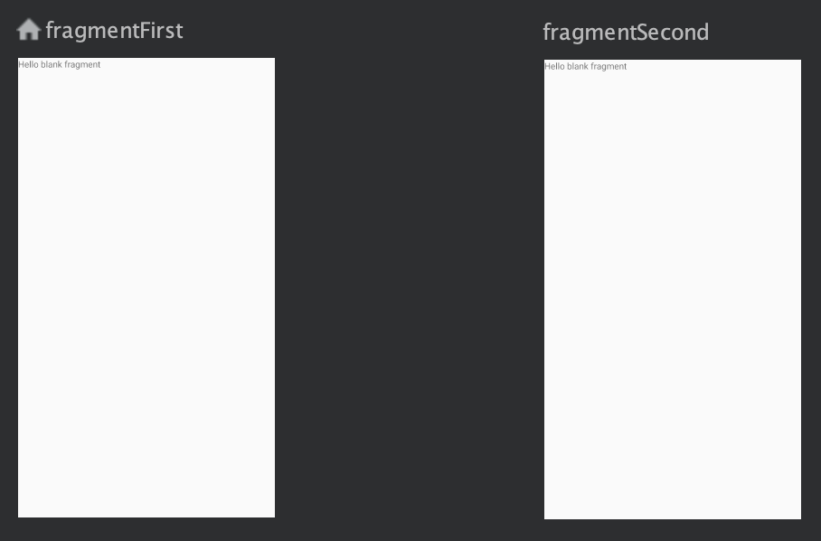

NavGraph 편집기에서 fragmentFirst 라는 destination 을 클릭해보면 오른쪽 측면에 동그라미 버튼이 하나 생기고, 클릭한 후 fragmentSecond라는 destination 쪽으로 드래그 하면 action이 생성된다.

 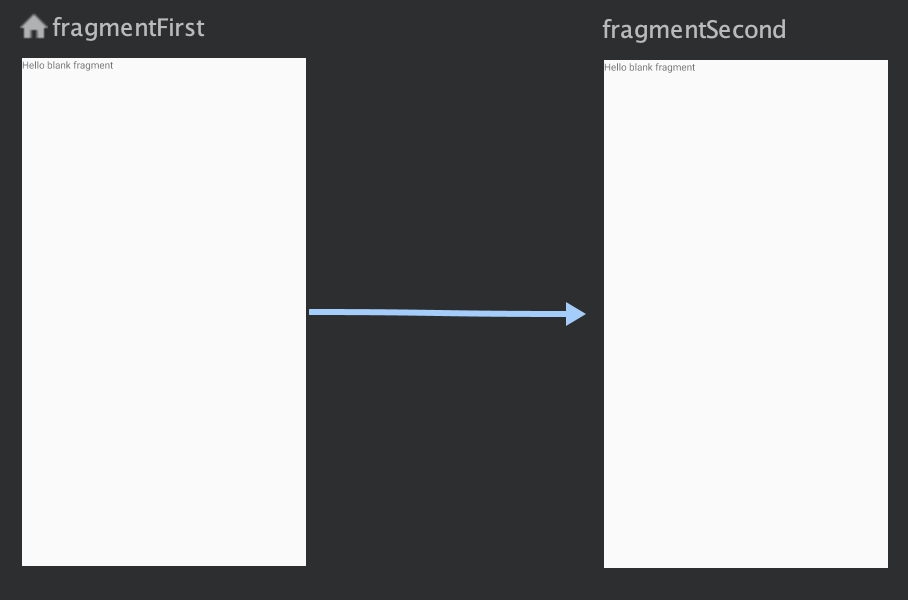

편집기 모드에서 Code 모드로 바꿔서 보면

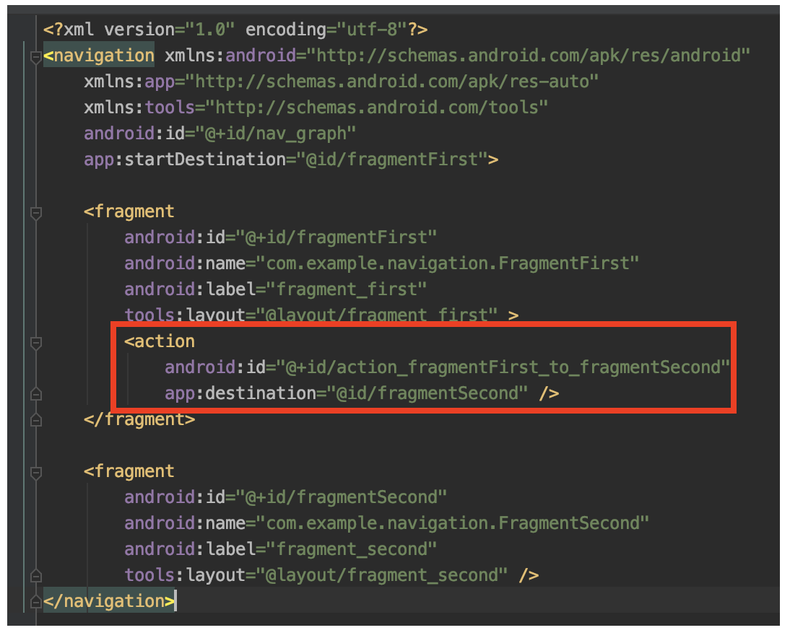

이렇게 fragmentFirst 뷰 속성으로 action 태그가 자동으로 추가되어 잇는 것을 확인

action 태그의 속성에서는 action의 id를 설정할 수 있고,

action이 가르키는 목적지가 fragmentSecond 임을 명시해줘야 한다.


### 실제 탐색을 위한 물리적인 코드 작성

위에서 action을 한 것은 NavGraph를 작성함으로 써 논리적인 탐색 경로를 생성한 것이고,

실제로 코틀린 코드로 물리적인 이동을 작성해줘야 한다.


이 때 사용되는 것이 NavController 객체이다.

이 NavController는 NavHost 내에서 탐색을 직접 관리하는 객체이다.

따라서 각 NavHost에는 그에 대응하는 NavController 들이 하나씩 존재한다.


코틀린에서 다음 3개의 메소드 중 하나를 사용하여 NavController 객체를 가져올 수 있다.

- Fragmnet.findNavController()
- View.findNavController()
- ACtivity.findNavController(viewid : Int)


3가지 방법 중 View.findNavController() 사용 하여 물리적인 이동을 해보자


위에 작성한 nav_graph를 보면 fragmentFirst 라는 destination과 fragmentSecond 라는 destination이 만들어져 있다.

이 각 Fragment를 아래와 같이 디자인하고, fragmentFirst 프래그먼트 화면의 textView를 클릭하면 fragmentSecond 프래그먼트로 이동하여 탐색하는 로직을 View.findNavController()를 사용해서 구현

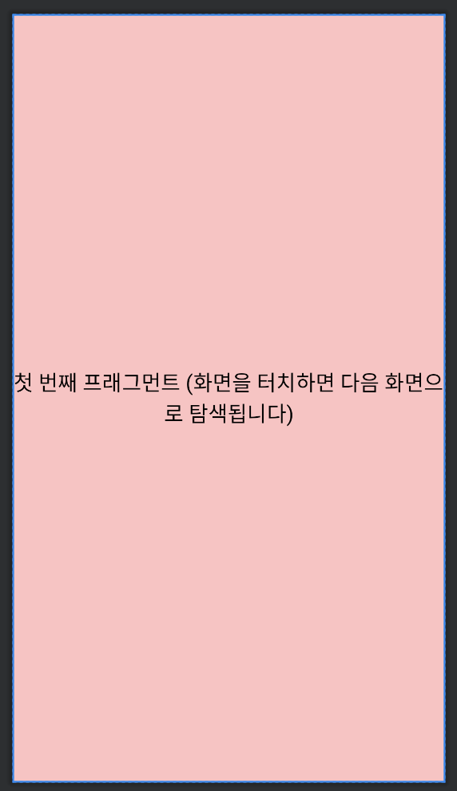


위 그림 처럼 fragmnetFirst의 화면 중앙에 id가 textView_first 인 textView 배치


fragmentFirst.kt 파일에서 textView_first에 setOnClickListner를 달고 클릭 시

View.findNavController() 를 사용하여 fragmentSecond 프래그먼트로 이동하도록 하였다.

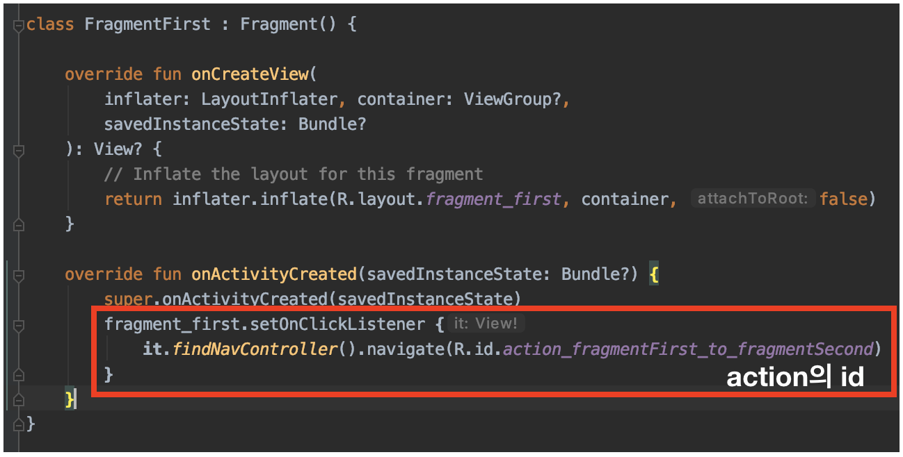

findNavController() 메소드의 인자에는 nav_graph에서 생성했던 fragmentSecond로 향하는 action의 id 값을 작성하면된다.


---

findNavController() 메소드 인자에 nav_graph에 존재하는 fragmentSecond 프래그먼트의 id 값을 넣어도 되지만 가급적이면 action의 id를 넣어주는 것이 좋다.

---


---

참고사이트

김초희 깃험 : https://choheeis.github.io/newblog//articles/2020-08/navigation

공 홈 : https://developer.android.com/guide/navigation