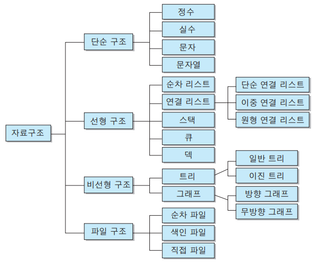

# 자료구조란 (Data Strcture)

사전적 의미 : 자료(Data) 의 집합

각 원소들이 논리적으로 정의된 규칙에 의해 나열되며 자료에 대한 처리를 효율적으로 수행할 수 있도록 자료를 구분하여 표현 한 것

자료 구조란 컴퓨터 과학에서 효율적인 접근 및 수정을 가능케 하는 자료의 집합을 의미하여,

각 원소들 사이의 관계가 논리적으로 정의된 일정한 규칙에 의하여 나열되며 자료에 대한 처리를 효율적으로 수행할 수 있도록 자료를 조직적, 체계적으로 구분하여 표현 한 것을 말한다.

## 목적

> 자료(Data) 를 더 효율적으로 저장하고, 관리하기 위해 사용하며, 잘 선택된 자료구조는 실행시간을 단축시켜주거나 메모리 용량의 절약을 이끌어 낼 수 있다.

## 선택 기준

> 작업의 효율성, 추상화, 재사용성을 증가시킥기 위하여 상황에 따른 적절한 자료구조 사용이 필요

- 자료의 처리시간
- 자료의 크기
- 자료의 활용빈도
- 자료의 갱신정도
- 프로그램의 용이성

## 특징

### 효율성

자료구조를 사용하는 목적은 효율적인 데이터의 관리 및 사용이다.

적절한 자료구조를 선택하여 사용한다면 업무의 효율이 올라갈 것이다.

### 추상화

추상화란 복잡한 자료, 모듈, 시스템 등으로 부터 핵심적인 개념만 간추려 내는 것이다.

자료구조를 구현 시 중요한 것은 어느 시점에 데이터를 삽입할 것이며, 어느 시점에 이러한 데이터를 어떻게 사용할 것인지에 대해서 초점을 맞출 수 있기 때문에 구현 외적인 부분에 더 시간을 쏟을 수 있다.

마찬가지로 자료구조 내부의 구현은 중요하지 않다. 어떻게 구현했는지 보다 어떻게 사용해야 하는지를 알고 있어야 한다.

### 재사용성

자료구조를 설계 할 때 특정 프로그램에서만 동작하게 설계하지는 않는다.

다양한 프로그램에서 동작할 수 있도록 범용성 있게 설계하기 때문에 해당 프로젝트가 아닌 다른 프로젝트에서도 사용할 수 있다.

## 분류

