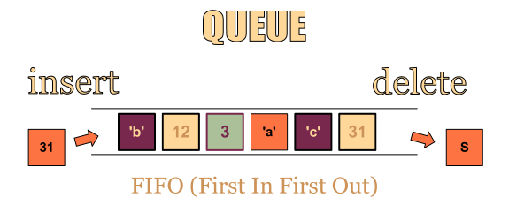
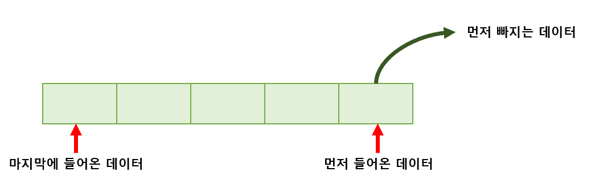
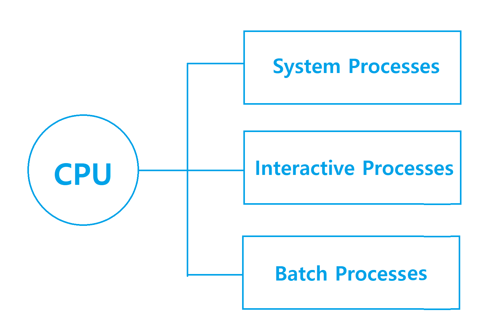

# 큐 (Queue)

> 먼저 집어 넣은 데이터가 먼저 나오는 FIFO (First In First Out) 구조로 저장하는 형식

한쪽 끝에서만 삽입이 이루어지고,

다른 끝에서는 삭제 연산만 이루어지는 유한 순서 리스트

처음 들어온 원소부터 빠지는 방식을 FIFO (First In First Out) 방식 이라고 한다.

## 사례

### 1. 줄 서서 기다리는 사람

### 2. 한줄로 나란히 가는 차

### 3. 운영체제의 테스크 스케줄링

