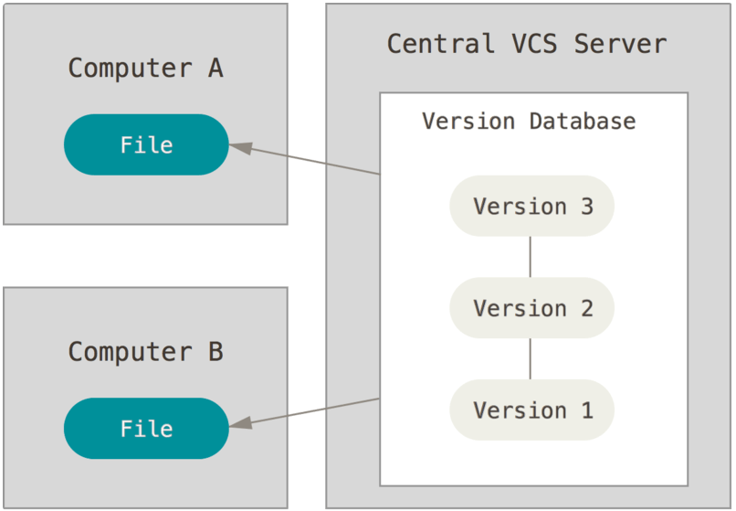

# Git

> 분산버전관리시스템, 코드의 버전을 관리하는 도구


## 버전 관리 시스템

> 파일 변화를 시간에 따라 기록하고 특정 시점 버전을 다시 꺼낼 수 있는 시스템

버전 관리 시스템 (VCS - Version Control System)

왜 필요할까? ex)

1. 100만장에 종이 중 무작위 5장에 A라고 적었다.
2. 그 5장에 B라고 적고 섞는다.
3. B라 적은 내용을 새로 고쳐 C라고 써야한다.

버전 관리 시스템이 없을 때에는 일일이 찾아서 수정해야 함

버전 관리 시스템이 있을 때에는 각 상황마다 버전을 기록하고 관리해두었다면 그냥 1번 버전으로 돌아간 후 수행


좀 더 쉽게 말하면 **뒤로가기가 가능** 하다는 의미


### VCS 종류


#### Local VCS

> 파일을 각 시점마다 복사해서 저장하는 것


위의 방식은 아주 간단하고 쉽지만, 변형되기도 쉽고 삭제, 변경에 대해 취약해서 잘못되어도 알아내기 어렵다


이를 더 쉽게 할 수 있게 하고자 간단한 DB에 파일의 변경 정보를 담아 관리하는 로컬 VSC라는 것이 만들어졌다.


위와 같은 방식인데 모든 것이 로컬 컴퓨터에 있기에 다른 컴퓨터에서 해당 DB에 접근하기 어렵다.

이러한 문제를 해결하기 위해 개발된 것이 CVCS (Centralized Version Control Systems) 이다.


#### CVCS

> 파일 관리를 하는 중앙 서버에 DB가 있어 로컬에서 해당 서버에서 파일을 받아서 사용

CVCS (Centralized Version Control Systems)



파일 관리를 하는 중앙 서버에 DB가 있어 로컬에서 해당 서버에서 파일을 받아서 사용한다.

각 로컬에서 관리하지 않고 중앙에서 관리하기에 관리가 쉽고 서버 기록을 보면 누가 무엇을 했는지 알 수 있다.


다만 단점은 중상 서버가 작동하지 않으면 각 버전의 정보를 받아올 수 없고, 중앙 서버 하드에 문제가 생기면 각 로컬로 가져간 스냅샷 (어느 특정한 버전, 상태에 대한 기록)은 무사하지만 전체적인 히스토리를 잃을 수 있다.

commit 한 내용이 바로 중상서버로 업로드 되는 방식이므로 그 소스를 공유하는 모든 작업자에게 영향이 간다.


이러한 문제를 개선된 것이 DVCS (Distributed Version Control Systems) 이다.


#### DVCS

> 로컬 작업공간에서 작업을 진행하다가 중간중간 로컬저장소로 올려서 작업한 내용에 대한 이력을 관리하고 개발이 끝나서 해당 파일을 최종적으로 반영하고 할 때, 그 때 중앙서버에 업로드하는 방식


CVCS는 commit -> 중앙서버 업로드 였다면, DVCS (git)은 최종적으로 중앙서버에 올리기 까지 몇 가지의 과정을 더 거쳐야 한다.


그 과정에서 나온느 개념이 로컬저장소이고, 로컬 작업공간에서 작업을 진행하다가 중간중간 올리고자 하는 내용을 로컬저장소로 올려서 작업한 내용에 대한 이력을 관리 할 수 있다.

개발이 끝나서 해당 파일을 최종적으로 반영하고자 할 때, 그 때 중상서버에 업로드하는 방식이다.

git의 기능은 많고, 로컬 저장소에 올리기 전에도 commit할 대상을 지정할 수 있는 스테이지 영역도 있는데, 진행해야 하는 작업이 많은 경우 작업별로 commit 대상을 분리 할 수 있는 기능이다.


`로컬 작업 공간 -> 스테이지 영역 -> 로컬저장소 -> 중앙서버` 형태로 구성 


**명령 Summary**

|                            | SVN    | git                                        |
| -------------------------- | ------ | ------------------------------------------ |
| 중앙서버의 내용 내려받기   | update | pull (fetch + merge를 한 번에 처리할 경우) |
| 스테이지 영역에 추가       |        | add                                        |
| 로컬저장소로 내용 올리기   |        | commit                                     |
| 로컬저장소로 내용 내려받기 |        | fetch                                      |
| 로컬저장소에서 내용 합치기 |        | merge                                      |
| 중앙서버로 내용 올리기     | commit | push                                       |


## git 저장소 만들기

```bash
$ git init
Initialized empty Git repository in C:/Users/student/Desktop/test/.git/

(master) $
```

* `.git` 폴더가 생성되며, 버전이 관리되는 저장소
* git bash에서는 `(master)` 로 브랜치가 표기 된다. 


## git 최초 설정

> Git을 설치하고 나서 사용자이름과 이메일 주소를 설정한다.
>
> Git은 커밋할 때 마다 이 정보를 사용한다.

`git config --global user.name 내이름`		 : 이름

`git config --global user.email 내 이메일`	: 이메일 


※`--global` 옵션으로 설정하는 것은 딱 한번만 하면된다.


### `git config --list`

> 설저한 모든 것을 보여준다.

```bash
$git config --list
user.name=IngakHwang
user.email=ghkdrnjsm@gmail.com
core.editro=code --wait
core.editor=code --wait
core.autocrlf=true
...
```


### `git config alias`

> Git 명령어 단축어

```bash
$ git config --global alias.co checkout
$ git config --global alias.br branch
$ git config --global alias.ci commit
$ git config --global alias.st status
```

git commit 대신 git ci 만으로 커밋 할 수 있다


## 버전 만들기

### `add`

> 변경된 사항 저장하기

```bash
$ git add <파일/폴더/디렉토리>
$ git add . # 현재 디렉토리 변경 모두
$ git add a.txt   # 특정 파일
$ git add folder/ # 특정 폴더 
$ git add *.png   # 특정 확장자
```

#### 예시

```bash
$ touch a.txt
$ git status
On branch master

No commits yet
# 트래킹되지 않는 파일 / Working directory	(아직 add되지 않음)
Untracked files:
  (use "git add <file>..." to include in what will be committed)
        a.txt

nothing added to commit but untracked files present (use "git add" to track)
$ git add a.txt
$ git status
On branch master

No commits yet
# 커밋될 변경사항들!!! (Staging area)		(add된 파일)
Changes to be committed:
  (use "git rm --cached <file>..." to unstage)
        new file:   a.txt

```

### `commit` 

> add된 파일이 어떻게 변경되었는지 기록

```bash
$ git commit -m '변경사항기재'
```

#### 예시

```bash
$ git commit -m 'first'
[master (root-commit) acca762] first
1 file changed, 0 insertions(+), 0 deletions(-)
create mode 100644 a.txt
```


 `commit --amend`

> 최신 커밋 메시지 수정

```bash
$git commit -m 'first commit'
$git add forgotten_file
$git commit --amend
```

※ --amend 옵션으로 커밋을 고치는 작업은, 이전의 커밋을 완전히 새로 고쳐서 새 커밋으로 변경하는 것을 의미한다.

amend로 커밋을 수정하는 작업이 주는 장점은 마지막 커밋 작업에서 아주 살짝 뭔가 빠뜨린 것을 넣거나 변경하는 것을 새 커밋으로 분리하지 않고 하나의 커밋에서 처리하는 것이다. (또 새로 커밋을 만들지 않겟다)


## 상태 관련 명령어

### `status`

> add되었는지 확인 할때

```bash
$ git status
```

#### 예시

```bash
$ git status
On branch master

No commits yet
# 커밋될 변경사항 => git add가 된 파일 (commit 해야 함)
Changes to be committed:
  (use "git rm --cached <file>..." to unstage)
        new file:   1.txt
# 아직 트래킹되지 않은 파일 => git add가 안된 파일 (add 후 commit)
Untracked files:
  (use "git add <file>..." to include in what will be committed)
        a.txt
```


### `log`

> commit된 기록조회

```bash
$ git log
```

#### 예시

```bash
$ git log
commit 4bb326437f7f90946011db0a1c42c0f2af403531 (HEAD -> master)
Author: IngakHwang <Ingak.Hwang@users.noreply.github.com>
Date:   Wed Sep 29 15:17:30 2021 +0900

    third

commit 62768e158d452e71da854e13959fca92ec12f962
Author: IngakHwang <Ingak.Hwang@users.noreply.github.com>
Date:   Wed Sep 29 15:16:30 2021 +0900

    second

commit acca762f4d0a4da00b7af2516825f08c2465247e
Author: IngakHwang <Ingak.Hwang@users.noreply.github.com>
Date:   Wed Sep 29 15:13:57 2021 +0900

    first
```

`git log -1` : 최근 기록된 커밋 조회

```bash
$ git log -1
commit 4bb326437f7f90946011db0a1c42c0f2af403531 (HEAD -> master)
Author: IngakHwang <Ingak.Hwang@users.noreply.github.com>
Date:   Wed Sep 29 15:17:30 2021 +0900

    third
```


`git log --branches --decorate` : 브랜치 별로 커밋 로그 조회

`git log --branches --decorate --graph` : + 그래프로

`git log --branches --decorate --graph --oneline` : + 그래프를 원라인으로 간단히

`git log -p {branch1}..{branch2}` : branch1에는 없고 branch2에는 있는 커밋 로그 조회

※ HEAD : 현재 Checkout(사용) 중인 branch

```bash
$ git log --branches --decorate
commit dd0744681eed6680ec3914674462e113651aabcf (HEAD -> exp)	//branch
Author: IngakHwang <ghkdrnjsm@gmail.com>
Date:   Tue Feb 8 19:57:07 2022 +0900

    exp2

commit 5e4fe1633ff29337cf2ac389730d6cccd3ebd503
Author: IngakHwang <ghkdrnjsm@gmail.com>
Date:   Tue Feb 8 19:55:45 2022 +0900

    exp

commit 1518ca4bd355061f2f49237d98a23d3a55394c30 (master)		//master
Author: IngakHwang <ghkdrnjsm@gmail.com>
Date:   Mon Feb 7 17:15:15 2022 +0900

    11

commit 25ab5a886fb7ff7bfd48e46b842505af7a25608f
Author: IngakHwang <ghkdrnjsm@gmail.com>
Date:   Mon Feb 7 17:14:12 2022 +0900

    10

```

 

`git log --decorate` : 브랜치가 가지고 있는 커밋 가리키기


### `diff`

> commit된 기록에 차이점 혹은 파일에 대한 변화를 알려준다.
>
> commit 하기 전에 자기가 작업을 한 내용에 문제가 있는지 없는지 확인하는 마지막 절차

```bash
$git diff
```

```bash
$git diff commit번호1..commit번호2
```

#### 예시

```bash
$ git diff
diff --git a/f1.txt b/f1.txt
index 9462317..e3a30dc 100644
--- a/f1.txt
+++ b/f1.txt
@@ -1 +1 @@
-f1.txt : 2
+f1.txt : 5
```


```bash
$ git diff 9f5a60953734900a4b3aef0a875645505cf8decc..3cd014de879f86bebecfc77866ef253d9dae0800
diff --git a/f1.txt b/f1.txt
index 2456b16..e2eaf76 100644
--- a/f1.txt
+++ b/f1.txt
@@ -1 +1 @@
-source : 2
+source : 1
```


## 과거로 돌아가기

> **굉장히 신중하게 사용할 것**
>
> git reset 명령은 매우 위험하다
>
> 특히 --hard 옵션과 사용하면 더욱 위험하다


### `reset`

> **(github에 올리기 전에 사용금지)** 
>
> reset은 내 컴퓨터에만 있는 버전에 대해서만 사용할 것
>
> reset은 github에 올리기 전에 복구를 해야할 때 사용할 것 

> commit 되었던 기록들 중간으로 돌아가기
>
> ex) 1,2,3,4,5 번째 커밋 중 4,5 번째 지우고 3번째 기록으로 돌아가기

```bash
$git reset commit번호 --hard
```


#### 예시

```bash
USER@DESKTOP-EFG7BOL MINGW64 ~/Documents/gitfth (master)
$ git log
commit 08923f97e4f0d4e177bbaa609a4814a7875361a5 (HEAD -> master)
Author: IngakHwang <ghkdrnjsm@gmail.com>
Date:   Mon Feb 7 16:57:13 2022 +0900

    5

commit d22981c6e5d9c805e9ce94a4c16d221f7280bedc
Author: IngakHwang <ghkdrnjsm@gmail.com>
Date:   Mon Feb 7 16:32:18 2022 +0900

    4

commit 917e22a8effafa1e96215928ed8ced7700e3a855
Author: IngakHwang <ghkdrnjsm@gmail.com>
Date:   Mon Feb 7 16:28:20 2022 +0900

    f2

commit 9f5a60953734900a4b3aef0a875645505cf8decc
Author: IngakHwang <ghkdrnjsm@gmail.com>
Date:   Mon Feb 7 16:27:10 2022 +0900

    2
    
commit 3cd014de879f86bebecfc77866ef253d9dae0800
Author: IngakHwang <ghkdrnjsm@gmail.com>
Date:   Mon Feb 7 16:24:20 2022 +0900

    1

USER@DESKTOP-EFG7BOL MINGW64 ~/Documents/gitfth (master)
$ git reset 917e22a8effafa1e96215928ed8ced7700e3a855 --hard
HEAD is now at 917e22a f2

USER@DESKTOP-EFG7BOL MINGW64 ~/Documents/gitfth (master)
$ git log
commit 917e22a8effafa1e96215928ed8ced7700e3a855 (HEAD -> master)
Author: IngakHwang <ghkdrnjsm@gmail.com>
Date:   Mon Feb 7 16:28:20 2022 +0900

    f2

commit 9f5a60953734900a4b3aef0a875645505cf8decc
Author: IngakHwang <ghkdrnjsm@gmail.com>
Date:   Mon Feb 7 16:27:10 2022 +0900

    2

commit 3cd014de879f86bebecfc77866ef253d9dae0800
Author: IngakHwang <ghkdrnjsm@gmail.com>
Date:   Mon Feb 7 16:24:20 2022 +0900

    1
```


> Staging Area, Working Directory 사이

```bash
$git add .
$git status
On branch master
Changes to be committed:
  (use "git reset HEAD <file>..." to unstage)
  renamed: README.md -> README
  modified: CONTRIBUTING.md
```


```bash
$ git reset HEAD CONTRIBUTING.md
Unstaged changes after reset:
M CONTRIBUTING.md
$ git status
On branch master
Changes to be committed:
  (use "git reset HEAD <file>..." to unstage)
  renamed: README.md -> README
Changes not staged for commit:
  (use "git add <file>..." to update what will be committed)
  (use "git checkout -- <file>..." to discard changes in working
directory)
  modified: CONTRIBUTING.md

```


### `revert`


## 원격 저장소 관련 명령어

### `git remote add "단축이름" "저장소 url"`

> 원격저장소(Github) 등록

```bash
$ git remote add origin https://github.com/IngakHwang/first.git
```

origin은 변수명 이라고 생각⇒ 바꿀 수 있는데, 왠만하면 바꾸지 않는 것이 좋음

### `git remote -v`

> 원격저장소 주소 확인

```bash
$ git remote -v
origin  https://github.com/IngakHwang/first.git (fetch)
origin  https://github.com/IngakHwang/first.git (push)
```

### `git remote show <리모트저장소이름>`

> 리모트 저장소의 구체적인 정보 확인

```bash
$git remote show origin
* remote origin
  URL: https://github.com/my-org/complex-project
  Fetch URL: https://github.com/my-org/complex-project
  Push URL: https://github.com/my-org/complex-project
  HEAD branch: master
  Remote branches:
  master tracked
  dev-branch tracked
  markdown-strip tracked
  issue-43 new (next fetch will store in
remotes/origin)
  issue-45 new (next fetch will store in
remotes/origin)
  refs/remotes/origin/issue-11 stale (use 'git remote prune' to
remove)
  Local branches configured for 'git pull':
  dev-branch merges with remote dev-branch
  master merges with remote master
  Local refs configured for 'git push':
  dev-branch pushes to dev-branch
(up to date)
  markdown-strip pushes to markdown-strip
(up to date)
  master pushes to master
(up to date)
```


### `git remote rename <기존리모트저장소이름> <변경할저장소이름>`

> 리모트 저장소 이름 변경 (origin -> paul)

```bash
$git remote rename origin paul
```


### `git remote remove <삭제할저장소이름>`

> 리모트 저장소 삭제 (rm도 가능)

```bash
$git remote remove paul
```


### `git push origin master`

> commit된 내용 Github으로 push 

```bash
$git push -u origin master		#master = branch
```

### `git pull origin master`  

> Github 저장소 땡겨오기

```bash
$git pull -u origin master
```

### `git clone 'url'`

> github에 주소에 있는 Repositories 가져오기
>
> 포크할 디렉토리 내에서 할 것

```bash
$git clone 'https://github.com/git/git.git gitsrc'	#gitsrc 디렉토리 만들고 폴더 내에 clone
													# . = 현재 디렉토리
```

`clone` 은 원격저장소 자체를 가져온다

저장소를 Clone 하면 'origin' 이라는 리모트 저장소가 자동으로 등록된다.


## 브랜치 관련 명령어

### `git branch {branch name}` 

> 브랜치 생성

```bash
$ git branch 'newBranch'
```

### `git branch` 

> branch 목록 조회

```bash
$ git branch
* master
```


### `git checkout {branch name}` 

> 현재 브랜치에서 {branch name}으로 이동

```bash
~/Desktop/branch (feature/index)  #(feature/index => master 이동)
$ git checkout master
Switched to branch 'master'
```

### `git checkout {commit number}`

> 해당 commit number 로 이동 (과거로 이동?)


### git checkout -b {branch name}

> {branch name} 생성 및 이동

```bash
~/Desktop/branch (master)			#(feature/index 브랜치생성 후 이동)
$ git checkout -b 'feature/index'
Switched to a new branch 'feature/index'
```

### `git branch -d {branch name}`

> {branch name} 삭제

```bash
$ git branch -d feature/about
Deleted branch feature/about (was a61ecd3).
```

### `git merge {branch name}`

>  브랜치 병합 = merge 

```bash
$ git merge feature/index
Updating 139169d..15e4ff5
Fast-forward
 index.html | 0
 1 files changed, 0 insertions(+), 0 deletions(-)
 create mode 100644 index.html
```

> Fast-forward
>
> 동일 내용이 포함되는 브랜치일 경우 브랜치 이동만으로 병합해서 따로 commit을 생성하지 않는 경우
>
> 서로 다른 상태를 병합하는 것이 아니고 master를 다른 branch 위치로 이동만 해도 되는 상태이기 때문에
>
> 별도의 merge를 위한 commit이 발생하지 않음


> merge commit
>
> 서로 다른 상태의 브랜치를 병합해서 새로운 commit을 만드는 경우
>
> 아예 다른 결과물을 갖고 있는 master와 branch는 merge 되어 새로운 commit을 만든다.

----

fastword, mergecommit 차이점 : https://yuja-kong.tistory.com/51

----


#### **branch 충동해결** 

Merge 하는 두 브랜치에서 같은 파일의 한 부분을 동시에 수정하고 Merge 하면 git은 해당 부분을 Merge 하지 못한다.

Merge 충돌이 일어났을 때 Git이 어떤 파일을 Merge 할 수 없었는지 `git status` 를 이용하면 알 수 있다.

충돌이 일어난 파일은 `unmerged` 상태로 표시된다.

Git은 충돌이 난 부분을 표준 형식에 따라 표시해준다. 그러면 개발자는 해당 부분을 수동으로 해결한다.

ex)

```bash
function b(){

}
<<<<<<<<< HEAD					#중복되는 부분 시작
function a(master){
======
function a(exp){
>>>>>>>> exp					#중복되는 부분 끝
}
function c(){

}

```


### `git log --oneline --graph` 

> 브랜치 가지 확인

```bash
$ git log --oneline --graph
*   20e3e0e (HEAD -> master) Merge branch 'feature/ppt'
|\
| * 95d5731 (feature/ppt) Add ppt & Update README
* | 80a8bfd  인각
|/
*   8db1722 README change
|\
| * a61ecd3 Update README ...
* | 5c6d968 Update README
|/
*   5bcea52 Merge branch 'feature/style'
|\
| * 9d11cef complete index css
* | 3891a94 Hotfix
|/
* 25601f7 Use VSC for commit
* c574e0f branch README commit
```

### `git stash`

> 작업하던 내용을 감출 때 사용하는 명령어 (워킹 디렉토리의 사항을 감추기) (버전관리추적파일만 해당)

다른 브랜치에서 작업 중에 또 다른 브랜치로 이동해야 할 때 작업 중이던 내용을 감추기 위함

```bash
$git stash
Saved working directory and index state WIP on exp: 9161e43 1
HEAD is now at 9161e43 1
```


### `git stash apply` 

> 감추었던 내용 복원

```bash
$git stash apply
On branch exp
Changes not staged for commit:
	(use "git add <file>..." to update what will be committed)
	(use "git checkout -- <file>..."to discard changes in working directory)
	
		modified : {파일이름}

no changes added to commit (use "git add" and/or "git commit -a")
```


### `git stash list`

> 감추었던 내용에 대한 리스트


### `git stash drop`

> stash 되었던 내용 중 최신 stash 삭제


### `git stash pop` = `git stash apply; git stash drop;`

> stash 되었된 내용 복원 및 stash리스트 내에서 삭제


## Undoing

### `git restore --staged {파일이름}` 

> add 취소

```bash
$ git status
On branch master
Changes to be committed:
  (use "git restore --staged <file>..." to unstage)
        modified:   README.md
        modified:   a.txt
```

```bash
$ git restore --staged a.txt
$ git status
On branch master
Changes to be committed:
  (use "git restore --staged <file>..." to unstage)
        modified:   README.md

Changes not staged for commit:
  (use "git add <file>..." to update what will be committed)
  (use "git restore <file>..." to discard changes in working directory)
        modified:   a.txt
```


### `git restore {파일이름}` 

> 작업 내용을 이전 버전 상태로 되돌리기
>
> ***해당 명령어 실행 후 다시 복원 불가능***

```bash
$ git status
On branch master
Changes not staged for commit:
  (use "git add <file>..." to update what will be committed)
  # 변경사항을 버리기 위해서는...
  # WD 있는거..
  (use "git restore <file>..." to discard changes in working directory)
        modified:   a.txt

no changes added to commit (use "git add" and/or "git commit -a")
```

```bash
$ git restore a.txt
```


### `git commit --amend` 

> 커밋 메시지 수정
>
> 공개된 저장소에 push 된 커밋 메시지 수정하면 큰 일남
>
> => 커밋 해시값이 변경됨 (기존 버전을 건든다)


## README.md

오픈소스의 공식 문서를 작성하거나

개인 프로젝트의 프로젝트 소개서로 활용


----

참고 사이트 : 

git 간편 안내서 : https://rogerdudler.github.io/git-guide/index.ko.html

git 관련 블로그 : https://ojava.tistory.com/157

git book : http://git-scm.com/book/ko/v2

git 관련 블로그 : http://marklodato.github.io/visual-git-guide/index-ko.html

git 원리 동영상 - 생활코딩 : https://www.youtube.com/watch?v=KyGfapLpWhY&list=PLuHgQVnccGMA8iwZwrGyNXCGy2LAAsTXk&index=15

