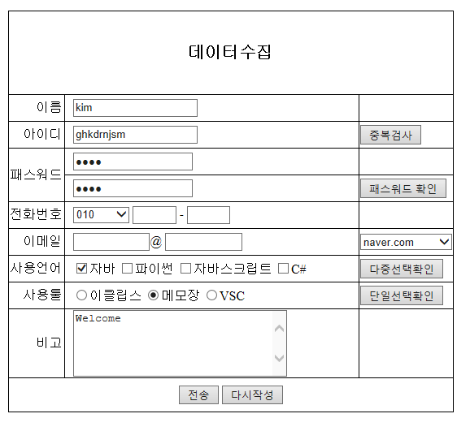

# HTML, CSS 활용

```CSS
	table{
		border : solid 1px black;
		border-collapse : collapse;
		margin : 50px auto;
	}

	td{
		border : solid 1px black;
		border-collapse : collapse;
	}
	
	#action_btn{
		text-align:center;
		height : 40px;
	}
	.title{
		text-align:right;
		padding-right: 3px;
	}
	
	th{
		height : 100px;
		font-size : 20px;
	}
	.data{
		width : 350px;
		height : 30px;
		padding-left : 10px;
	}
```


```html
<!DOCTYPE html>
<html>
<head>
<meta charset="UTF-8">
<title>Form copy</title>
<style type="text/css">
	table{
		border : solid 1px black;
		border-collapse : collapse;
	}

	td{
		border : solid 1px black;
		border-collapse : collapse;
	}

</style>

</head>
<body>
<form action="" form="">
	<table>
		<tr>
			<td colspan="2">데이터수집</td>
		</tr>
		<tr>
			<td>이름</td>
			<td>
			<input type="text" name="user_name">
			<input type="button" value="중복검사">
			</td>
		</tr>
		<tr>
			<td>아이디</td>
			<td><input type="text" name="user_id"></td>
		</tr>
		<tr>
			<td>패스워드</td>
			<td><input type="password" name="user_pw"></td>
		</tr>
		<tr>
			<td>전화번호</td>
			<td>
			<select name="phone1">
				<option>--번호선택--</option>
				<option>010</option>
				<option>011</option>
				<option>019</option>
				<option>02</option>
				<option>031</option>
			</select> -
			<input type="text" size="4" name="phone2"> -
			<input type="text" size="4" name="phone3">
			</td>
			
		</tr>
		<tr>
			<td>이메일</td>
			<td>
			<input type="text" size="10" name="email1"> @
			<select name="email2">
				<option>--이메일선택--</option>
				<option>naver.com</option>
				<option>daum.net</option>
				<option>google.com</option>
			</select> 
			</td>
			
		</tr>
		<tr>
			<td>사용언어</td>
			<td>
			<input type="checkbox" name="langs">자바
			<input type="checkbox" name="langs">파이썬
			<input type="checkbox" name="langs">자바스크립트
			<input type="checkbox" name="langs">C#
			</td>
			
		</tr>
		<tr>
			<td>사용툴</td>
			<td>
			<input type="radio" name="tools">이클립스
			<input type="radio" name="tools">메모장
			<input type="radio" name="tools">VSC
			</td>
			
		</tr>
		<tr>
			<td>비고</td>
			<td>
				<textarea rows="5" cols="30" name="etc">Welcome</textarea>
			</td>
			
		</tr>
		<tr>
			<td colspan="2">
			<input type="submit" value="가입">
			<input type="reset" value="reset">
			</td>
		</tr>	
	</table>
</form>

</body>
</html>
```


