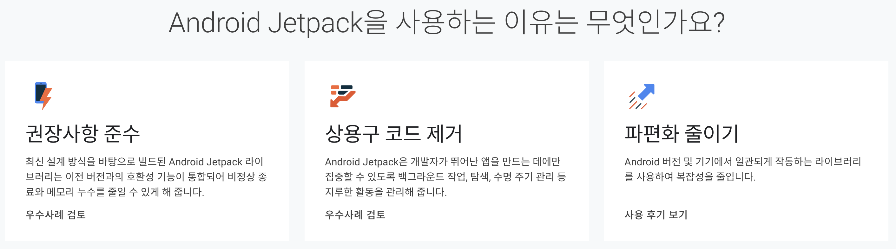
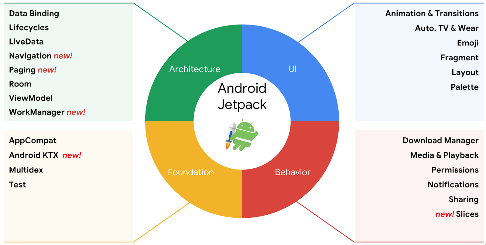

# Android Jetpack

> 개발자들이 더욱 더 편리하게, 빠르게, 쉽게 높은 퀄리티의 앱을 개발하도록 돕는 모음 도구

## 안드로이드 Jetpack 이란

Google Developer 공식사이트에서의 Jetpack 정의

> Jetpack은 개발자가 관심 있는 코드에 집중할 수 있도록 권장사항 준수, 상용구 코드 제거, 모든 Android 버전과 기기에서 일관되게 작동하는 코드 작성을 돕는 라이브러리 모음입니다.
> 

안드로이드 Jetpack은 개발에 자주 쓰이는 여러 라이브러리들과 툴들을 묶어놓은 모음집이다.

개발자들이 더욱 더 편리하게, 빠르게, 쉽게 높은 퀄리티의 앱을 개발하도록 돕는 모음 도구이다.

Jetpack의 장점중 하나는 이전 안드로이드 버전들과 호환이 된다는 것이다.

Jetpac의 라이브러리들은 androidx.* 로 패키지화가 되어있기 때문에 API로 부터 분리되어 있다.

또한 API와 분리되어 있고 라이브러리 형태이기 때문에 자주 업데이트가 되어 항상 가장 뛰어난 최신 버전의 Jetpack 구성요소에 액세스할 수 있다.

Jetpack은 androidx.* 패키지로 구성되어 있기 때문에 android.x 로 마이그레이션이 필요하다.

## 안드로이드 Jetpack의 구성요소

크게 4가지 구성요소로 나눌 수 있고 각 구성요소에는 다양한 라이브러리들과 툴들이 존재한다.

### Architecture

- Data Binding : xml파일에 Data를 연결해서 사용할 수 있게 도와준다.
- Lifecycles : 안드로이드 activity 생명주기 관련 유틸리티
- LiveData : 데이터가 변경될 때 실시간으로 view에 알려준다.
- Navigation : activity, fragment간 이동을 쉽게 도와준다.
- Paging : 대량의 데이터를 관리해주는 유틸리티
- Room : Database 보다 쉽게 사용할 수 있게 도와준다.
- WorkManager : 백그라운드 작업을 보다 쉽게 도와준다.

### Foundation

- AppCompat : 하위 안드로이드 앱에서 최신버전 sdk를 사용할 수 있도록 도와준다.
- Android KTX : 코틀린 코드를 더욱 간결하게 만들어준다.
- Multidex : dex관리 관련 유틸리티
- Test : 안드로이드 테스트관련 유틸리티

### Behavior

- Download manager : 큰 파일 다운로드를 service 차원에서 관리를 도와준다.
- Media & Playback : 미디어 파일 재생 관련 유틸리티
- Permissions : 안드로이드 권한 관련 유틸리티
- Notifications : 안드로이드 notification 관련 유틸리티
- Sharing : Actionbar에서 데이터를 보다 쉽게 공유할 수 있도록 도와준다.

### UI

- 앱에서 다양한 애니메이션, 이모지 또는 다양한 플랫폼 (TV, 워치) 관련 유틸리티를 사용할 수 있는 컴포넌트

Jetpack 컴포넌트는 안드로이드 API 플랫폼의 일부가 아니기 때문에 원하는 컴포넌트들만 androidx.* 패키지에서 선택해서 사용할 수 있다.

----

마이그레이션(migration) - 이주, 마이그레이션

정보기술에서, 마이그레이션이란 한 운영환경으로부터, 대개의 경우 좀 더 낫다고 여겨지는 다른 운영환경으로 옮겨가는 과정을 말한다.

참고사이트

안드로이드 Jetpack 알아보기 velog : https://velog.io/@eoqkrskfk94/android-Jetpack