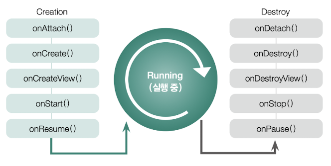

# Fragment

> Activity는 User와 App이 상호작용하는 진입점이며, 하나의 화면을 구성하는 것이고, Fragment는 Activity 안에서 화면의 일부를 구성하는 것이다.

> 부분 화면

## 주요특징

- Activity는 User와 App이 상호작용하는 진입점이며, 하나의 화면을 구성하는 것이고, Fragment는 Activity 안에서 화면의 일부를 구성하는 것이다.
-  App의 전체 UI에서 어딘가에 반복적으로 재사용 가능한 부분을 말한다.
- 단일 화면이나 화면 일부에 관한 UI를 정의하는데 적합하다.

- 자체 레이아웃(xml 파일을 정의할수  있음)을 가질 수 있고 자체 생명 주기를 보유한다.
- 입력 이벤트를 받아 처리 할 수 있다.

- 독립적으로 존재할 수 없고, 반드시 Activity 나 다른 Fragment에 호스팅 되어야 한다.
  - Fragment를 갖고 있는 Activity or Fragment를 Host Activity, Host Fragment 라고 한다.
- Activity 내에서 실행 중 추가, 제거 가능하다.
- Fragment의 view 계층 구조는 Host view 계층 구조의 일부가 된다.

- Android Jetpack 라이브러리 중 Navigation, BottomNavigationView, ViewPager2 등 Fragment와 호환되도록 설계 되어 Fragment가 해당 라이브러리와 자주 사용된다.

## Activity와 Fragment 목적성

- Activity : App 전체적인 UI에 포함될 요소들을 배치하는 곳
- Fragment : 단일 화면, 화면 일부에 관한 UI를 정의하는데 적합

하늘색 박스 부분은 Activity에 배치된 NavigationView

연두색 박스 부분은 Fragment 자체 UI

Activity는 Fragment를 호스팅 하고 있다.

## Fragment 장점

- App의 단일화면 이나 부분 화면 을 Fragment로 구현해서 실행 시 UI 모습을 사용자와 상호작용하면서 실시간으로 수정 할 수 있다.
  - Fragment 추가/교체/삭제 등의 작업이 실행됨으로 화면이 바뀌는 것처럼 보임
- Fragment를 사용하여 런타임 동안 UI를 실시간으로 바꿀 시 Host Activity의 수명 주기가 STARTED 상태 이상에 있는 동안에만 가능하다.
- 런타임 동안 Fragment의 변경사항(추가/교체/삭제)이 발생하면 FragmentManager 가 관리하는 Fragment BackStack에 변경 사항 히스토리를 저장하여 기록할 수 있다.

## Fragment 주의점

- Fragment는 재사용 가능한 자체 UI를 가지기 때문에 어느 Activity 에나 호스팅 될 수 있고 어느 Fragment에나 호스팅 될 수 있다.

- 따라서, Fragment Class에는 자체 UI를 관리하는 로직만 구현해야 하고 다른 Activity 나 Fragment를 직접 조작하는 로직을 포함해서는 안된다. (모듈성, 재사용성을 해치게 됨)

  = Fragment가 다른 Activity, Fragment에 의존하면 안된다.

## LifeCycle

> 화면을 보이는 것을 기준으로 생명 주기 메서드를 가지는데
>
> 생성 관련 5개, 소멸 관련 5개를 가지고 있다.

**생명 주기**

생성과 관련된 메서드가 5개나 이지만

프래그먼트를 포함하고 있는 액티비티가 화면에 계속 나타나고 있는 상태에서 onAttach() 부토 onResume() 까지 메서드가 모두 한번에 호출된다.

1. onAttach()

   프래그먼트 매니저를 통해 액티비티에 프래그먼트가 추가되고 commit 되는 순간 호출

2. onCreate()

   프래그먼트가 생성됨과 동시에 호출, UI인 뷰와 관련된 것을 제외한 프래그먼트 자원(주로 변수)을 초기화 할 때 사용

3. onCreateView()

   UI와 관련된 뷰를 초기화

4. onStart()

   프래그먼트가 새로 추가 되거나

   화면에서 사라졌다가 다시 나타나면 onCreateView()는 호출되지 않고 onStart()만 호출

   주로 화면 생성 후 화면에 입력될 값을 초기화 하는 용도

5. onResume()

   onStart()와 같은 용도로 사용

   다른 점은 소멸 주기 메서드가 onPause() 상태에서 멈췄을 때(현 프래그먼트 일부가 가려지지 않았을 떄)는 onStart()를 거치지 않고 onResume()이 바로 호출

**소멸 주기**

현재 프래그먼트 위로 새로운 프래그먼트가 추가 되거나

현재 프래그먼트를 제거하면 소멸 주기와 관련된 메서드가 순차적으로 호출된다.

1. onPause()

   현재 프래그먼트가 화면에서 사라지면 호출

   주로 동영상 플레이어를 일시정지하거나 현재 작업을 잠시 멈추는 용도로 사용

2. onStop()

   onPause()와 다른 점은 현재 프래그먼트가 화면에 일부분이라도 보이면 onStop()은 호출되지 않는다.

   동영상 플레이를 예로 들면 일시정지가 아닌 정지를 하는 용도

3. onDestoryView()

   뷰의 초기화를 해제하는 용도

   이 메서드 호출된 후 생성 주기 메서드인 onCreateView()에서 인플레이터로 생성한 View가 모두 소멸

4. onDestory()

   액티비티에는 아직 남아있지만 프래그먼트 자체는 소멸

   프래그먼트에 연결된 모든 자원을 해제하는 용도

5. onDetach()

   액티비티에서 연결이 해제

---

참고 사이트

김초희 깃헙 : https://choheeis.github.io/newblog//articles/2021-02/fragment