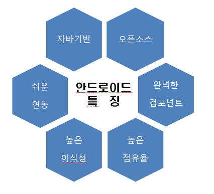
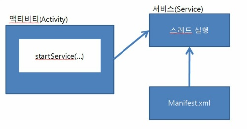

# 안드로이드 (Android)

## 안드로이드란

구글에서 만든 운영체제로써, 운영체제와 미들웨어, 사용자 인터페이스, 어플리케이션, MMS 서비스 등을 하나로 묶어 서비스를 제공하며 다양한 어플리케이션을 만들어 설치하면 실행될 수 있도록 구성된 어플리케이션 플랫폼이다.

안드로이드는 리눅스(Linux)를 기반으로 제작되었고 언어는 자바와 코틀린을 사용한다.

## 안드로이드 특징

1. 자바기반 : 안드로이드를 개발할 때 사용하는 언어는 자바이다. 전 세계 많은 자바 개발자들이 앱 개발을 할 수 있어 안드로이드는 빠르게 성장할 수 있는 계기가 되었다. 코틀린 또한 지원한다.
2. 오픈소스 : 안드로이드는 오픈소스를 기반으로 하고 있으며 아파치 2.0 라이센스를 사용한다.
3. 완벽한 컴포넌트 : 안드로이드는 오픈소스임에도 불구하고 스마트폰을 위한 완벽한 컴포넌트들을 제공한다. 핵심적인 커널 부분만 제공하고 다른 부분들은 개발자에게 맡기는 방식이 아니라 제공된 소스를 사용하면 스마트폰이라는 전화기가 그대로 만들어지므로 대부분의 개발자들은 그 위에 올라가는 앱만 만들면 된다.
4. 높은 점유율
5. 높은 이식성 : 안드로이드는 리눅스를 기반으로 높은 이식성을 가지고 있으며 새로운 하드웨어의 기능을 쉽게 연동할 수 있다. 모발일 뿐만 아니라 태블릿, PMP 등 각종 통신 기기에 사용할 수 있다. 나아가 가전기기, 자동차 까지도 적용할 수 있는 연동성을 갖추어 임베디드시스템의 새로운 패러다임을 제시 하고 있다.
6. 쉬운연동 

## 안드로이드 4대 컴포넌트

안드로이드는 4대 컴포넌트 액티비티, 서비스, 컨텐츠프로바이더, 브로드캐스트리시버 이렇게 4가지를 말한다.

어플리케이션을 만들 떄 주요 구성요소이자 안드로이드의 사실상 모든 구성요소 이다.

각각의 구성요소는 인텐트를 통해서 상호 통신을 한다.

### 액티비티 (Activity)

액티비티는 UI화면을 담당하는 컴포넌트이다.

액티비티 역할을 하기 위해서는 자바소스에서 Activity 클래스를 상속해야 하며 액티비티가 기본적으로 가지고 있는 생명주기 메소드를 재정의하여 원하는 기능을 구현하는 방식으로 제작한다.

**특징**

1. 안드로이드 앱은 반드시 하나 이상의 Activity를 가지고 있어야 한다.
2. 2개의 Activity를 동시에 Display 할 수 없다.
3. 다른 앱의 Activity도 불러 낼 수 있다.
4. Activity 내 Fragment(프래그먼트) 를 추가하여 화면을 분할시킬 수 있다.

### 서비스 (Service)

서비스는 백그라운드에서 실행되는 프로세스를 의미한다.

서비스는 화면이 존재하지 않는다.

앱의 구성요소 이므로 새로 만든 후에는 항상 매니페스트에 등록 해주어야 한다.

**특징**

1. 화면이 없다. 그저 백그라운드에서 돌아가는 컴포넌트
2. 한번 시작된 서비스는 앱이 종료되도 계속해서 백그라운드에서 돌아간다.
3. 모든 서비스는 Service 클래스를 상속받아서 사용한다.
4. 네트워크를 통해 데이터를 가져 올 수 있다.

### 콘텐츠 제공자 (Content Provider)

데이터를 관리하고 다른 앱 데이터를 제공해주는 컴포넌트이다.

데이터베이스의 데이터를 전달할 때 많이 사용한다.

**특징**

1. 파일입출력, SQLiteDB, Web 등을 통해서 데이터를 관리한다.
2. 콘텐츠 제공자를 통하여 다른 앱의 데이터도 변경 가능 하다.

### 브로드캐스트 리시버 (Broadcast Recevier)

안드로이드에서 다양한 이벤트와 정보를 받아 반응하는 컴포넌트이다.

브로드캐스팅은 메시지를 여러 객체에서 전달하는 방법을 의미 하는데, 이렇게 전달되는 브로드캐스팅 메시지를 브로드캐스트 리시버라는 앱의 구성요소를 이용해 받을 수 있다.

**특징**

1. 디바이스에서 발생하는 일 중에서 앱이 알아야 하는 상황이 발새앟면 알려준다.
2. 수신기를 통해 디바이스의 상황을 감지하고 적절한 작업을 수행한다.
3. 대부분 UI가 존재하지 않는다.

----

참고 사이트

안드로이드 4대 컴포넌트란 무엇인가? 블로그 : https://coding-factory.tistory.com/205

안드로이드 공식문서 : https://developer.android.com/guide/components/fundamentals