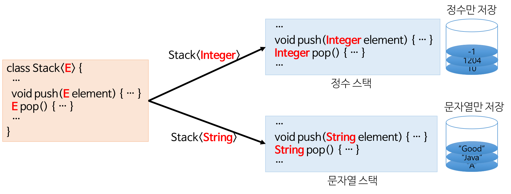

# Java 면접


## Java와 C/C++의 차이점

java와 c/c++의 가장 큰 차이점은 실행 환경이다.

java에서의 개발은 컴파일 혹은 컴파일 + jar 압축, 자바는 링크 과정이 없이 컴파일러가 바로 바이트 코드를 생성

c/c++에서의 개발은 컴파일 + 링크


## Java 언어의 장단점


### 장점

- 운영체제에 독립적이다 - JVM에서 동작하기 때문에, 운영체제에 종속되지 않는다.
- 객체지향 언어 - 캡슐화, 상속, 추상화, 다형성 등 지원
- 자동으로 메모리 관리 - JVM에서 Garbage Collector로 GC(Garbage Collection)이 일어나, 메모리 관리할 필요가 없음
- 오픈소스
- 멀티스레드 쉽게 구현 - 스레드 생성 및 제어 관련 라이브러리 제공을 하여 운영체제 상관 없이 멀티 스레드 구현가능
- 동적 로딩 지원 - 애플리케이션 실행 시 모든 객체가 생성되지 않고, 각 객체가 필요한 시점에 클래스를 로딩해서 생성, 유지보수 시 해당 클래스만 수정하면 됨


### 단점

- 비교적 속도가 느리다
  - 한 번 컴파일로 기계어가 만들어지지 않고 JVM에 의해 기계어로 번역되고 실행하는 과정을 거치기 때문에 C / C++ 의 컴파일 단계에서 만들어지는 완전한 기계어보다는 속도가 느리다. 그러나 하드웨어 성능 향상, 기계어로 변환해주는 JIT 컴파일러 같은 기술 적용으로 JVM의 기능이 향상 되어 속도 격차가 줄어듬
  - 예외처리가 불편하다.


### Java 접근 제어자 종류 및 특징

| 접근 제어자 | 설명                                                         |
| ----------- | ------------------------------------------------------------ |
| public      | 어떤 클래스의 객체에서든 접근 가능                           |
| private     | 이 클래스에서 생성된 객체들만 접근 가능                      |
| protected   | 이 클래스와 동일 패키지에 있거나 상속 관계에 있는 하위 클래스의 객체들만 접근 가능 |
| package     | 동일 패키지에 있는 클래스의 객체들만 접근 가능               |


## OOP의 4가지 특징

1. 추상화
   - 객체에서 공통된 속성이나 기능을 추출하는 것
2. 캡슐화
   - 데이터와 기능을 모아놓고 패킷하는 것 (변수와 메소드를 하나로 묶음) 
   - 실제 구현 부분을 외부에 드러나지 않도록 하는 것
   - 데이터를 외부에서 직접 접근하지 않고 함수를 통해서 접근
3. 상속
   - 부모 클래스의 특성과 기능을 물려받는 것
   - 클래스의 재사용이 용이하도록 해준다.
4. 다형성
   - 어떤 변수, 메소드가 상황에 따라 다른 결과를 내는 것
   - 오버 로딩(Overloading) : 하나의 클래스에서 메소드의 이름이 같지만 파라메터가 다른 것
   - 오버 라이딩(Overriding) : 부모 클래스의 메소드를 자식 클래스의 용도에 맞게 재정의


## OOP의 5대 원칙 (SOLID)


- S : 단일 책임 원칙 (SRP, Single Respoinsibility Principle)
  - 한 클래스는 하나의 책임만 가져야 한다.
- O : 개방 - 폐쇄 원칙 (OCP, Open Closed Principle)
  - 확장에는 열려(OPEN) 있으나, 변경에는 닫혀(Closed) 있어야 한다.
- L : 리스코프 치환 원칙 (LSP, Liskov Substitution Principle)
  - 객체는 프로그램의 정확성을 깨드리지 않으면서 하위 타입의 인스턴스로 바꿀 수 있어야 한다.
- I : 인터페이스 분리 원칙 (ISP, Interface Segregation Principle)
  - 인터페이스를 클라이언트에 특화되도록 분리시켜야 한다.
- D : 의존 역전 원칙 (DIP, Dependency Inversion Principle)
  - 의존 관계를 맺을 때 변화하기 쉬운 것 보다 변화하기 어려운 것, 거의 변화가 없는 것에 의존하라는 것
  - 추상화에 의존한다. 구체화에 의존하면 안된다.


## 객체지향, 절차지향 프로그래밍의 차이

- 절차지향 프로그래밍
  - 실행하고자 하는 절차를 정하고, 이 절차대로 프로그래밍하는 방법
  - 목적을 달성하기 위한 일의 흐름에 중점을 둔다.
- 객체지향 프로그래밍
  - 실제 세상의 물체를 객체로 표현하고, 이들 사이의 관계, 상호 작용을 프로그램으로 나타낸다.
  - 객체를 추출하고 객체들의 관계를 결정하고 이들의 상호 작용에 필요한 필드와 메서드를 설계 및 구현한다.
  - 객체 지향의 핵심은 연관되어 있는 변수와 메서드를 하나의 그룹으로 묶어서 그룹핑하는 것
  - 하나의 클래스가 여러 개의 인스턴스가 될 수 있다는 점이 객체 지향의 재활용성


## 제네릭(Generic)

개념 : 모든 종류의 타입을 다룰 수 있도록 일반화된 타입 매개 변수로 클래스나 메서드를 선언하는 기법




## 클래스, 객체, 인스턴스 차이

- 클래스 (Class)
  - 객체를 만들어 내기 위한 설계도 혹은 틀
  - 연간되어 있는 변수와 메서드의 집합
- 객체 (Object)
  - 소프트웨어 세계에 구현할 대상
  - 클래스에 선언된 모양 그대로 생성된 실체
  - 클래스의 인스턴스
  - 클래스 타입으로 선언 되었을 때 '객체' 라고 부른다.
- 인스턴스 (Instance)
  - 설계도를 바탕으로 소프트웨어 세계에 구현된 구체적인 실체
  - 메모리에 할당됨


## 인터페이스와 추상 클래스의 차이

- 추상 메서드 (Abstract Method)
  - abstract 키워드와 함께 원형만 선언되고, 코드는 작성되지 않는 메서드

```java
public abstract String getName();	// 추상메서드
public abstract String fail(){return "result";} // 추상메서드X 
```


- 추상 클래스 (Abstract Class)
  - 개념 : abstract 키워드로 선언된 클래스
  - 추상 메서드를 한 개 이상 포함되는 경우 반드시 추상 클래스로 선언해야 한다.
  - 추상 메서드가 하나도 없어도 추상 클래스 선언 할 수 있다.
- 추상 클래스 구현
  - 서브 클래스에서 슈퍼 클래스의 모든 추상 메서드를 오버라이딩하여 실행 가능한 코드로 구현
- 추상 클래스 목적
  - 객체를 생성하기 위함이 아니며, 상속을 위한 부모 클래스로 활용하기 위한 것이다.
  - 여러 클래스들의 공통된 부분을 추상화(추상 메서드) 하여 상속받는 클래스에게 구현을 강제화하기 위한 것

```java
abstract class Shape{
    Shape() {...}
    void edit() {...}
    abstarct public void draw();
};
```

```java
class Circle extends Shape{
    public void draw(){System.out.println("circle");}	//오버라이딩
    void show(){...}
}
```


- 인터페이스 (Interface)
  - 개념 : 추상 메서드와 상수만을 포함하여, Interface 키워드를 사용하여 선언한다.
- 인터페이스 구현
  - 인터페이스를 상속받고, 추상 메서드를 모두 구현한 클래스를 작성
  - implements 키워드를 사용하여 구현
- 인터페이스 목적
  - 상속 받은 서브 클래스에게 구현할 메서드들의 원형을 모두 알려주고, 클래스가 자신의 목적에 맞게 메서드를 구현하도록 하는 것
  - 구현 객체의 같은 동작을 보장하기 위한 목적
- 인터페이스 특징
  - 상수 필드와 추상 메서드만으로 구성된다.
  - 모든 메서드는 추상 메서드로, abstract public 속성이며 생략 가능
  - 인터페이스를 상속 받아 새로운 인터페이스 사용 가능 `interface b extends a {}`


- 추상 클래스, 인터페이스 공통점
  - 객체 생성 불가
  - 선언만 하고 구현 내용 없음
  - 자식 클래스에게 메서드 구체적인 동작 구현하도록 위임


- 추상 클래스, 인터페이스 차이점

  - 서로 다른 목적
    - 추상 클래스 : 추상 메서드를 자식 클래스가 구체화 하여 기능을 확장하는 데 목적 (상속을 위한 부모클래스)
    - 인터페이스 : 서로 관련이 없는 클래스에서 공통적으로 사용하는 방식이 필요하지만 기능을 각각 구현할 필요가 있는 경우에 사용 (구현 객체의 같은 동작을 보장), 상속이 된 클래스에 추가 기능 부여
  - 추상 클래스는 클래스, 인터페이스는 클래스가 아니다
  - 추상 클래스는 단일 상속, 인터페이스는 다중 상속 가능

  

## 동기, 비동기

- 동기 (Synchronous : 동시에 일어나는)
  - 요청과 그 결과가 동시에 일어난다는 약속인데, 바료 요청을 하면 시간이 얼마가 거리던지 요청한 자리에서 결과가 주어져야 한다.
  - 순차적으로 진행
  - 다음 실행될 명령은 현재 실행 중인 명령 종료 시 까지 대기 (대기시간 버퍼링)
  - 설계가 매우 간단하고 직관적이지만, 결과가 주어질 때까지 아무것도 못하고 대기해야하는 단점
  - Java 에서 synchronized 키워드 사용
    - 멀티 스레드 접근 제한 키워드
    - 메소드 단위, 블록 단위 적용 가능
- 비동기 (Asynchronous : 동시에 일어나지 않는)
  - 요청과 결과가 동시에 일어나지 않는 것
  - 현재 실행 중인 명령이 종료되지 않아도 다음 명령 실행 가능
  - Callback 함수를 통해 결과 확인
  - 결과가 주어지는데 시간이 걸러디러다고 다른 작업을 할 수 있고, 자원을 효율적으로 사용 가능, 동기보다 복잡
  - ex) Ajax, Thread


## 리플렉션 (Reflection)

- 리플렉션
  - 이미 로딩이 완료된 클래스에서 또 다른 클래스를 동적으로 로딩하여 생성자, 멤버 필드, 멤버 메서드 등을 사용할 수 있는 기법
  - 클래스의 패키지 정보, 접근 지정자, 슈퍼 클래스, 어노테이션 등을 얻을 수 있다.
  - 컴파일 시간이 아니라 실행 시간에 동적으로 특정 클래스의 정보를 객체화를 통해 분석 및 추출해낼 수 있는 프로그래밍 기법
- 사용방법
  - `Class.forName("클래스 이름")`
  - 클래스의 이름으로부터 인스턴스를 생성 할 수 있고, 이를 이용하여 클래스의 정보를 가져올 수 있다.

- 사용이유
  - 실행 시간에 다른 클래스를 동적으로 로딩하여 접근할 떄
  - 클래스와 멤버 필드, 메서드 등에 관한 정보를 얻어내야 할 때
  - 리플렉션 없이도 완성도 높은 코드 구현 가능하지만 조금 더 유연한 코드를 만들 수 있다.
- 주의 할 점
  - private 멤버도 `Field.setAccessible()` 메서드 true로 지정 시 접근, 조작 가능


ex)

```java
public class Human {
    public String name;
    public int number;
    public void setHuman (String name, int number) {
        this.name = name;
        this.number = number;
    }
    public void setNumber(int number) {
          this.number = number;
    }
    public void sayHello(String name) {
        System.out.println("Hello, " + name);
  }
}
```


```java
import java.lang.reflect.Method;
import java.lang.reflect.Field;
/* ReflectionTest 클래스 */
public class ReflectionTest {
    public void reflectionTest() {
        try {
            Class myClass = Class.forName("Human");
            Method[] methods = myClass.getDeclaredMethods();
            /* 클래스 내 선언된 메서드의 목록 출력 */
            /* 출력 : public void Human.setHuman(java.lang.String,int)
                     public void Human.setNumber(int)
                     public void Human.sayHello(java.lang.String) */
            for (Method method : methods) {
                System.out.println(method.toString());
            }
            /* 메서드의 매개변수와 반환 타입 확인 */
            /* 출력 : Class Name : class DoHee
                     Method Name : setDoHee
                     Return Type : void */
            Method method = methods[0];
            System.out.println("Class Name : " + method.getDeclaringClass());
            System.out.println("Method Name : " + method.getName());
            System.out.println("Return Type : " + method.getReturnType());
            /* 출력 : Param Type : class java.lang.String
                     Param Type : int */
            Class[] paramTypes = method.getParameterTypes();
            for(Class paramType : paramTypes) {
                System.out.println("Param Type : " + paramType);
            }
            /* 메서드 이름으로 호출 */
            Method sayHelloMethod = myClass.getMethod("sayHello", String.class);
            sayHelloMethod.invoke(myClass.newInstance(), new String("Human")); // 출력 : Hello, Human
            /* 다른 클래스의 멤버 필드의 값 수정 */
            Field field = myClass.getField("number");
            Human obj = (Human) myClass.newInstance();
            obj.setNumber(5);
            System.out.println("Before Number : " + field.get(obj)); // 출력 : Before Number : 5
            field.set(obj, 10);
            System.out.println("After Number : " + field.get(obj)); // 출력 : After Number : 10
        } catch (Exception e) {
            // Exception Handling
        }
    }
    public static void main(String[] args) {
        new ReflectionTest().reflectionTest();
    }
}
```

