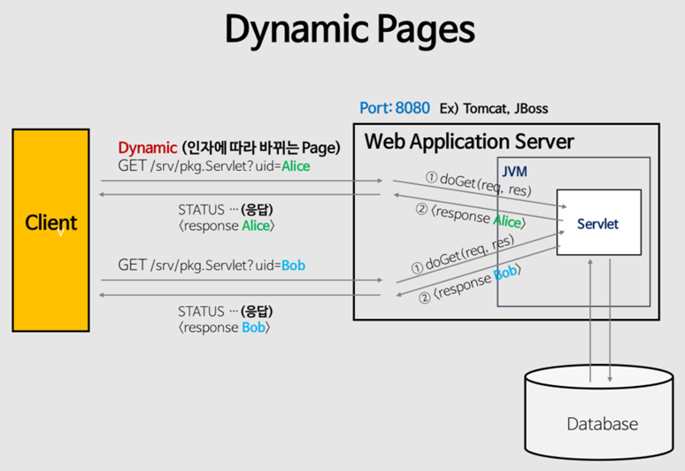

# 서블릿 (Servlet)

> 서버 쪽에서 실행되면서 클라이언트의 요청에 따라 동적으로 서비스를 제공하는 자바 클래스

독자적으로 실행되지 못하고 톰캣과 같은 JSP/Servlet 컨테이너에서 실행된다.

클라이언트가 웹 서버에 요청(Request) -> 웹 서버는 그 요청을 WAS에 위임 ->

WAS는 각 요청에 해당하는 서블릿 실행 -> 서블릿은 요청에 대한 기능 수행 후 결과 반환

