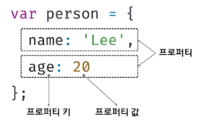
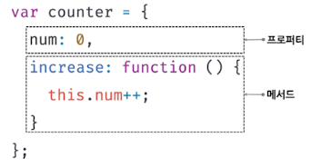

# 객체 리터럴

자바스크립트는 객체 기반의 프로그래밍 언어이며, 자바스크립트를 구성하는 거의 "모든 것"이 객체다.

원시 값을 제외한 나머지 값(함수, 배열, 정규 표현식 등)은 모두 객체다.

원시 타입은 단 하나의 값만 나타내지만 객체 타입(object/reference type)은 다양한 타입의 값(원시 값 또는 다른 객체)을 하나의 단위로 구성한 복합적인 자료구조 (data structure)다.

또한 원시 타입의 값, 즉 원시 값은 변경 불가능한 값이지만 객체 타입의 값, 즉 객체는 변경 가능한 값이다.


객체는 0개 이상의 프로퍼티로 구성된 집합이며, 프로퍼티는 키(key)와 값(value)으로 구성된다.



자바스크립트에서 사용할 수 있는 모든 값은 프로퍼티 값이 될 수 있다.

자바스크립트의 함수는 일급 객체이므로 값으로 취급할 수 있다.

따라서 함수도 프로퍼티 값으로 사용할 수 있다.

프로퍼티 값이 함수일 경우, 일반 함수와 구분하기 위해 메서드(method)라 부른다.


이처럼 객체는 프로퍼티와 메서드로 구성된 집합체다.



- 프로퍼티 : 객체의 상태를 나타내는 값(data)
- 메서드 : 프로퍼티를 참조하고 조작할 수 있는 동작 (behavior)


이처럼 객체는 객체의 상태를 나타내는 값(프로퍼티)과 프로퍼티를 참조하고 조작할 수 있는 동작(메서드)을 모두 포함할 수 있기 때문에 상태와 동작을 하나의 단위로 구조화 할 수 있어 유용하다.

---

**객체와 함수** 

자바스크립트의 객체는 함수와 밀접한 관계를 가진다.

함수로 객체를 생성하기도 하며 함수 자체가 객체이기도 하다.

자바스크립트에서 함수와 객체는 분리해서 생각할 수 없는 개념이다.

즉, 객체를 이해해야 함수를 제대로 이해할 수 있고, 반대로 함수를 이해해야 객체를 정확히 이해할 수 있다.

---

객체의 집합으로 프로그램을 표현하려는 프로그래밍 패러다임을 객체지향 프로그래밍이라 한다.


## 객체 리터럴에 의한 객체 생성

C++ 이나 자바 같은 클래스 기반 객체지향 언어는 클래스를 사전에 정의하고 필요한 시점에 new 연산자와 함께 생성자 (constructor)를 호출하여 인스턴스를 생성하는 방식으로 객체를 생성한다.

---

**인스턴스 (instance)**

클래스에 의해 생성되어 메모리에 저장된 실체를 말한다.

객체지향 프로그래밍에서 객체는 클래스와 인스턴스를 포함한 개념이다.

클래스는 인스턴스를 생성하기 위한 템플릿의 역할을 한다.

인스턴스는 객체가 메모리에 저장되어 실제로 존재하는 것에 초점을 맞춘 용어다.

----


자바스크립트는 프로토타입 기반 객체지향 언어로서 클래스 기반 객체지향 언어와는 달리 다양한 객체 생성 방법을 지원한다.

- 객체 리터럴
- Object 생성자 함수
- 생성자 함수
- Object.create 메서드
- 클래스(ES6)

이러한 객체 생성 방법 중에서 가장 일반적이고 간단한 방법은 객체 리터럴을 사용하는 방법이다.

리터럴(literal)은 사람이 이해할 수 있는 문자 또는 약속된 기호를 사용하여 값을 생성하는 표기법을 말한다.

객체 리터럴은 객체를 생성하기 위한 표기법이다.


객체 리터럴은 중괄호 `{...}` 내에 0개 이상의 프로퍼티를 정의한다.

변수에 할당되는 시점에 자바스크립트 엔진은 객체 리터럴을 해석해 객체를 생성한다.

```javascript
var person = {
  name: 'Lee',
  sayHello: function(){
    console.log(`Hello! My name is ${this.name}.`);
  }
};

console.log(typeof person);	// object
console.log(person);	// {name: "Lee", sayHello: f}
```


객체 리터럴의 중괄호는 코드 블록을 의미하지 않는다.

코드 블록의 닫는 중괄호 뒤에는 세미콜론을 붙이지 않는다.

하지만 객체 리터럴은 값으로 평가되는 표현식이다.

따라서 객체 리터럴의 닫는 중괄호 뒤에는 세미콜론을 붙인다.


객체 리터럴은 자바스크립트의 유연함과 강력함을 대표하는 객체 생성 방식이다.

객체를 생성하기 위해 클래스를 먼저 정의하고 new 연산자와 함께 생성자를 호출할 필요가 없다.

숫자값과 문자열을 만드는 것과 유사하게 리터럴로 객체를 생성한다.

객체 리터럴에 프로퍼티를 포함시켜 객체를 생성함과 동시에 프로퍼티를 만들 수도 있고, 객체를 생성한 후 프로퍼티를 동적으로 추가할 수도 있다.


객체 리터럴 외의 객체 생성 방식은 모두 함수를 사용해 객체를 생성한다.

이 방법에 대해서는 추후 살펴보자


## 프로퍼티

**객체는 프로퍼티의 집합이며, 프로퍼티는 Key, Value로 구성된다.**

```javascript
var person = {
	// 프로퍼티 키 : name, 프로퍼티 값 : 'Lee'
  name : 'Lee',
  // 프로퍼티 키 : age, 프로퍼티 값 : 20
  age: 20
};
```


프로퍼티 키는 프로퍼티 값에 접근할 수 있는 이름으로서 식별자 역할을 한다.

하지만 반드시 식별자 네이밍 규칙을 따라야 하는 것은 아니지만, 식별자 네이밍 규칙을 따르지 않는 이름에는 반드시 따옴표를 사용해야 한다.

식별자 네이명 규칙을 따르지 않는 프로퍼티 키를 사용하면 번거로운 일이 발생한다.

```javascript
var person ={
  firstName : 'Ingak',	// 식별자 네이밍 규칙 준수한 프로퍼티 키
  'last-name' : 'Hwang'	// 식별자 네이밍 규칙 준수하지 않는 프로퍼티 키
};
```

식별자 네이밍 규칙을 준수하면 따옴표를 생략 할 수 있다.

준수하지 않으면 따옴표를 생략할 수 없다.


## 메서드

자바스크립트에서 사용할 수 있는 모든 값은 프로퍼티 값으로 사용할 수 있다.

아직 살펴보진 않았지만 자바스크립트 함수는 객체(일급 객체)다.

따라서 값으로 취급 할 수 있기 때문에 프로퍼티 값으로 사용할 수 있다.

프로퍼티 값이 함수일 경우 일반 함수와 구분하기 위해 메서드(method) 라 부른다.

즉, 메서드는 객체에 묶여 있는 함수를 의미한다.


## 프로퍼티 접근

프로퍼티에 접근하는 방법은 두 가지다.

- 마침표 프로퍼티 접근 연산자 `.` 를 사용하는 마침표 표기법 (dot notation)
- 대괄호 프로퍼티 접근 연산자 `[...]` 를 사용하는 대괄호 표기법 (bracket notation)


프로퍼티 키가 식별자 네이밍 규칙을 준수하는 이름이면 마침표, 대괄호 표기법을 모두 사용할 수 있다.

식별자 네이밍 규칙을 준수하지 않는 이름은 반드시 대괄호 표기법을 사용해야 한다.

대괄호 표기법을 사용하는 경우 대괄호 프로퍼티 접근 연산자 내부에 지정하는 프로퍼티 키는 반드시 따옴표로 깜싼 문자열이어야 한다.

```javascript
var person = {
  name : 'Hwang'
};

console.log(person.name)	// Hwang
console.log(person['name'])	// Hwang

var person2 = {
  'last-name' : 'Hwang'
};
console.log(person2.last-name)	// SyntaxError
console.log(person2.['last-name'])	// Hwang
```


## 프로퍼티 값 갱신

이미 존재하는 프로퍼티에 값을 할당하면 프로퍼티 값이 갱신된다.

```javascript
var person = {
  name: 'Lee'
};

person.name = 'Kim';

console.log(person)		// {name : 'Kim'}
```


## 프로퍼티 동적 생성

존재하지 않는 프로퍼티에 값을 할당하면 프로퍼티가 동적으로 생성되어 추가되고 프로퍼티 값이 할당된다.

```javascript
var person = {
  name : 'Lee'
};

person.age = 20;

console.log(person)		//{name : 'Lee', age : 20}
```


## 프로퍼티 삭제

delete 연산자는 객체의 프로퍼티를 삭제한다.

이 때 delete 연사나의 피연산자는 프로퍼티 값에 접글 할 수 있는 표현식이어야 한다.

만약 존재하지 않는 프로퍼티를 삭제하면 아무런 에러 없이 무시된다.

```javascript
var person = {
  name : 'Lee'
};

person.age = 20;

console.log(person);		//{name : 'Lee', age : 20}

delete person.age;	// age 프로퍼티 존재함 -> 삭제

delete person.address;	// address 프로퍼티 존재하지 않음 -> 삭제X, 에러 발생하지 않음

console.log(person);	// {name : 'Lee'}
```


## ES6 추가된 객체 리터럴 확장 기능


### 프로퍼티 축약 표현

객체 리터럴의 프로퍼티는 Key, Value로 구성된다.

프로퍼티 값은 변수에 할당된 값, 즉 식별자 표현식 일 수도 있다.

```javascript
var x = 1, y = 2;

var obj = {
  x: x,
  y: y
};

console.log(obj);	// {x:1, y:2}
```


프로퍼티 값으로 변수를 사용하는 경우 변수 이름과 프로퍼티 키가 동일한 이름일 때 프로퍼티 키를 생략 (preperty shorthand) 할 수 있다.

이 때 프로퍼티 키는 변수 이름으로 자동 생성된다.

```javascript
let x = 1, y = 2;

var obj = {x,y}

console.log(obj);	// {x:1, y:2}
```


### computed property name

문자열 또는 문자열로 타입 변환 할 수 있는 값으로 평가되는 표현식을 사용해 프로퍼티 키를 동적으로 생성할 수도 있다.

단, 프로퍼티 키로 사용할 표현식을 대괄호 `[...]` 로 묶어야 한다.

이를 계산된 프로퍼티 이름 (computed property name) 이라 한다.

```javascript
var prefix = 'prop';
var i = 0;
var obj = {};

obj[prefix + '-' + ++i] = i;
obj[prefix + '-' + ++i] = i;
obj[prefix + '-' + ++i] = i;

console.log(obj);		//{prop-1:1, prop-2:2, prop-3:3}
```


객체 리터럴 내부에서도 계산된 프로퍼티 이름으로 프로퍼티 키를 동적 생성 할 수 있다.

```javascript
const prefix = 'prop';
let i = 0;
const obj = {
	[`${prefix}-${++i}`] : i,
	[`${prefix}-${++i}`] : i,
	[`${prefix}-${++i}`] : i  
};

console.log(obj);		//{prop-1:1, prop-2:2, prop-3:3}
```


### 메서드 축약 표현

메서드를 정의하려면 프로퍼티 값으로 함수를 할당한다.

function 키워드를 생략한 축약 표현을 할 수 있다. 

```javascript
const obj = {
  name : 'Lee',
  sayHi(){
    console.log('Hi! '+this.name);
  }
};

obj.sayHi();	// Hi! Lee
```

