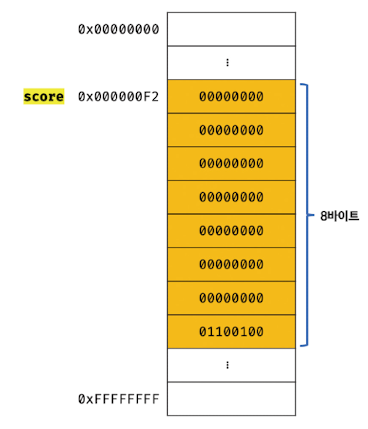

# 데이터 타입

데이터 타입(data type)은 값의 종류를 말한다.

자바스크립트의 모든 값은 데이터 타입을 갖는다.

자바스크립트의 데이터 타입은 원시 타입 (primitive type), 객체 타입 (object/reference type)으로 분류 할 수 있다.


**원시 타입**

number, string, boolean, undefined, null, symbol


Number  1과

String '1'은 비슷해 보이지만 전혀 다른 값이다.

확보해야 할 메모리 공간의 크기도 다르고 메모리에 저장되는 2진수도 다르며 읽어 들여 해석하는 방식도 다르다.


undefined : var 키워드로 선언된 변수에 암묵적으로 할당되는 값

null : 값이 없다는 것을 의도적으로 명시 할 때 사용하는 값

symbol : ES6에서 추가된 7번째 타입


**객체 타입**

객체, 함수, 배열


*string, number, boolean은 다른 언어들과 비슷하고 사용법도 간단하여 생략*


## undefined

> var 키워드로 선언된 변수에 암묵적으로 할당되는 값
>
> 개발자가 의도적으로 할당하기 위한 값이 아니라 자바스크립트 엔진이 변수를 초기화 할 때 사용하는 값

undefined 타입의 값은 undefined가 유일하다.

var 키워드로 선언한 변수는 암묵적으로 undefined로 초기화된다.

다시 말해, 변수 선언에 의해 확보된 메모리 공간을 처음 할당이 이뤄질 때 까지 빈 상태(대부분 비어 있지 않고 쓰레기 값이 들어 있다)로 내버려두지 않고 자바스크립트 엔진이 undefined로 초기화한다.

따라서 변수를 선언한 이후 값을 할당하지 않은 변수를 참조하면 undefined가 반환된다.

```javascript
var foo;
console.log(foo); //undefined
```

이처럼 undefined는 개발자가 의도적으로 할당하기 위한 값이 아니라 자바스크립트 엔진이 변수를 초기화 할 때 사용하는 값이다.

변수를 참조했을 때 undefined가 반환된다면 참조한 변수가 선언 이후 값이 할당된 적이 없는, 즉 초기화되지 않은 변수라는 것을 간파 할 수 있다.

변수에 값이 없다는 것을 명시하고 싶을 때에는 null을 할당하면 된다.


## null

null 타입의 값은 null이 유일하다.

프로그래밍 언어에서 null은 변수에 값이 없다는 것을 의도적으로 명시 할 때 사용한다.

변수에 null을 할당하는 것은 변수가 이전에 참조하던 값을 더 이상 참조하지 않겠다는 의미다.

이는 이전에 할당되어 있던 값에 대한 참조를 명시적으로 제거하는 것을 의미하며, 자바스크립트 엔진은 누구도 참조하지 않은 메모리 공간에 대해 가비지 콜렉션을 수행할 것이다.


## symbol

심벌은 ES6에서 추가된 7번째 타입으로, 변경 불가능한 원시 타입의 값이다.

심벌 값은 다른 값과 중복되지 않는 유일무이한 값이다.

따라서 주로 이름이 충돌할 위험이 없는 객체의 유일한 프로퍼티 키를 만들기 위해 사용한다.

심벌 이외의 원시 값은 리터럴을 통해 생성하지만 심벌은 Symbol 함수를 호출해 생성한다.

이 때 생성된 심벌 값은 외부에 노출되지 않으며, 다른 값과 절대 중복되지 않는 유일무이한 값이다.

```javascript
//심벌 값 생성
var key = Symbol('key');
console.log(typeof key); // symbol

//객체 생성
var obj = {};

//이름이 충돌할 위험이 없는 유일무이한 값인 심벌을 프로퍼티 키로 사용한다.
obj[key] = value;
console.log(obj[key]); //value
```


## 객체

자바스크립트의 데이터 타입은 크게 원시 타입과 객체 타입으로 분류된다.

그 이유는 원시 타입과 객체 타입은 근본적으로 다르다.

자세한 설명은 추후 설명하고

중요한 것은 자바스크립트는 객체 기반 언어 이며, 자바스크립트를 이루고 있는 거의 모든 것이 객체라는 것이다.


## 데이터 타입의 필요성

> 데이터 타입은 값의 종류를 말한다.
>
> 자바스크립트의 모든 값은 데이터를 갖는다.
>
> 데이터 타입이 필요한 이유
>
> 1. 값을 저장할 때 확보해야 하는 메모리 공간의 크기를 결정하기 위해
> 2. 값을 참조할 때 읽어 들여야 할 메모리 공간의 크기를 결정하기 위해
> 3. 메모리에서 읽어 들인 2진수를 어떻게 해석 할지 결정하기 위해


### 1. 데이터 타입에 의한 메모리 공간의 확보와 참조

값은 메모리 저장하고 참조할 수 있어야 한다.

메모리에 값을 저장하려먼 먼저 확보해야 할 메모리 공간의 크기를 결정해야 한다.

다시 말해, 몇 바이트의 메모리 공간을 사용해야 낭비와 손실 없이 값을 저장할 수 있는지 알아야 한다.

예를 들어, 다음과 같이 변수를 선언하고 숫자 값을 할당한다면

`var score = 100;`

위 코드가 실행되면 컴퓨터는 숫자 값 100을 저장하기 위해 메모리 공간을 확보한 후, 확보된 메모리에 숫자 값 100을 2진수로 저장한다.

이러한 처리를 하려면 숫자 값을 저장할 때 확보해야 할 메모리 공간의 크기를 알아야 한다.

자바스크립트 엔진은 데이터 타입, 즉 값의 종류에 따라 정해진 크기의 메모리 공간을 확보한다.

즉, 변수에 할당되는 값의 데이터 타입에 따라 확보해야 할 메모리 공간의 크기가 결정된다.


위 코드의 경우 자바스크립트 엔진은 리터럴 100을 숫자 타입의 값으로 해석하고

숫자 타입의 값 100을 저장하기 위해 8바이트의 메모리 공간을 확보한다.

그리고 100을 2진수로 저장한다.



자바스크립트는 숫자 타입의 값을 생성할 때 배정밀도 64비트 부동소수점 형식을 사용한다.

따라서 실제로 메모리 =에 저장되는 2진수 값은 위 그림과 다르다.


이번에는 값을 참조할 경우이다.

식별자 score를 통해 숫자 타입의 값 100이 저장되어 있는 메모리 공간의 주소를 찾아갈 수 있다.

정확히 말하면 숫자 값 100이 저장되어 있는 메모리 공간의 선두 메모리 셀의 주소를 찾아갈 수 있다.

이 때 값을 참조하려면 한 번에 읽어 들여야 할 메모리 공간의 크기, 즉 메모리 셀의 개수(바이트 수)를 알아야 한다.

score 변수의 경우, 저장되어 있는 값이 숫자 타입이므로 8바이트 단위로 읽어 들이지 않으면 값이 훼손된다.


그렇다면 컴퓨터는 한 번에 읽어 들여야 할 메모리 셀의 크기를 어떻게 알 수 있는 것일까?

score 변수는 숫자 타입의 값이 할당되어 있으므로 자바스크립트 엔진은 score 변수를 숫자 타입으로 인식한다.

숫자타입은 8바이트 단위로 저장되므로 score 변수를 참조하면 8바이트 단위로 메모리 공간에 저장된 값을 읽어 들인다.


**심벌 테이블**

컴파일러 또는 인터프리터는 심벌 테이블 이라고 부르는 자료 구조를 통해 식별자를 키로 바인딩된 값의 메모리 주소, 데이터 타입, 스코프 등을 관리한다.


### 2. 데이터 타입에 의한 값의 해석

메모리에서 읽어 들인 2진수를 어떻게 해석할 수 있을까?

모든 값은 데이터 타입을 가지며, 메모리에 2진수, 즉 비트의 나열로 저장된다.

메모리에 저장된 값은 데이터 타입에 따라 다르게 해석될 수 있다.

예를 들어, 메모리에 저장된 값 0100 0001 을 숫자로 해석하면 65, 문자열로 해석하면 'A' 이다.

앞에서 본 score 변수는 숫자 타입의 값이다. 

따라서 해당 변수를 참조하면 메모리 공간의 주소에서 읽어 들인 2진수를 숫자로 해석한다

