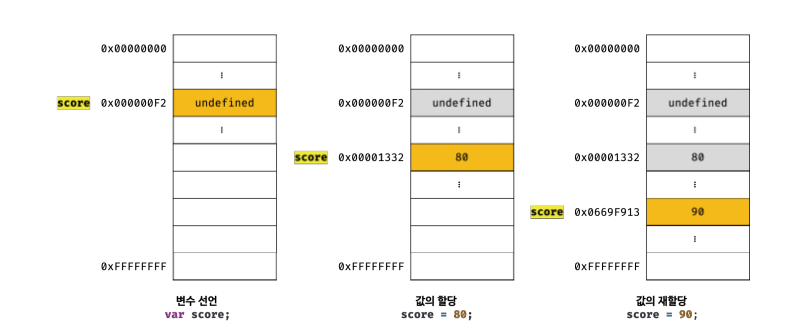
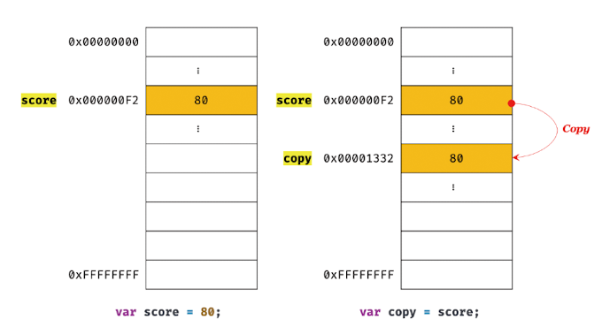
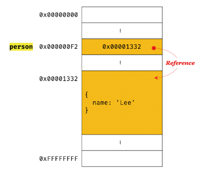
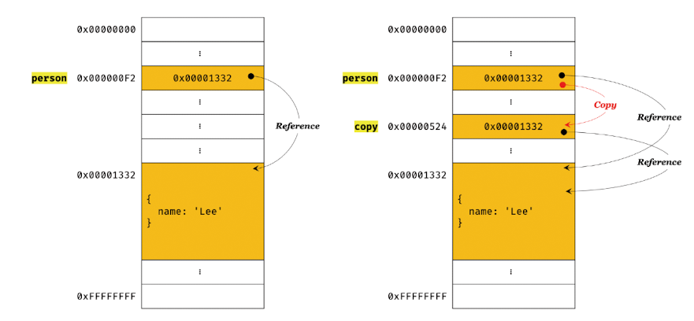

# 원시 값과 객체 비교


데이터 타입을 원시 타입과 객체 타입으로 구분하는 이유는 무엇일까?

원시 타입과 객체 타입은 근본적으로 다르다는 의미일 것이다.

원시 타입과 객체 타입은 크게 세 가지 측면에서 다르다.


1. 원시 값은 변경 불가능한 값이다. 이에 비해 객체는 변경 가능한 값이다.
2. 원시 값을 변수에 할당하면 변수(확보된 메모리 공간)에는 실제 값이 저장된다. 이에 비해 객체를 변수에 할당하면 변수(확보된 메모리 공간)에는 참조 값이 저장된다.
3. 원시 값을 갖는 변수를 다른 변수에 할당하면 원본의 원시 값이 복사되어 전달된다. 이를 값에 의한 전달 (pass by value) 이라 한다.이에 비해 객체를 가르키는 변수를 다른 변수에 할당하면 원본의 참조 값이 복사되어 전달된다. 이를 참조에 의한 전달(pass by reference) 이라 한다.


## 원시 값


### 변경 불가능한 값

원시 타입(primitive type)의 값, 즉 원시 값은 변경 불가능한 값(immutable value) 이다.

다시 말해, 한 번 생성된 원시 값은 읽기 전용 (read only) 값으로서 변경할 수 없다.


값을 변경할 수 없다는 것이 구체적으로 무엇일까?

먼저 변수와 값은 구분해서 생각해야 한다.

변수는 하나의 값을 저장하기 위해 확보된 메모리 공간 자체 또는 그 메모리 공간을 식별하기 위해 붙인 이름이고,

값은 변수에 저장된 데이터로서 표현식이 평가되어 생성된 결과를 말한다.

**변경 불가능하다는 것은 변수가 아니라 값에 대한 진술이다.**

**즉, '원시 값은 변경 불가능하다.' 는 말은 원시 값 자체를 변경할 수 없다는 것이지 변수 값을 변경할 수 없다는 것이 아니다.**

변수는 언제든지 재할당을 통해 변수 값을 변경(엄밀히 말하자면 교체)할 수 있다.

그렇기 때문에 변수라고 부른다.


변수의 상대 개념인 상수는 재할당이 금지된 변수이다.

상수도 값을 저장하기 위한 메모리 공간이 필요하므로 변수라고 할 수 있지만, 단 한 번만 할당이 허용되므로 변수 값을 변경(교체)할 수 없다.


```javascript
// const 키워드를 사용해 선언한 변수는 재할당이 금지, 상수는 재할당이 금지된 변수 일 뿐
const o = {};

// const 키워드를 사용해 선언한 변수에 할당한 원시 값(상수)는 변경할 수 없다.
// 하지만 const 키워드를 사용해 선언한 변수에 할당한 객체는 변경할 수 있다.
o.a = 1;
console.log(o);		// {a:1}
```


원시 값은 변경 불가능한 값, 즉 읽기 전용 값이다. 

원시 값은 어떤 일이 있어도 불변한다.

이러한 원시 값의 특성은 데이터의 신뢰성을 보장한다.


값을 할당 할 때를 보면

원시 값을 할당한 변수에 새로운 원시 값을 재할당하면 메모리 공간에 저장되어 있는 재할당 이전의 원시 값을 변경하는 것이 아니라 새로운 메모리 공간을 확보하고 재할당한 원시 값을 저장한 후, 변수는 새롭게 재할당한 원시 값을 가르킨다.

이 때 변수가 참조하던 메모리 공간의 주소가 바뀐다.



변수가 참조하던 메모리 공간의 주소가 변경된 이유는 변수에 할당된 원시 값이 변경 불가능한 값이기 때문이다.


변수 값을 변경하기 위해 원시 값을 재할당하면 새로운 메모리 공간을 확보하고 재할당한 값을 저장한 후, 변수가 참조하던 메모리 공간의 주소를 변경한다.

값의 이러한 특성을 불변성(immutability) 이라 한다.


불변성을 갖는 원시 값을 할당한 변수는 재할당 이외에 변수 값을 변경할 수 있는 방법이 없다.


### 문자열과 불변성

데이터 타입에 의한 메모리 공간의 확보와 참조에서 살펴보았듯, 원시 값을 저장하려면 먼저 확보해야 하는 메모리 공간의 크기를 결정해야 한다.

이를 위해 원시 타입별로 메모리 공간의 크기가 미리 정해져 있다.

단, ECMAScript 사양에 문자열 타입(2바이트), 숫자 타입(8바이트) 이외의 원시 타입은 크기를 명확히 규정하고 있지는 않아서 브라우저 제조사의 구현에 따라 원시 타입의 크기는 다를 수 있다.


원시 값인 문자열은 다른 원시 값과 비교할 때 독특한 특징이 있다.

문자열은 0개 이상의 문자로 이루어진 집합이며, 1개의 문자는 2바이트의 메모리 공간에 저장된다.

따라서 문자열은 몇 개의 문자로 이뤄졌느냐에 따라 필요한 메모리 공간의 크기가 결정된다.

숫자 값은 1도, 100000000도 동일한 8바이트가 필요하지만 문자열의 경우 1개의 문자로 이뤄진 문자열은 2바이트, 10개의 문자로 이뤄진 문자열은 20바이트가 필요하다. (단순 계산했을 시)


그럼에도 자바스크립트는 개발자의 편의를 위해 원시 타입인 문자열 타입을 제공한다.

자바스크립트의 문자열은 원시 타입이며, 변경 불가능하다.

```javascript
var str = 'Hello';
str = 'world';
```

첫 번째 문이 실행되면 문자열 'Hello'가 생성되고 식별자 str은 문자열 'Hello' 가 저장된 메모리 공간의 첫 번째 메모리 셀 주소를 가르킨다.

그리고 두 번째 문이 실행되면 이전에 생성된 문자열 'Hello'를 수정하는 것이 아닌 새로운 문자열 'world'를 메모리에 생성하고 식별자 str은 이것을 가르킨다.

이 때 문자열 'Hello', 'world'는 모두 메모리에 존재한다.

식별자 str은 문자열 'Hello'를 가르키고 있다면 문자열 'world'를 가리키도록 변경되었을 뿐이다.

---

**유사 배열 객체 (array-like object)**

마치 배열처럼 인덱스로 프로퍼티 값에 접근할 수 있고 `length` 프로퍼티를 갖는 객체

문자열은 마치 배열처럼 인덱스를 통해 각 문자에 접근할 수 있고, length 프로퍼티를 갖기 때문에 유사 배열 객체이다.

---


`str[0] = 'S'` 로 이미 생성된 문자열의 일부 문자를 변경해도 반영되지 않는다.

문자열은 변경 불가능한 값이기 때문이다.

원시 값은 어떤 일이 있어도 불변한다.

이는 데이터의 신뢰성을 보장한다.


그러나 변수에 새로운 문자열은 재할당하는 것은 물론 가능하다.

이는 기존 문자열을 변경하는 것이 아니라 새로운 문자열을 새롭게 할당하는 것이기 때문이다.


### 값에 의한 전달

```javascript
var score = 80;		// 80
var copy = score;	// 80

score = 100;			// 100

// copy?
```

위 처럼에 변수에 원시 값을 갖는 변수를 할당하면 할당받는 변수(copy)에는 할당되는 변수(score)의 원시 값이 복사되어 전달된다.

이를 값에 의한 전달이라 한다.


이 때 score, copy 변수는 숫자 80을 갖는 다는 점은 동일하나,

각각의 80 값은 다른 메모리 공간에 저장된 별개의 값이다.



두 변수의 값 80은 다른 메모리 공간에 저장된 별개의 값이라는 것은 score 변수의 값을 변경해도 copy 변수의 값에는 어떠한 영향도 주지 않는다.

염격하게 표현하면 값을 전달하는 것이 아니라 메모리 주소를 전달한다.

단, 전달된 메모리 주소를 통해 메모리 공간에 접근하면 값을 참조할 수 있다.


결국은 두 변수의 원시 값은 서로 다른 메모리 공간에 저장된 별개의 값이 되어 어느 한쪽에서 재할당을 통해 값을 변경하더라도 서로 간섭할 수 없다.


## 객체

객체는 프로퍼티의 개수가 정해져 있지 않으며, 동적으로 추가되고 삭제할 수 있다.

또한 프로퍼티의 값에도 제약이 없다.

따라서 객체는 원시 값과 같이 확보해야 할 메모리 공간의 크기를 사전에 정해 둘 수 없다.


객체는 복합적인 자료구조이므로 객체를 관리하는 방식이 원시 값과 비교해서 복잡하고 구현 방식도 브라우저 제조사마다 다를 수 있다.

원시 값은 상대적으로 적은 메모리를 소비하지만 객체는 경우에 따라 크기가 매우 클 수도 있다.

객체를 생성하고 프로퍼티에 접근하는 것도 원시 값과 비교할 때 비용이 많이 드는 일이다.


### 변경 가능한 값

객체는 변경 가능한 값(mutable value)이다.

```javascript
var person = {
  name: 'Lee'
};
```

원시 값을 할당한 변수는 원시 값 자체를 값으로 갖는다.

하지만 객체를 할당한 변수가 기억하는 메모리 주소를 통해 메모리 공간에 접근하면 참조 값(reference value)에 접근할 수 있다.

참조 값은 생성된 객체가 저장된 메모리 공간의 주소, 그 자체다.



객체를 할당한 변수에는 생성된 객체가 실제로 저장된 메모리 공간의 주소가 저장되어 있다

이 값을 참조 값이라고 한다.

변수는 이 참조 값을 통해 객체에 접근할 수 있다.


일반적으로 원시 값을 할당한 변수의 경우 "변수의 값은 O다" 라고 표현한다.

객체를 할당한 변수의 경우 "변수는 객체를 참조하고 있다", "변수는 객체를 가리키고 있다." 라고 표현한다.


원시 값은 변경 불가능한 값이므로 원시 값을 갖는 변수의 값을 변경하려면 재할당 외에는 방법이 없다.

객체는 변경 가능한 값이다.

객체를 할당한 변수는 재할당 없이 객체를 직접 변경할 수 있다.

즉, 재할당 없이 프로퍼티를 동적으로 추가할 수도 있고 프로퍼티 값을 갱신할 수도 있으며 프로퍼티 자체를 삭제할 수도 있다.


---

**얕은 복사(shallow copy), 깊은 복사(deep copy)**

객체를 프로퍼티 값으로 갖는 객체의 경우

얕은 복사는 한 단계까지만 복사하는 것을 말하고

깊은 복사는 객체에 중첩되어 있는 객체까지 모두 복사하는 것이다.

```javascript
const o = {x: {y:1}};

//얕은 복사
const c1 = {...o}
console.log(c1 === o)		// false
console.log(c1.x === o.x)// true

//깉은 복사
const _ = require('lodash')

const c2 = _.cloneDeep(o)
console.log(c1 === o)		// false
console.log(c1.x === o.x)// false
```

얕은 복사와 깊은 복사로 생성된 객체는 원본과는 다른 객체다.

즉, 원본과 복사본은 참조 값이 다른 별개의 객체다.

하지만 얕은 복사는 객체에 중첩되어 있는 객체의 경우 참조 값을 복사하고

깊은 복사는 객체에 중첩되어 있는 객체까지 모두 복사해서 원시 값처럼 완전한 복사본을 만든다.


참고로 다음과 같이 원시 값을 할당한 변수를 다른 변수에 할당하는 것을 깊은 복사,

객체를 할당한 변수를 다른 변수에 할당하는 것을 얕은 복사 라고 부르는 경우도 있다.

```javascript
//깊은 복사 라고 불리기도 함
const v = 1;
const c1 = v
console.log(c1 === v)		// true

//얕은 복사 라고 불리기도 함
const o = {x:1};
const c2 = o;
console.log(c2 === o)		// true
```

---


### 참조에 의한 전달

여러 개의 식별자가 하나의 객체를 공유 할 수 있다.

```javascript
var person = {
  name : 'Lee'
};

// 참조 값을 복사(얕은 복사)
var copy = person;
```




객체를 가리키는 변수(원본, person)를 다른 변수(사본, copy)에 할당하면 원본의 참조 값이 복사되어 전달된다.

이를 참조에 의한 전달이라 한다.

이 것은 두 개의 식별자가 하나의 객체를 공유한다.

따라서 원본 또는 사본 중 어느 한쪽에서 객체를 변경하면 서로 영향을 주고 받는다.


"값에 의한 전달", "참조에 의한 전달"은 식별자가 기억하는 메모리 공간에 저장되어 있는 값을 복사해서 전달한다는 면에서 동일하다.

다만 식별자가 기억하는 메모리 공간, 즉 변수에 저장되어 있는 값이 원시 값이냐 참조 값이냐의 차이만 있을 뿐이다.

