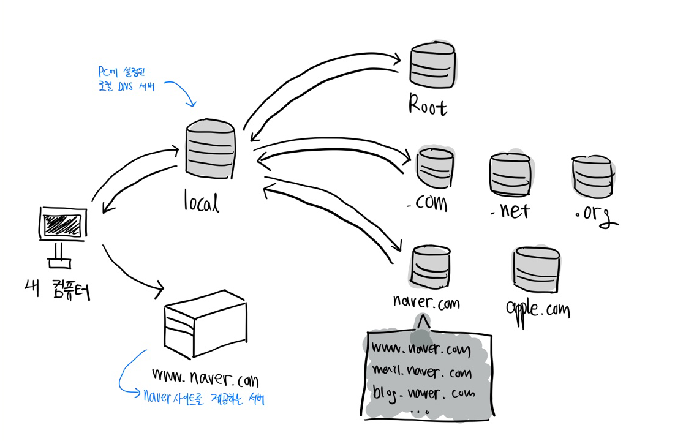

# DNS (Domain Name System)

> IP주소를 도메인이름으로, 도메인이름을 IP주소로

## DNS란?

Domain Name System

www.naver.com 이란 url이 있을 때

naver.com 이 도메인에 해당하고

www 는 호스트 네임에 해당하는 부분이다.

## 도메인은 왜 있는 것일까?

어느 웹사이트를 들어가려 하면, 우리가 쓰는 웹 브라부어 (크롬, 사파리 등)이 그 사이트를 제공하는 지구의 어딘가에 있는 서버에다가 요청(request)를 한다.

이를 위해선 이 서버의 IP주소를 알아야하는데, 모든 웹 사이트의 IP주소를 하나하나 외우고 다니는 건 매우 힘든 일이니, IP주소들을 key : value 처럼 **특정이름** : IP 주소 관계로 만든 것이다.

여기서 특정이름에 해당하는 부분이 **도메인** 이다.

## 도메인이 저장되는 곳이 DNS

IP와 도메인의 주소 관계가 저장되는 곳이 DNS이다.

System이란 말에서 알 수 있듯이 어느 한 군데에 싹 몰려 있는 게 아니고

다층적으로 구성된 네트워크에 분산되어 있다.

## DNS 동작원리

내 컴퓨터에서 www.naver.com 에 접속하고자 한다.

네이버를 제공하는 서버에다가 요청(request)를 해야 하는 데, IP주소를 모르는 상태이다.

이 때 브라우저는 PC에 설정된 로컬 DNS 서버에 **naver.com 이라는 도메인**과  **www 이라는 호스트 네임**을 가지고 IP를 갖고 있는 물어본다. (로컬 DNS서버는 통신사마다 다르며 사용자가 다른 곳으로 바꿀 수 도 있음)

이 로컬 DNS서버엔 내가 원하는 IP주소가 이미 캐싱(caching)되어 있을 수도 있고 아닐 수도 있는데,

캐싱되어 있다면 바로 그 주소를 가져다 쓰면 되고 없다면 다른 곳을 거쳐서 가져와야 한다.

'다른 곳을 거쳐오는 작업'

우선 Root DNS 서버에 이 주소(www.naver.com)에 해당하는 IP주소를 어디서 찾을 수 있냐고 물어본다.

Root DNS 서버는 이에 대한 응답(response)로 .com 으로 끝나는 도메인들을 담당하는 DNS 서버의 IP주소를 돌려준다.

이를 통해 로컬 DNS서버가 .com을 담당하는 DNS서버에게 찾아가 내가 원하는 주소의 IP주소가 어디있는지 물으면, .com 담당 서버는 이에 대한 응답으로 naver.com 의 도메인 정보를 가진 서버의 IP주소를 준다.

다시 이를 통해서 로컬 DNS 서버가 naver.com의 도메인 정보를 가진 DNS 서버에게 찾아가고, 거기엔 여러 호스트 네임별 (www. mail. blog 등)로 IP주소가 있는 데 그 중 ww와 매칭되는 IP주소 즉 www.naver.com 의 IP주소를 준다.

이를 로컬 DNS서버가 브라우저에게 반환하면 www.naver.com 의 서버로 접속하게 되는 것

## 로컬 DNS 서버를 바꾼다는 것 무엇일까?

로컬 DNS 서버는 일반적으로 통신사 것으로 설정되어 있는데, 이걸 수정한다는 것은 정부에서 막아놓은 사이트에 접속하거나 국가검열받은 전화번호부 대신 외국의 전화번호부를 쓴다는 것과 같은 의미이다.

또는 특정 서비스를 보다 빠르게 이용하기 위해 로컬 DNS서버를 바꾸기도 한다.

예를 들어 기본 로컬 DNS서버를 구글의 서버 주소로 세팅하면 유튜브처럼 구글에서 제공하는 서비스를 보다 빠르게 이용가능하다.

### 도메인네임 (DomainName)

> 네트워크 상 컴퓨터를 식별하는 호스트

넒은 의미로는 네트워크 상에서 컴퓨터를 식별하는 호스트명을 가르키며,

좁은 의미에서는 도메인 레지스트리에게서 등록된 이름을 의미한다.

우리가 네트워크 상에서 원하는 호스트를 가르기크는 이름 정도로 생각하면 된다. 

ex) 네이버

naver.com -> 도메인 주소

우리가 웹 브라우저에게 해당 주소를 입력하면 브라우저는 각각의 도메인 영역을 관리하는 DNS서버에 요청을 보내서 해당 주소가 가르키는 위치가 어디인지 확인하여 반환하여 준다.

### 호스트네임 (Hostname, Nodename)

>  네트워크에 연결된 장치들에게 부여되는 각각의 고유된 이름

우리가 도메인 주소를 생성하고 나면 서비스를 구분하가 위해 별도의 서브 도메인을 사용하기도 한다.

ex) 네이버

메일 서비스의 경우 mail.naver..com

웹툰 서비스의 경우 comic.naver.com 이라는 주소를 사용한다.

여기서 mail과 comic은 naver.com 이라는 도메인 네임에서 각각의 서비스를 구분하기 위한 호스트 네임

네트워크를 구성하고 네트워크 안에서 아이피 주소가 아닌 별칭(호스트네임과 같은)을 사용하기 위해선 호스트 네임과 IP 관리해주는 테이블이 필요하다.

네트워크의 게이트웨이 (라우터)를 통해 대상자에 대한 IP와 호스트 네임을 관리한다.

---

참고 사이트

DNS 에 대한 짧은 지식 블로그 : https://jofestudio.tistory.com/24

호스트네임, 도메인 네임 블로그 : https://velog.io/@minjae-mj/%ED%98%B8%EC%8A%A4%ED%8A%B8-%EB%84%A4%EC%9E%84%EA%B3%BC-%EB%8F%84%EB%A9%94%EC%9D%B8-%EB%84%A4%EC%9E%84

