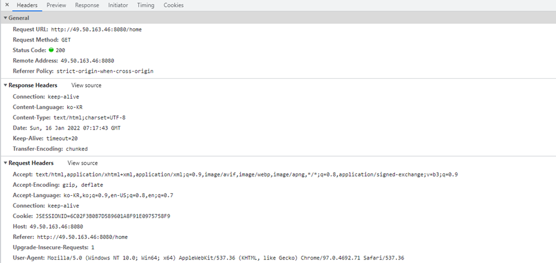

# HTTP 헤더

> 클라이언트와 서버가 요청 도는 응답으로 부가적인 정보를 전송할 수 있도록 해준다.

크롬에서 개발자 도구 - Network 탭 - 페이지 클릭




## HTTP 공통헤더

> 요청, 응답 모두에 사용 가능한 기본적인 헤더 항목


- Date
  - HTTP 메시지를 생성한 일시 (RFC 1123에서 규정)
  - `Date : Sun, 16 Jan 2022 07:17:43 GMT`
- Connection
  - 클라이언트와 서버 간 연결에 대한 옵션 설정
  - `Connection : keep-alive` : 현재 TCP 커넥션을 유지한다.
  - `Connection : close` : HTTP 메시지 직후 TCP 접속을 끊는다.
- Cache-Control
  - 쿠키, 캐시 관련
- Pragma
- Trailer


## HTTP 엔티티 관련 헤더

> 요청 및 응답 메시지 모두에서 사용 가능한 (콘텐츠, 본문, 리소스 등)에 대한 설명 헤더

HTTP 메시지 내 포함된 선택적인 개체에 대한 구체적인 미디어 타입 등의 설명

HTTP 메시지는 이미지, 비디오, 오디오, HTML 문서, 전자메일 등의 개체들을 운반 할 수 있다.


- Content-Type
  - 해당 개체에 포함되는 미디어 타입 정보
  - 컨텐츠의 타입(MIME 미디어 타입) 및 문자 인코딩 방식(EUC-KR, UTF-8 등)을 지정한다.
  - 타입 및 서브타입(type/subtype)으로 구성된다.
    - type : 10개 정도 표준으로 지정됨(application, audio, font, image, multipart 등)
    - subtype : 각 타입별로 수십에서 수백개 정도
  - `Content-Type : text/html;charset=UTF-8` : html텍스트 문서이고, UTF-8 문자 인코딩으로 표현
  - *(공통헤더)*
- Content-Language
  - 해당 개체와 가장 잘 어울리는 사용자 언어
  - `Content-Language : ko-KR`
  - *(공통헤더)*
- Content-Encoding
  - 해당 개체 데이터의 압축 방식
  - `Content-Encoding: gzip, deflate`
  - 만일 압축이 시행되었다면 Content-Encoding 및 Content-Length 2개 항목을 토대로 압축해제가능
  - *(공통헤더)*
- Content-Length
  - 전달되는 해당 개체의 바이트 길이 또는 크기(10진수)
  - 응답 메시지 Body의 길이를 지정하거나 특정 지정된 개체의 길이를 지정한다.
  - *(공통헤더)*
- Content-Location
  - 해당 개체의 실제 위치를 알려준다.
  - *(공통헤더)*
- Content-Disposition
  - 응답 Body를 브라우저가 어떻게 표시해야할지 알려준다.
  - `Content-Disposition : inline` : 웹페이지 화면에 표시
  - `Content -Disposition : attachment; filename='filename.csv'` : 파일 다운로드
  - 다운로드 되길 원하는 파일은 attachment로 값을 설정하고, filename 옵션으로 파일명 지정
  - 파일용 서버인 경우 이 태그를 자주 사용
  - ***(응답 헤더)***
- Content-Security-Policy
  - 다른 외부 파일들을 불러오는 경우, 차단할 소스와 불러올 소스를 명시한다.
  - XSS 공격에 대한 방어 가능 (허용한 외부 소스만 지정 가능)
  - `Content-Security-Policy: default-src https` : https를 통해서만 파일을 가져온다.
  - `Content-Security-Policy: default-src 'self'` : 자신의 도메인의 파일들만 가져온다.
  - `Content-Security-Policy: default-src 'none'` : 파일을 가져올 수 없다.
  - ***(응답 헤더)***
- Location
  - 리소스가 리다이렉트(redirect)된 때에 이동된 주소, 또는 새로 생성된 리소스 주소를 명시한다.
  - 300번대 응답이나 201 Created 응답일 때 어느 페이지로 이동할지를 알려준다.
    - 새로 생성된 리소스의 경우 : HTTP 상태 코드 `201 Created` 반환
    - 300번대 응답의 경우 : `HTTP/1.1 302 Found Location: /` 브라우저는 / 주소로 redirect
  - ***(응답 헤더)***
- Last-Modified
  - 리소스를 마지막으로 갱신한 일시
  - ***(응답 헤더)***
- Transfer-Encoding
  - `Transfer-Encoding : chunked`
  - 동적으로 생성되어 Body의 길이를 모르는 경우에 조금씩 전송이 가능하다.
  - 각 chunk 마다 그 시작에 16진수 길이를 삽입하여 chunk 길이를 알려준다.
  - ***(응답 헤더)***


## HTTP 요청 헤더

> HTTP 요청 메시지


- Host
  - 요청하는 호스트에 대한 호스트명 및 포트번호 (필수)
  - Host 필드에 도메인명 및 호스트명 모두를 포함한 전체 URI(FQDN) 지정이 필요하다.
  - 이에 따라 동일 IP 주소를 갖는 단일 서버에 여러 사이트를 구축 할 수 있다.
  - `Host : 49.50.163.46:8080`
- User-Agent
  - 클라이언트 소프트웨어 (브라우저, OS) 명칭 및 버전 정보
  - `User-Agent: Mozilla/5.0 (Windows NT 10.0; Win64; x64) AppleWebKit/537.36 (KHTML, like Gecko) Chrome/97.0.4692.71 Safari/537.36`
- From
  - 클라이언트 사용자 메일 주소
    - 주로 검색엔진 웹 로봇의 연락처 메일 주소를 나타낸다.
    - 때로는, 이 연락처 메일 주소를 user-Agent 항목에 두는 경우도 있다.
- Cookie
  - 서버에 의해 Set-Cookie로 클라이언트에게 설정된 쿠기 정보
  - `Cookie : JSESSIONID=6C02F3B0B7D589601A8F91E0975758F9`
  - ***(쿠기 / 캐시 관련)***
- Referer
  - 바로 직전에 머물었던 웹 링크 주소
  - `Referer : http://49.50.163.46:8080/user/login`
- If-Modified-Since
  - 제시한 일시 이후로만 변경된 리소스를 취득 요청
- Authorization
  - 인증 토큰(JWT/Bearer 토큰)을 서버로 보낼 때 사용하는 헤더
  - "토큰의 종류(Basic, Bearer 등) + 실제 토큰 문자" 를 전송
- Origin
  - 서버로 POST 요청을 보낼 때, 요청이 어느 주소에서 시작되었는지 나타낸다.
  - 여기서 요청을 보낸 주소와 받는 주소가 다르면 CORS 에러가 발생한다.
  - `Origin : http://49.50.163.46:8080`
  - 응답 헤더의 Access-Control-Allow-Origin과 관련
- 다음 4개는 주로 HTTP 메시지 Body의 속성 또는 내용 협상용 항목들
  - Accept : 클라이언트 자신이 원하는 미디어 타입 및 우선 순위를 알린다. (텍스트 : text/html, text/plain,..., 이미지 : image/jpeg,...) 등
    - `Accept: */*` : 어떤 미디어 타입도 가능, `Accept : image/*` : 모든 이미지 유형이 가능
    - `Accept : text/html,application/xhtml+xml,application/xml;q=0.9,image/avif,image/webp,image/apng,*/*;q=0.8,application/signed-exchange;v=b3;q=0.9`
  - Accept-Charset : 클라이언트 자신이 원하는 문자 집합
  - Accpet-Encoding : 클라이언트 자신이 원하는 문자 인코딩 방식
    - `Accept-Encoding : gzip, deflate`
  - Accept-Language : 클라이언트 자신이 원하는 가능한 언어
    - `Accept-Language : ko-KR,ko;q=0.9,en-US;q=0.8,en;q=0.7`
  - 각각이 HTTP Entity Header 항목 중 `Content-Type`, `Content-Type charset-xxx`, `Content-Encoding`, `Content-Language` 들과 일대일로 대응된다.

### 예시

```http
GET /home.html HTTP/1.1
Host: developer.mozilla.org
User-Agent: Mozilla/5.0 (Macintosh; Intel Mac OS X 10.9; rv:50.0) Gecko/20100101 Firefox/50.0
Accept: text/html,application/xhtml+xml,application/xml;q=0.9,*/ *;q=0.8
Accept-Language: en-US,en;q=0.5
Accept-Encoding: gzip, deflate, br
Referer: https://developer.mozilla.org/testpage.html
Connection: keep-alive
Upgrade-Insecure-Requests: 1
If-Modified-Since: Mon, 18 Jul 2016 02:36:04 GMT
If-None-Match: "c561c68d0ba92bbeb8b0fff2a9199f722e3a621a"
Cache-Control: max-age=0
https://gmlwjd9405.github.io/2019/01/28/http-header-types.html
```


```http
POST /myform.html HTTP/1.1
Host: developer.mozilla.org
User-Agent: Mozilla/5.0 (Macintosh; Intel Mac OS X 10.9; rv:50.0) Gecko/20100101 Firefox/50.0
Content-Length: 128
https://gmlwjd9405.github.io/2019/01/28/http-header-types.html
```


## HTTP 응답 헤더

> HTTP 요청이나 특정 HTTP 헤더를 수신했을 때, 이에 응답


- Server

  - 서버 소프트웨어 정보

- Accept-Range

- Set-Cookie

  - 서버 측에서 클라이언트에게 세션 쿠기 정보를 설정 (RFC 2965에서 규정)
  - ***(쿠키 / 캐시 관련)***

- Expires

  - 리소스가 지정된 일시까지 캐시로써 유효함을 나타낸다. 즉, 응답 컨텐츠가 언제 만료되는지를 나타낸다.
  - `Expires: Thu, 26 Jul 2018 07:28:00 GMT`
  - Cache-Control과 별개로 응답에 Expires라는 헤더를 줄수 있다. ( 단, Cache-Control의 max-age가 있는 경우 이 헤더는 무시)
  - ***(쿠키 / 캐시 관련)***

- Age

  - 캐시 응답. max-age 시간 내에서얼마나 흘렀는지 초 단위로 알려준다.
  - ***(쿠키/캐시 관련)***

- ETag

  - HTTP 컨텐츠가 바뀌었는지를 검사할 수 있는 태그
  - ***(쿠키/캐시 관련)***

- Porxy-authenticate

- Allow

  - 해당 엔티티에 대해 서버 측에서 지원 가능한 HTTP 메소드의 리스트를 나타낸다.
  - 때론, HTTP 요청 메시지의 HTTP 메소드 OPTIONS에 대한 응답용 항목으로 사용된다.
    - OPTIONS : 웹서버측 제공 HTTP 메소드에 대한 질의
  - `Allow : GET, HEAD`
    - 405 Method Not Allowd 에러와 함께 웹 서버에서 제공 가능한 HTTP 메서드는 GET, HEAD 분임을 알린다.

- Access-Control-Allow-Origin

  - 요청을 보내는 프론트 주소와 받는 백엔드 주소가 다르면 CORS 에러가 발생
    - 서버에서 이 헤더에 프론트 주소를 적어주어야 에러가 발생하지 않는다.
  - `Access-Control-Allow-Origin: www.naver.com`
    - 프로토콜, 서브도메인, 도메인, 포트 중 하나만 달라도 CORS 에러가 난다.
  - `Access-Control-Allow-Origin : * `
    - 만약 주소를 일일이 지정하기 싫다면 * 으로 모든 주소에 CORS 요청을 허용되지만 보안이 취약해진다.
  - 유사한 헤더로 `Access-Control-Request-Method` , `Access-Control-Request-Headers`, `Access-Control-Allow-Methods`,`Access-Control-Allow-Headers` 등이 있다.
  - Request와 Allow에서 Method 단수 복수 주의

   

### 예시

```http
200 OK
Access-Control-Allow-Origin: *
Connection: Keep-Alive
Content-Encoding: gzip
Content-Type: text/html; charset=utf-8
Date: Mon, 18 Jul 2016 16:06:00 GMT
Etag: "c561c68d0ba92bbeb8b0f612a9199f722e3a621a"
Keep-Alive: timeout=5, max=997
Last-Modified: Mon, 18 Jul 2016 02:36:04 GMT
Server: Apache
Set-Cookie: mykey=myvalue; expires=Mon, 17-Jul-2017 16:06:00 GMT; Max-Age=31449600; Path=/; secure
Transfer-Encoding: chunked
Vary: Cookie, Accept-Encoding
X-Backend-Server: developer2.webapp.scl3.mozilla.com
X-Cache-Info: not cacheable; meta data too large
X-kuma-revision: 1085259
x-frame-options: DENY
https://gmlwjd9405.github.io/2019/01/28/http-header-types.html
```


## CORS (Cross-Origin Resource Sharing)

- 배경
  - 처음 전송되는 리소스의 도메인과 다른 도메인으로 부터 리소스가 요청될 경우 해당 리소스는 cross-origin HTTP 요청에 의해 요청된다.
  - 보안 상의 이유로, 브라우저들은 스크립트 내에서 초기화되는 cross-origin HTTP 요청을 제한한다.
    - ex) XMLHttpRequest는 same-origin 정책을 따르기에 XMLHttpRequest을 사용하는 웹 애플리케이션은 자신과 동일한 도메인으로 HTTP 요청을 보내는 것만 가능했다.
    - 웹 애플리케이션을 개선하기 위해, 개발자들은 브라우저 벤더사들에게 XMLHttpRequest가 cross-domain 요청을 할 수 있도록 요청했고 이에 따라 CORS가 생겼다.
- 개념
  - 웹 서버에게 보안 cross-domain 데이터 전송을 활성화하는 cross-domain 접근 제어권을 부여한다.
- 과정
  - CORS 요청 시 에는 미리 OPTIONS 주소로 서버가 CORS를 허용하는지 물어본다.
  - 이 때 `Access-Control-Request-Method`로 실제 보내고자 하는 메서드를 알리고,
  - `Access-Control-Request-Headers` 로 실제로 보내고자 하는 헤더들을 알린다.
  - `Allow` 항목들은 Request에 대응되는 것으로, 서버가 허용하는 메서드와 헤더를 응답하는 데 사용된다.
  - Request와 Allow가 일치하면 CORS 요청이 이루어진다.


## HTTP 캐시/쿠키 관련 헤더

**Caching 관련**

- Cache-Control
  - `Cache-Control : no-store` : 아무것도 캐싱하지 않는다.
  - `Cache-Control : no-cache` : 모든 캐시를 쓰기 전에 서버에 해당 캐시를 사용해도 되는지 확인한다.
  - `Cache-Control : must-revalidate` : 만료된 캐시만 서버에 확인을 받도록 한다.
  - `Cache-Control : public` : 공유 캐시(또는 중개 서버)에 저장해도 된다는 것을 의미한다.
  - `Cache-Control : private` : 브라우저 같은 특정 사용자 환경에만 저장한다.
  - `Cache-Control : max-age` : 캐시 유효시간을 명시한다.
  - 주로 응답 헤더로 사용지만, "클라이언트 - 중개 서버 - 서버"의 구조에서 중개 서버의 캐시를 가져오지 않도록 하려면 클라이언트에서 요청 헤더에 이 헤더를 추가한다.
  - ***(공통 헤더)***
- Expires
  - 리소스가 지정된 일시까지 캐시로써 유효함을 나타낸다. 즉, 응답 커텐츠가 언제 만료되는지를 나타낸다.
  - `Expires : Thu, 26 Jul 2018 07:28:00 GMT`
  - Cache-Control과 별개로 응답에 Expires라는 헤더를 줄 수 있다. (단, Cache-Control의 max-age가 있는 경우 이헤더는 무시)
  - ***(응답 헤더)***
- Age
  - 캐시 응답. max-age 시간 내에서 얼마나 흘렀는지 초 단위로 알려준다.
  - `max-age=3600` 이 경우, 1분 후 `Age: 60`이 캐시 응답 헤더에 포함된다.
  - ***(응답 헤더)***
- ETag
  - HTTP 컨텐츠가 바뀌었는지를 검사할 수 있는 태그
  - 같은 주소의 자원이더라도 컨텐츠가 달라졌다면 ETag가 다르다.
  - 같은 주소로 GET 메서드 수행 시 응답 Body의 내용이 동일하면 같은 ETag를 갖지만, 내용이 바뀌었다면 Etag 헤더 값이 변경된다.
  - 이 헤더 값이 변경되었다면 캐시를 지우고 새로 변경된 컨텐츠를 받는다.
  - ***(응답 헤더)***
- If-None-Match
  - 서버에 ETag가 달라졌는지 검사를 요청한다.
  - ETag가 다를 경우에만 컨텐츠를 새로 받는다.
  - 만약 ETag가 같다면 서버는 `304 Not Modified`를 응답해서 캐시를 그래도 사용한다.
  - ***(요청 헤더)***


**Cookies 관련**

- Cookie
  - 서버에 의해 Set-Cookie로 클라이언트에게 설정된 쿠키 정보
  - `Cookie : attribute1=value1; attribute2=value2;`
  - 서버는 이 쿠키 헤더를 파싱해서 사용한다.
  - CSRF 공격 같은 것을 막기 위해서 반드시 서버는 쿠키가 제대로 된 상황에서 온 것인지 확인하는 로직이 필요하다.
  - ***(요청 헤더)***
- Set-Cookie
  - 서버측에서 클라이언트에게 세션 쿠키 정보를 설정할 때 사용하는 항목 (RFC 2965에서 규정)
  - `Set-Cookie : attribute = value; 옵션~` 형태로 다수 정보들이 설정됨
  - 옵션
    - Expires : 쿠키 만료 날짜 설정
    - Max-Age : 쿠키 수명 설정. Expires는 무시
    - Secure : https에서만 쿠키가 전송
    - HttpOnly : 자바스크립트에서 쿠키에 접근할 수 없다, XSS 요청을 막으려면 활성화해두는 것이 좋다.
    - Domain : 도메인을 적어주면 도메인 일치하는 요청에서만 쿠키가 전송된다, 가끔 도메인 다른 쿠키들이 있는데 ,이런 쿠키들은 써드 파티 쿠키로 클라이언트를 추적하고 있는 쿠키이다.
    - Path : 해당 path와 일치하는 요청에서만 쿠키가 전송된다.
  - ex) `Set-Cookie: zerocho=babo; Expires=Wed, 21 Oct 2015 07:28:00 GMT; Secure; HttpOnly`
  - 쿠키는 XSS 공격과 CSRF 공격 등에 취약하기 때문에 HttpOnly 옵션을 켜두고, 쿠키를 사용하는 요청은 서버 단에서 검증하는 로직을 마련해두는 것이 좋다.
  - ***(응답 헤더)***


## 캐시, 쿠키, 세션의 차이

- 캐시 (Cache)

  - 개념

    CPU와 주기억장치 사이에 물리적으로 존재하는 버퍼 형태의 고속의 기억장치(컴퓨터 메모리 버퍼)

  - 사용 목적

    CPU와 Memory 사이의 속도의 차이를 완화

- 쿠키 (Cookie)

  - 개념

    인터넷 웹 상에서 상태 정보를 클라이언트 측에 저장하여, 서버 측에서 필요할 때마다 지속성 있게 활용하고자 할 때 사용한다. (클라이언트 로컬에 저장되는 키와 값이 들어 있는 파일)

  - 사용 목적

    HTTP의 비연결(Connectionless)과 무상태(Stateless)을 보완

    웹 브라우저에 서버 측에 있는 상태값들을 저장할 수 있게 하도록 하여 사용자에 대한 지속적인 상태감시 및 상태참조를 한다.

  - 쿠키 저장

    웹 서버는 HTTP 헤더 내 `Set-Cookie` 란에 세팅할 쿠키 관련 정보를 실어 보낸다.

    웹 브라우저는, 쿠키를 도메인 서버 이름으로 정렬된 쿠키 디렉토리에 저장한다.

    (크롬 쿠키 디렉토리 : C:/Users/name/AppData/Local/Google/Chrome/User Data/Default/Local Storage)

- 세션 (session)

  - 개념

    일정 시간 동안 같은 브라우저로부터 들어오는 요청을 하나의 상태로 보고 그 상태를 유지하는 기술

    웹 브라우저를 통해 서버에 접속한 이후 부터 브라우저를 종료할 대 까지 유지되는 상태

    쿠키를 이용해 Session ID만 저장하고 이 값으로 구분해서 서버에서 처리


---

참고사이트 : https://gmlwjd9405.github.io/2019/01/28/http-header-types.html


