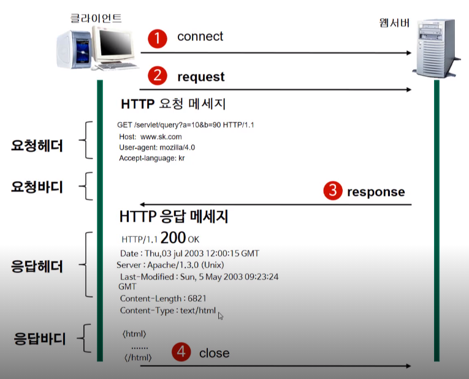
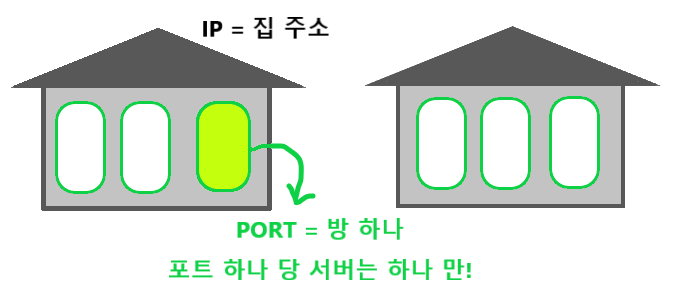

# HTTP

> 서버와 클라이언트가 인터넷상에서 데이터를 주고 받기 위한 프로토콜

**HyperText Transfer Protocol**

## 특징

- HTTP 메시지는 HTTP 서버와 클라이언트에 의해 해석이 된다.
- TCP / IP를 이용하는 응용 프로토콜이다. (컴퓨터와 컴퓨터 간에 데이터를 전송 할 수있도록 하는 장치로 인터넷이라는 통신망을 통해 원하는 정보(데이터)를 주고 받는 기능을 이용하는 응용 프로토콜)
- HTTP는 연결 상태를 유지하지 않는 비연결성(=무상태, Stateless) 프로토콜이다.
  - 서버가 클라이언트에게 받은 요청을 응답결과로 만들어서 응답하고 나면 클라이언트와의 연결이 끊어버림
  - 요청이 끝난 후 서버는 클라이언트의 이전상황을 알 수 없음, 이러한 특징을 무상태(Stateless)
    - 이러한 단점을 해결하기 위해 Cookie, Session이 등장
  - HTTP는 연결이 유지하지 않는 프로토콜이기에 요청 / 응답 방식으로 동작

## 장점

불특정 다수를 대상으로 하는 서비스에 적합

계속 서버와 클라이언트의 연결상태를 유지하는 게 아니기 때문에 클라이언트와 서버간의 최대 연결수 보다 훨씬 많은 요청과 응답을 처리 가능

## 단점

연결을 끊어버리기 때문에 클라이언트의 이전상황을 알 수 없음 => Stateless 상태

이런 Stateless 특징 때문에 정보를 유지하기 위해 Cookie, Session 기술이 등장

## 동작방식

- 서버 : 클라이언트 요청에 따라 적절한 파일, 데이터를 제공
- 클라이언트 : 웹 브라우저에서 작동하는 프로그램 혹은 서버에게 요청하는 프로그램

클라이언트를 통해서 어떠한 서비스를 url을 통하거나 다른 것을 통해서 요청(request)을 하면

서버에서는 해당 요청사항에 맞는 결과를 찾아서 사용자에게 응답(response)하는 형태로 동작

1. connect : 클라이언트가 원하는 서버에 접속

2. request : 클라이언트가 서버에 요청

   서버에게 요청에 대한 정보를 담아 서버로 보낸다.

3. response : 서버가 요청에 대한 응답결과를 클라이언트에게 보낸다.

4. close : 응답이 끝나면 서버와 클라이언트 연결 끊기 (Stateless)

### 동작순서

1. 사용자가 웹 브라우저에 URL 주소 입력

2. DNS 서버에 웹 서버의 호스트 이름을 IP주소로 변경 요청

   IP : 각각의 패킷을 상대방에게 전달하는 역할

   IP 주소 : 컴퓨터 네트워크에서 장치들이 서로 인식하기 위한 특수번호 (변경가능)

   MAC 주소 : 네트워크 인터페이스에 할당된 고유 식별자 (변경불가)

   ARP(Address Resolution Protocol : 주소 결정 프로토콜) : 데이터를 보낼 목적지를 MAC주소를 사용해서 찾아감

   

   

3. 웹 서버와 TCP 연결 시도

   - 3 way Handshake : 클라이언트 - 서버 간 신뢰성 있는 연결을 하기 위해 3번의 패킷 교환 과정

     - SYN : 클라이언트가 서버로 임의로 생성한 시퀀스 번호를 전달
     - SYN ACK : 서버는 클라이언트에서 전달한 시퀀스를 +1 시켜서 전달 (서버의 패킷을 정상 수신했다는 신호)
     - ACK : 클라이언트가 서버에서 전달해준 시퀀스를 +1 시켜서 다시 전달함 (서버 - 클라이언트 간 패킷 교환이 정상적으로 이루어졌다는 신호)

     SYN (synchronize sequence numbers)

     ACK (acknowledgment)

   서버 사이드에서는 진행 과정에 따라 LISTEN -> SYN_RCV -> ESTABLISHED로 변경된다.

   종료되면 CLOSED (종료 된다고 해서 리소스를 바로 반환시키지 않는다.)

   

   

4. 서버에게 GET 명령을 전송

   ex)

   GET /index.html HTTP/1.1					-> 요청문

   Host : www.naver.com							-> 헤더

   User-Agent : Mozilla / 5.0

   ...

   Body : 														-> (Get 요청이기에 바디가 없다)

   

5. 서버가 클라이언트에게 데이터 (웹 문서)를 회신한다.

   ex)

   HTTP/1.1 200 OK											-> 상태문

   

   Date: Thu, 12 Feb 2009 06:29:38 GMT       -> 헤더 시작

   Server: Apache/1.3.29 (Unix) PHP/4.3.4RC3 

   X-Powered-By: PHP/4.3.4RC3 

   Transfer-Encoding: chunked 

   Content-Type: text/html				      			-> 헤더 끝

   

   <HTML>							     -> body

   <HEAD>

   <TITLE> test </TITLE>

   </HEAD>

   …….

   …..생략….

   

6. 서버 - 클라이언트간 연결 해제

   - 4way Handshke : 서버와 클라이언트 양쪽다 연결을 종료시킨다는 메시지를 보낸다. (양쪽 다 각각 이므로 4번의 패킷 교환)
     - Client -> Server : FIN
     - Server -> Client : ACK
     - Server -> Client : FIN
     - Client -> Server : ACK
   - 시퀀스를 임의 생성하여 전달시키고 ACK로 +1 증가시킨 값을 받는 것은 3 way Handshake와 동일

7. 웹 브라우저가 웹 문서를 출력

### 요청 메시지 구조

- 요청문

  - 요청메소드 (Request Method)

    GET, PUT, POST, PUSH, OPTIONS 등의 요청방식이 온다. 서버에게 요청의 종류를 알려주기 위해서 사용

    - GET : 정보를 요청 (SELECT)
    - POST : 정보를 입력 (INSERT)
    - PUT : 정보를 업데이트 (UPDATE)
    - DELETE : 정보를 삭제 (DELETE)
    - HEAD : (HTTP) 헤더 정보만 요청, 해당 자원이 존재하는지 혹은 서버에 문제가 없는지 확인하기 위해
    - OPTIONS : 웹서버가 지원하는 메서드의 종류 요청
    - TRACE : 클라이언트의 요청을 그대로 반환,

  - URL

    요청하는 자원의 위치를 명시

  - HTTP 버전

    웹 브라우저가 사용하는 http 프로토콜의 버전

    

- 헤더

  두번째 줄 부터는 여러 줄의 헤더 정보, 각각의 줄은 헤더명과 헤더 값이 콜론으로 구분되어져 있다.

  

- 바디

  본문은 요청을 할 때 함께 보낼 데이터를 담는 부분

  요청메소드가 POST나 PUT을 사용하게 됐을 때 들어오게 된다.

  GET 방식은 요청 할 때 가지고 가야 되는 자원도 URL에다 붙여서 갖고 간다.

  그래서 GET 방식은 요청바디가 없다.

### 응답 메시지 구조

- 상태문

  - HTTP 버전

  - 상태코드

    - 1XX (조건부 응답) : 요청을 받았으며 작업을 계속한다.
    - 2XX (성공) : 클라이언트가 요청한 동작을 수신하여 이해했고 승낙했으며 성공적으로 처리했음
    - 3XX (리다이렉션 완료) : 클라이언트는 요청을 마치기 위해 추가 동작을 취해야 한다.
    - 4XX (요청 오류) : 클라이언트에 오류가 있음
    - 5XX (서버 오류) : 서버가 유효한 요청을 명백하게 수행하지 못했음

    

  - 상태이름

    

    첫번째 줄에는 반드시 응답 HTTP프로토콜의 버전 / 상태코드 / 상태 이름 으로 기재

    ex) `HTTP/1.1 200 OK`

    

    

- 헤더

- 바디

  응답 리소스 데이터가 나오는 부분 (HTML을 받아 브라우저가 화면에 렌더링)

## URL (Uniform Resource Locator)

- URL은 웹 상에서 자원들의 위치
- 특정 웹 서버의 특정파일에 접근하기 위한 경로 혹은 주소

- 물리적인 서버를 찾기 위해서 반드시 필요한 것이 IP주소 or 도메인 주소
- 물리적인 컴퓨터를 찾은 후 해당 컴퓨터 안에 등장하는 소프트웨어 서버를 찾기 위해서는 포트 값이 필요

## IP/포트

> IP : 컴퓨터를 찾을 때 필요한 주소
>
> Port : 그 컴퓨터 안에서 프로그램을 찾기 위한 수단

- IP : 집 주소, 하나의 컴퓨터에 주소, 컴퓨터의 IP

- 포트 : 집 안의 여러 개의 방이 존재하듯, 각각의 방을 포트

  => 하나의 포트에는 하나의 서버만 가능, 서버 마다 포트번호가 각각 달라져야 한다.

### 잘 알려진 포트들 - Well-known port

----

참고사이트

웹과 네트워크의 기본(TCP/IP) : https://velog.io/@conatuseus/2019-09-10-2009-%EC%9E%91%EC%84%B1%EB%90%A8-xsk0ds2eqf

HTTP 동작방식 : https://pearlluck.tistory.com/117