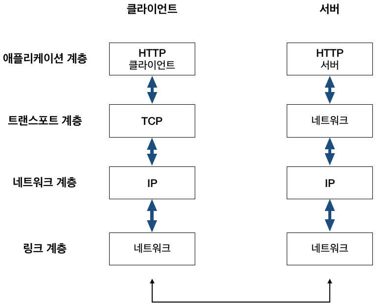
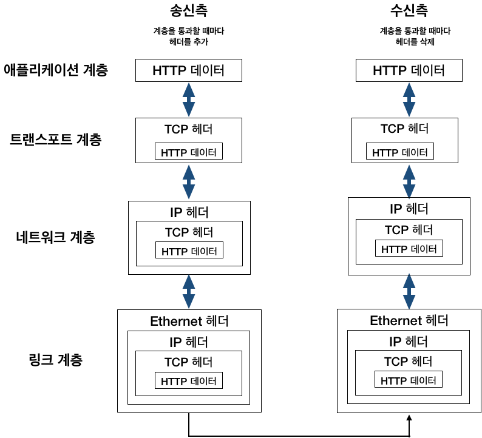
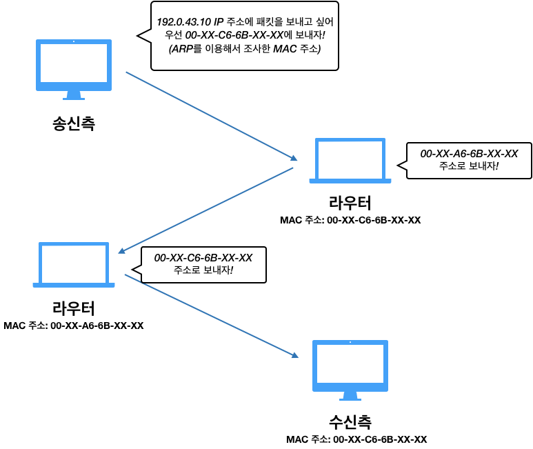
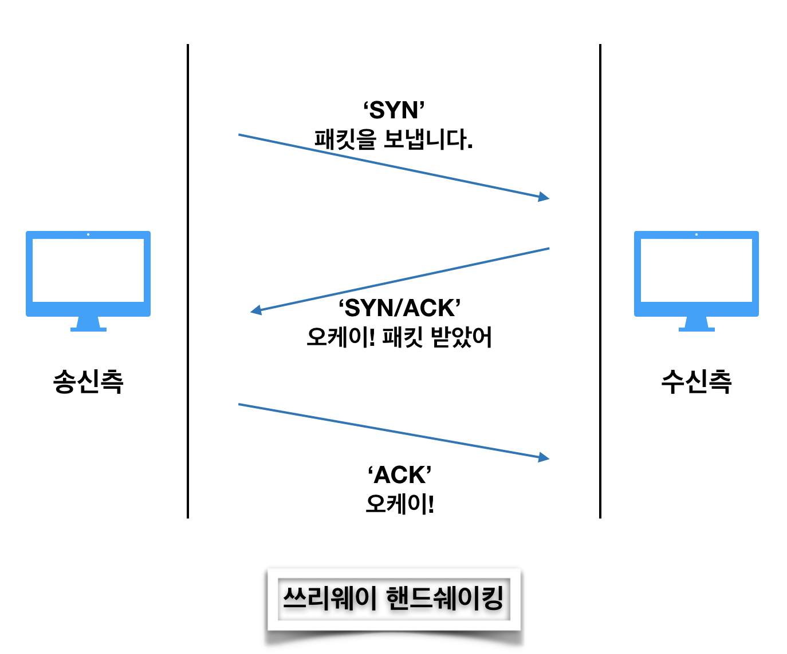

# TCP / IP

> TCP와 IP를 중심으로 하는 프로토콜의 집합, 네트워크의 공통 언어


PC와 스마트폰 등이 통신하는 규칙을 **프로토콜**이라고 하고, 

복수의 프로토콜을 조합한 것이 **네트워크 아키텍처**이다.


여러가지 네트워크 아키텍처가 있지만 가장 많이 사용되는 것이 TCP/IP 이다.

TCP/IP는 TCP와 IP를 중심으로 하는 프로토콜의 집합으로, 네트워크의 공통 언어이다.


PC나 스마트폰 등의 OS에도 TCP/IP가 내장되어 있고, TCP/IP로 통신하는 PC와 스마트폰, 각종 네트워크 기기 전반을 **호스트**라고 부른다.


프로토콜에는 케이블 규격, IP 주소 지정 방법, 떨어진 상대를 찾기 위한 방법, 그 곳에 도달하는 순서, 웹을 표시하기 위한 순서 등 여러가지가 있는데, 이렇게 인터넷과 관련된 프로토콜들을 모은 것을 **TCP / IP** 라고 한다.


## TCP / IP 계층 구조

> TCP/IP 4계층 : 네트워크 인터페이스 - 인터넷 - 트랜스포트 - 애플리케이션, 각 계층에 포함된 프로토콜을 조합해 애플리케이션이 통신한다.


TCP/IP에서는 네트워크를 통해 통신하기 위한 기능을 계층화하고 복수의 프로토콜을 조합하여 실현했다.

TCP/IP의 계층구조는 네트워크 인터페이스층, 인터넷층, 트랜스포트층, 애플리케이션층으로 모두 4계층이다. (OSI 7계층 참조)

 

4개 층의 프로토콜이 모두 정상적으로 제 기능을 해야 비로소 통신이 이루어 진다.

그리고, 어떤 계층이 기능을 발휘하려면, 그 하위 계층이 정상적으로 동작한다는 것을 전제로 한다.


굳이 왜 4 계층으로 나누었을까?

=> 여러 메리트가 있는데

1. 사양이 변경되면 해당 계층만 바꾸면 되므로 자유롭다.
   - ex) 인터넷이 하나의 프로토콜로 되어 있다면 어디선가 사양이 변경되었을 때 전체를 바꿔야 하지만, 계층화되어 있으면 사양이 변경된 해당 계층만 변경하면 된다. 각 계층은 계층이 연결되어 있는 부분만 결정되어 있어, 각 계층의 내부는 자유롭게 설계 할 수 있다.
2. 설계가 편하다
   - 애플리케이션 층에서 애플리케이션은 자기 자신이 담당하는 부분을 고려하면 되고, 상대가 어디에 있는지, 어떠한 루트로 메시지를 전달하는지, 전달한 메시지가 확실하게 전달되고 있는지 같은 고려를 하지 않아도 된다.


## TCP / IP 통신흐름



TCP / IP 통신 할 때 계층을 순서대로 거쳐 상대와 통신한다.

송신하는 측은 애플리케이션 층부터 내려가고

수신하는 측은 네트워크 층부터 올라간다.


HTTP를 예를 들어 다음과 같은 순서로 통신한다.

1. 송신측 클라이언트의 애플리케이션 계층 (HTTP) 에서 '어떤 웹 페이지를 보고 싶다' 라는 HTTP 요청을 지시
2. 트랜스포트 계층 (TCP) 에서는 애플리케이션 계층에서 부터 받은 데이터(HTTP 메시지)를 통신하기 쉽게 조각내어 안내 번호와 포트 번호를 붙여 네트워크 계층에 전달한다.
3. 네트워크 계층 (IP)에서는 수신지 MAC 주소를 추가해서 링크 계층에 전달, 이로써 네트워크를 통해 송신할 준비가 되었다.
4. 수신측 서버는 링크 계층에서 데이터를 받아들여 순서대로 위의 계층에 전달하여 애플리케이션 계층까지 도달한다.
5. 수신측 애플리케이션 계층에 도달하게 되면 클라이언트가 발신했던 HTTP 요청을 수신할 수 있다. 


이 과정을 그림으로 표시



송신 할 때 는 각 계층을 거칠 때 마다 헤더에 필요한 정보가 추가되고

수신할 때에는 해당 계층마다 사용한 헤더를 삭제한다.

이렇게 정보를 감싸는 것을 캡슐화 라고 한다.


## 네트워크 인터페이스 층 (링크 계층)

> 같은 네트워크 안에서 데이터를 전송하는 것

네트워크 인터페이스 층 역할은 같은 네트워크 안에서 데이터를 전송하는 것이다.


기술적인 관점에서는 하나의 네트워크는 라우터와 레이어3 스위치로 구획되는 범위, 또는 레이어2 스위치로 구성하는 범위

ex)

레이어2 스위치에 연결된 PC의 인터페이스에서 같은 레이어2 스위치에 연결된 다른 PC의 인터페이스 까지 데이터를 전송할 수있다.

그때, 0,1 의 디지털 데이터를 전기신호 등의 물리적 신호로 변환해 전송 매체로 전달해 진다.


네트워크 인터페이스층의 구체적인 프로토콜

**유선(이더넷), 무선 LAN(Wi-Fi),** PPP 등

네트워크 인터페이스 층의 프로토콜이 통신 상대와 같아야 할 필요가 없다.


## 인터넷 층 (네트워크 층)

> 많은 네트워크 사이에서 데이터를 전송하는 역할 (원격지 네트워크 간 데이터를 전송)

많은 네트워크가 존재하고, 거기에 다양한 기기가 연결되는데, 인터넷층은 그 네트워크 사이에서 데이터를 전송하는 역할을 한다. (네트워크 상에서 패킷의 이동을 다룬다)


패킷이란 전송하는 데이터의 최소 단위

이 계층에서는 어떠한 경로를 거쳐 상대의 컴퓨터까지 패킷을 보낼지를 결정하기도 한다.


네트워크 끼리 연결하고 데이터를 전송하는 기기가 **라우터**이다.

라우터에 의한 네트워크 간 전송을 가리켜 **라우팅**이라고 한다.

원격지 네트워크에서 최종적인 출발지와 목적지 사이의 데이터 전송을 가리켜 **엔드투엔드 통신**이라고 한다.


인터넷 층의 구체적인 프로토콜

**IP**, ICMP, ARP

엔드투엔드 통신에 이용하는 프로토콜은 IP이고,

ICMP, ARP는 IP를 도와주는 프로토콜이다.


## 트랜스포트 층

> 데이터를 적절한 애플리케이션에 배분하는 일


**네트워크로 접속되어 있는 2대의 컴퓨터 사이의 데이터 흐름을 제공한다.**


최하층(네트워크 인터페이스층) 부터 트랜스포트층까지 바르게 동작하면, 출발지와 목적이 애플리케이션 간에 데이터를 송수신할 수 있게 된다.

TCP/IP 트랜스포트 층에 포함되는 프로토콜은 TCP(Transmission Control Protocol), UDP(User Data Protocol) 이다.

TCP를 이용하면 데이터가 유실되더라도 그 사실을 검출해 데이터를 다시 보내준다.

TCP에는 엔드투엔드의 신뢰성을 확보해 주는 기능이 있다.(Three handshake) 


그 밖에도 데이터의 분할과 조립 등도 있다.


## 애플리케이션 층

> 애플리케이션의 기능을 실행하기 위한 데이터의 형식과 처리 절차 등을 결정하는 것

단순한 0과 1이 아니라, 문자와 이미지 등 인간이 인식할 수 있도록 데이터를 표현


애플리케이션 층 프로토콜

HTTP, SMTP, POP3, DHCP, DNS 등등

HTTP는 Chrome, Edge 등등 웹브라우저에서 이용

SMTP, POP는 Outlook, Thunderbird 와 같은 전자메일 소프트웨어에서 이용


단, 애플리케이션층에 포함된 프로토콜이라고 해서 반드시 애플맄에이션에서 이용하는 것은 아니다.

DHCP, DNS는 애플리케이션의 통신을 준비하기 위한 프로토콜이다.


## IP (Internet Protocol)

네트워크 층에 해당하는 프로토콜

이름 그대로 인터넷을 활용하는 거의 대부분의 시스템이 IP를 이용하고 있다.


IP의 역할은 각각의 패킷을 상대방에게 전달하는 것 (패킷 : 통신망을 통해 전송하기 쉽도록 자른 데이터의 전송단위)

상대에게 전달하기 까지 여러 가지 요소가 필요한데, 그 중에서도

IP 주소와 MAC 주소 (Media Access Control Address) 라는 요소가 중요하다.


IP주소는 각 노드에 부여된 주소를 가리키고 

MAC 주소는 각 네트워크 카드에 할당된 고유의 주소이다.

IP 주소는 변경 가능하고, MAC 주소는 변경이 불가하다.


통신은 ARP (주소 결정 프로토콜)를 이용하여 MAC 주소에서 한다.


```
IP 주소? MAC 주소?

IP 주소
컴퓨터 네트워크에서 장치들이 서로를 인식하고 통신을 하기 위해서 사용하는 특수한 번호이다.
네트워크에 연결된 장치가 라우터이든 일반 서버이든, 모든 기계는 이 특수한 번호를 가지고 있어야 한다.
이 번호를 이용하여 발신자를 대신하여 메시지가 전송되고 수신자를 향하여 예정된 목적지로 전달된다.

MAC 주소
네트워크 세그먼트의 데이터 링크 계층에서 통신을 위한 네트워크
인터페이스에 할당된 고유 식별자이다.
```


IP 통신은 MAC 주소에 의존해서 통신한다.

인터넷에서 통신 상대가 같은 랜선 내에 있을 경우는 적어서 여러 대의 컴퓨터와 네트워크 기기를 중계해서 상대방에게 도착한다.

그렇게 중계하는 동안에는 다음으로 중계할 곳의 AMC 주소를 사용하여 목적지를 찾아가는 것이다.

이 때 ARP (Address Resolution Protocl) 이 사용된다.

ARP는 주소를 해결하기 위한 프로토콜 중 하나이며, 수신지의 IP주소를 바탕으로 MAC 주소를 조사할 수 있다.


ARP를 사용해서 패킷을 보내는 과정



목적지 까지 중계를 하는 도중에 컴퓨터와 라우터 등의 네트워크 기기는 목적지에 도착하기 전까지 대략적인 목적지만 알고 있다.

이 시스템을 라우팅이라고 부르는 데, 택배 배송과 비슷하다.

화물을 보내는 사람은 택배 집배소 등에 화물을 가지고 가면 택배를 보낼 수 있는 것만 알고 있으며, 집배소는 화물을 보내는 곳을 보고 어느 지역의 집배소에 보내면 되는지만 알고 있다.

그리고 목적지에 있는 집배소는 어느 집에 배달하면 되는지만 알고 있다.

결국 어떤 컴퓨터나 네트워크 기기도 인터넷 전체를 상세하게 파악하고 있지 못한다.


## TCP (Transfer Control Protocol)

> 대용량의 데이터를 보내기 쉽게 작게 분해하여 상대에게 보내고, 정확하게 도착했는지 확인하는 역할


TCP는 트랜스포트 층에 해당하며, 신뢰성 있는 바이트 스트림 서비스를 제공한다.

```
바이트 스트림 서비스란?
용량이 큰 데이터를 보내기 쉽게 TCP 세그먼트라고 불리는 단위 패킷으로 작게 분해하여 관리하는 것을 말하고, 신뢰성 있는 서비스는 상대방에게 보내는 서비스를 의미한다.
```

TCP는 대용량의 데이터를 보내기 쉽게 작게 분해하여 상대에게 보내고, 정확하게 도착했는지 확인하는 역할을 담당한다.


### 쓰리웨이 핸드쉐이킹 (Three way handshaking)

TCP는 데이터를 상대방에게 확실하게 보내기 위해서 쓰리웨이 핸드쉐이킹 이라는 방법을 사용한다.

이 방법은 패킷을 보내고 잘 보내졌는지 여부를 상대에게 확인하러 간다.

여기에서 'SYN', 'ACK' 라는 TCP 플래그를 사용한다.



1. 송신 측에서 최초 'SYN' 플래그로 상대에게 접속함과 동시에 패킷을 보낸다.
2. 수신측에서는 'SYN/ACK' 플래그로 송신측에 접속함과 동시에 패킷을 수신한 사실을 전한다.
3. 마지막으로 송신측이 'ACK'  플래그를 보내 패킷 교환이 완료되었음을 전한다.


## DNS (Domain Name System)

> 도메인명에서 IP 주소를 조사하거나 반대로 IP주소로부터 도메인명을 조사하는 서비스를 제공

HTTP와 같이 응용 계층 시스템에서 도메인 이름과 IP 주소 이름을 확인을 제공한다.

컴퓨터는 IP 주소와는 별도로 호스트 이름과 도메인 이름을 붙일 수 있다.

DNS는 도메인명에서 IP 주소를 조사하거나 반대로 IP주소로부터 도메인명을 조사하는 서비스를 제공한다.


---

참고 사이트

네트워크의 기본 TCP/ IP 블로그 : https://velog.io/@conatuseus/2019-09-10-2009-%EC%9E%91%EC%84%B1%EB%90%A8-xsk0ds2eqf

그림으로 배우는 네트워크 책