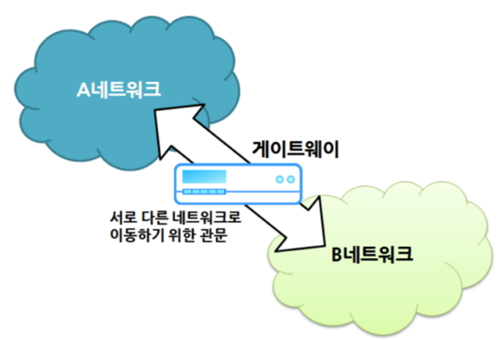

# 게이트웨이 (Gateway)

> 컴퓨터 네트워크에서 한 네트워크(segment)에서 다르 네트워크로 이동하기 위하여 거쳐야 하는 지점이다.

## 게이트웨이 란

일반적으로 '관문', '출입구' 라는 의미로 다양한 분야에서 사용되는 용어이다.

컴퓨터 네트워크에서의 게이트웨이는 서로 다른 네트워크 (이기종 네트워크)를 연결해준다.

현재 사용자가 위치한 네트워크에서 다른 네트워크로 이동하기 위해 반드시 거쳐야 하는 거점을 의미한다.

서로 다른 네트워크의 프로토콜이 다를 경우에 중재 역할을 해준다고 보면 될 것 같다.

하위 계층 (1~3 Layer) 에서 주로 라우터가 이러한 역할을 한다.

상위 계층 (4~7 Layer)에서 상이한 프로토콜들 간의 특수한 변환을 담당 하는 복잡한 소프트웨어를 수행하는 서버를 의미하기도 한다.

예시로 전자우편을 여러 양식으로 바꿔주는 Mail gateway가 있다.

## 게이트웨이 비유

> 게이트웨이는 다른 언어를 사용하는 두 사람 사이에 통역사나 번역기와 비슷하다.
>
> 게이트웨이는 다른 화폐를 사용하는 두 국가 사이에 환전소와 비슷하다.

한 도시에서 다른 도시로 이동하기 위해서 톨게이트를 지나야 하는 상황과 비교해보면 게이트웨이 (Gateway)에 대해 이해 하기 쉽다.

유럽의 도로로 만들어진 국경처럼 나라와 나라를 연결해 주는 톨게이트가 있다고 가정해보면,

출발 국가에서는 우리나라나 미국과 같이 우측통행을 하는 도로이고, 도착 국가에서는 일본과 같이 좌측통행을 하는 도로를 이용한다고 가정해 보자.

이 경우, 톨게이트를 지나가면서 바뀐 도로의 규칙 (프로토콜)을 알려주고 적용(변환) 시킨다고 보면 게이트웨이와 유사한 상황을 가지고 있다고 볼 수 있다.

## 게이트웨이 역할 및 특징

- 일반적으로 게이트웨이의 주소는 IPv4에서 4번째 옥텟 (192.168.1.xxx)만 다른 경우가 많다.
- 집 컴퓨터에서 인터넷에 접속하려는 경우 **집-> 공유기 -> 인터넷 제공 회사 라우터 -> 인터넷망** 이와 같은 경로를 따라 간다. 이 때, 공유기와 인터넷 제공 회사의 라우터는 이전의 단계에서 다음 단계로 넘어 갈 때의 게이트웨이 역할을 담당한다. **인터넷에 접속하기 위하여는 수많은 게이트웨이를 거쳐야 한다.**
- 이 때, 거치는 게이트웨이의 수를 홉 수(hop count) 라고 한다.

---

참고 사이트

게이트웨이(Gateway)란? 개념 정리 사이트 : http://melonicedlatte.com/network/2020/04/28/201100.html

Gateway란? 블로그 : https://brownbears.tistory.com/195