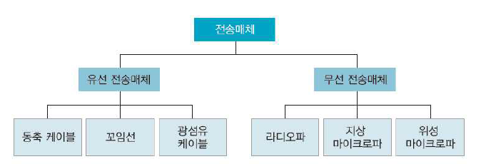

# 네트워크 구축

네트워크의 구체적인 구성을 추상화해, 클라우드 아이콘으로 네트워크를 표현할 수 있다.

클라우드 아이콘으로 표현하는 네트워크의 규모는 전후의 문맥에 달려있다.

## 기본적인 네트워크 기기

- 라우터
- 레이어2 스위치
- 레이어3 스위치

이 네트워크 기기들은 모두 뎅이터를 전송한다. 데이터 전송 처리는 주로 3 단계로 이루어 진다.

1. **데이터 수신** : 전기신호 등 물리적 신호로 변환된 데이터를 원래 디지털 신호(0,1)로 되돌린다.
2. **데이터를 보낼 곳을 결정** : 데이터에 부가된 제어 정보를 참조하여 전송할 곳을 결정한다.
3. **데이터 전송** : 데이터를 물리적인 신호로 변환해서 내보낸다. 필요하면 제어 정보를 고쳐쓴다.

네트워크 기기의 차이는 2 번째 단계에 있다. 데이터에는 다양한 제어 정보가 부가되는데, 네트워크 기기의 동작 메커니즘에서는 어느 제어 정보를 참조해서 데이터를 보낼 곳을 결정하는지가 중요하다.

### 인터페이스

네트워크 기기, PC, 서버 등을 연결하기 위해 각각의 기기에는 인터페이스가 있어야 한다.

일반적으로 이용되는 것은 이더넷 인터페이스이다. 종종 포트 라고 불린다. (이더넷 포트, LAN 포트)

인터페이스는 '경계'라는 의미로, 네트워크 인터페이스는 '0', '1'의 디지털 데이터와 전기신호와 같은 물리적인 신호의 경계이다.

'0', '1'의 디지털 데이터는 전기신호 등 물리적 신호로 변환되어 인터페이스에서 송출되고, 링크로 전달된다.

### 전송 매체와 링크

각 기기에 달린 인터페이스 끼리 연결(링크)한다.

인터에피스를 서로 연결하는 케이블을 **전송 매체** 라고 한다.

데이터를 변환한 전기신호 등 물리적인 신호가 전송 매체를 통해 전달되어 간다.

전송 매체는 유선 케이블뿐만 아니라, 무선 전파인 경우도 있다. (Wi-Fi)

다양한 기기의 인터페이스를 전송 매체로 연결해 링크를 구성함으로써 네트워크가 형성된다.

## LAN 구축

LAN은 사용자가 직접 만드는 네트워크이다.

LAN을 구축하는 주요 기술

- 이더넷
- 무선 LAN (Wi-Fi)

사용자가 직접 LAN을 구축하려면, 이더넷 인터페이스가 있는 라우터와 레이어2, 레이어3 스위치 등의 네트워크 기기를 준비해야 한다.

준비된 기기들의 네트워크 인터페이스를 LAN 케이블로 연결해 가면, 기기 사이에 링크가 구성되고 LAN이 만들어 진다. (유선 LAN)

무선 LAN을 이용하려면, 네트워크 기기인 무선 LAN 액세스 포인트와 무선 LAN 인터페이스가 있는 PC나 스마트폰 등이 필요하다. 노트북 PC나 스마트폰은 대부분 무선 LAN 인터페이스를 갖추고 있다.

무선 LAN 액세스 포인트 친(親)기, 노트북 PC or 스마트폰 자(子)기

각각 필요한 설정하면 무선 LAN의 링크가 완성된다.

