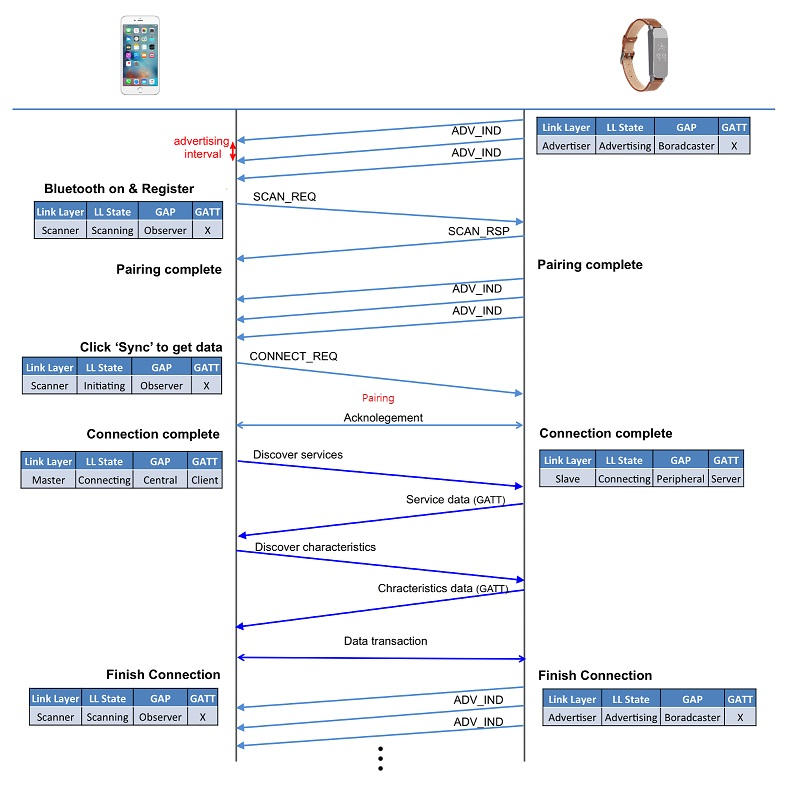

# 블루투스 프로토콜 스택

프로토콜 : 디바이스 간에 데이터를 송수신하기 위한 하나의 약속

## 블루투스 장치 구분

일반적으로 블루투스라고 하면 Bluetooth Classic 부터 Bluetooth Low Energy (BLE) 까지를 모두 포함한다.

이 말은 블루투스의 종류는 하나가 아니라 개념적으로 3가지로 나뉠 수 있다.

- 블루투스 클래식 (Bluetooth Classic) (BLE 이전까지 사용되던 표준)

  BLE 이전에 스펙을 사용하는 기기를 지칭하며 멀티미디어, 대용량 텍스트 등을 다루는 장치

- 블루투스 스마트 레디 (Bluetooth Smart Ready)

  블루투스 클래식과 BLE 모두 지원하는 장치를 말하며 핸드폰이나 PC 등이 해당

- 블루투스 스마트 (Smart)(Bluetooth Low Energy) (블루투스 4.0에 도입)

  BLE 연결만 지원하는 장치를 말하며 저전력으로 구동되어 소량의 데이터만 송수신하는 장치가 해당

## 블루투스 프로토콜 스택 (BLE)

Application - Host - Controller 3개의 계층 구조를 이루며 동작한다.

Appplication 계층은 코드로 작성하는 것이다.

Host 계층은 개발자가 직접 구현하는 부분이 아니다. 이미 이 계층을 위한 코드들은 칩 개발사에서 제공한다. 하지만 블루투스 기기의 동작 속성을 바꾸고, 블루투스 장치와 연결되는 PC - 스마트 폰에 올라가는 어플리케이션 작성을 위해 Host 계층이 동작하는 방식을 알아햐 한다. 특히, GAP, GATT 가 중요하다.

Controller 계층은 블루투스 기기의 물리적인 회로와 이를 제어하는 저레벨의 software를 지칭한다.

HCI를 기준으로 아래는 'HCI Bottom' 이라 불리고  위를 'HCI Top' 이라 말한다.

두 개의 Top, Bottom 사이는 물리 링크인 UART, USB, PCMCIA 등의 인터페이스로 연결된다.

- Physical : 2.4 GHz ISM 대역에서 1 Mbps의 속도로 패킷 송수신 역할 (실제 Bluetooth Analog Signal과 통신 할 수 있는 회로가 구성되어 있음)
- LL (Link Layer) : 5가지의 RF 상태 제어 (standby, advertising, scanning, initiating, connected) 및 디바이스의 Role 정의
- HCI (Host Controller Interface) : Host 영역, Controller 영역의 Interface 역할
- L2CAP (Logical Link Control and Adaptation Protocol) : 데이터 encapulation service 제공
- SM (Security Manager) : paring and key distributuiion 방법 정의 및 인증과 보안에 사용
- ATT (Atrribute Protocol) : 다른 기기로 'attribute'라는 데이터 노출 및 데이터 교환을 위한 클라이언트, 서버 프로토콜 정의
- GAP (Generic Access Protocol) : 장치 간의 paring 과 bonding 사용을 통해 장치 간 인터페이스 역할
- GATT (Generic Attribute Profile) : ATT를 이용하는 sub-procedure를 정의하는 프레임워크, ATT 영역에서 읽어 들인 서비스의 기능 수행

### Physical Layer

Physical Layer (PHY) 는 아날로그 통신을 담당하는 회로와 디지털 데이터 - 아날로그 신호를 변환하는 기능을 포함한다.

BLE는 2.4 GHz ISM (Industrial, Scientific, and Medical) 주파수 대역을 사용하고, 2402MHz ~ 2480MHz 대역을 2MHz 단위로 분할해서 총 40개의 채널을 사용한다. 이 중 [37,38,39] 3개의 채널은 기기간 상호 인지를 위해 advertising 신호를 broadcast / scan 하고 연결을 시작하기 위한 Advertising 채널로 사용한다.

클래식 블루투스에서는 1MHz 단위로 분할해서 총 79개의 채널을 사용한다.

주변 채널 간섭을 피하기 위해 주파수 호핑 방식을 사용한다.

- 2.4 GHz 영역에서 ISM Band 사용하며, 2 MHz 간격으로 총 40개의 채널 사용
- 3개의 (37,38,39) Advertising 채널과 나머지 37개의 Data 채널을 사용
- 같은 ISM Band를 사용하는 Wifi와의 간섭을 피하기 위해 주파수 호핑 방식 사용
-  1 MHz 간격 79개 채널 사용에서는 79개 채널 사용

*BLE*

*Classic*

### Link Layer

하드웨어와 소프트웨어 조합으로 구성되어 있으며, 하드웨어 단에서는 Preamble, Access Address, CRC, AES 등이 처리되고 소프트웨어 단에서는 블루투스 기기간 통신 및 연결 상태를 관리한다.

블루투스로 연결되는 두 장치는 서로 다른 역할을 가지게 된다. 

Master, Slave로 역할을 나누고 Master 가 더 많은 제어, 처리 작업을 담당하도록 한다.

이렇게 함으로써 Slave 역할을 하는 센서장치(peripheral)는 더 작은 리소스로 구동할 수 있다.  

**Role**

- Master : 연결을 시도하고, 연결 후에 전체 Connection을 관리하는 역할
- Slave : Master의 연결 요청을 받고, Master의 timing 규약(호핑규칙)을 따르는 역할
- Advertiser : Advertising Packet을 전송하는 역할, 장치
- Scanner : Advertising Packet을 수신하는 역할, 장치, Scanner는 아래와 같은 2가지 Scanning 모드가 있다.
  - Passive Scanning : Scanner는 Advertising Packet을 받고 이에 대해 따로 응답을 보내지 않는다. 따라서 해당 Packet을 보낸 Advertiser 는 Scanner가 Packet을 수신했는지에 대해서 알지 못한다.
  - Active Scaaning : Advertising Packet을 받은 Scanner는 Advertiser에게 추가적인 데이터를 요구하기 위해 Scan Request 라는 것을 보낸다. 이를 받은 Advertiser 는 Scan Response로 응답한다.

Advertiser 와 Scanner 는 두 장치가 연결되기 전에 서로 담당해야 할 역할을 말한다.

Master와 Slave는 연결이 되고 난 이후 각자가 맡을 역할을 말한다.

Link Layer 에서 BLE 장치가 서로 발견하고 연결 한후, 데이터 통신을 하기 까지 하위 레이어에서 일어나는 과정 전반을 다룬다.

따라서 블루투스가 동작하는 (저레벨의) 구조를 익힐 때 탁월하다.

**State**

Link Layer는 5가지의 RF 상태 제어가 가능하다.

각 디바이스는 서로 연결이 되는 과정에서 이 State를 변화시키며, 각 State의 내용은 아래와 같다.

- Standby State : Singal Packet을 보내지도, 받지도 않은 상태
- Advertising State : Advertising Packet을 보내고, 해당 Advertising Packet에 대한 상대 디바이스의 Response를 받을 수 있고 이에 응답할 수 있는 상태
- Scanning State : Advertising Channel 에서 Scaning 하고 있는 상태
- Initiating State : Advertiser의 Connnectable Advertising Packet을 받고 난 후 Connection Request를 보내는 상태
- Connection State : Connection 이후의 상태

#### Advertising and Scaaning

BLE는 송출하는 packet의 형식이 하나로 정해져 있다.

그리고 advertising, data 두 종류의 패킷을 사용한다.

**advertising packet과 이를 송출, 수신하는 Advertiser, Scanner**

Advertising packet은 BEL 장치들이 서로를 인식하는 과정에 사용된다.

- Advertiser 장치가 목적지 없이 주변에 advertising packet을 송출하면, Scanner 장치는 이걸 수신해서 주변에 있는 advertiser 장치들을 인지한다.
- Advertising packet은 header data(장치 정보)에 31 byte data payload(사용자 지정 데이터)를 합친 것이다. header data 에는 6 byte MAC address (Bluetooth address)도 포함하고 있다. 6 byte MAC address 는 블루투스 장치를 구분하는 고유한 주소값이다.
- Packet을 송출하는 간격 (advertising interval)은 20ms ~ 10.24s 사이에서 조절할 수 있다. 간격이 짧을 수록 빠르게 인식되지만 소비 전류가 많아진다.
- Advertiser, Scanner는 3개의 advertising channel을 임의로 호핑하면서 데이터를 송출 - 스캔하기 때문에, 한 채널에 둘이 오버랩 되는 경우데만 데이터가 전달된다. 호핑하는 속도가 빠르기 때문에 시간이 걸리더라도 오버랩은 된다.

Advertising packet을 수신하는 Scanner 입장에서는 advertising packet을 수신한 이후의 동작에 따라 2가지로 분류 할 수 있다.

- Passivce scanning
  - 단순히 advertising packet을 수신만 한다. 수신 여부를 advertiser에게 전송하지 않는다.
- Active scanning
  - advertising packet을 수신하면 Scan Request라 불리는 packet을 advertiser에게 전송한다. Advertiser가 Scan Request를 받으면 다시 Scan Response 라 불리는 packet을 응답으로 보내준다. Advertising packet의 31byte에 담지 못했던 정보가 있다면 Scan Response에 31 byte를 추가해서 보낼 수 있다. 일반적으로 블루투스 장치의 이름이 Scan Response로 전달된다. 그래서 블루투스 스캔하면 MAC 주소가 먼저 뜨고, 잠시 후에 이름으로 대체되는 것이다.

*advertising packet, scan response 로 전달받는 데이터의 실제구조*

Advertiser 는 3개의 상태 값을 가질 수 있으며, 이 값이 Advertising packet에 포함되어 전송된다.

- Connectable / Non - connectable
  - Scanner 가 advertising packet을 받은 이후 연결을 시도할 수 있는지를 나타낸다. Non - connectable 이면 오직 advertising packet 만을 송출하는 장치라는 뜻이다.
- Scannable / Non-scannable
  - Scanner 가 advertising packet을 받은 이후 Scan request를 보낼 수 있는지를 나타낸다.
- Directed / Undirected
  - Directed 상태값을 가진다면 advertising packet에는 송출기기, 수신기기의 Bluetooth address만 포함되고 그 밖의 사용자 데이터를 가지지 않는다. 이 속성은 연결을 원하는 기기가 명확히 정해져 있다는 것을 의미한다.

실제 상태값이 Advertising packet에 포함될 때는 아래처럼 조합되어 사용된다.

일반적으로 사용되는 ADV_IND 값은 해당 BLE 기기가 advertising 할 때 31byte의 사용자 데이터를 포함해서 전송하고, Scan resquest에 응답을 하며, 연결 요청을 받아들인다는 의미이다.

| Advertising PDU   | Description                                                  | Max adv data len     | Allow scan req | Allow connect |
| ----------------- | ------------------------------------------------------------ | -------------------- | -------------- | ------------- |
| ADV_IND           | Used to send connectable undirected advertisement            | 31 bytes             | Yes            | Yes           |
| ADV_DIRECT_IND    | Used to send connectable directed advertisement              | N/A                  | No             | Yes           |
| ADV_SCAN_IND      | Used to send scannable undirected advertisement              | 31 bytes             | Yes            | No            |
| ADV_NONCONN_IND   | Used to send non-connectable undirected advertisement        | 31 bytes             | No             | No            |
| **ADV_EXT_IND**   | Used to indicate that an advertisement will be sent on a secondary advertisement channel. | No adv data allowed. | No             | No            |
| **AUX_ADV_IND**   | Used to send connectable directed advertisement on a secondary advertisement channel. | 254 bytes            | Yes            | Yes           |
| **AUX_SYNC_IND**  | Used for periodic advertisements on secondary advertisement channels. | 254 bytes            | No             | No            |
| **AUX_CHAIN_IND** | Used to chain advertisement packets, allowing the advertisement data to extend beyond one packet. | 254 bytes            | N/A            | N/A           |

#### Connections

두 블루투스 장치가 연결을 맺으려면 Master 장치는 스캔을 하고 connection request packet을 보내야 한다. 여기에 Slave 장치가 응답하면 연결이 맺어진다. Connection request packet은 채널 호핑을 위한 정보를 담고 있다.

BLE는 Link Layer에서 블루투스 기기가 미리 정해진 몇 개의 장치만 연결될 수 있도록 해주는 White list 기능을 제공한다. 이 기능을 사용할 경우 미리 정해진 Bluetooth address가 아니면 연결 요청을 무시한다.

Connection 자체는 단순히 Slave, Master 장치가 정해진 시간에 따라 (connection interval) 데이터를 주고 받는 것이다. 따라서 connection을 맺을 때 마스터는 연결 설정과 관계된 connection parameter 들을 전달해서 공유해야 한다.

**주요 파라미터들**

- Connection interval
  - 두 장치 사이의 데이터 통신 (connection event)은 주기적으로 이루어진다. 각 통신의 시작 시점 사이의 간격이 connection interval 이다. (7.5ms ~ 4s) 이 시간 간격은 배터리 소모와도 연관이 있다.
- Slave latency
  - Slave 장치가 주기적으로 이루어지는 connection event에 응답하지 않아도 연결해제 되지 않는 횟수 이다.
- Connection supervision timeout
  - 지정된 시간동안 유효한 데이터 송수신이 없는 경우 연결이 해제된 것으로 간주된다.

연결 후 데이터를 실어나르는 data packet은 사용자가 사용할 수 있는 27byte의 공간을 제공한다. 이 공간은 프로토콜이 사용되는 방식에 따라 변경될 수 있기 때문에 일반적으로는 20byte로 제한되어 사용된다.

이 밖에도 Link Layer 에서는 몇 가지 제어 기능을 추가로 담당한다.

그 중 2가지 기능이 중요하다.

- Changing the connection parameters
  - 연결을 시작하기 위해 Master  장치가 연결 요청을 보낼 때 connection parameter를 전달해서 공유한다고 했는데, 처음에 설정된 이 파라미터들을 연결 된 상태에서 바꿔줘야 할 경우가 있다. 예를 들어 상당량의 데이터 전송을 위해 connection inerval을 짧게 바꾸는 대신 배터리 소모를 희생하는 상황이 이에 해당된다. Link Layer는 Master / Slave 장치가 connection parameter를 연결 도중에 변경 할 수 있도록 처리해준다.
- Encryption
  - 암호화된 데이터 통신을 사용하는 경우 데이터 암복호화 작업을 담당한다.

BLE 장치가 서로를 발견한 뒤 (advertising / scanning) 연결을 맺고 (connection) 데이터 통신을 하기 까지 서로 주고 받는 무선 신호를 도식화 하면 아래와 같다.

### SM (Security Manager)

두 장치가 암호화된 보안 통신을 할 때 필요한 보안키를 생성-교환 할 수 있도록 보안 알고리즘과 프로토콜을 제공한다. SM은 BLE 장치가 담당할 2 가지 역할을 정의한다.

- Initiator
  - Link Layer의 Master (GAP에서의 Central)
- Responder
  - Link Layer의 Slave (GAP에서의 Peripheral)

SM은 3가지 procedure를 제공한다.

- Pairing
  - 보안 링크를 구축하기 위해 temporary security encryption key를 생성한다. Encryption key는 연결이 지속되는 동안 유지되지만 저장되지 않기 때문에 다른 연결에 재사용 될 수없다.
- Bonding
  - 일단 Pairing 과정이 끝나면 shared security key를 저장해서 다음번 연결해도 재사용할 수 있는 보안 관계를 구축할 수 있다. 이 상태를 Bonding 또는 Pairing with Bonding 이라 한다.
- Encryption Re-establishment
  - Bonding 과정이 끝나면 키가 양쪽 장치에 저장된다. Encryption re-establishment는 저장된 키를 이용해 다음번에 다시 연결될 때 Pairing - Bonding 없이 보안 연결을 재설정하는 방법을 제공한다.

Phase1 에서 temporary key 생성을 위해 필요한 정보들을 교환한다.

Phase2 에서 temporary encryption key (STK, Short Term Key) 를 양쪽 장치에 생성하고 연결을 암호화 하는데 사용한다. 

이후 Bonding을 실행한다면 Key distribution 과정을 통해 permanent key를 받아 저장하고 다음번 접속 때 재사용한다.

Pairing procedure는 temporary security encryption key (STK)를 양쪽 장치를 생성하기 위해 Security Manager Protocol (SMP) packet을 교환한다.

이 과정이 끝나면 최종적으로 STK를 이용한 암호화 통신이 가능하다.

### GAP (Generic Access Profile)

GAP역할은 크게 Broadcaster, Observer, Peripheral, Central로 나뉠 수 있다.

GAP에 대해서 간단히 설명하자면 GAP은 서로 다른 제조사가 만든 BLE 디바이스들끼리 서로 호환되어 통신할 수 있게 해주는 주춧돌 역할을 한다.

어떻게 디바이스가 서로를 인지하고 데이터를 advertising 하고 connection을 맺을지에 대한 프레임워크를 제공할까

(GAP은 최상위 control layer라고 불린다.)

**Role**

- Broadcaster : Link Layer에서 Advertiser 역할에 상응한다. 주기적으로 Advertising Packet을 보낸다. 예를 들면, 온도센서는 온도데이터를 자신과 연결된 디바이스에게 일정 주기로 보낸다.
- Observer : Link Layer에서 Scanner 역할에 상응한다. Broadcaster가 뿌리는 Advertising Packet에서 data를 얻는다. 온도센서로 부터 온도 데이터를 받아 디스플레이에 나타내는 태블릿 컴퓨터의 역할이다.
- Central : Link Layer에서 Master 역할과 상응한다. Central 역할은 다른 디바이스의 Advertising Packet을 듣고 Connection을 시작할 때 시작된다. 좋은 성능의 CPU를 가지고 있는 스마트폰이나, 태블릿 컴퓨터들의 역할이다.
- Peripheral : Link Layer에서 Slave 역할과 상응한다. Advertising Packet을 보내 Central 역할의 디바이스가 Connection을 시작할 수 있도록 하게끔 유도한다. 센서 기능이 달린 디바이스들의 역할이다.

여기서 커넥션이라고 하는 데 커넥션 과정에는 paring과  bonding 과정이 있다. 각각의 차이점은 무엇일까?

**Paring , Bonding**

아래 그림 Peripheral이 advertising packet을 일정한 간격으로 발생시키고 Central은 Observer (scan)을 통해 패킷을 읽어 들여 커넥션 요청을 하는 과정을 보여주며 여기서 페어링과 본딩에 대한 개념이 나온다.

Paring은 기기간의 영구 보안을 생성하는 것이 아니다.

Paring은 Bonding을 허용하는 메커니즘이다.

Paring은 security를 정보를 (I/O기능, requirement for 중간자 등) 교환하며, client로 부터 교환요청이 시작된다.

한번 Paring이 완료되면, temporary security key가 교환되고 연결이 encrypted 된다.

이러한 encrypeted 연결에서는 long term key - IRK(Identity resolving key)가 교환되는 데 이는 encryption key와 encryption key의 연결이고 디지털 서명된 key 이다.

Exact key들의 교환은 각각의 device의 security feature에 의해 결정된다.

Bonding은 Paring 된 이후에 long term key 교환하고 이를 나중에 사용하기 위해 보관하는 것이다.

기기는 key를 보관하고 다음 연결에 사용된다.

Key는 Bonding procedure를 통해 교환된다.

기기간에 Bonding 된 경우 security 정보를 교환하지 않고도 연결을 암호화할 수 있다.

bonding 된 기기간에는 "turn on encryption"를 보낼 수 있으며, 기기는 이미 저장된 key를 사용하여 누군가 snooping 하여 key 교환을 볼 수 없으므로 통신 메시지는 Paring 할 때와 마찬가지로 deconding 될 수 있다.

### GATT (General Attribute Profile)

BLE 데이터 교환을 관리하는 GATT는 디바이스들이 데이터를 발견하고 읽고, 쓰는 것을 가능하게 하는 기조적인 데이터 모델과 절차를 정의한다. (BLE 기기간의 모든 통신은 GATT sub-procudure로 핸들링되므로 application, profiles는 GATT를 직접적으로 이용하게 된다.)

디바이스 간의 Low-level에서의 모든 인터렉션을 정의하는 GAP와 달리 GATT는 오직 데이터의 포맷 및 전달에 대해서만 처리한다.

GATT는 ATT를 이용하여 장치 사이에 데이터를 전송하는 방식을 결정하는 프레임 워이다.

ATT는 Service 와 Characteristic이라는 개념을 사용하여 어떤 데이터 'attribute'를 다른 장치에게 보여주도록 하며, 이 때 attribute를 보여주는 장치를 서버라고 하고, 보는 장치를 클라이언트라고 한다.

**Role**

- Clinet (Master) : Central 역할을 했던 장치에서 Client 역할을 하며, 연결 과정에서 연결 간격을 조정하고 Service 항목을 통해 데이터 요청의 기능을 수행
- Server (Slave) : Peripheral 역할을 했던 장치에서 Server 역할을 하며, 연결 과정에서 초기 연결 간격을 명시하며 Client에서 보낸 연결 간격 조정 값의 적용 여부를 판단하고 Client의 데이터 요청에 대한 응답 기능을 수행

---

참고사이트

블로그1 : https://blog.naver.com/chodahi

블로그2 : https://neosla.tistory.com/49?category=862930

블로그3 : https://igotit.tistory.com/entry/BLE-Protocol-Stack-Bluetooth-Low-Energy