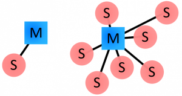
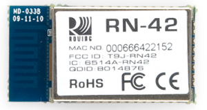
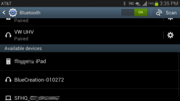
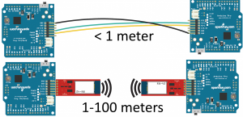
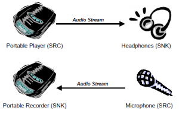
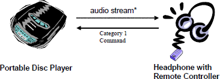

# 블루투스

> 스마트폰, 노트북, 이어폰, 헤드폰 등의 전자기기를 서로 연결하여 정보를 교환하는 근거리 무선 기술(10M 이내)의 표준

블루투스란 스마트폰, 노트북, 이어폰, 헤드폰 등의 전자기기를 서로 연결하여 정보를 교환하는 근거리 무선 기술(10M 이내)의 표준을 말한다.

와이파이, 블루투스 등 무선 통신 기술이 매우 많지만, 그중에서도 근거리 무선 기술에 보통 활용되는 것은 블루투스이다.

## 원리

블루투스의 원리 그 자체는 무선전파의 원리와 같다.

안테나를 통해 보내고자 하는 데이터를 전자기파로 변조하여 보내고 안테나가 수신하여 전자기파를 데이터로 복조 시키는 것 이다.

*(복조란, 데이터 통신에서 수신된 신호를 원래의 신호로 복구하는 조작)*

이는 휴대전화, 라디오 같은 경우도 마찬가지이다.

블루투스의 무선 시스템은 주파수를 사용한다.

주파수는 무선통신의 기본적인 개념 중 하나인데, 주파수는 1초의 몇 번 진동하는지를 나타내는 척도이다. 단위는 헤르츠(Hz)

모든 소리 및 파동은 주파수가 정해져 있는데 블루투스는 주파수 2,402MHz ~ 2,480MHz의 영역을 쓰고 있다.

총 79개의 채널을 사용한다. 이 때문에 블루투스의 사용 대역을 2.4 GHz 라고 한다.

2.4GHz를 사용하는 블루투스는 블루투스 이외의 전파가 블루투스와 같은 주파수를 사용한다면 전파간섭이 일어나 전파가 굴곡되거나 망가질 수 있다.

따라서 블루투스와 같은 무선 통신 방식에는 각자 고유한 주파수 영역이 정해져 있다.

또한 블루투스 전파 간의 간섭을 방지하기 위해 주파수 호핑 방식을 사용한다.

### 주파수 호핑

> 주파수 호핑이란 데이터를 전송할 때 79개의 채널 중 하나를 독점하여 데이터를 전송하는 방식이 아닌 빠르게 채널을 이동하며 데이터를 조금씩 전송하는 방식

주파수 호핑이란 데이터를 전송할 때 79개의 채널 중 하나를 독점하여 데이터를 전송하는 방식이 아닌 빠르게 채널을 이동하며 데이터를 조금씩 전송하는 방식이다.

하나의 채널로 연결하여 데이터를 보낼 경우 다른 주파수와 간섭이 생길 수 있기 때문이다.

이 때문에 블루투스는 앞서 말한 79개의 채널을 1초당 1600번 호핑 (Hopping) 하여 데이터를 전송한다.

블루투스 네트워크(piconets)는 마스터, 슬레이브 모델을 사용한다.

이 모델은 하나의 마스터 장치가 다수의 (7개 까지) 슬레이브 장치와 연결될 수 있다.

피코넷에 연결 되는 슬레이브 장치는 오직 하나의 마스터 장치에만 연결이 가능하다.

마스터 장치는 피코넷을 통해 통신을 조율한다.

마스터 장치는 연결된 어떤 슬레이브 장치에든 데이터를 전송할 수 있고, 요청을 보낼 수도 있다.

슬레이브 장치는 마스터와 데이터를 교환할 수 있지만 슬레이브간 통신을 할 수 없다. 

ex) 

블루투스는 마스터 기기와 슬레이브 기기로 구성된다.

블루투스 이어폰을 예를 들면

스마트폰 = 마스터

이어폰 = 슬레이브

서로가 블루투스로 연결이 되면 두 기기간의 주파수 호핑 방법으로 데이터를 주고 받는 것이다.

## 블루투스 주소와 이름

모든 블루투스 장치는 약어로 DB_ADDR 이라 불리는 고유한 48-bit (6 bytes) 주소를 가진다.

이 주소는 항상 12자리 16진수 값으로 표시 된다.

이 주소의 상위 절반 (24 bits)은 oragnization unique identifier (OUI) 라 불리며 제작사를 나타낸다.

하위 절반 (24 bits)은 장치의 고유한 주소이다.

ex) RN-42 Bluetooth Module

"MAC NO." 항목이 000666422152

"000666" 은 모듈을 생산한 OUI of Roving Networks이다.

RN module은 상위 24-bits에 같은 값을 공유한다.

하위 절반 "422152"는 모듈 고유한 ID 이다.

블루투스 장치들은 사용자가 이해 하기 쉽도록 이름을 제공하는데, 이 이름은 블루투스 장치를 구분하기 쉽도록 고유 주소 대신 보여진다.

장치의 이름은 248 byte 까지 가능하며 두 장치가 같은 이름을 사용할 수 있다.

그래서 이름에는 종종 블루투스 모듈의 고유 ID가 포함되기도 한다.

## 연결과정

1. Inquiry - 두 개의 블루투스 장치가 서로를 완전히 모르는 상태라면 서로를 찾기위한 과정

   하나의 장치 (핸드폰, PC 등)가 inquiry request를 보내면 다른 하나의 장치는 이 request에 대해 주소, 이름 및 기타 정보와 함께 응답해줘야 한다.

2. Paging (Connecting) - Paging은 두 장치가 연결되기위한 과정이다.

   연결이 완성되기 전에 각각의 장치는 서로의 주소를 알고 있어야만 한다.

3. Connection - Paging 과정이 끝나면 connection 상태가 된다. 연결이 된 동안 장치들은 자신의 상태(모드)를 바꿀 수 있다.

   - Active Mode - 일반적인 연결 상태. 장치는 데이터를 전송, 수신하는데 참여한다.
   - Sniff Mode - 절전모드. Sleep(비활동) 상태를 유지하다가 정해진 간격 마다 송수신 내용이 있는지 확인
   - Hold Mode - 일시적인 절전모드. 장치는 정해진 시간 동안 Sleep 상태에 들어갔다 다시 Active 모드로 돌아온다. 마스터 장치가 슬레이브 장치에게 이 모드로 들어가도록 지시 할 수 있다.
   - Park Mode - 정지모드. 더 깊은 절전 모드로 마스터 장치에서 신호가 올 때까지 정지모드로 들어가도록 알려준다.

### Bonding and Paring

두 장치가 연결된 후 특별한 데이터를 교환하면 Bonding 상태를 만들 수 있다.

Bonding 된 장치들은 서로 가까운 거리를 유지할 때 자동으로 연결된다.

Bonding은 paring 이라 불리는 과정으로 만들어진다.

두 장치는 페어링 될 때 서로 주소, 이름, 프로파일 (profiles)을 교환하고 저장해둔다.

또한 common secret key를 교환해서 향후 Bonding 될 때 사용한다.

페어링은 사용자가 원하는 장치만 연결될 수 있도록 인증 과정을 요구한다.

인증 과정을 위해서는 별도의 UI 조작이 필요하지만 이 과정을 생략하고 인증없이 연결되도록 할 수도 있다.

인증 과정은 6자리 숫자를 입력받아 수행하는 데 예전 기기의 경우 (v2.0 이하) PIN 코드를 사용한다.

PIN코드는 4자리 숫자부터 16자 알파멧 문자까지 다양한 방법이 사용될 수 있다.

### 블루투스 프로파일

블루투스 프로파일은 블루투스 장치가 어떤 종류의 데이터를 보내는지 명확하게 정의하기 위한, 블루투스의 기본 표준위에 더해진 프로토콜이다.

블루투스 specifications 는 블루투스가 어떻게 동작하는 지를 설명하고 프로파일은 어떻게 사용되는지를 정의한다.

블루투스 프로파일은 연결되었을 때 장치가 어떻게 동작해야 하는지를 결정한다.

예를 들어 핸즈프리 헤드셋의 경우 headset profile (HSP)를 사용 하고,

Nintendo Wii Controller의 경우는 human interface device (HID) 프로파일을 사용한다.

이 장치들과 연결되는 장치의 경우, 호환성을 갖기 위해서는 두 프로파일을 모두 지원해야 한다.

#### 자주 접하게 되는 블루투스 프로파일

 ##### Serial Port Profile (SPP)

블루투스를 이용해 serial communication interface(likes RS-232 or a UART) 를 무선으로 대체하고 싶은 경우 SPP 프로파일을 사용하면 된다.

SPP 프로파일은 두 장치가 많은 양의 데이터를 교환하는데 초점이 맞춰져 있다.

이 프로파일은 블루투스의 가장 기본적인 프로파일 중 하나이기도 하다. (본래 목적은 RS-232 케이블 통신을 대체하는 것이기 때문)

SPP 프로파일을 사용하면 두 장치는 RX, TX 라인이 마치 유선으로 연결된 것처럼 데이터를 주고 받을 수 있다.

##### Human Interface Device (HID)

HID 프로파일은 블루투스를 이용한 사용자 입력장치에 사용된다.

키보드, 마우스, 조이스틱, 비디오 게임 컨트롤러 등에 주로 사용된다.

HID 프로파일은 실제로는 USB 사용자 입력장치를 지원하기 위한 것이다.

SPP 프로파일이 RS-232 케이블의 대체재인 것처럼 HID 프로파일도 USB 케이블을 대체하는 것을 목표로 한다. 

##### Hands-Free Profile (HFP), Headset Profile (HSP)

블루투스 이어폰 등에 사용되는 프로파일로 HFP의 경우는 차량의 hands-free 오디오 시스템이 사용된다.

HFP는 HSP를 기반으로 일반적인 폰 인터랙션 (전화 수신/거절, 종료 등)을 추가로 지우너하기 위한 내용들이 포함되어 있다.

##### Advanced Audio Distribution Profile (A2DP)

블루투스 장치간 오디오를 전송하기 위한 프로파일이다.

HFP, HSP는 오디오를 양방향으로 전송하지만 A2DP는 단방향으로만 전송한다.

대신 오디오의 음질은 훨씬 높다.

대부분의 A2DP 블루투스 모듈은 제한된 오디오 코덱만을 지원한다.

최소한 SBC (subband codec), MPEG-1, MPEG-2, AAC, ATRAC 정도는 지원할 것이다.

##### A/V Remote Control Profile (AVRCP)

Audio/video remote control profile 은 블루투스 장치를 무선으로 제어하기 위한 프로파일이다.

오디오 플레이어를 무선으로 제어가 가능하도록 하기위해 A2DP 프로파일과 함께 지원되곤 한다.

## 블루투스와 와이파이

> 빠른 속도와 넓은 수신 및 송신 범위의 필요성이 없다면 블루투스, 반대의 경우에는 와이파이를 쓴다.

블루투스와 유사한 것이 바로 와이파이(Wi-Fi)이다.

이 둘의 차이점은 무엇일까?

둘은 무선 통신이라는 큰 틀에서 다른 목적을 가지고 태어난 기술이다.

블루투스는 기본적으로 근거리에서 통신하고 저전력을 요구한다는 점이 특징이다.

따라서 통신 대상 서로 간의 거리가 가깝고 외부 배터리를 사용하는 환경에서 큰 장점을 발휘한다.

와이파이는 빠르고 안전성(보안성) 있는 인터넷 접속이 목표이다.

그래서 범위도 블루투스보다 넓고 속도도 빠르며 보안성이 높지만, 그만큼 족잡하고 설치가 어려운 단점이 있다.

결론적으로 빠른 속도와 넓은 수신 및 송신 범위의 필요성이 없다면 블루투스, 반대의 경우에는 와이파이를 쓴다.

## 무선 프로토콜 비교

| Name                             | Bluetooth Classic           | Bluetooth 4.0 Low Energy (BLE) | ZigBee            | WiFi                    |
| -------------------------------- | --------------------------- | ------------------------------ | ----------------- | ----------------------- |
| IEEE Standard                    | 802.15.1                    | 802.15.1                       | 802.15.4          | 802.11 (a, b, g, n)     |
| Frequency (GHz)                  | 2.4                         | 2.4                            | 0.868, 0.915, 2.4 | 2.4 and 5               |
| Maximum raw bit rate (Mbps)      | 1-3                         | 1                              | 0.250             | 11 (b), 54 (g), 600 (n) |
| Typical data throughput (Mbps)   | 0.7-2.1                     | 0.27                           | 0.2               | 7 (b), 25 (g), 150 (n)  |
| Maximum (Outdoor) Range (Meters) | 10 (class 2), 100 (class 1) | 50                             | 10-100            | 100-250                 |
| Relative Power Consumption       | Medium                      | Very low                       | Very low          | High                    |
| Example Battery Life             | Days                        | Months to years                | Months to years   | Hours                   |
| Network Size                     | 7                           | Undefined                      | 64,000+           | 255                     |

## 블루투스 버전

### 블루투스 1.0

1998년 SIG 그룹 결성 2년 이후 최초로 등장한 블루투스 버전으로 주파수 호핑 방법을 채택하여 발전했다.

하지만 연결을 위한 하드웨어 장치를 사전에 입력해줘야 하는 문제로 현재처럼 두 장치 사이간 익명 연결이 불가능

### 블루투스 1.1

2002년 IEEE 표준으로 승인된 버전으로 기존 1.0과 1.0b의 문제점을 수정한 점이 특징이며

신호 강도 지표(Singal Strength Indicator) RSSI를 수신 받을 수 있게 됐다.

### 블루투스 1.2

2005년 IEEE 표준으로 승인받은 버전으로 전송속도는 큰 차이가 없지만, 오류나 음성, 신호의 품질 손실을 막는 기술이 추가됐다. 실제 전송 속도는 1.1과 동일한 723 kbps 정도 이다.

### 블루투스 2.0 + EDR

버전이 1에서 2 버전으로 바뀌면서 데이터 속도가 3 Mbps로 크게 증가한다.

EDR은 강화된 데이터 전송 (Enhanced Data Rate)를 말한다. (이론상 3 Mbps, 실제 데이터 전송 속도 2.1 Mbps)

다중 연결 시나리오의 단순화로 데이터 전송량이 늘면서 전력 소비가 줄어든 효과를 함께 얻은 버전이다.

### 블루투스 2.1 + EDR

2007년 채택된 2.1 버전은 장치의 이름이나 서비스 목록 등 다양한 정보를 제공하도록 개선되었다.

근거리 무선통신 (NFC)에 대응하는 기능이 추가됨으로 NFC 라디오 인터페이스를 사용할 수 있다면 자동적으로 안전하게 접속이 가능하다.

배터리 수명이 3배에서 10배 까지 증가했다.

### 블루투스 3.0 + HS

2009년 발표되었으며, 최대 속도를 24 Mbps로 끌어올렸다.

HS는 High Speed를 뜻하며 기기간 대용량 파일 전송이 가능하며, 내장된 전력 관리 기능으로 전력 소모를 크게 줄였다.

### 블루투스 4.0 (Bluetooth Low Energy의 시작)

2010년 발표되었으며, 기존 블루투스의 콧속 전송과 저전력 기능을 포함한 규격이다.

블루투스 클래식, 블루투스 스마트, 불루투스 스마트 레디로 구성되며 고속 전송은 블루투스 클래식, 스마트 레디는 일반적인 노트북이나 스마트폰에 사용된다.

저전력에 초점을 맞춘 BLE의 경우 전송 속도는 1 Mbps로 IoT 통신에 강점을 가진다.

### 블루투스 4.1

2013년 발표되었으며, 4.0에 기능이 추가된 마이너 업데이트 버전이다.

LTE와의 공존성을 높여 서로 간의 간섭 현상을 줄였다.

블루투스 연결 장치끼리 거리 문제로 잠시 연결이 끊어져도 다시 자동 연결이 되도록 기능을 추가했다.

웨어러블 기기가 허브의 역할을 할 수 있게 되었으며, IPv6 표준이 탑재되어 있다.

### 블루투스 4.2

2014년 발표되었으며 사물인터넷 지원을 위한 특징을 도입했다..

새로운 인터넷 프로토콜 지원 프로파일이 추가되었으며, 데이터 전송 거리의 증가와 개인정보 보호, 보안 등이 핵심이다.

### 블루투스 5.0

2016년 소개되었으며 IoT에 초점을 맞췄다.

블루투스 4 버전의 1 Mbps의 속도에서 두배 늘린 2 Mbps의 속도를 가진다.

4.2 LE에 비해 4배 긴 전송거리와 243m 까지 전송이 가능하다.

----

참고사이트

블루투스 (Bluetooth)의 역사 및 원리 블로그 : https://neosla.tistory.com/48?category=862930

★블루투스 기초 : https://www.hardcopyworld.com/?p=2101