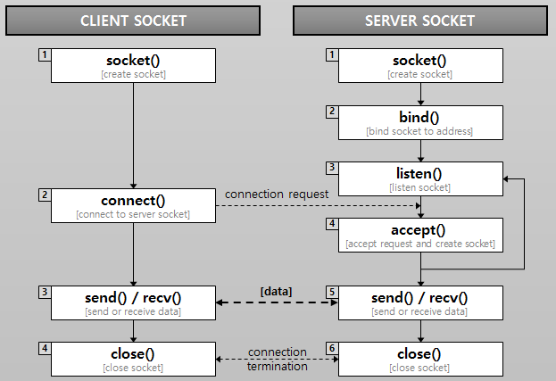

# 소켓 (Socket)

> 네트워크 환경에 연결할 수 있게 만들어진 연결부
>
> 네트워크상에서 동작하는 프로그램 간 통신의 종착점 (Endpoint)
>
> IP 주소와 port 번호를 조합한 네트워크 주소
>
> 네트워크 상에서 서버와 클라이언트 2개의 프로그램이 특정 포트를 통해 양방향 통신이 가능하도록 만들어주는 소프트웨어 장치

소켓의 사전적 의미 : 구멍, 연결, 콘센트 등의 의미

네트워크에서 소켓의 의미는 프로그램이 네트워크에서 데이터를 송수신 할 수 있도록 "네트워크 환경에 연결할 수 있게 만들어진 연결부"이다.

소켓(Socket)이란 네트워크 상에서 동작하는 프로그램 간 통신의 종착점 (Endpoint) 이다.

즉, 프로그램이 네트워크에서 데이터를 통신할 수 있도록 연결해주는 연결부 라고 할 수 있다.

> Endpoint : IP Address 와 port 번호의 조합을 뜻하며 최종 목적지를 나타낸다.
>
> 예시로 최종목적지는 사용자의 디바이스(PC, 스마트폰 등) 또는 Server 가 될 수 있다.

보통 OSI 7 Layer의 네 번째 계층인 TCP 상에서 동작하는 소켓을 주로 사용하는데, 이를 TCP 소켓 혹은 TCP / IP 소켓 이라 한다.

## TCP / IP 소켓 프로그래밍

소켓 프로그래밍은 소켓 통신의 절차에 대한 이해와 운영체제 및 프로그래밍 언어에 종속적으로 제공되는 소켓 API 사용법을 숙지한다면 구현 할 수 있다.

하지만 네트워크 환경에서는 네트워크 단절, 트래픽 증가, 시스템 리소스 관리 문제 등과 같은 많은 문제들이 발생함에 따라 예외 처리가 필수적이기에 초보 개발자에게는 어렵게 다가 올 수 있다.

### 클라이언트 소켓, 서버 소켓

데이터를 통신할 수 있도록 해주는 연결부이기 때문에 통신한 두 프로그램 (Client, Server) 모두에 소켓이 생성되어야 한다.

두 개의 시스템 (또는 프로세스) 가 소켓을 통해서 네트워크 연결을 만들기 위해서는 어느 한곳에서 연결 요청을 해야 한다. 이 때 IP 주소와 포트 번호로 식별할 대상에게 네트워크 연결을 하고 싶다는 요청을 하는 것이다.

무작정 연결을 요청한다고 해서 네트워크 연결이 체결되는 것이 아니라 수신 측에서 어떤 연결 요청을 받아들일 것인지를 미리 시스템에 등록하여, 요청이 수신되었을 떄 요청을 처리할 수 있도록 해야 한다.

## 소켓 API 실행 흐름

Server는 특정 포트와 연결된 소켓 (Server 소켓)을 가지고 컴퓨터 위에서 동작하게 되는데,

이 Server는 소켓을 통해 Client 측 소켓의 연결 요청이 있을 떄 까지 기다리고 있는다. (listening)

Client 소켓에서 연결요청을 하면 (올바른 port로 들어왔을 때) Server 소켓이 허락을 하여 통신을 할 수 있도록 연결 되는 것이다.

**클라이언트 소켓 흐름**

1. 소켓 생성
2. 서버 측에 연결
3. 서버 소켓에서 연결을 받으면 데이터를 송수신
4. 모든 처리가 완료되면 소켓을 닫음

**서버 소켓 흐름**

1. 소켓 생성
2. 서버가 사용할 IP주소와 포트 번호를 생성한 소켓에 결합
3. 클라이언트로부터 연결 유청이 수신되는 지 주시
4. 요청이 수신되면 accpet 후 소켓 생성
5. 데이터 송수신
6. 소켓 닫음

### 클라이언트 소켓

1. **소켓 생성 : socket()**

   소켓 통신을 위해 가장 먼저 해야 할 일은 소켓을 생성 하는 것이다.

   이 때 소켓의 종류를 지정할 수 있는데, TCP 소켓을 위해서는 스트립 타입, UDP 소켓을 위해서는 데이터그램 타입을 지정할 수 있다.

   최초 소켓이 만들어지는 시점에는 어떠한 여결 대상에 대한 정보도 들어 있지 않다.

   그러기에 연결 대상 즉, IP와 Port를 지정하고 연결 요청을 전달하기 위해서는 새성한 소켓을 사용하여 connect() API를 호출해야 한다.

2. **연결 요청 : connect()**

   connect() API는 IP 주소와 포트 번호로 식별되는 대상으로 연결 요청을 보낸다.

   connect() API는 블록 방식으로 동작하기에, 연결 요청에 대한 결과가 결정되기 전에는 connect()의 실행이 끝나지 않고 대기한다.

   호출이 성공하면 send() / recv() API를 통해 데이터를 송수신 한다.

3. **데이터 송수신 : send() / recv()**

   연결된 소켓을 통해 데이터를 보낼 때는 send ()

   수신에는 recv() API를 사용한다.

   두 API 모두 connect() 와 동일하게 블럭 방식으로 동작한다.

   그러므로 두 호출이 모두 결과가 결정되기 전 까지는 API가 리턴되지 않는다.

   특히 recv() 같은 경우는 한 번 실행되면 언제 어떤 데이터가 전송되어 올 것인지 알 수 없기 때문에, 데이터 수신을 위해서 별도의 스레드를 실행하여 데이터 수신을 기다린다.

4. **소켓 닫기 : close()**

   데이터 소숭신이 필요 없게 되면, 소켓을 닫기 위해 close() API를 호출한다.

   해당 소켓은 닫힌 이후에는 재사용이 불가능하다.

### 서버 소켓

1. **소켓 생성 : socket()**

   클라이언트와 동일하게 소켓 생성

2. **소켓 바인딩 : bind()**

   bind의 사용되는 파라미터는 포트 번호 or IP 주소 + 포트 번호이다.

   시스템 상에서 많은 수의 프로세스가 동작하기에 서버에 접근할 수 있는 가상화된 포트를 지정해야 한다.

   운영체제는 소켓들이 중복된 포트 번호를 사용하지 않도록, 내부적으로 포트 번호와 소켓 연결 정보를 관리하는데, bind() 호출과정에서 중복되는 포트 사용이 있으면 운영체제가 포트 할당을 거부하고 API는 에러를 리턴한다.

3. **클라이언트 연결 요청 대기 : listen()**

   서버 소켓에 포트 번호를 결합하고 나면, 서버 소켓을 통해 클라이언트의 요청을 받을 준비가 되었다.

   클라이언트의 연결 요청이 수신될 때 까지 기다려야 한다.

   대기 상태를 빠져나오는 경우도 있는데 이 때는 요청이 수신되는 경우와, 에러가 발생하는 경우이다.

   클라이언트 연결 요청에 대한 정보는 시스템 내부적으로 관리되는 큐에 쌓이게 됨으로, 대기중인 연결 요청을 큐로부터 꺼내와서, 연결을 수립하기 위해서는 accept() 를 호출하면 된다.

4. **클라이언트 연결 수립 : accept()**

   최종적으로 accept() 을 호출해서 소켓 간 연결이 수립이 된다.

   여기서 한가지 독특한 부분은 accept()가 호출되어 소켓 간 연결을 수립할 때 새로운 소켓을 만들어 연결하게 된다.

   그럼 여기서 서버 소켓의 역할은 클라이언트 연결을 대기하고 연결 수립 요청을 하고 소켓을 닫는 것이다.

5. **데이터 송수신 : send() / recv()**

   클라이언트와 동일

6. **소켓 닫기 : close()**

   클라이언트와 동일, (클라이언트의 연결을 대기하는 소켓 또한 닫아줘야 함)

---

참고사이트

소켓이란 무엇인가 블로그 : https://www.daleseo.com/what-is-a-socket/

Socket 이란 블로그 : https://medium.com/@su_bak/term-socket%EC%9D%B4%EB%9E%80-7ca7963617ff

소켓 통신이란 블로그 : https://helloworld-88.tistory.com/215

TCP/IP 소켓이란 블로그 : https://popbox.tistory.com/66

소켓과 소켓 프로그래밍 개념 : https://velog.io/@devsh/%EB%84%A4%ED%8A%B8%EC%9B%8C%ED%81%AC-%EA%B8%B0%EC%B4%88-%EA%B0%9C%EB%85%90-%EC%A0%95%EB%A6%AC%ED%95%98%EA%B8%B0-%EC%86%8C%EC%BC%93%EA%B3%BC-%EC%86%8C%EC%BC%93-%ED%94%84%EB%A1%9C%EA%B7%B8%EB%9E%98%EB%B0%8D-%EA%B0%9C%EB%85%90
