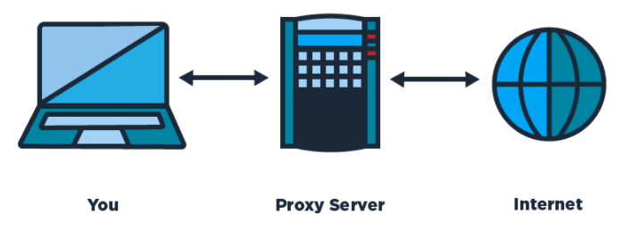
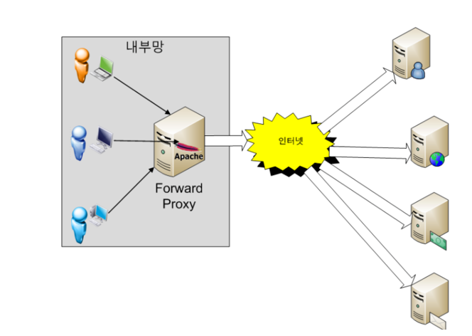
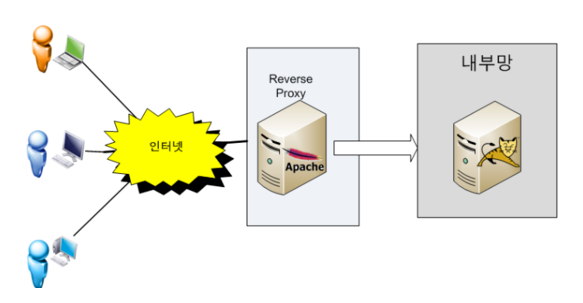

# 프록시 (Proxy)

프록시 (proxy)란 대신 이라는 의미를 가지고 있다.

프로토콜에 있어서 대리 응답 등에서 사용하는 개념이라고 할 수 있다.

보안상의 문제로 직접 통신을 주고 받을 수 없는 사이에서 프록시를 이용해서 중계를 하는 개념이라고 볼 수 있다.

이렇게 중계를 기능을 하는 것을 프록시 서버 라고 한다.

## 프록시 서버 특징

프록시 서버는 클라이언트와 서버의 입장에서 볼 때 서로 반대의 역할을 하는 것 처럼 보여진다.

클라이언트가 프록시를 바라보면 프록시가 서버와 같이 동작을 하게 되는 것이고,

서버가 프록시를 바라보면 클라이언트 처럼 작동을 하게 되는 것이다.

프록시를 사용하는 이유는 단순히 보안 때문은 아니다.

프록시는 프록시 서버에 요청이 된 내용들을 캐시를 이용해 저장해 둔다.

이렇게 캐시로 저장을 해두게 된다면 다시 데이터를 가져올 상황이 발생을 하지 않기 때문에 전송시간을 절약 할 수 있다는 이점이 있다.

## 프록시 서버

> 프록시 서버는 서버의 위치에 따라 크게 두가지로 나누어 지게 된다.

### Foward Proxy

그림에서 보면 내부망 -> 외부망 으로 데이터를 전달이 되는 걸 볼 수 있다.

특정 사이트를 가려고 할 때, 가조 싶은 목적지 사이트의 주소를 직접 프록시 서버에 전달하며 프록시 서버가 해당 목적지 사이트의 내용을 받아와서 전달을 해주는 개념 이라고 볼 수 있다.

말 그대로 대신 처리를 해주는 역할을 하게 된다.

캐싱 기능이 있으므로 자주 사용되는 컨텐츠들이라면 성능 향상을 가져올 수 있으며, 프록시에서 특정 사이트는 접근이 불가능 하도록 제한을 걸 수도 있기 때문에 기업 환경(기업의 외부망)에서 많이 사용이되는 방식이다.

ex) 사용자가 Proxy 설정을 myproxy.com 으로 하고, 타켓 서버가 naver.com 이라고 한다면 주소창에 naver.com을 치면 프록시서버를 거쳐 알아서 naver.com으로 브라우징 되게 된다.

### Reverse Proxy

사용자가 Reverse Proxy로 설정된 버서의 주소로 데이터를 요청을 하게 되며, 프록시 서버가 이 요청을 받아서 실제 내부 서버에서 데이터를 받아와 클라이언트에게 전달을 해주는 개념이다.

물론 사용자가 직접 내부 서버에 다이렉트로 붙어서 서비스를 제공 받을 수도 있겠지만 이렇게 프록시를 구성하는 이유는 바로 보안 때문이다.

보통의 기업 네트워크 환경은 DMZ라고 하는 내부 네트워크와 외부 네트워크 사이에 위치하는 구간이 존재하며, 이 구간에는 보통 메일, 웹, FTP 서버등 외부 서비스를 제공하는 서버들이 위치를 하고 있다.

기업이 특정 서비스를 만들어서 WAS서버를 DMZ 쪽에 놓고 다이렉트로 사용을해도 되지만, 대부분의 WAS 서버는 DB서버와도 함께 연동이 되어 있으므로 WAS가 털리게 된다면 DB서버도 함께 털리는 문제가 발생을 하게 된다.

이러한 이유들 때문에 Reverse Proxy를 두고 실제 서비스는 내부에 위치를 시키고 프록시 서버가 내부 서버와 통신을 해서 데이터를 받아오는 형식을 많이 사용하고 있다.