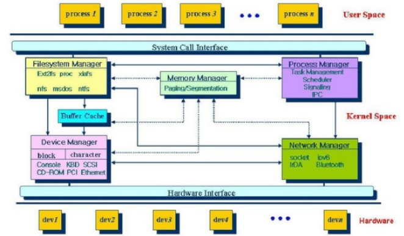
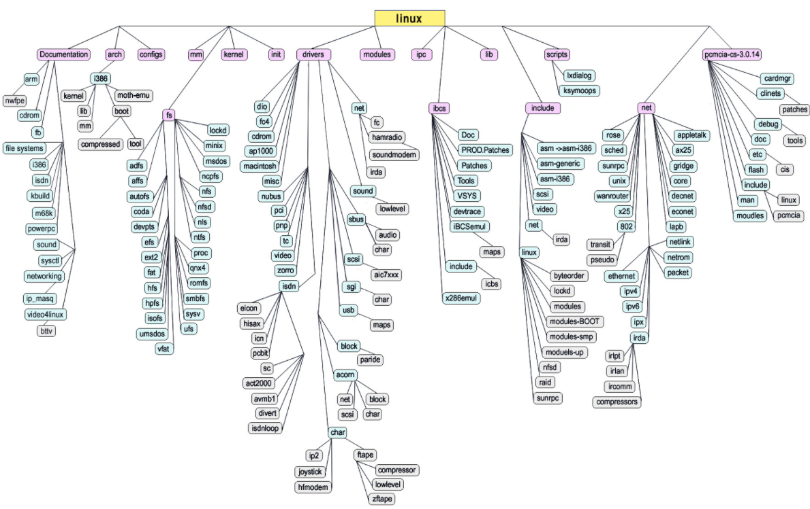

# 리눅스 커널 (Linux kernel)

> 커널은 자원 관리자 이며 커널이 과닐하는 자원에는 물리적인 자원과 추상적인 자원이 있다


운영체제는 자원관리자(resource manager) 이다.

운영체제가 관리해야 할 자원은 크게 물리적인 자원 (physical resource), 추상적인 자원(abstarc resource) 이다.

물리적인 자원은 CPU, 메모리, 디스크, 터미널, 네트워크 등 시스템을 구성하고 있는 요소들과 주변 장치 등이 이고

추상적인 자원은 CPU를 추상화 시킨 테스크 (task), 메모리를 추상화시킨 세그먼트와 페이지, 디스크를 추상화시킨 파일, 네트워크를 추상화시킨 통신 프로토콜, 패킷 등이 있다.

물리적인 자원에 대응하지 않으면서 추상적인 객체로만 조잰하는 자원은 보안, 사용자ID에 따른 접근 제어등이 있다.




운영체제는 시스템 호출을 통해 테스크가 자원을 사용할 수 있게 해주는 자원관리지이다.


## 리눅스의 소스레벨 구조




### kernel 디렉토리

> 테스크 관리자 구현, 테스크 관리자 기능 구현

테스크의 생성과 소멸, 프로그램의 실행, 스케줄링, 시그널 처리 등의 기능이 이 디렉터리에 구현되어 있다.


### arch 디렉토리

> CPU(인텔의 i386, ARM, Sparc 등등)타입과 같은 하드웨어 종속적인 부분 구현

architecture를 의미하는 arch이다.

이 디렉토리는 CPU의 타입에 따라 하위 디렉토리로 다시 구분된다.

대표적으로 인텔의 i386, ARM (Advanced RISC Machine)의 ARM 계열(저전력 특징이 있어 휴대폰 등 모바일 장치에 많이 사용됨), SUN의 Sparc, IBM의 PPC 등이 있다.

ex) i386 기준 arch/x86 디렉토리

boot => 시스템 부팅 시 사용하는 부트스트랩 코드 구현

kernel => 테스크 관리자 중에서 문맥 교환이나 쓰레드 관리 같은 기능

mm => 메모리 관리자 중에서 페이지 부재 결함 처리 같은 기능 등의 하드웨어 종속적인 부분이 구현

lib => 커널이 사용하는 라이브러리 함수가 구현


### fs 디렉토리

>  리눅스에서 지원하는 다양한 파일 시스템, open(), read(), write() 등의 시스템 호출이 구현

다양한 파일시스템을 사용자가 일관된 인터페이스로 접근할 수 있도록 하기 위해 리눅스가 도입한 가상 파일시스템(virtual file system)도 이 디렉토리에 존재


### mm 디렉토리

>  메모리 관리자가 구현

물리 메모리 관리, 가상 메모리 관리, 테스크 마다 할당되는 메모리 객체 관리 등의 기능이 구현


### driver 디렉토리

> 리눅스에서 지원하는 디바이스 드라이버가 구현

디바이스 드라이버란 디스크, 터미널, 네트워크 카드 등 주변 장치를 추상화시키고 관리하는 커널 구성 요소이다.

리눅스 초기에는 3가지 종류로 구분하였다.

파일시스템을 통해 접근되는 블록 디바이스 드라이버,

사용자 수준 응용 프로그램이 장치 파일을 통해 직접 접근하는 문자 디바이스 드라이버,

TCPI/IP를 통해 접근되는 네트워크 디바이스 드라이버

현재의 시스템에서는 충분하지 않다, USB, LCD, DSP, Sound 등 다양한 장치들이 사용되기 떄문이다.


### net 디렉토리

> 커널 소스 중 상당히 많은 양을 차지하며, 통신 프로토콜 구현

TCP/IP 뿐만 아니라 UNIX 도메인 통신 프로토콜, 802.11, IPX, RPC, AppleTalk, bluetooth 등 다양한 통신 프로토콜을 구현해 놓았다.

한편 다양한 통신 프로토콜의 추상화 계층이며 사용자 인터페이스를 제공하는 소켓(socket) 역시 이 디렉토리에 구현


### ipc 디렉토리

> 프로세스 간 통신 기능 구현 (파이프, 시그널)


###  init 디렉토리

> 커널 초기화 부분으로 커널의 메인 시작 함수 구현


### include 디렉토리

> 리눅스 커널이 사용하는 헤더 파일 구현


### others 디렉토리

> Documentation 디렉토리에 유용한 자료 존재

리눅스 커널 및 명령어들에 대한 자세한 문서 파일, 커널 라이브러리 함수 등등


## 리눅스 커널 컴파일

리눅스에서 C 언어를 이용하여 hello 실행 파일 만들기

vi 같은 편집기로 C 프로그램을 작성하고 gcc를 이용해 컴파일하면 실행 파일을 만들 수 있다.

```
$vi hello.c
$gcc -O -o hello hello.c
$ls
hello hello.c
$./hello
Hello Linux
```

```
#include<stido.h>

int main(void)
{
	printf("Hello Linux \n");
	return();
}

```

vi편집기와 gcc 컴파일러를 이용해 간단히 hello 실행파일을 만들 수 있으며, ls 명령어를 이용해 만들어진 실행파일 hello를 확인 할 수 있다.


리눅스 커널도 위의 디렉토리들의 소스들을 gcc로 컴파일해서 리눅스 커널을 만들면 된다.


리눅스 커널을 만드는 방법은 C 언어를 이용하여 hello 실행 파일을 만드는 방법과 같지만 상당히 많은 파일들을 컴파일 해야 한다는 것과 컴파일 결과가 hello 라는 이름이 아니라 bzImage (또는 zImage) 라는 것이 다를 뿐이다.


같은 방법으로 만들어지지만 수행될 때에는 매우 다른 방식으로 동작한다.

커널은 메모리에 상주하지만 사용자 수준 응용인 hello는 필요할 때 메모리에 적재된다.

커널은 강력한 커널 권한(kernel level)으로 동작하고, hello는 사용자 권한 (user level)로 동작한다.

커널을 만들 때는 많은 소스 파일들을 기반으로 컴파일 해야 하기 때문에 make 유틸리티를 사용하게 된다.


### 리눅스 커널 만드는 과정

리눅스 커널을 만드는 과정은 3단계로 이루어진다.

- 커널 구성 (Kernel configuration)
- 커널 컴파일 (Kernel compile)
- 커널 인스톨 (Kernel installation)


#### 커널 구성 (Kernel configuration)

커널 구성이란 새로 만들어질 리눅스 커널에게 현재 시스템에 존재하는 하드웨어 특성, 커널 구성 요소, 네트워크 특성 등의 정보를 알려주는 과정이다.

보통 이 과정은 매우 복잡하며 자신이 가지고 있는 시스템의 하드웨어 정보들에 대한 사전 지식이 필요하다.

커널 구성을 수행하는 방법은 make config, make menuconfig, make xconfing 등의 방법이 있다.

커널 구성 단계에서 사용자가 선택한 사항은 include/linux/autoconf.h 와 .config 라는 파일에 저장되며, 이후 커널 컴파일 단계에서 사용하게 된다.


#### 커널 컴파일 (Kernel compile)

커널 소스 파일을 이용해 실행 가능한 커널을 만드는 과정으로 "make bzImage" 나 "make zImage" 등의 명령으로 생성될 수 있다.

커널 버전 2.6 이후부터는 단순히 "make" 만을 타이핑해도 된다.

커널 컴파일이 끝나면 새로운 커널이 i386 CPU를 기준으로 했을 때 kernel/arch/x86/boot/ 디렉터리에 생성된다.


#### 커널 인스톨 (Kernel installation)

생성된 커널로 시스템이 부팅될 수 있도록 만드는 과정이다.

구체적으로 커널 인스톨은 생성된 커널 이미지를 루트 파일시스템으로 복사, 모듈, 인스톨, 그리고 부트 로더 수정등의 과정으로 이루어진다.


```
/*/usr/src 디렉토리에 커널 소스를 받은 뒤 압축 해제*/
$cd /usr/src/kernels/linux-3.16/

/*커널 구성*/
$make menuconfig

/*커널 컴파일*/
$make

/*모듈로 선택한 커널 구성 요소를 컴파일 및 인스톨*/
$make modules
$make modules_install

/*커널 인스톨*/
$make install
```

*커널 구성, 컴파일 , 인스톨 과정을 명령어 수준으로 정리*


기술된 명령들은 Makefile을기반으로 수행된다.

커널 소스가 `/usr/src/kernels/linux-3.16` 에 존재한다고 가정하면 이들을 위한 최상위 Makefile은

`/usr/src/kernels/linux-3.16/Makefile`이 될것이다.

이 파일이 존재하는 디렉토리로 이동하여 커널 구성을 위해 `make menuconfig` 명령을 수행한다.

이 질문을 하는 커널 구성 스크립트가 실행되며 y(yes), n (no) 로 대답한다.


커널 구성에서 대답해야 할 질문들은 모듈 사용 여부, 일반적인 시스템 정보, 시스템에 존재하는 블록 디바이스 특성, 네트워크 통신 프로토콜, SCSI 디바이스 특성 등에 대한 문의로 이루어 진다.


----

참고 사이트

wiki.kidp.org : http://wiki.kldp.org/Translations/html/The_Linux_Kernel-KLDP/

리눅스 커널 블로그 : https://hayeol.tistory.com/8?category=485140
