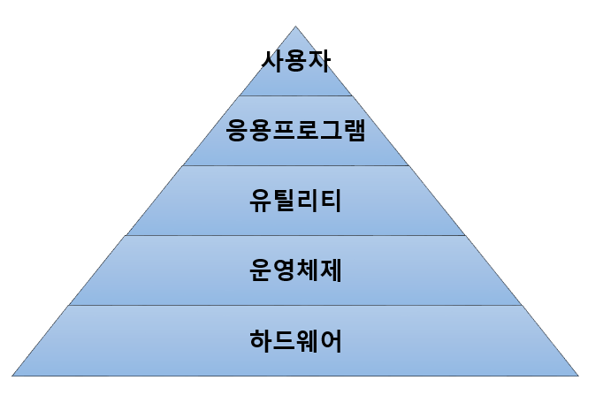
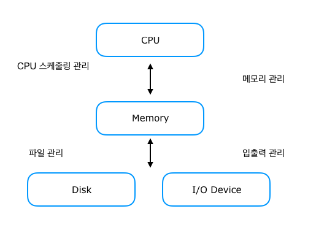

# 운영체제 (Operation System)

> 컴퓨터 시스템의 자원들을 효율적으로 관리하며, 사용자가 컴퓨터를 편리하고, 효과적으로 사용할 수 있도록 환경을 제공하는 여러 프로그램의 모임

운영체제는 커널과 시스템 프로그램으로 세분할 수 있다.

커널 이란 항상 메모리에 상주하면서 동작하는 운영체제의 핵심 부분으로 코어 (core) 또는 뉴클리어스(nucleus) 

시스템 프로그램은 라이브러리, 컴파일러, 파일 관련 명령어, 테스크 관련 명령어, 네트워크 관련 명령어, 시스템 관리 명령어 등으로 구성된다.

커날만 가지고 운영체제로서 의미가 없다.

즉, 사용자와 직접 상호 작용하는 시스템 프로그램이 없이는 아무런 일도 수행할 수 없다

## 운영체제 란

> 컴퓨터 사용자와 컴퓨터 하드웨어 간의 인터페이스

운영체제(Operating System)는 컴퓨터 시스템의 자원들을 효율적으로 관리하며, 사용자가 컴퓨터를 편리하고, 효과적으로 사용할 수 있도록 환경을 제공하는 여러 프로그램의 모임이다.

운영체제는 컴퓨터 사용자와 컴퓨터 하드웨어 간의 인터페이스로서 동작하는 시스템 소프트웨어의 일종으로,

다른 응용프로그램이 유용한 작업을 할 수 있도록 환경을 제공해준다.

## 커널이란

> 컴퓨터 하드웨어와 프로세스를 잇는 핵심 인터페이스
>
> 메모리에 상주하는 운영체제의 부분
>
> 자원 관리자, 관리하는 자원은 물리적인 자원, 추상적인 자원

컴퓨터와 전원을 켜면 운영체제는 이와 동시에 수행된다.

한편 소프트웨어가 컴퓨터 시스템에서 수행되기 위해서는 메모리에 그 프로그램이 올라가 있어야 한다.

마찬가지로 운영체제 자체도 소프트웨어로서 전원이 켜짐과 동시에 메모리에 올라가야 한다.

하지만, 운영체제처럼 규모가 큰 프로그램이 모두 메모리에 올라간다면 한정된 메모리 공간의 낭비가 심할 것이다.

따라서 운영체제 중 항상 필요한 부분만 전원이 켜짐과 동시에 메모리에 올려놓고 그렇지 않은 부분은 필요할 때 메모리에 올려서 사용하게 된다.

이 때 메모리에 상주하는 운영체제의 부분을 커널이라 한다.

또 이것을 좁은 의미의 운영체제라고도 한다.

즉 커널은 메모리에 상주하는 부분으로써 운영체제의 핵심적인 부분을 뜻한다.

이에 반에 넓은 의미의 운영체제는 커널뿐 아니라 각종 시스템을 위한 유틸리티들을 광범위하게 포함되는 개념이다

디바이스 관리, 프로세스 관리, 메모리 관리, 시스템 콜 제공과 같은 기능을 가지고 있다.

컴퓨터 자원을 관리해준다.

## 운영체제의 종류

Windows 98, Windows10, UNIX, LINUX, Android 등 이 있다.

단일 작업 처리 시스템에는 DOS

다중 작업 처리 시스템에는 WINDOWS, UNIX, LINUX 등이 사용되고

주로 WINDOWS는 개인용

UNIX, LINUX는 서버용 운영체제로 사용된다.

### 윈도우즈 9x 기반

마이크로소프트 사에서 만든 GUI 환경으로 된 PC 운영체제로 윈도우즈 95/98/ME 등이 있다.

### 윈도우즈 NT 기반

마이크로소프트 사에서 만든 운영체제로 클라이언트 - 서버 환경에서 서버로 동작하는 시스템에 사용될 목적으로 개발 되었으며 윈도우즈 2000/XP/2003/비스타 등이 있다.

### 윈도우즈 CE 기반

팜탑(palmtop) 컴퓨터와 개인 휴대 정보 단말기 (PDA)를 위한 운영체제

### 유닉스 (UNIX)

다중 사용자(mulit-user), 다중 작업(multi-tasking) 지원하여 기업의 서버 컴퓨터와 통신용 서버 컴퓨터 등으로 사용된다.

### 리눅스 (Linux)

프로그램 소스 코드가 무료로 공개되어 있는 개방형 운영체제

### 매킨토시 (Macintosh)

애플사에 의해 개발된 강력한 그래픽 기능을 가진 운영체제

## 운영체제의 목적

> 시스템 처리를 많이, 빠르게, 고장없이 ,정확하게 해결하기 위함

처리 능력 향상, 사용 가능도 향상, 신뢰도 향상, 반환 시간 단축 등이 있다.

처리능력, 반환시간, 사용가능도, 신뢰도는 운영체제의 성능을 평가하는 기준이 된다.

| 처리능력 (Throughput)          | 일정 시간 내에 시스템이 처리하는 일의 양                     |
| ------------------------------ | ------------------------------------------------------------ |
| **반환시간(Turn Around Time)** | **시스템에 작업을 의뢰한 시간 부터 처리가 완료될 때 까지 걸린 시간** |
| **사용가능도 (Availability)**  | **시스템을 고장 없이 사용할 수 있는지**                      |
| **신뢰도 (Reliabilty)**        | **시스템이 주어진 문제를 정확하게 해결하는 정도**            |

## 운영체제의 기능

> 운영체제의 핵심은 자원을 어떻게 효율적으로 관리할 것인가

1. 프로세서, 기억장치, 입출력장치, 파일 및 정보 등의 자원을 관리한다.
2. 자원을 효율적으로 관리하기 위해 자원의 스케줄링 기능을 제공한다.
3. 사용자와 시스템 간의 편리한 인터페이스를 제공한다.
4. 시스템의 각종 하드웨어와 네트워크를 관리, 제어 한다.
5. 데이터를 관리하고, 데이터 및 자원의 공유 기능을 제공한다.
6. 시스템의 오류를 검사하고 복구한다.
7. 자원 보호 기능을 제공한다.
8. 입 출력에 대한 보조 기능을 제공한다.
9. 가상 계산기 능력을 제공한다.

> **※ 가상 계산기란?**
>
> 한대의 컴퓨터를 여러 대의 컴퓨터 처럼 보이게 하는 가상 컴퓨터 운영체제에 의해 만들어지며 사용자의 관점에서는 가상 컴퓨터가 실제 컴퓨터처럼 보일 수도 있고 아주 다르게 보일수도 있다.

## 운영체제의 주요 자원관리

> 운영체제의 핵심은 자원을 어떻게 효율적으로 관리할 것인가

| 자원          | 기능                                                         |
| ------------- | ------------------------------------------------------------ |
| 프로세스 관리 | 1. 프로세스 스케줄링 및 동기화 관리 담당                     |
|               | 2. 프로세스 생성과 제거, 시작과 정지, 메시지 전달 등의 기능 담당 |
| 기억장치 관리 | 프로세스에게 메모리 할당 및 회수 관리 담당                   |
| 주변장치 관리 | 입 출력 장치 스케줄링 및 전반적인 관리 담당                  |
| 파일 관리     | 파일의 생성과 삭제, 변경, 유지 등의 관리 담당                |

운영체제의 핵심은 자원을 떻게 효율적으로 관리할 것인가 이다.

자원은 하드웨어, 소프트웨어 자원으로 나뉜다.

CPU는 통상적으로 컴퓨터 한대에 하나가 장착되기 때문에 여러 프로세스들이 CPU를 효율적으로 나누어 사용할 수 있도록 관리해야 한다.

CPU와 메모리는 전원이 꺼지면 처리 중이던 정보가 모두 사라지기 때문에 전원이 나가도 기억해야 하는 부분은 보조기억장치에 파일 형태로 저장된다.

이러한 파일들이 저장되는 방식 및 접근 권한 등에 대해서 운영체제가 관리를 해주어야 한다.

## 운영체제 자원 관리

### 물리적인 자원 (physical resource)

COU, 메모리, 디스크, 터미널, 네트워크 등의 시스템을 구성하는 요소들과 주변 장치 등

### 추상화적인 자원 (abstract resource)

물리적인 자원을 운영체제가 관리하기 위해 추상화 시킨 객체들이다.

대표적인 추상적 자원에는 CPU를 추상화 시킨 테스크(task), **테스크 관리자**

메모리를 추상화시킨 세그먼트와 페이지, **메모리 관리자**

디스크를 추상화시킨 파일, **파일 시스템**

네트워크를 추상화시킨 통신 프로토콜, 패킷 등이 있다. **네트워크 관리자**

물리적인 자원에 대응하지 않으면서 추상적인 객체로만 존재하는 자원들 => 보안, 사용자 ID에 따른 접근 제어 등 

디바이스 드라이버를 통해 일관되게 접근하도록 해주는 **디바이스 드라이버 관리자**

### CPU 관리

CPU 스케줄링

#### 선입선출 (First Come First Served)

>  먼저 CPU를 사용하기 위해 도착한 프로세스를 먼저 처리해주는 방식

이는 일상생활에서 줄서기하는 것과 같다.

이 방법을 사용하면 먼저 CPU를 요청한 프로세스가 작업이 끝날 때 까지 다른 프로세스들은 작업을 할 수 없다.

이 방법은 cPU는 효율저긍로 계속 작업은 할 수 있으나 전체적인 프로세스를 처리하는 면에서는 비효율적인 방법

#### 라운드 로빈 (Round Robin)

> CPU를 한 번 할당받아 사용할 수 있는 시간을 일정한 고정된 시간으로 제한

선입선출의 방법을 보안하고자 나온 방법이 라운드 로빈 스케줄링이다.

이 기법에서는 CPU를 한 번 할당받아 사용할 수 있는 시간을 일정한 고정된 시간으로 제한한다.

긴 작업이 필요한 프로세스가 CPU를 할당받더라도 정해진 시간이 지나면 CPU를 내어놓고 CPU의 서비스를 기다리는 줄의 제일 뒤에서 기다려야 한다.

이렇게 되면 뒤의 프로세스들이 무작정 오래 기다려야 하는 상황은 막을 수 있다.

#### 우선순위 (Priority)

> 수행 대기중인 프로세스들에게 프로그램에 따라 우선순위를 부여하고 우선순위가 높은 프로세스에게 CPU를 먼저 할당

수행 대기중인 프로세스들에게 프로그램에 따라 우선순위를 부여하고 우선순위가 높은 프로세스에게 CPU를 먼저 할당하게 된다.

또한 지나치게 오래 기다리는 프로세스가 발생하지 않도록, 기다린 시간이 늘어날 수록 우선순위를 점차 높어주는 방안도 사용되어 질수 있다.

### 메모리 관리

#### 고정 분할 (fixed partion)

물리적 메모리를 몇 개의 영구적인 분할로 나눈다.

나뉜 각각의 분할에는 하나의 프로그램이 적재된다.

이 방식은 단순해서 분할의 크기보다 큰 프로그램은 적재가 불가능하다.

이렇기 떄문에 메모리의 효율적인 사용 측면에서도 바람직하지 않다.

#### 가변 분할 (variable partion)

매 시점 프로그램의 크기에 맞게 메모리를 분할해서 사용하는 방식이다.

따라서 분할의 큰 프로그램의 실행이 제한되는 문제는 발생하지 않는다.

그러나 물리적 메모리 크기보다 더 큰 프로그램의 실행은 여전히 불가능하다.

#### 가상 메모리 (virtual memory)

최근에 거의 모든 컴퓨터 시스템에서 사용하는 메모리 관리 기법이다.

가상 메모리 기법에서는 물리적 메모리보다 더 큰 프로그램이 실행되는 것을 지원한다.

이 때 실행될 수 있는 프로그램의 크기는 가상 메모리의 크기에 의해 결정된다.

운영체제는 물리적인 주소와 가상 메모리에 주소를 매핑하여 관리한다.

실제 이렇게 가상 메모리를 할당할 수 있게 하는 것은 실행되지 않는 부분의 프로그램을 보조디스크에 두었다가 필요할 때 메모리에 적재하는 방식이다.

이때 보조 기억장치에서 사용되는 부분을 스왑 영역이라 한다.

### 주변 장치 및 입출력 장치

CPU나 메모리와 달리 인터럽트라는 메커니즘을 통해 관리한다.

주변 장치들은 CPU의 서비스가 필요한 경우에 신호를 발생시켜 서비스를 요청하게 되는데 이 때 발생시키는 신호를 인터럽트라고 한다.

CPU는 평소에 CPU 스케줄링에 따라 자신에게 주어진 작업을 수행하고 있다가 인터럽트가 발생하면 하던 일을 잠시 멈추고 인터럽트에 의한 요청 서비스를 수행하게 된다.

주변 장치들은 각 장치마다 그 장치에서 일어나는 업무에 대한 관리를 위한 일종의 작은 CPU를 가진다.

이를 컨트롤러라고 하는데 이 컨틀롤러를 바탕으로 무언가 입력이 되면 CPU에게 인터럽트를 발생시켜 보고하는 역할을 한다.

그러면 CPU는 하던 일을 잠시 멈추고 인터럽트에 대한 처리를 하기 위해 운영제체로 할당이 넘어간다.

## 운영체제의 운용기법 종류

운영체제에는 여러가지 운용기법들이 존재하는 데 크게 7가지가 존재한다.

오늘날 사용하는 OS의 운용기법은 주로 **다중 모드 처리** 방식과 **분산 처리 시스템** 방식을 사용한다.

### 일괄처리 시스템

초기의 컴퓨터 시스템에서 사용된 형태로, 일정량 또는 일정 기간 동안 데이터를 모아서 한꺼번에 처리하는 방식이다.

작업 준비 시간을 줄이기 위해 처리할 여러 개의 작업들을 일정 기간 또는 일정량이 될 떄까지 모아 두었다가 한꺼번에 처리하는 방식이다.

1. 일괄처리를 위해 적절한 작업 제어 언어 (Job Control Language)를 제공해야 한다.
2. 컴퓨터 시스템을 효율적으로 사용할 수 있다.
3. 반환시간 (Turn Around Time)이 늦지만 하나의 자겅ㅂ이 모든 자원을 독점하므로 CPU 유휴 시간이 줄어든다.
4. 급여 계산, 지불 계산, 연말 결산등의 업무에 사용된다.

### 다중 프로그램밍 시스템

다중 프로그래밍 시스템(Multi-Programming System)은 하나의 CPU와 주기억장치를 이용하여 여러개의 프로그램을 동시에 처리하는 방식이다.

1.  하나의 주기억장치에 두 개 이상의 프로그램을 기억시켜 놓고, 하나의 CPU와 대화 하면서 동시에 처리한다.
2. CPU의 사용률과 처리량이 증가한다.

### 시분할 시스템

시분한 시스템(time Sharing System)은 여러 명의 사용자가 사용하는 시스템에서 컴퓨터가 사용자들의 프로그램을 번갈아가며 처리해줌으로써 각 사용자에게 독립된 컴퓨터를 사용하는 느낌을 주는 것으로, 라운드 로빈 (Round Robin)방식이라고도 한다.

1. 여러 사용자가 각자의 단말장치를 통하여 동시에 운영체제와 대화하면서 각자의 프로그램을 실행한다.
2. 하나의 CPU는 같은 시점에서 여러 개의 작업을 동시에 수행할 수 없기 때문에, CPU의 전체 사용시간을 작은 작업 시간량으로 쪼개어 그 시간량 동안만 번갈아가면서 CPU를 할당하여 각 작업을 처리한다.
3. 다중 프로그래밍 방식과 결합하여 모든 작어비 동시에 진행되는 것처럼 대화식 처리가 가능하다.
4. 시스템의 전체 효율은 좋아지나 개인별 사용자 입장에서는 반응 속도가 느려질 수 있다.
5. 각 장업에 대한 응답 시간을 최소한으로 줄이는 것을 목적으로 하며, 하드웨어를 보다 능률적으로 사용할 수 있다.

### 다중처리 시스템

다중 처리 시스템(Multi-Processing System)은 여러개의 CPU와 하나의 주기억장치를 이용하여 여러 개의 프로그램을 동시에 처리하는 방식이다.

1. 하나의 CPU가 고장나더라도 다른 CPUI를 이용하여 업무를 처리 할 수 있으므로 시스템의 신뢰성과 안정성이 높다.
2. 여러 CPU는 하나의 메모리를 공유하여 단일 운영체제에 의해 관리된다.
3. 프로그램의 처리 속도는 빠르나 기억장치, 입출력장치 등의 자원 공유에 대한 문제점을 해결해야 한다.

### 실시간 처리 시스템

실시간 처리 시스템(Real Time Processing System)은 데이터 발생 즉시, 또는 데이터 처리 요구가 있는 즉시 처리하여 결과를 산출하는 방식이다.

1. 처리시간이 단축되고, 처리 비용이 절감된다.
2. 우주선 운행, 교통 제어, 레이더 추적기, 핵물리학 실험 및 데이터 수집, 전화교란장치의 제어, 은행의 온라인 업무 등 시간에 제한을 두고 수행되어야 하는 작어베 주로 사용된다.

### 다중 모드 처리

다중 모드 처리 (Multi-Mode processing)은 일괄 처리 시스템, 시분할 시스템, 다중 처리 시스템, 실시간 처리 시스템을 한 시스템에서 모두 제공하는 방식이다.

### 분산 처리 시스템

분산 처리 시스템(Distributed Processing System)은 여러개의 컴퓨터 (프로세서)를 통신 회선으로 연결하여 하나의 작업을 처리하는 방식이다.

각 단말장치나 컴퓨터 시스템은 고유의 운영체제와 CPU, 메모리를 가지고 있다.

> **※ 운영체제의 운용기법의 발달과정**
>
> 1세대 : 일괄처리 시스템
>
> 2세대 : 다중프로그래밍 시스템, 다중 처리 시스템, 시분할 시스템, 실시간 처리 시스템
>
> 3세대 : 다중모드
>
> 4세대 분산 처리 시스템

---

참고 사이트

운영체제란 무엇인가? 블로그 : https://coding-factory.tistory.com/300?category=760717

다양한 운영체제의 운용기법 종류 블로그 : https://coding-factory.tistory.com/301?category=760717

운영체제와 커널이란? 블로그 : https://goodmilktea.tistory.com/23
