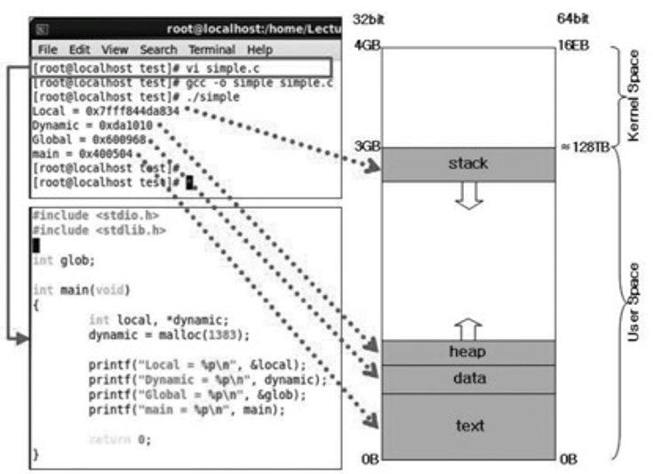
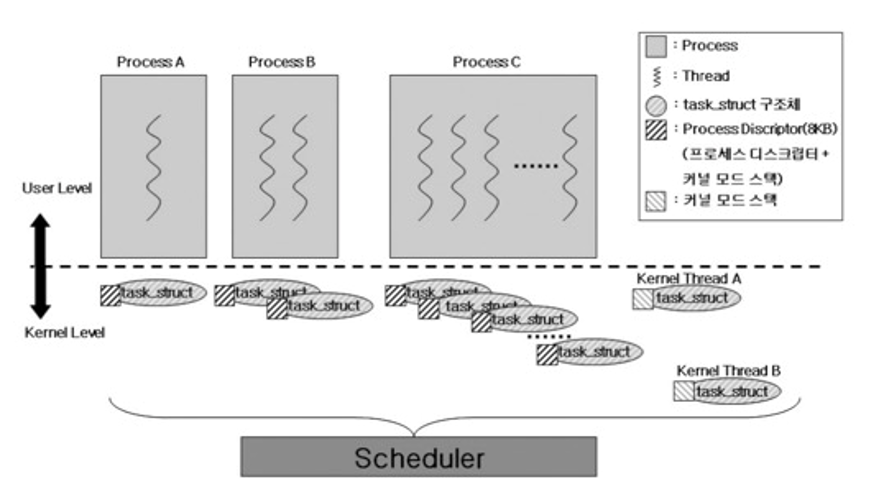
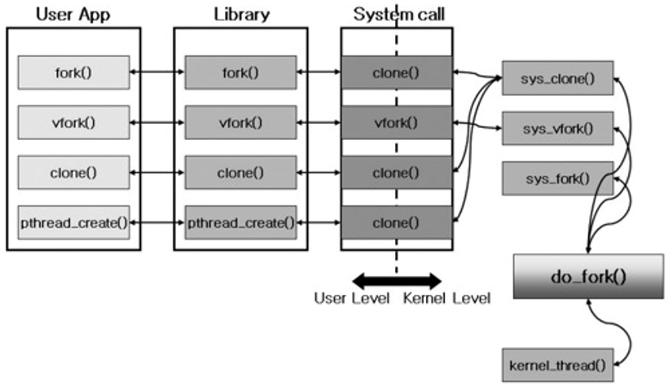

# 태스크(task) 관리

> 태스크를 통해 다양한 생명과 변화를 제공한다.
>
> 태스크의 정의, 구조, 생성과 수행, 문맥 교환, 리눅스 특유의 쓰레드 지원기법과 스케줄링 정책


## 프로세스, 쓰레드, 태스크

태스크(task)란 무엇일까?

태스크를 '자원소유권의 단위'

쓰레드를 '수행의 단위'

프로세스 '동작중인 프로그램 (running, runnable program)' 으로 이 때 프로그램은 디스크에 저장되어 있는 실행 가능한 형태의 파일이다.

실행 가능한 형태의 파일은 컴파일 과정을 거쳐 얻어진 바이너리 기계 명령어와 수행에 필요한 자료들의 집합으로 구성된다.


실행 파일 자체는 그저 디스크에 저장되어 있는 수동적인 존재에 불과하다.

파일 형태로 존재하고 있는 프로그램이 수행되기 위해서는 리눅스 커널로부터 CPU 등의 자원을 할당받을 수 있는 동적인 객체가 되어야 한다.

이 동적인 객체가 프로세스이다.


프로세스는 동작중인 프로그램이며, 커널로부터 할당받은 자신만의 자원을 가지고 CPU가 기계어 명령들을 실행함에 따라 끊임없이 변화하는 동적인 존재이다.

커널이 시스템에 존재하는 여러 개의 프로세스 중 CPU라는 자원을 어느 프로세스에게 할당해 줄 것인가를 결정하는 작업을 스케줄링이라고 부른다.


## 프로세스 구조

> 텍스트, 데이터, 스택, 힙 이라는 네 영역 으로 구분




텍스트 영역에는 CPU에서 직접 수행되는 명령어가,

데이터 영역에는 전역변수가 들어 있다.

스택 영역에는 지역변수와 인자 그리고 함수의 리턴 주소 등이 존재한다.

힙 영역에는 동적 할당받은 내용이 존재한다.

이 때 각 영역은 세그먼트 (segment) 또는 가상 메모리 객체 (vm_area_struct) 라고 부른다.


32bit 환경에서 운영체제는 각 프로세스들에게 각각 4GB(=2의 32제곱 bit, 가상메모리의 개념이다.)의 가상 주소 공간을 할당해준다.

| 4(GB)              |                                                         | kernel space |
| ------------------ | ------------------------------------------------------- | ------------ |
|                    |                                                         |              |
| 3(GB)    **stack** | 지역변수, 인자, 함수의 리턴 주소 등이 존재, 아래로 자람 | user space   |
| ↓                  |                                                         |              |
| ↑                  |                                                         |              |
| heap               | 동적 할당받은 내용이 존재, malloc/free 위로 자람        |              |
| data               | 젼역변수 등이 들어있음                                  |              |
| 0B    text         | CPU에서 직접 수행되는 명령어 (명령, 함수)               |              |

​				*각 영역은 세그먼트, 가상메모리 객체 라고 부른다.*


프로세스가 생성되면 가상 주소 공간을 포함하여 모든 자원들이 새로이 할당된다.

프로세스의 경우 자신을 생성해준 부모와는 서로 독립적인 관계를 가진다.

하지만 쓰레드 생성의 경우 같은 가상 주소 공간을 공유하게 된다.


```c
#include <sys/types.h>
#include <unistd.h>
#include <stido.h>
#include <stdib.h>

int g = 2;

int main(void)
{
	pid_t pid;
    int l = 3;
    
    printf("PID(%d): Parent g=%d, l=%d \n", getpid(), g, l);
    
    if((pid=fork())<0) {
        perror("fork error");
        exit(1);
    } else if(pid ==0){
        g++;
        l++;
    } else {
        wait();
    }
    
    printf("PID(%d): Parent g=%d, l=%d \n", getpid(), g, l);
    
    return 0;
}
```

```
#Linux

[root@localhost ]# gcc -o fork fork.c
[root@localhost ]# ./fork
PID(10404): Parent g=2, l=3
PID(10405): g=3, l=4
PID(10404): g=2, l=3
```

*프로세스 생성*		fork는 프로세스 생성


위 프로그램은 전역변수 g, 지역변수 l 을 가지고 있으며 fork() 함수를 통해 새로운 프로세스를 생성한다.

10404번 pid를 가지는 부모 프로세스가 10405 번  pid를 가지는 자식 프로세스를 생성했고, 전역, 지역 변수를 각각 1씩 증가시켰고 3,4로 증가되어 출력되었다.

반면 부모 프로세스에서 g와 l 변수 값을 출력하면 원래 2,3이 출력된다.


이를 통해 프로세스가 생성되면 주소 공간을 포함하여 이 프로세스를 위한 모든 자원들이 새로이 할당됨을 알 수 있고, 자식 프로세스의 연산 결과는 자식 프로세스 주소 공간의 변수에만 영향을 줄 뿐 부모 프로세스 주소 공간의 변수에는 영향이 없으며, 지역변수, 전역 변수 등의 값이 다르게 출력된 것이다. 


```c
#include <unistd.h>
#include <stido.h>
#include <stdib.h>
#include <sched.h>

int g = 2;

int sub_func(void *arg)
{
    g++;
    printf("PID(%d): Child g=%d \n", getpid(), g);
    sleep(2);
    
    return();
}

int main(void)
{
	int pid;
    int child_stack[4096];
    int l=3;
    printf("PID(%d): Parent g=%d, l=%d \n", getpid(), g, l);
    clone (sub_func, (void *)(child_stack+4095), CLONE_VM | CLONE_THREAD | CLONE_SIGHAND, NULL);
    sleep(1);
    printf("PID(%d): Parent g=%d, l=%d \n", getpid(), g, l);
    return ();
}
```

```
#Linux

[root@localhost ]# gcc -o clone clone.c
[root@localhost ]# ./clone
PID(17351): Parent g=2, l=3
PID(17351): Child g=3
PID(17351): Parent g=3, l=3
```

*쓰레드 생성*		clone은 쓰레드 생성


이 프로그램도 우선 기존 프로세스가 자신의 pid, 전역 변수 g, 지역 변수 l의 초기 값을 출력한다.

결과는 17351, g, l은 각각 2,3이 출력되었다.

그 이후 clone()을 호출하여 새로운 쓰레드를 생성한다.

이 쓰레드는 sub_func() 이라는 함수를 수행한 후 종료 한다.

sub_func() 함수는 g값을 증가 시키고 pid와 g 값을 출력한다.

이 프로그램은 새로운 쓰레드를 생성한 것이며, 새로운 프로세스를 생성한 것이 아니다.

그리고 쓰레드는 자신을 생성한 태스크와 동일한 pid를 갖는다. 따라서 출력된 pid는 17351, g 값은 3이다.

그리고 이 쓰레드는 함수의 끝을 만나 종료되고 1초간 잠들었던 기존의 쓰레드는 깨어나 자신의 pid, g, l 값을 출력한다.

이 때 g 값이 기존 2가 아닌 3으로 바뀌었다.

즉, 기존에 수행되던 쓰레드는 자신이 생성한 쓰레드가 변수를 수정하면 그 수정된 결과를 그대로 볼 수 있는 것이다.


프로세스와 쓰레드 생성을 통해 알 수 있는 것

1. 새로운 프로세스를 생성하면, 생성된 프로세스 (자식프로세스)와 생성한 프로세스(부모 프로세스)는 서로 다른 주소 공간을 갖는다. 반면 새로운 쓰레드를 생성하면 생성된 쓰레드 (자식 쓰레드)와 생성한 쓰레드 (부모 쓰레드)는 서로 같은 주소 공간을 공유한다.
2. 같은 프로세스에서 새로운 쓰레드를 생성할 경우 기존 쓰레드와 생성된 다른 쓰레드가 함께 동작하고 있는 것으로 볼 수 있다. 즉, 한 프로세스에 2개의 쓰레드가 동작한다. 한 프로세스에 여러 쓰레드가 동작하는 모델을 다중 쓰레드 시스템이라고 한다. 쓰레드 생성은 새로이 모든 자원을 생성해 주어야 했던 프로세스에 비해 새성이 드는 비용이 비교적 적다.
3. 자식 쓰레드에서 결함이발생하면 부모 쓰레드로 전파된다. 반면 자식 프로세스에서 발생한 결함은 부모 프로세스에게 전파되지 않는다. 쓰레드는 모델은 지원공유, 프로세스 모델은 결함 고립에 적합한 프로그램밍 모델


```c
#include <sys/types.h>
#include <unistd.h>
#include <stido.h>
#include <stdib.h>

int main(void)
{
	pid_t pid;
    int exit_status;
    
    if((pid=fork())<0){
        perror("fork error");
        exit(1);
    } else if(pid ==0){
        printf("Before exec \n");
        execl("./ fork", "fork", (char *)0);
        printf("After exec \n");
    } else {
        pid =wait(&exit_status);
    }
    
    printfc("Parent \n");
    return ();
}
```

```
#Linux

[root@localhost ]# gcc -o fork_exec fork_exec.c
[root@localhost ]# ./fork_exec
Before exec
PID(17453): Parent g=2, l=3
PID(17454): g=3, l=4
PID(17453): g=2, l=3
Parent
```

*프로세스 수행*


우선 fork()로 새로운 프로세스를 생성하고, 새성된 프로세스에서 "Before exec" 라는 문자열을 출력한다.

execl()를 호출하여 *프로세스 생성*  바이너리 파일을 수행한다.

그 결과 *프로세스 생성* 에서 출력되었던 내용이 출력된다. (단, 이 때 부모 프로세스와 자식 프로세스의 pid는 달라졌다. 이는 수행 시기마다 pid를 동적으로 할당하기 떄문이다.)

그리고 "After exec"라는 문자열은 출력되지 않았다.

이는 execl()이 성공적으로 수행되면 프로세스의 수행 이미지 (텍스트, 데이터, 스택 등) 가 기존의 것 (여기서는 *프로세스 수행*) 에서 새로운 것 (여기서는 *프로세스 생성*)으로 바뀌며, 이 때문에 After exec를 출력하는 printf()는 수행되지 않게 된다.


fork(), vfork()는 둘 다 프로세스를 생성한다. 

fork()는 부모 프로세스의 주소 공간을 복사하여 자식 프로세스의 주소 공간을 따로 만들지만,

vfork()의 경우 일단은 같은 주소 공간을 가르킨다.

이 때 execl()가 자식 프로세스에서 호출되었다고 가정해 보면, execl()는 기존에 사용하던 프로세스의 주소 공간을 모두 없애고, 요청된 바이너리를 기반으로 새로운 주소 공간을 생성한다. fork() 이후 바로 execl()이 되었다면 결국 fork() 때 수행했던 부모 프로세스의 주소 공간을 복사하여 자식 프로세스의 주소 공간을 따로 만들어 주었단 작업이 불필요한 작업이 되고 만다.

이 단점을 해결하기 위해 제공되는 것이 vfork() 이다.


## 태스크 모델



프로세스는 자신이 사용하는 자원과 그 자원에서 수행되는 수행 흐름으로 구성된다.

리눅스에서는 이를 관리하기 위해 각 프로세스마다 task_struct라는 자료 구조를 생성한다.


프로세스 A가 새로운 프로세스 D를 생성한다고 가정(프로세스 구조 - *프로세스 생성*)해보자.

자원을 의미하는 사각형이 하나 그려지고 (생성) 이 자원에서는 수행되는 수행의 흐름을 의미하는 실선이 하나 생성된다.

리눅스 에서는 task_struct 자료 구조가 하나 생성되어 이를 관리하게 된다.


만일 프로세스에서 새로운 쓰레드를 하나 생성하면 어떻게 될까? (프로세스 구조 - *쓰레드 생성*)

사각형은 그대로 있고, 내부에 새로운 수행 흐름을 의마하는 실선이 하나 더 생성된다. (프로세스 B)

리눅스에서는 새로운 쓰레드를 위해 task_struct 자료 구조를 하나 더 생성한다.


결국 리눅스에서는 프로세스가 생성되든, 쓰레드가 생성되는 task_struct 라는 동일한 자료 구조를 생성하여 관리한다.

리눅스 커널은 프로세스, 쓰레드 중 어떤 것이 요청 되든 모두 task_struct 자료 구조로 동일하게 관리한다.

단지 task_struct 자료 구조 중에서 수행 이미지를 공유하는가, 같은 쓰레드 그룹에 속해 있는가 등의 여부에 따라 프로세스, 또는 쓰레드로 사용자에게 해석되는 차이가 있을 뿐이다.

리눅스는 1:1 모델을 기반으로 한다. 즉 사용자 수준에서 쓰레드를 생성하면 그 쓰레드의 존재를 커널도 안다는 것이다. (n : 1 모델은 사용자 수준 쓰레드 n개에 커널 수준 자료구조 1개가 대응되므로, 사용자 수준 쓰레드 생성을 커널이 모를 수 있다.)


이러한 구현은 기존의 운영체제와 다른 리눅스 특유의 태스크 개념이다.

프로세스가 수행되려면 자원 (resource)과 수행 흐름 (flow of control)이 필요한데, 기존 운영체제들은 자원을 태스크로 제어 흐름을 쓰레드러 정의 하였다.

반면 리눅스에서는 프로세스던 쓰레드 던 커널 내부에서는 태스크 라는 객체로 관리된다.

태스크가 관리하는 자원을 어떻게 공유하고 접근 제어하느냐에 따라 프로세스를 해석될 수도 있고 쓰레드로 해석될 수도 있는 것이다.




사용자의 프로세스 혹은 쓰레드 생성 요청은 라이브러리를 거쳐 시스템 호출을 통해 리눅스 커널에 전달된다.

전달되는 제어 흐름은 그림과 같다. 

fork(), clone(), pthread_create()는 커널에 구현되는 sys.cclone() 시스템 호출을 사용하며,

vfork()는 sys_vfork()를 사용한다.

sys_clone(), sys_vfork()는 모두 커널 내부 함수인 do_fork()를 호출한다.


fork()는 프로세스를 생성하는 함수이고, clone()은 쓰레드를 생성하는 함수인데, 커널 내부에서 마지막으로 호출되는 함수 do_fork()로써 동일하다.

왜 그럴까?

리눅스 입장에서 본다면 모두 '태스크'를 생성하기 때문이다.


fork()는 비교적 부모 태스크과 덜 공유하는 태스크이고,

clone()으로 생성되는 태스크는 비교적 부모 태스크와 많이 공유하는 태스크이다.

즉, do_fork()를 호출할 때 이 함수의 인자로 부모 태스크와 얼마나 공유할지를 정해 줌으로 fork(), clone() 함수 둘 다를 지원 할 수 있는 것이다.


do_fork는 어떤 일을 수행할까?

새로 생성되는 태스크를 위해 일종의 이름표를 하나 준비한다.

이름표에 새로 생성된 태스크의 이름, 태어난 시간, 부모님 이름, 소지품 등의 매우 자세한 정보를 기록해둔다.

그러면 나중에 새로 생성된 태스크를 쉽게 찾고 그 태스크의 정보를 알 수 있을 것이다.

바로 이 '이름표' 라는 것을 리눅스 용어로 바꾸면 tast_struct 구조체 이다.

그런 뒤 이 태스크가 수행되기 위해 필요한 자원 등을 할당한 뒤 수행 가능한 상태로 만들어준다.


일반적으로 말하는 프로세스이던, 쓰레드이던, 커널 내부에서 생성하는 커널 쓰레드이던 간에 리눅스에선 모두 tast_struct 구조체로 표현된다.

그렇다면 사용자들은 어떤 조건이 만족될 때 태스크를 프로세스, 쓰레드 라고 부를까?


시스템에 존재하는 모든 태스크는 유일하게 구분이 가능해야 한다.

태스크 별로 유일한 이 값은 tast_struct 구조체 내의 pid 필드에 담겨 있다.

하지만 POSIX 표준에 의하면 '한 프로세스 내의 쓰레드는 동일한 PID를 공유해야 한다.' 라고 명시 되어 있다.

리눅스에선 이를 위해 tgid(Thread Group ID)라는 개념을 도입했다.


태스크가 생성되면 이 태스크를 위한 유일한 번호를 pid로 할당해 준다.

그런 뒤 만약 사용자가 프로세스를 원하는 경우라면 새성된 태스크의 tgid 값을 새로 할당된 pid 값과 동일하게 넣어준다. 따라서 tgid 값도 유일한 번호를 갖게 된다.

사용자가 쓰레드를 원하는 경우라면 부모 쓰레드의 tgid 값과 동일한 값으로 생성된 태스크의 tgid를 성정한다.


결국 부모 태스크와 자식 태스크는동일한 tdig를 갖게 되며 동일한 프로세스에 속해 있는 것으로 해석된다.


```c
#include <unistd.h>
#include <stido.h>
#include <stdib.h>
#include <linux/unistd.h>

int main(void)
{
	int pid;
    
	printf("before fork \n \n");
    
    if((pid= fork())<0){
        printf("fork error \n");
        exit(-2);
    } else if(pid ==0){
        printf("TGID(%d),PID(%d) : Child \n", getpid(), syscall(_NR_gettid));
    } else {
        printf("TGID(%d),PID(%d) : Parent \n", getpid(), syscall(_NR_gettid));
    	sleep(2);
    }
    
    printf("after fork \n \n");
    
    return 0;
}
```

```
#Linux

[root@localhost ]# gcc -o fork_pt fork_pt.c
[root@localhost ]# ./fork_pt
before fork

TGID(17560), PID(17560) : Parent
TGID(17651), PID(17651) : Child
after fork

after fork

```

*fork, pid, tgid*


```c
#include <unistd.h>
#include <stido.h>
#include <stdib.h>
#include <linux/unistd.h>

int main(void)
{
	int pid;
    
	printf("before vfork \n \n");
    
    if((pid= vfork())<0){
        printf("fork error \n");
        exit(-2);
    } else if(pid ==0){
        printf("TGID(%d),PID(%d) : Child \n", getpid(), syscall(_NR_gettid));
        _exit(0);
    } else {
        printf("TGID(%d),PID(%d) : Parent \n", getpid(), syscall(_NR_gettid));
    }
    
    printf("after vfork \n \n");
    
    return 0;
}
```

```
#Linux

[root@localhost ]# gcc -o vfork_pt vfork_pt.c
[root@localhost ]# ./vfork_pt
before vfork

TGID(17585), PID(17585) : Child
TGID(17584), PID(17584) : Parent
after vfork

```

*vfork, pid, tgid*


fork(), vfork() 에서는 각 태스크의 pid와 tgid가 부모 태스크와 자식 태스크 간에 서로 다른 것을 알 수 있다.

즉 사용자 입장에서는 서로 다른 프로세스가 만들어 진것이다.


```c
#include <unistd.h>
#include <stido.h>
#include <stdib.h>
#include <linux/unistd.h>

void*t_function(void *data)
{
    int id;
    int i=0;
    pthread_t t_id;
    id = *((int *)data);
    printf("TGID(%d), PID(%d), pthread_self(%d) : Child \n", getpid(), syscall(_NR_gettid),pthread_self());
    
    sleep(2);
}

int main(void)
{
	int pid, status;
    int a = 1;
    int b = 2;
    pthread_t p_thread[2];
    printf("before pthread_create \n n ");
    if((pid = pthread_create(&p_thread[0], NULL, t_function, (void*)&a)) < 0){
        perror("thread create error : ");
        exit(1);
    }
     if((pid = pthread_create(&p_thread[1], NULL, t_function, (void*)&b)) < 0){
        perror("thread create error : ");
        exit(2);
    }
    
	pthread_join(p_thread[0], (void **)&status);
    printf("pthread_join(%d) \n", status);
    pthread_join(p_thread[1], (void **)&status);
    printf("pthread_join(%d) \n", status);
    printf("TGID(%d), PID(%d) : Parent \n", getpid(),syscall(_NR_gettid));
    return 0;
}
```

```
#Linux

[root@localhost ]# gcc -o pthread_pt pthread_pt.c -lpthread
[root@localhost ]# ./pthread_pt
before pthread_create

TGID(17672), PID(17673), pthread_self(356116224) : Child
TGID(17672), PID(17674), pthread_self(347723520) : Child
pthread_join(0)
pthread_join(0)
TGID(17572), PID(17672) : Parent
```

*pthread, pid, tgid*


반면 pthread_create() 에서는 각 ㄱ태스크의 pid는 서로 다르지만 tgid는 서로 돌일함을 알 수 있다.

즉 같은 프로세스 내부에 2개의 서로 다른 쓰레드가 생성된 것이다.


```c
#include <unistd.h>
#include <stido.h>
#include <stdib.h>
#include <linux/unistd.h>
#include <sched.h>

int sub_func_b(void *arg)
{
	printf("TGID(%d), PID(%d): Child \n", getpid(), syscall(_NR_gettid));
    sleep(2);
    return 0;
}

int main(void)
{
	int pid;
    int child_a_stack[4096], child_b_stack[4096];
    
    printf("before clone \n \n");
   	printf("TGID(%d), PID(%d): Parent \n", getpid(), syscall(_NR_gettid));
    
    clone (sub_func, (void *)(child_a_stack+4095), CLONE_CHILD_CLEARTID | CLONE_CHILD_SETTID, NULL);
    
    clone (sub_func, (void *)(child_a_stack+4095), CLONE_VM | CLONE_THREAD | CLONE_SIGHAND, NULL);
    
    sleep(1);
    
    printf("after clone \n \n");
    return 0;
}
```

```
#Linux

[root@localhost ]# gcc -o clone_pt clone_pt.c
[root@localhost ]# ./clone_pt
before clone

TGID(17750), PID(17750) : Parent
TGID(17750), PID(17752) : Child
TGID(17751), PID(17751) : Child
after clone

```

*clone, pid, tgid*


clone()을 이용해 프로세스와 쓰레드를 만드는 예

clone()의 인자로 CLONE_CHILD_CLEARID와 CLONE_CHILD_SETTID를 설정하면 리눅스 커널은 태스크를 생성할 때 프로세스로 해석 될 수 있도록 자원 공유가 되지 않는 형태로 생성하며, 

clone()의 인자로 CLONE_THREAD를 설정하면 태스크를 생성 할 때 쓰레드로 해석될 수 있도록 자원 공유가 되는 형태로 생성한다.


task_struct 내의 tgid 값을 출력하는 함수(실제 task_struct의 pid)는 getpid() 함수이다.


---

PID (Process Identification Number) : 프로세스 각각을 구별할 수 있는 유일한 데이터


PPID (Parent Process Identification Number) : 프로세스를 만든 부모 프로세스의 PID를 나타내는 값, 프로그램을 실행한 프로세스의 PID가 PPID로 할당된다.


UID(User ID), GID(Group ID) : 프로세스에 저장되는 UID, GID는 프로세스를 실행한 사용자의 UID와 GID가 저장된다. 사용자는 오직 하나의 UID를 가질 수 있지만 사용자가 속한 그룹은 크게 기본 그룹과 보조 그룹으로 나뉜다. 프로세스에 할당되는 GID는 사용자의 기본 그룹의 GID가 저장되고, 사용자가 실행한 프로세스가 아닌 부모 프로세스가 만든 자식 프로세스인 경우 부모 프로세스의 UID와 GID가 새로운 프로세스의 UID와 GID로 저장된다.


EUID(Effective User ID), EGID(Effective Group ID) : 프로세스에는 또 하나의 UID와 GID가 저장되어 있는데, 그 UID, GID는 실행한 사용자의 정보를 담는 UID와 구별하기 위하여 EUID (effective user ID), EGID (effective group ID) 라고 부른다.

UID, GID는 프로그램을 실행한 사용자의 정보를 담고 EUID, EGID는 프로세스가 파일에 대해서 가지는 권한을 나타낸다. 파일의 권한을 읽기, 쓰기, 실행으로 나누어 관리하는데, EUID, GUID는 각각의 프로세스가 시스템에 있는 파일에 대해서 이러한 권한 중 어떤 것을 가지고 있느냐를 나타내는 용도로 사용한다.

일반적으로 대부분의 프로세스는 UID, EUID가 동일한 값을 가지고 있으나, 일부 특별한 ㅡㅍ로세스는 두 가지 값이 서로 다른 값을 가지고 있기도 한다.


참고 책

리눅스 커널 내부구조 - 백승재, 최종무 공저


참고 사이트

태스그 관리 - 1 블로그 :  https://hayeol.tistory.com/8?category=485140

프로세스의 구성요소-PID,PPID,UID,GID,EUID,EGID : https://ttend.tistory.com/688

