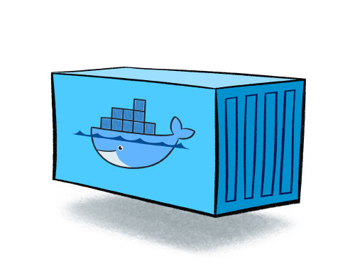

# Docker

> 다양한 프로그램을 쉽게 배포 관리하기 위한 플랫폼

도커는 컨테이너 기반의 오픈소스 가상화 플랫폼이다.

다양한 프로그램, 실행환경을 컨테이너로 추상화하고 동일한 인터페이스를 제공하여 프로그램의 배포 및 관리를 단순하게 해준다.

백엔드 프로그램, DB 서버, 메시지 큐등 어떤 프로그램도 컨테이너로 추상화할 수 있고 조립PC, AWS, Azure, Goolge cloud 등 어디에서든 실행 할 수 있다.

## Container

> 격리된 공간에서 프로세스가 동작하는 기술

컨테이너는 격리된 공간에서 프로세스가 동작하는 기술이다.

가상화 기술의 하나지만 기존 방식과는 차이가 있다.

기존의 가상화 방식은 주로 OS를 가상화 하였다.

VMware나 VirtualBox 같은 가상머신은 호스트 OS위에 게스트 OS 전체를 가상화하여 사용하는 방식인데,

이 방식은 여러가지 OS를 가상화 할 수 있고 비교적 사용법이 간단하지만 무겁고 느려서 운영환경에선 사용 할 수 없다.

이러한 상황을 개선하기 위해 CPU의 가상화 기술(HVM)을 이용한 KVM(Kernel-based Virtual Machine)과

반가상화(Paravirtualization) 방식의 Xen이 등장한다.

이러한 방식은 게스트 OS가 필요하긴 하지만 전체 OS를 가상화하는 방식이 아니였기 때문에 호스트형 가상화 방식에 비해 성능이 향상 된다.

전가상화든, 반가상화든 추가적인 OS를 설치하여 가상화하는 방법은 어째든 성능문제가 있어 이를 개선하기 위해 프로세스를 격리하는 방식이 등장한다.

리눅스에서는 이 방식을 리눅스 컨테이너라고 하고 단순히 프로세스를 격리시키기 때문에 가볍고 빠르게 동작한다.

하나의 서버에 여러 개의 컨테이너를 실행하면 서로 영향을 미치지 않고 독립적으로 실행되어 마치 가벼운 VM을 사용하는 느낌을 준다.

## Image

> 컨테이너 실행에 필요한 파일 등 모든 정보를 담고 있음

이미지는 컨테이너 실행에 필요한 파일과 설정값등을 포함하고 있는 것으로 상태값을 가지지 않고 변하지 않는다.

컨테이너 이미지를 실행한 상태라고 볼 수 있고 추가되거나 변하는 값은 컨테이너에 저장된다.

같은 이미지에서 여러개의 컨테이너를 생성 할 수 있고 컨테이너의 상태가 바뀌거나 컨테이너가 삭제되더라도 이미지는 변하지 않고 그대로 남아 있는다.

ex)

ubuntu 이미지 = ubuntu를 실행하기 위한모든 파일을 가지고 있음

MySQL 이미지 = debian을 기반으로 MySQL을 실행하는 데 필요한 파일과 실행 명령어, 포트 정보 등을 가지고 있음

이미지는 컨테이너를 실행하기 위한 모든 정보를 가지고 있기 때문에 더 이상 의존성 파일을 컴파일하고 이것저것 설치할 필요가 없다.

새로운 서버가 추가되면 미리 만들어 놓은 이미지를 다운받고 컨테이너를 생성만 하면 된다.

---

출처 :  https://subicura.com/2017/01/19/docker-guide-for-beginners-1.html#%EC%84%9C%EB%B2%84%EB%A5%BC-%EA%B4%80%EB%A6%AC%ED%95%9C%EB%8B%A4%EB%8A%94-%EA%B2%83

