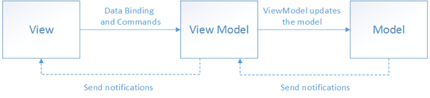

# MVVM 패턴

> Model + View + View Model
>
> 각각의 역할을 나눠 코드 관리를 하자

비즈니스 로직과 프레젠테이션 로직을 UI로 부터 깔끔하게 분리

View는 UI와 UI 로직을 다룬다.

ViewModel은 프레젠테이션 로직과 View를 위한 상태를 다룬다.

Model은 비즈니스 로직과 데이터를 다룬다.

- MVVM을 잘 사용한다는 것의 의미 : Model, ViewModel의 역할과 책임을 잘 이해한다는 것

## MVVM Conponents

- Model : 데이터와 데이터를 가져오는 로직 자체, 특히 MVVM 패턴에서의 Model은 domain 모델을 나타내는데, domain 모델이란, 소프트웨어로 해결하고자 하는 문제 영역을 개념적으로 표현한 것
- View : 사용자에게 화면으로 보여지는 모든 구조, 레이아웃, View는 model을 시작적으로 표현하고, 사용자의 상호작용을 받는다. View는 data binding을 통해 이러한 입력을 View Model에게 전달한다.
- ViewModel : View에 보여져야하는 데이터와 명령들을 가지고 있다. ViewModel이 MVC 패턴의 Controller 나 MVP 패턴의 Presenter와 다른 점은, View가 ViewModel을 observe(관찰) 하는 형태로 binding 되어 있기 때문에, data의 갱신을 View가 자동으로 받을 수 있게 되어 있다

View는 ViewModel을 알지만

ViewModel은 View를 알지 못한다.

ViewModel은 Model을 알지만

Model은 ViewModel을 알지 못한다.

이런 구조를 통해서 ViewModel과 Model이 View로 부터 독립적인 형태를 만들어서 UI로 부터 비즈니스 로직과 프레젠테이션 로직을 분리 라는 목적을 이룰 수 있다.

### View

> UI 관련된 것을 다루는 것 

View의 역할은 UI에 관련된 것을 다루는 것이다.

사용자가 스크린을 통해서 보는 것들에 대한 구조, 레이아웃, 형태를 정의하는 것이다.

View는 애니메이션 같은 UI 로직음 포함하되 비즈니스 로직을 포함하지 말아야 한다.

### ViewModel

> View가 사용할 메서드와 필드를 구현

ViewModel의 역할은 View가 사용할 메서드와 필드를 구현하고, View에게 상태 변화를 알리는 것이다. (View는 ViewModel의 상태 변화를 observing) 

ViewModel에서 제공하는 메서드와 필드가 UI에서 제공할 기능을 정의한다.

하지만, View가 이 기능을 어떻게 보여줄 것인지를 결정한다.

일반적으로 ViewModel과 Model은 1:N 관계를 형성한다.

ViewModel은 View가 쉽게 사용할 수 있도록 Model의 데이터를 가공해서 View에게 제공한다.

ex) View에서 서로 다른 두 Model의 데이터를 활용한 데이터가 필요하다면 View에서 Model의 값을 조작해서 사용하는 것이 아니라, ViewModel에서 두 Model의 데이터를 가공하고 View에서는 오직 UI만 다루도록 한다. 

### Model

> 비즈니스 로직과 유효성 검사와 데이터를 포함하는 앱의 도메인 모델

Model은 비즈니스 로직과 유효성 검사와 데이터를 포함하는 앱의 도메인 모델로 생각 할 수 있다.

쉽게 말해, 모델은 앱에서 사용할 데이터에 관련된 행위와 데이터를 다룬다.

## MVVM 동작

1. 사용자의 Action들은 View를 통해 들어온다.
2. View에 Action이 들어오면, Command 패턴으로 ViewModel에 Action에 전달된다.
3. ViewModel은 Model에게 데이터를 요청한다.
4. Model은 ViewModel에게 요청받은 데이터를 응답한다.
5. ViewModel은 응답받은 데이터를 가공하여 저장한다.
6. View은 ViewModel과 Data Binding하여 화면을 나타낸다.

## MVVM 장점

- View Model이 Model과 View 사이의 어댑터로서 변경이 생겼을 때 변경을 최소화 할 수 있다.
- Model과 ViewModel이 View로 부터 독립적이다.
  - ViewModel과 Model을 플랫폼 독립적으로 개발 할 수 있다.
  - Test하기 쉽다.
- 개발 기간 동안 개발자와 디자이너가 동시에 독립적으로 (병렬로) 작업 할 수 있다.
  - UI 디자인이 나오지 않았더라도 미리 정의한 Model과 ViewModel을 먼저 개발할 수 있기 때문에 병렬적인 업무 프로세스가 가능하다.

- 코드 변경을 최소화 할 수 있다.

## MVVM 단점

- 거대하고 복잡한 앱을 위해서 고안된 디자인 패턴인 만큼, 소형 앱에서 사용하게 되면 오버헤드가 커진다.
- 앱이 너무 거대해지면 앱의 메모리 소모가 데이터 바인딩 때문에 커진다.

---

프레젠테이션 로직 : 보여주기 위한 로직, 즉 화면상의 디자인 구성을 위한 로직

비즈니스 로직 : 어떠한 특정한 값을 얻기 위해 데이터의 처리를 수행하는 로직

도메인 모델 : 특정 문제와 관련된 모든 주제의 개념 모델

참고 사이트

https://velog.io/@k7120792/Model-View-ViewModel-Pattern

https://salix97.tistory.com/266

https://beomy.tistory.com/43