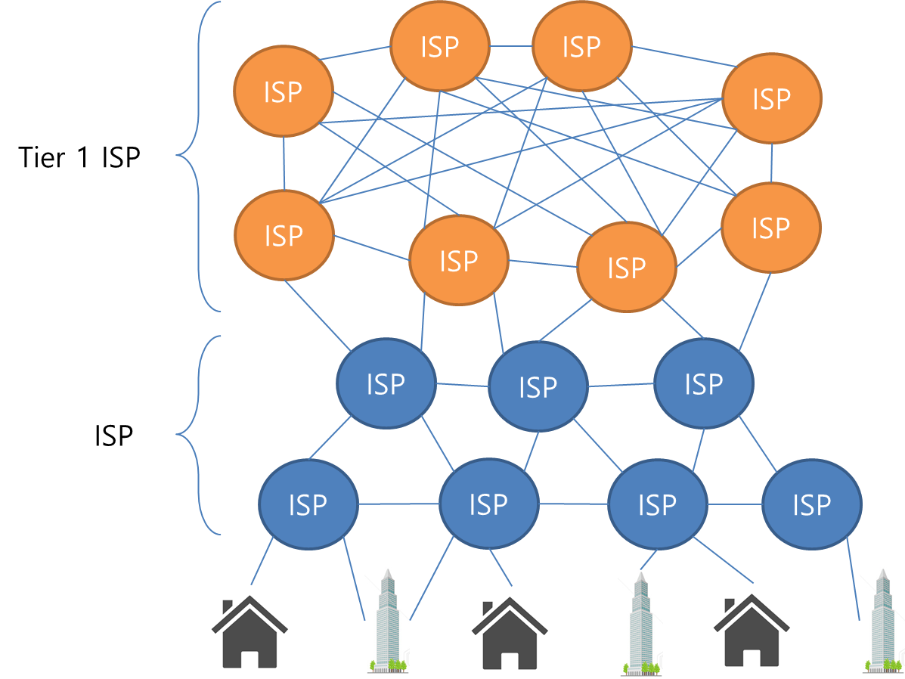

# AS (Autonomous System)

누구나 이용할 수 있는 인터넷은 전 세계의 다양한 조직이 관리하는 네트워크가 연결된 것이다.

그 조직의 네트워크를 **AS(Autonomous System)** 라고 부른다.

AS의 구체적인 예는 ISP(인터넷 서비스 프로바이더 : 고유한 라우팅 정책을 가지고 있음), 정부(공공)기관, 회사, 단체 등, Google이나 Amazon 등 인터넷 상에서 서비스를 제공하는 기업 네트워크도 AS이다.

ISP의 상위 그룹을 Tier1 이라고 부른다. 한국에서는 KT, SK, LG가 Tier 1이다.

Tier1 이외의 ISP는 최종적으로는 Tier1에 연결되어 자신이 관리하지 않는 네트워크의 정보도 입수한다.

결국, **인터넷 상에 모든 ISP는 Tier1을 경유해서 연결**된다.

 ## 인터넷 접속

ISP와 계약하고 가정이나 사내 네트워크의 라우터를 ISP의 라우터와 연결하면, 인터넷을 이용 할 수 있다.

라우터를 통하지 않고 토느북이나 스마트폰 등을 ISP의 라우터와 접속하는 방법도 있다.

ISP의 라우터와 접속하기 위해서는 고정회선 또는 모바일 회선을 이용할 수 있다.

|                | 고정 회선                                            |
| -------------- | ---------------------------------------------------- |
| 전용선         | 통신 속도는 보장되지만 비용이 비싸다.                |
| 전화회선(ADSL) | 전화회선을 이용해 저가에 인터넷에 접속 할 수 있다.   |
| 광케이블(FTTH) | 광케이블을 이용해 고속으로 인터넷에 접속 할 수 있다. |
| 케이블 TV 회선 | 케이블 TV 회선을 인터넷 접속에도 이용한다.           |

|                     | 모바일 회선                                                  |
| ------------------- | ------------------------------------------------------------ |
| 휴대전화망 (4G LTE) | 휴대전화망을 이용한 광역 인터넷 접속이 가능하다.             |
| WiMAZ / WiMAX2 회선 | WiMAX망을 이용한 광역 인터넷 접속이 가능하다.                |
| 무선 LAN (Wi-Fi)    | Wi-Fi 액세스 포인트의 제한된 범위에서 인터넷에 접속 할 수 있다. |

---

라우터 : 컴퓨터 네트워크 간에 데이터 패킷을 전송하는 네트워크 장치

https://2infinity-and-beyond.tistory.com/7

