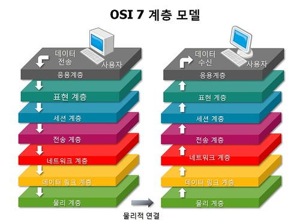
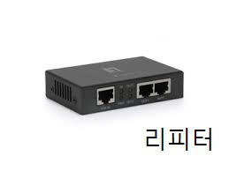
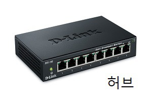

# OSI 7 계층 (OSI 7 Layer)

> 통신이 일어나는 과정을 7단계로 나누어 흐름을 파악하기 쉽도록 만든 표준이다.

1. OSI 7계층은 통신의 과정을 7단계로 나눈 것으로, 종단간 통신에서 트래픽의 흐름을 파악하기 쉽다.
2. 네트워크 구성 요소를 표준화함으로써 장비 개발과 지원의 표준이 된다.
3. 또한 독립적인 계층으로 이루어져 있어서 문제해결이 용이하다.

**계층별 요약**

1. 물리 계층
   - 케이블, 리피터, 허브를 통해 bit 흐름을 전송하며, 단지 데이터를 전달할 뿐이다.
2. 데이터 링크 계층
   - 프레임에 MAC 주소를 부여해 브리지나 스위지를 통해 안전하게 정보를 전달한다.
3. 네트워크 계층
   - 라우터, Layer3 스위치와 같은 장비를 통해 IP 주소 부여, 경로 설정을 수행하고, 경로에 따라 패킷을 전달한다.
4. 전송 계층
   - TCP, UDP 같은 프로토콜을 통하여 패킷 생성 및 전송을 담당하고, 종단간 데이터 전달의 유효성이나 효율성을 책임진다.
5. 세션 계층
   - TCP/IP 세션을 만들고 없애는 책임을 지며, 데이터가 통신하기 위한 논리적인 연결을 담당한다.
6. 표현 계층
   - 데이터가 Text 인지, GIT인지, JPG인지 등을 구분하는 등, 포장, 압축, 암호화 와 같은 코드 간의 번역을 담당한다.
7. 응용 계층
   - HTTP, FTP와 같은 프로토콜이 속하며, 네트워크 소프트웨어 UI 부분과 같이 일반적인 응용 서비스를 수행한다.

> Open Systems Interconnection Reference, 국제표준화기구 ISO 에서 개발한 모델로, 컴퓨터 내 네트워크 프로토콜 디자인과 통신을 계층으로 나누어 설명한 것이다.

> 흐름을 한 눈에 알아보기 쉽다. 7단계 중 특정한 곳에 이상이 생기면 다른 단계의 장비 및 SW를 건드리지 않고도 이상이 생긴 단계만 고칠 수 있다.

컴퓨팅 장치, 네트워킹 장치를 만들 떄 OSI 참조 모델을 참조해서 모든 통신장치를 만들게 된다.

계층 하나하나가 모듈화 되어 있다.

- 네트워크에서 트래픽의 흐름을 꿰뚫어 볼 수 있다.
- 용이성, 유지관리의 수월성이 있다.
- 각 계층은 독립되어 있다.
- 네트워크 구성 요소를 표준화함으로써 타업체의 장비 개발과 지원이 가능해진다.
- OSI는 개방된 시스템, 시스템 간의 상호연결성을 부여하는 표준이다.

- 물리 계층 : 하드웨어
- 데이터 링크 계층 : 하드웨어 + 소프트웨어
- 네트워크 계층 부터 : 소프트웨어

- 상위층
  - 7. 응용계층 : Message
  - 6. 표현계층 : Message
  - 5. 세션계층 : Message
- 하위층
  - 4. 전송계층 : Segment
  - 3. 네트워크 : Packet
  - 2. 데이터링크 : Frame
  - 1. 물리 : bit

**상하구조가 가지는 문제해결의 용이성**

상위 계층의 프로토콜이 제대로 동작하기 위해서는 하위 모든 계층에 문제가 없어야 한다.

즉 7 계층이 제대로 동작하려면 1~6 계층이 모두 완벽히 문제가 없어야 한다.

예를 들어 ping은 네트워크 계층에 속하는 프로그램이고, ping이 잘 수행되고 이상이 없다면, 네트워크 계층까지는 모두 이상이 없다는 것이다.

이와 같이 어디서 문제가 발생했는지 좀 더 용이하게 체크할 수 있고, 모듈 별로 독립적으로 처리가 가능하다.

## 계층1 : 물리계층

> 네트워크의 기본 네트워크 하드웨어 전송 기술을 이룬다.
>
> 네트워크의 높은 수준의 기능의 논리 데이터 구조를 기초로 하는 필수 계층이다.
>
> 다양한 특징의 하드웨어 기술이 접목되어 있기에 OSI 아키텍처에서 가장 복잡한 계층으로 간주된다.

- 주로 전기적, 기계적, 기능적인 특성을 이용해 통신 케이블로 데이터를 전송한다.
- 사용되는 통신 단위는 비트 (1,0으로 나타내고 전기적으로 On, Off 상태) 이다.
- 단지 데이터를 전달만 한다. (데이터가 무엇이고, 어떤 에러가 있는지 관여하지 않는다.)
- 케이블, 리피터, 허브를 통해 데이터를 전송한다.
- 물리매체를 통해 bit 흐름을 전송한다.

## 계층2 : 데이터 링크 계층

> 포인트 투 포인트 (Point to Point) 간 신뢰성 있는 전송을 보장하기 위한 계층이다.
>
> CRC 기반의 오류 제어와 흐름 제어가 필요하다.

- 물리계층을 통해 송수신되는 정보의 오류와 흐름을 관리한다.
- 이를 통해 안전한 정보의 전달을 수행할 수 있도록 하는 역할을 수행한다.
- MAC주소를 가지고 통신하게 된다.
- 전송되는 단위를 프레임 이라고 한다.
- 브릿지나 스위치를 통해 MAC 주소를 가지고 물리계층에서 받은 정보를 던달한다.
- 프레임에 주소부여 (MAC - 물리적 주소)
- 에러검출 / 재전송 / 흐름제어

포인트 투 포인트 (Point to Point) 간 신뢰성 있는 전송을 보장하기 위한 계층이다.

CRC 기반의 오류 제어와 흐름 제어가 필요하다.

주소값은 물리적으로 할당 받는데, 이는 네트워크 카드가 만들어질 떄 부터 맥 주소 (MAC address) 가 정해져 있다는 뜻이다.

주소 체계는 계층이 없는 단일 구조 이다.

데이터 링크 계층의 가장 잘 알려진 예는 이더넷 이다.

> 이 외에도 HDLC나 ADCCP 같은 포인트 투 포인트 (Point to Point) 프로토콜이나 패킷 스위칭 네트워크나 LLC, ALOHA 같은 근거리 네트워크용 프로토콜이 있다.
>
> 네트워크 브릿지나 스위치 등이 이 계층에서 동작하며, 직접 이어진 곳에만 연결할 수 있다.

## 계층3 : 네트워크 계층

> 여러 개의 노드를 거칠 때마다 경로를 찾아주는 역할을 하는 계층이다.
>
> 다양한 길의 데이터를 네트워크들을 통해 전달하고, 그 과정에서 전송 계층이 요구하는 서비스 품질 (QoS) 를 제공하기 위한 기능적, 절차적 수단을 제공한다.

- 주소부여 (IP)
- 경로설정(Route)
- 가장 중요한 기능 : 데이터를 목적지 까지 가장 안전하고 빠르게 전달하는 기능이다.
- 경로를 선택하고, 주소를 정하고, 경로에 따라 패킷을 전달한다.

네트워크 계층은

1. 라우팅
2. 흐름 제어
3. 세그멘테이션 (segmentation / desegmentation)
4. 오류 제어
5. 인터네트워킹 (Internetworking) 등을 수행한다.

라우터가 이 계층에서 동작하고, 이 계층에서 동작하는 스위치도 있다. (2계층의 장비 중 스위치라는 장비에 라우팅 기능을 장착한 Layer 3 스위치도 있다.)

데이터를 연결하는 다른 네트워크를 통해 전달함으로써 인터넷이 가능하게 만드는 계층이다.

논리적인 주소 구조 (IP), 곧 네트워크 관리자가 직접 주소를 할당하는 구조를 가지며, 계층적 (hierarchical)이다.

> 서브네트의 최상위 계층으로 경로를 설정하고, 청구 정보를 관리한다.
>
> 개방형 시스템들의 사이에서 네트워크 연결을 설정, 유지, 해제하는 기능을 부여하고, 전송 계층 사이에 네트워크 서비스 데이터 유닛 (NSDU : Network Service DAta Unit)을 교환하는 기능을 제공한다.

## 계층4 : 전송 계층

> 종단간 (End to End) 통신을 다루는 최하위 계층으로 종단간 신뢰성 있고 효율적인 데이터를 전송하며, 기능은 오류 검출 및 복구와 흐름제어, 중복검사 등을 수행한다.

- 패킷 생성
  - Assembly
  - Sequencing
  - Deassembly
  - Error detection
  - Request repeat
  - Flow control
- 패킷 전송
- 통신을 활성하기 위한 계층이다.
- 포트를 열어 응용프로그램들이 전송을 할 수 있게 해준다.
- 만약 데이터가 왔다면 4계층에서 해당 데이터를 하나로 합쳐서 5계층으로 보내준다.
- 이 계층까지 물리적인 계층에 속한다.

양 끝단 (End to End)의 사용자들이 신뢰성 있는 데이터를 주고 받을 수 있도록 한다.

상위 계층들이 데이터 전달의 유효성이나 효율성을 생각하지 않도록 해준다.

전송 계층은 특정 연결의 유효성을 제어하고, 일부 프로토콜은 상태 개념이 있고 (stateful), 연결 기반(connection oriented)이다.

이는 전송 계층이 패킷들의 전송이 유효한지 확인하고 전송 실패한 패킷들이 다시 전송한다는 것을 뜻한다.

가장 잘 알려진 전송 계층의 예는 TCP 이다.

종단간 (End to End) 통신을 다루는 최하위 계층으로 종단간 신뢰성 있고 효율적인 데이터를 전송하며, 기능은 오류 검출 및 복구와 흐름제어, 중복검사 등을 수행한다.

## 계층5 : 세션 계층

> 양 끝단의 응용 프로세스가 통신을 관리하기 위한 방법을 제공

- 동시 송수신 방식 (duplex)
- 반이중 방식 (half-duplex)
- 전이중 방식 (Full Duplex)
- 체크 포인팅
- 유휴
- 종류
- 다시 시작 과정 등을 수행
- TCP/ IP 세션을 만들고 없애는 책임을 진다.

데이터가 통신하기 위한 논리적인 연결을 말한다.

4 계층에서도 연결을 맺고 종료할 수 있기 때문에 우리가 어느 계층에서 통신이 끊어 졌나 판단하기는 한계가 있다.

그러므로 세션 계층은 4계층과 무관하게 응용 프로그램 관점에서 봐야 한다.

- 통신하는 사용자들을 동기화 하고, 오류복구 명령들을 일괄적으로 다룬다.
- 통신을 하기 위한 세션을 확립/ 유지 / 중단 (운영체제가 해줌)

## 계층6 : 표현 계층

> 코든 간의 번역을 담당하여 사용자 시스템에서 데이터의 형식상 차이를 다루는 부담을 응용 계층으로부터 덜어 준다.

코든 간의 번역을 담당하여 사용자 시스템에서 데이터의 형식상 차이를 다루는 부담을 응용 계층으로부터 덜어 준다.

MIME 인코딩이나 암호화 등의 동작이 이 계층에서 이루어 진다.

ex) 표현 계층의 몫

EBCDIC로 인코딩된 문서 파일 -> ASCII로 인코딩된 파일로 바꾸어주기

- 데이터 표현이 상이한 응용 프로세스의 독립성을 제공하고 ,암호화 한다.
- 사용자의 명령어를 완성 및 결과를 표현한다.
- 포장 / 압축 / 암호화
- 해당 데이터가 TEXT 인지, 그림읹, GIF 인지, JPG 인지의 구분 등이 표현 계층의 몫이다.

## 계층7 : 응용 계층

> 응용 프로세스와 직접 관계하여 일반적인 응용 서비스를 수행
>
> 일반적인 응용 서비스는 관련된 응용 프로세스들 사이의 전환을 제공

응용 프로세스와 직접 관계하여 일반적인 응용 서비스를 수행한다.

일반적인 응용 서비스는 관련된 응용 프로세스들 사이의 전환을 제공한다.

- 네트워크 소프트웨어 UI 부분
- 사용자의 입출력 (I/O) 부분

최종 목적지로서 HTTP, FTP, SMTP, POP3, IMAP, Telnet 등과 같은 프로토콜이 있다.

해당 통신 패킷들은 이와 같은 프로토콜에 의해 모두 처리되며 우리가 사용하는 브라우저나 메일 프로그램은 프로토콜을 보다 쉽게 사용하게 해주는 응용프로그램이다.

한 마디로 모든 통신의 양 긑단은 HTTP와 같은 프로토콜이지 응용프로그램이 아니다.

---

참고 사이트

OSI 7 Layer 란? 깃허브 : https://livlikwav.github.io/study/osi-7-layer/