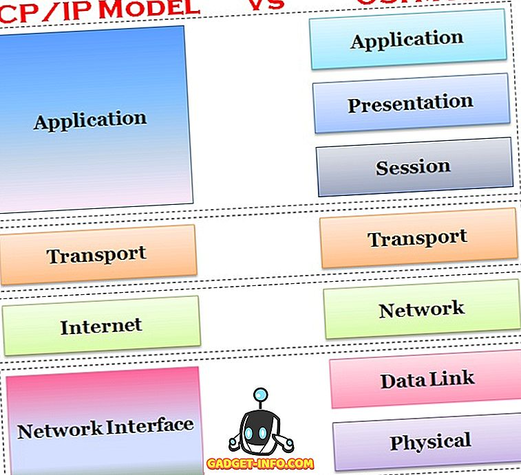

# OSI 모델과 TCP Stack의 차이

TCP / IP 및 OSI는 통신에 가장 널리 사용하는 두 가지 네트워크 모델이다.

그들 사이에 유사점과 비 유사점이 있다.

큰 차이점 중 하나는 OSI는 개념적 모델로 통신에는 실질적으로 사용되진 않지만

TCP/IP는 연결을 설정하고 네트워크를 통해 통신하는 데 사용된다.

## 비교 차트

| 비교의 근거     | TCP / IP 모델                                                | OSI 모델                                  |
| :-------------- | :----------------------------------------------------------- | :---------------------------------------- |
| 확장            | TCP / IP- 전송 제어 프로토콜 / 인터넷 프로토콜               | OSI- 개방형 시스템 상호 연결              |
| 의미            | 인터넷을 통해 데이터를 전송하는 데 사용되는 클라이언트 서버 모델입니다. | 컴퓨팅 시스템에 사용되는 이론 모델입니다. |
| 레이어 수       | 레이어 4 개                                                  | 레이어 7 개                               |
| ~~ 의해 개발 된 | 국방부 (국방부)                                              | ISO (국제 표준기구)                       |
| 명백한          | 예                                                           | 아니                                      |
| 용법            | 주로 사용됨                                                  | 사용되지 않음                             |

## TCP / IP 모델 정의

TCP (전송 제어 프로토콜) / IP (인터넷 프로토콜)는 국방부 프로젝트 대행사가 개발했다.

OSI 모델과 달리 4개의 레이어로 구성되어 있으며 각 레이어에는 프로토콜이 있다.

인터넷 프로토콜은 네트워크를 통한 통신을 위해 정의된 일련의 규칙이다.

TCP /  IP는 네트워킹을 통한 표준 프로토콜 모델로 간주된다.

TCP는 데이터 전송 및 IP 처리 주소를 처리한다.

TCP / IP 제품군은 TCP, UDP, ARP, DNS, HTTP, ICMP 등을 포함하는 프로토콜 집합이다.

강력하고 유연하여 주로 인터넷을 통해 컴퓨터를 상호 연결하는 데 사용된다.

**TCP / IP 계층**

- 응용 계층
- 전송 계층
- 인터넷 계층
- 네트워크 인터페이스 계층

## OSI 모델 정의

OSI (개방형 시스템 상호 연결) 모델은 ISO 에서 도입되었다.

프로토콜이 아니며 모델링 개념에 기반한 모델이다.

각각 다른 기능을 가진 수직 세트의 레이어를 가지고 있다.

데이터를 전송하는 상향식 접근 방식을 따른다.

강력하고 유연하지만 실체가 아니다.

**OSI 모델 계층**

- 응용 계층
- 표현 계층
- 세션 계층
- 전송 계층
- 네트워크 계층
- 데이터 링크 계층
- 물리 계층

## 공통점 / 차이점

- TCP / IP는 클라이언트 - 서버 모델이다(클라이언트가 서비스를 요청하면 서버가 제공). 반면 OSI는 개념 모델이다.
- TCP / IP는 인터넷을 포함한 모든 네트워크를 사용되는 표준 프로토콜이지만 OSI는 프로토콜이 아니라 시스템 아키텍처를 이해하고 설계하는 데 사용되는 참조 모델이다.
- TCP / IP는 4개의 계층 모델이며, OSI는 7개의 계층을 가지고 있다.
- TCP / IP는 실무적으로 널리 활용, OSI는 교육의 목적과 호환성의 기준이 된다.

### 공통점

|   구분    |         공통점          |           설명           |
| :-------: | :---------------------: | :----------------------: |
| 계층 역할 | – 캡슐화, 프로토콜 사용 |   – 계층 간 역할 정의    |
|           |   – 서비스 프리미티브   | – 요구, 지시, 응답, 확인 |
| 통신 역할 |   – 페이로드 전송기능   |   – APP 간 메시지 교환   |
|           |   - 다중화, 역다중화    |  – 포트 기반 세그먼트화  |

### 차이점

| 항목 |      OSI 7 Layer       |        TCP / IP        |
| :--: | :--------------------: | :--------------------: |
| 계층 |      – 7계층 모델      |      – 4계층 모델      |
| 구성 | – 역할 기반 계층 구성  | – 프로토콜의 집합 기반 |
| 기술 | – 통신전반 기술 표준화 | – 데이터 전송기술 특화 |
| 활용 | – 통신 모델 표준 제시  | – 실무적 통신기술 구현 |

### TCP/IP와 OSI를 연계한 활용 기술 / 특장점

|    구분     |                   활용 기술                    |                    특장점                    |
| :---------: | :--------------------------------------------: | :------------------------------------------: |
|  기반 기술  | – Ethernet, HDLC, PPP – OSPF, EIGRP, BGP, PBR  | – 프로토콜 개발 불필요 – 기기 개발 집중 가능 |
| 리스크 감소 | – STP, VRRP, LACP, GLBP – Troubleshooting 활용 |  – 벤더 간 HA 호환성 – 빠른 장애 처리 가능   |

----

참고 사이트

TCP / IP 와 OSI 모델 차이점 : https://ko.gadget-info.com/difference-between-tcp-ip

OSI 7 Layer, TCP/IP 비교 블로그 : http://blog.skby.net/osi-7-layer%EC%99%80-tcp-ip-%EB%B9%84%EA%B5%90/