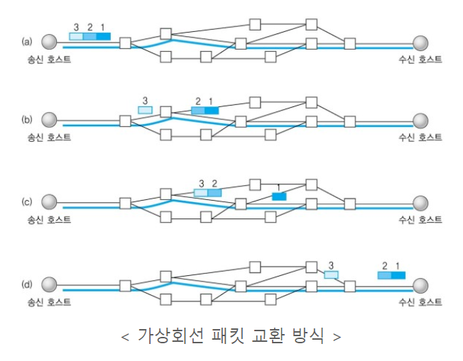
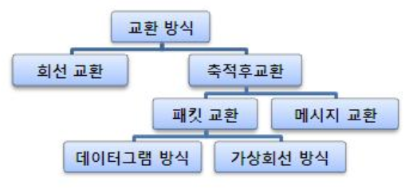

# TCP, UDP의 차이

> TCP와 UDP는 전송 계층에서 사용하는 데이터를 보내기 위해 사용하는 프로토콜이다.
>
> TCP와 UDP는 각각 가성 회선 방식과 데이터그램 방식이라는 점에서 차이를 가지며 신뢰성과 연속성 두 측면에서 상충 관계(trade off)에 있다.

1. TCP와 UDP는 둘 다 전송 계층에서 데이터를 보내기 위해 사용하는 프로토콜이다.
2. TCP는 연결형 서비스로 가상 회선 방식을 ㅔㅈ공하고, 높은 신뢰성을 보장하고 흐름 제어 및 혼잡 제어 기능을 제공한다.
3. UDP는 비연결형 서비스로 데이터그램 방식을 제공하고, 패킷에 순서 부여나 재조립등의 기능을 처리하지 않기 때문에 연속성이 중요한 서비스에 사용된다.

## 전송계층

TCP와 UDP, 네트워크의 계층들 중 전송 계층에서 사용하는 프로토콜이다.

전송계층은 송신자와 수신자를 연결하는 통신서비스를 제공하는 계층으로, 쉽게 말해 데이터의 전달을 담당한다.

데이터를 보내기 위해 사용하는 프로토콜이 있는데, 그것들이 바로 TCP, UDP 이다.

## TCP (Transmission Control Protocol)

> 전송을 제어하는 프로토콜로
>
> 인터넷 상에서 데이터를 메시지의 형태로 보내기 위해 IP와 함께 사용하는 프로토콜이다.

일반적으로 TCP와 IP를 함께 사용한다.

- IP : 데이터의 배달을 처리
- TCP : 패킷을 추적 및 관리

TCP는 연결형 서비스를 지원하는 프로토콜로 인터넷 환경에서 기본으로 사용한다.

**TCP 특징**

- 연결형 서비스로 가상 회선 방식을 제공한다.
- 3-way handshaking 과정을 통해 연결을 설정하고 4-way handshaking을 통해 해제한다.
- 흐름 제어 및 혼잡 제어
- 높은 신뢰성을 보장
- UDP 보다 속도가 느리다
- 전지웅 (Full-Duplex), 점대점 (Point to Point) 방식

가상 회선 방식을 제공한다는 것은 발신지와 수신지를 연결하여 패킷을 전송하기 위한 논리적 경로를 배정한다는 말이다.

tCP는 연결형 서비스로 신뢰성을 보장한다.

그래서 3-way handshaking 과정도 사용하고, 데이터의 흐름제어나 혼잡 제어와 같은 기능도 한다.

하지만 이러한 기능 때문에 UDP보다 속도가 느리게 된다. (이러한 기능들이 CPU를 사용하기 떄문)

**연속성보다 신뢰성이 중요할 때 사용하는 프로토콜 이다.**

**TCP 서버의 특징**

- 서버소켓은 연결만을 담당한다.
- 연결과정에서 반환된 클라이언트 소켓은 데이터의 송수신에 사용되는 서비스로 가상 회선 방식을 제공한다.
- 서버와 클라이언트는 1:1 로 연결된다.
- 스트림 전송으로 전송 데이터의 크기가 무제한이다.
- 패킷에 대한 응답을 해야하기 때문에 (시간 지연, CPU 소모) 성능이 낮다.
- Streaming 서비스에 불리하다. (손실될 경우 재전송 요청을 하므로)

**패킷(Packet)**

인터넷 내에서 데이터를 보내기 위한 경로배정(라우팅)을 효율적으로 하기 위해 여러 개로 나눈 데이터의 조각

**TCP의 패킷 추적 및 관리**

데이터는 패킷단위로 나누어 같은 목적지(IP계층)으로 전송된다.

A,B,C 라는 패킷에 1,2,3 이라는 번호를 부여하여 패킷의 분실 확인과 같은 처리를 하여 목적지에서 재조립을 수행한다.

### 3-way Handshaking

> TCP/IP 프로토콜을 이용해서 통신을 하는 응용프로그램이 데이터를 전송하기 전에 먼저 정확한 전송을 보장하기 위해 상대방 컴퓨터와 사전에 세션을 수립하는 과정을 의미

장치들 사이에 논리적인 접속을 성립(establish)하기 위하여 3-way handshake를 사용한다.

TCP 3-way handshake는 TCP/IP 프로토콜을 이용해서 통신을 하는 응용프로그램이 데이터를 전송하기 전에 먼저 정확한 전송을 보장하기 위해 상대방 컴퓨터와 사전에 세션을 수립하는 과정을 의미한다.

- Client- > Server : TCP SYN
- Server- > Clinet : TCP SYN ACK
- Client -> Server : TCP ACK
- SYN = Synchronize Sequence Numbers
- ACK = Acknowledgment

**TCP의 3-way Handshaking 역할**

- 양쪽 모두 데이터를 전송할 준비가 되었다는  것을 보장
- 실제로 데이터 전달이 시작하기 전에 한쪽이 다른 쪽에 준비되었다는 것을 알림
- 양쪽 모두 상대편에 대한 초기 순차일련번호를 얻을 수 있도록 한다.

**TCP의 3-way Handshaking 과정**

1. A 클라이언트는 B서버에 접속을 요청하는 SYN 패킷을 보낸다. 이 때 A 클라이언트는 SYN을 보내고 SYN/ACK 응답을 기다리는 SYN_SENT 상태가 된다.
2. B 서버는 SYN 요청을 받고 A 클라잉너트에게 요청을 수락한다는 ACK와 SYN flag가 설정된 패킷을 발송하고 A가 다시 ACK으로 응답하기를 기다린다. 이 때 B 서버는 SYN_RECEIVED 상태가 된다.
3. A 클라이언트는 B서버에게 ACK를 보내고 이후로부터는 연결이 이루어지고 데이터가 오가게 되는 것이다. 이 떄 B 서버의 상태가 ESTABLISHED 이다.

### 4-way Handshaking

- 3-way Handshake는 TCP의 연결을 초기화 할 때 사용된다.
- 4-way Handshaking은 세션을 종료하기 위해 수행되는 절차이다.

**TCP의 4-way Handshaking 과정**

1. 클라이언트가 연결을 종료하겠다는 FIN플래그를 전송한다.
2. 서버는 일단 확인메시지를 보내고 자신의 통신이 끝날때까지 기다리는 데 이 상태가 CLOSE_WAIT 상태이다.
3. 서버가 통신이 끝났으면 연결이 종료되었다고 클라이언트에게 FIN플래그를 전송한다.
4. 클라이언트는 확인했다는 메시지를 보낸다.

TIME_WAIT

클라이언트는 서버로 부터 FIN을 수신하더라도 일정시간 (디폴트 240초) 동안 세션을 남겨 놓고 잉여 패킷을 기다리는 과정을 거치게 되는 데 이 과정을 "TIME_WAIT" 라고 한다.

서버에서 FIN을 전송하기 전에 전송한 패킷이 Routing 지연이나 패킷 유실로 인한 재전송 등으로 인해 FIN 패킷보다 늦게 도착하는 상황이 발생한다면 Client 가 이미 세션을 종료한 후라서 이 패킷들이 Drop 되거나 데이터는 유실되지 않도록 한다.

## UDP (User Datagram Protocol)

> 데이터를 데이터그램 단위로 처리하는 프로토콜

데이터그램이란 독립적인 관계를 지니는 패킷이다.

UDP는 TCP와 달리 비연결형 프로토콜이다.

즉, 연결을 위해 할당되는 논리적인 경로가 없다.

따라서 각각의 패킷은 다른 경로로 전송되고, 각각의 패킷은 독립적인 관계를 지니게 된다.

이러한 프로토콜을 UDP라고 한다.

**UDP 특징**

- 비연결형 서비스로 데이터그램 방식을 제공한다.
- 정보를 주고 받을 떄 정보를 보내거나 받는다는 신호절차를 거치지 않는다.
- UDP 헤더의 CheckSum 필드를 통해 최소한의 오류만 검출한다.
- 신뢰성이 낮다.
- TCP보다 속도가 빠르다.

UDP는 비연결형 서비스로 이므로, 연결을 설정하고 해제하는 과정이 존재하지 않는다.

패킷에 순서부여, 재조립, 또는 흐름제어나 혼잡제어와 같은 기능을 처리하지 않기 때문에 TCP보다 속도가 빠르고 네트워크 부하가 적다는 장점이 있다.

단점은 신뢰성있는 데이터의 전송을 보장하지는 못한다.

따라서 신뢰성보다 연속성이 중요한 서비스, 예를 들면 실시간 서비스(streaming)에 자주 사용된다.

**UDP 서버의 특징**

- UDP에는 연결 자체가 없어서 (connect 함수 불필요) 서버 소켓와 클라이언트 소켓의 구분이 없다.
- 소켓 대신 IP를 기반으로 데이터를 전송한다.
- 서버와 클라이언트는 1:1, 1:N, N:M 등으로 연결될 수 있다.
- 데이터그램(메시지) 단위로 전송되며 그 크기는 65535 바이트로, 크기가 초과하면 잘라서 보낸다.
- 흐름제어(flow control)가 없어서 패킷이 제대로 전송되었는지, 오류가 없는지 확인할 수 없다.
- 파일전송과 같은 신뢰성이 필요한 서비스보다 성능이 중요시되는 경우에 사용된다.

**흐름제어(Flow Control)와 혼잡제어 (Congestion Control)**

- 흐름제어 : 데이터를 송신하는 곳과 수신하는 곳의 데이터 처리 속도를 조절하여 수신자의 버퍼 오버플로우를 방지하는 것이다.
- 혼잡제어 : 네트워크 내의 패킷 수가 넘치제 증가하지 않도록 방지하는 것이다.
  - 정보의 소통량이 과다하면 패킷을 조금만 전송하여 혼잡 붕괴 현상이 일어나는 것을 막는다.

## TCP, UDP 비교

**교환방식 - 참고**

**TCP Flow**

**UDP Flow**

----

참고 사이트

TCP와 UDP의 차이 깃헙 : https://livlikwav.github.io/study/tcp-and-udp/