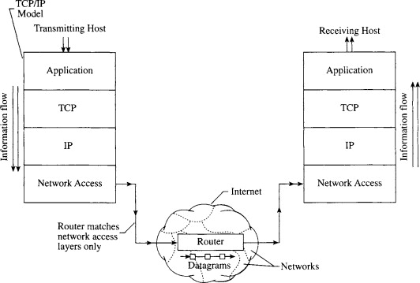

# TCP/IP

> TCP와 IP를 중심으로 하는 프로토콜의 집합, 네트워크의 공통 언어

PC와 스마트폰 등이 통신하는 규칙을 **프로토콜**이라고 하고, 

복수의 프로토콜을 조합한 것이 **네트워크 아키텍처**이다.

여러가지 네트워크 아키텍처가 있지만 가장 많이 사용되는 것이 TCP/IP 이다.

TCP/IP는 TCP와 IP를 중심으로 하는 프로토콜의 집합으로, 네트워크의 공통 언어이다.

PC나 스마트폰 등의 OS에도 TCP/IP가 내장되어 있고, TCP/IP로 통신하는 PC와 스마트폰, 각종 네트워크 기기 전반을 **호스트**라고 부른다.

## TCP/IP 계층 구조

> TCP/IP 4계층 : 네트워크 인터페이스 - 인터넷 - 트랜스포트 - 애플리케이션, 각 계층에 포함된 프로토콜을 조합해 애플리케이션이 통신한다.

TCP/IP에서는 네트워크를 통해 통신하기 위한 기능을 계층화하고 복수의 프로토콜을 조합하여 실현했다.

TCP/IP의 계층구조는 네트워크 인터페이스층, 인터넷층, 트랜스포트층, 애플리케이션층으로 모두 4계층이다. (OSI 7계층 참조)

 

4개 층의 프로토콜이 모두 정상적으로 제 기능을 해야 비로소 통신이 이루어 진다.

그리고, 어떤 계층이 기능을 발휘하려면, 그 하위 계층이 정상적으로 동작한다는 것을 전제로 한다.

## 네트워크 인터페이스 층

> 같은 네트워크 안에서 데이터를 전송하는 것

네트워크 인터페이스 층 역할은 같은 네트워크 안에서 데이터를 전송하는 것이다.

기술적인 관점에서는 하나의 네트워크는 라우터와 레이어3 스위치로 구획되는 범위, 또는 레이어2 스위치로 구성하는 범위

ex)

레이어2 스위치에 연결된 PC의 인터페이스에서 같은 레이어2 스위치에 연결된 다른 PC의 인터페이스 까지 데이터를 전송할 수있다.

그때, 0,1 의 디지털 데이터를 전기신호 등의 물리적 신호로 변환해 전송 매체로 전달해 진다.

네트워크 인터페이스층의 구체적인 프로토콜

**유선(이더넷), 무선 LAN(Wi-Fi),** PPP 등

네트워크 인터페이스 층의 프로토콜이 통신 상대와 같아야 할 필요가 없다.

## 인터넷 층

> 많은 네트워크 사이에서 데이터를 전송하는 역할 (원격지 네트워크 간 데이터를 전송)

많은 네트워크가 존재하고, 거기에 다양한 기기가 연결되는데, 인터넷층은 그 네트워크 사이에서 데이터를 전송하는 역할을 한다.

네트워크 끼리 연결하고 데이터를 전송하는 기기가 **라우터**이다.

라우터에 의한 네트워크 간 전송을 가리켜 **라우팅**이라고 한다.

원격지 네트워크에서 최종적인 출발지와 목적지 사이의 데이터 전송을 가리켜 **엔드투엔드 통신**이라고 한다.

인터넷 층의 구체적인 프로토콜

**IP**, ICMP, ARP

엔드투엔드 통신에 이용하는 프로토콜은 IP이고,

ICMP, ARP는 IP를 도와주는 프로토콜이다.

## 트랜스포트 층

> 데이터를 적절한 애플리케이션에 배분하는 일

최하층(네트워크 인터페이스층) 부터 트랜스포트층까지 바르게 동작하면, 출발지와 목적이 애플리케이션 간에 데이터를 송수신할 수 있게 된다.

TCP/IP 트랜스포트 층에 포함되는 프로토콜은 TCP, UPD 이다.

TCP를 이용하면 데이터가 유실되더라도 그 사실을 검출해 데이터를 다시 보내준다.

TCP에는 엔드투엔드의 신뢰성을 확보해 주는 기능이 있다.(Three handshake) 

그 밖에도 데이터의 분할과 조립 등도 있다.

## 애플리케이션 층

> 애플리케이션의 기능을 실행하기 위한 데이터의 형식과 처리 절차 등을 결정하는 것

단순한 0과 1이 아니라, 문자와 이미지 등 인간이 인식할 수 있도록 데이터를 표현

애플리케이션 층 프로토콜

HTTP, SMTP, POP3, DHCP, DNS 등등

HTTP는 Chrome, Edge 등등 웹브라우저에서 이용

SMTP, POP는 Outlook, Thunderbird 와 같은 전자메일 소프트웨어에서 이용

단, 애플리케이션층에 포함된 프로토콜이라고 해서 반드시 애플맄에이션에서 이용하는 것은 아니다.

DHCP, DNS는 애플리케이션의 통신을 준비하기 위한 프로토콜이다.