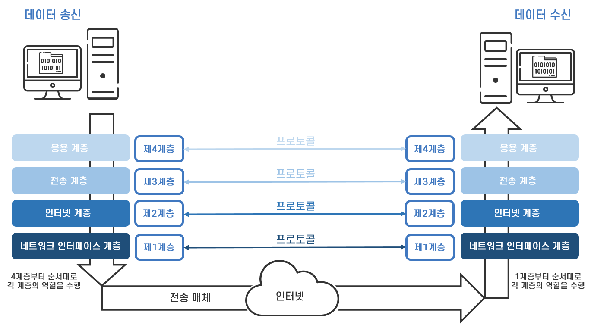
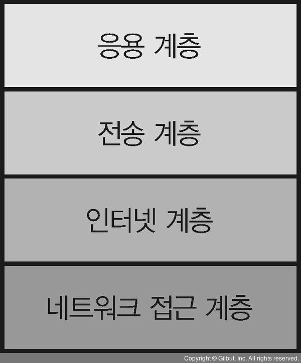

# 네트워크 아키텍처

> 컴퓨터 끼리 통신, 대화에 사용하는 언어 

한국어나 영어와 같은 언어로 사람들이 대화를 하는 것 처럼, 컴퓨터 통신에서는 **네트워크 아키텍처**를 이용한다.

즉, **대화에 사용하는 언어에 해당하는 것이 네트워크 아키텍처**이다.

언어에는 문자 표기법, 발음, 문법 등 다양한 규칙이 있다. 네트워크 아키텍처도 마찬가지인데,

통신 상대를 지정하는 법, 다시 말해 주소나 데이터 형식, 통신 절차 등의 규칙이 필요하다.

**통신에 필요한 규칙을 프로토콜** 이라고 한다.

**프로토콜의 집합이 바로 네트워크 아키텍처** 이다. (네트워크 아키텍처 = 프로토콜 스텍, 프로토콜 스위트)

## 네트워크 아키텍처 예시

TCP/IP , OSI , Microsoft NETBEUI, Novell IPX/SPX, Apple Appletalk, IBM SNA 등

## TCP/IP

> 네트워크의 공통 언어

TCP/IP에서는 네트워크를 통해 애플리케이션의 데이터를 주고받기 위해, 역할별로 네 가지로 계층화된 복수의 프로토콜을 조합한다.

프로토콜을 계층화하면, 나중에 변경하거나 확장하기 쉬워지는 장점이 있다.

예를 들어, 프로토콜을 변경하거나 기능을 추가할 때는 기본적으로 그 프로토콜만 생각하면 된다.

| TCP/IP 계층                                 | 주요 프로토콜                         |
| ------------------------------------------- | ------------------------------------- |
| 응용계층 (애플리케이션 층)                  | HTTP, SMTP, POP3, IMAP4, DHCP, DNS 등 |
| 전송계층 (트랜스포트 층)                    | TCP/UDP                               |
| 인터넷계층 (인터넷 층)                      | IP, ICMP, ARP 등                      |
| 네트워크 접근 계층 (네트워크 인터페이스 층) | 이더넷, 무선LAN, PPP 등               |

