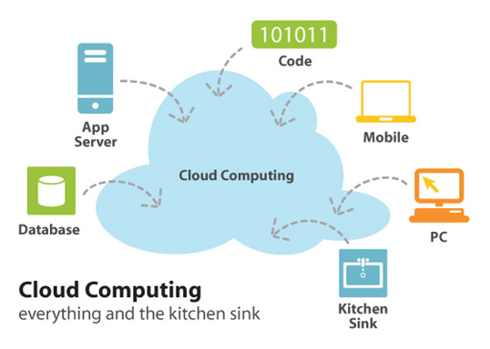

# 서버 운용 · 관리 (클라우드)

애플레케이션이 제대로 동작하려면, 서버가 항상 가동되고 있어야 한다.

또한, 새로운 서버를 도입하려면 적절한 하드웨어를 선정해 OS와 서버 애플리케이션을 설치하고 테스트해야 한다.

중요한 데이터를 다루는 서버에서는 **서버의 상태를 항상 감시하고 있으며, 문제가 발생하면 바로 대처해야 한다.**

데이터 백업, 보안대책 등 서버 운용 관리에는 시간과 비용이 들어간다.

## 클라우드

서버를 직접 관리 운용하지 않고, 인터넷을 통해 서버의 기능만 이용할 수 있게 한 것이 **클라우드 서비스**이다.

직접 서버를 운용 관리하는 기존 서버 운영 방법은 **온프레미스** 라고 한다.

## 클라우드 서비스 분류

> IaaS 하드웨어, PaaS 플랫폼, SaaS 애플리케이션 서비스 이용

클라우드 서비스는 네트워크를 경유해 서버의 어느 부분을 사용자가 이용할 수 있게 하느냐에 따라서 다음 세가지로 분류 한다.

- IaaS
- PaaS
- SaaS

### IaaS

네트워크를 경유해 서버의 CPU와 메모리, 저장장치와 같은 하드웨어 부분을 이용할 수 있게 한다.

사용자는 IaaS의 서버 상에서 다시 OS와 미들웨어, 애플리케이션을 추가한다.

IaaS를 이용해 클라우드 서비스 사업자의 서버에서 자유롭게 시스템을 만들어 이용 할 수 있다.

### PaaS

네트워크를 경유해 서버의 플랫폼을 이용할 수 있게 한다.

플랫폼이란 OS와 OS 상에서 동작하는 데이터베이스 등의 미들웨어를 포함한 부분을 가르킨다.

클라우드 서비스 서비스 사업자의 플랫폼에서 사용자는 사내 업무 시스템과 같은 독자적인 애플리케이션을 추가하여 자유롭게 이용 할 수 있다.

### SaaS

네트워크를 경유해 서버의 특정 소프트웨어 기능을 이용할 수 있게 한다.

일반 개인 사용자가 이용하는 클라우드 서비스는 대부분 SaaS 이다.

대표적인 예로 온라인 스토리지 서비스이다.

온라인 스토리지 서비스에서 사용자에게 네트워크를 경유해 파일 서버 기능을 제공한다.

사용자는 자유롭게 파일을 저장하고 공유 할 수 있다. 

---

서버 : 클라이언트 요청에 따라 적절한 파일, 데이터를 제공하는 PC or 프로그램

클라이언트 : 웹 브라우저에서 작동하는 PC or 프로그램 