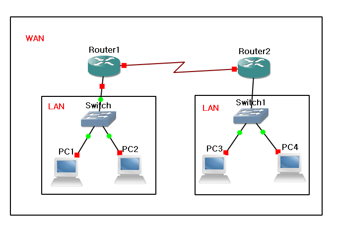
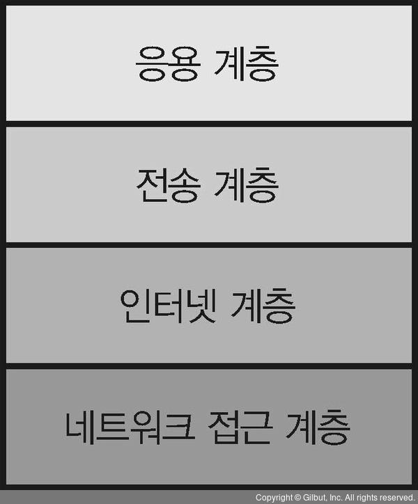

# 컴퓨터 네트워크

> 정보 수집이나 커뮤니케이션 효율화 등 다양한 목적을 위해 이용된다.

네트워크라고 한마디로 말하지만, 넓은 의미에서 네트워크에는 물류, 교통, 인맥 등 도 포함된다.

그물처럼 구성된 시스템을 나타내는 말이 네트워크인데, 컴퓨터끼리 데이터를 주고 받는 시스템을 **컴퓨터 네트워크**라고 한다.

PC나 스마트폰과 같은 정보 단말 기기를 서로 연결해서 만들어진다.

네트워크 덕분에 다른 사람과 데이터를 주고 받을 수 있다.

## 누가 이용 할 수 있는 네트워크 인가?

- 사용자를 제한하는 사설 네트워크
- 누구나  이용할 수 있는 인터넷

사내 네트워크나 가정 네트워크처럼 접속할 수 있는 사용자를 직원이나 가족으로 한정하는 **사설네트워크**

접속할 사용자를 제한하지 않고 누구든 이용 할 수 있는 네트워크는 **인터넷**이다.

## LAN과 WAN

> 거점 내 네트워크가 LAN이고, LAN 끼리 연결하기 위한 것이 WAN

LAN(Local Area NetWork), WAN(Wide Area NetWork)

LAN과 WAN으로 구성된 기업의 사내 네트워크(인트라넷)로 두차이를 이해해보자.

규모가 큰 기업은 복수의 거점을 구축한다. 이 때 각 거점의 네트워크가 LAN 이다.

LAN을 구축함으로써 거점 내의 PC나 서버의 통신이 가능해진다. 또한, 개인 사용자의 가정 내 네트워크도 LAN이다.

복수의 거점에서 파일을 공유하거나, 메일을 주고받으려면 거점 간의 통신도 필요한데, 거점의 LAN끼리 서로 연결하는 것이 WAN이다.

## LAN과 WAN 구축과 관리 비용

### LAN

LAN은 직접 구축하고 관리한다.

LAN을 구축하기 위해서는 각 기기 배치나 배선 그리고 필요한 설정을 해야 한다.

주로 유선(이더넷)이나 무선 LAN을 지원하는 기기를 이용하는데, 기기 비용이나 설정을 위한 인건비 등의 초기 비용이 들어간다.

구축한 후에도 정상적으로 가동되도록 매일 관리할 필요가 있다.

### WAN

NTT와 같은 통신사업자가 구축하고 관리한다.

통신사업자가 제공하는 WAN 서비스에는 여러 종류가 있으므로, 적절한 WAN 서비스를 선택해야 한다.

구축비용은 서비스 초기 계약 비용과 통신 요금을 통신사업자에게 지불한다.

통신 요금은 통신량을 기준으로 하는 종량제 방식과 고정 요금 방식 등 서비스에 따라서 요금 체계가 달라진다.

|              | LAN                          | WAN                        |
| ------------ | ---------------------------- | -------------------------- |
| 역할         | 거점 내 기기끼리 서로 연결   | 거점인 LAN끼리 서로 연결   |
| 구축 및 관리 | 직접 구축하고 관리           | 통신사업자가 구축하고 관리 |
| 초기 비용    | 설계, 구축 인건비, 기기 비용 | 서비스 계약 요금           |
| 관리 비용    | 관리자 인건비                | 통신요금                   |

## AS (Autonomous System)

누구나 이용할 수 있는 인터넷은 전 세계의 다양한 조직이 관리하는 네트워크가 연결된 것이다.

그 조직의 네트워크를 **AS(Autonomous System)** 라고 부른다.

AS의 구체적인 예는 ISP(인터넷 서비스 프로바이더 : 고유한 라우팅 정책을 가지고 있음), 정부(공공)기관, 회사, 단체 등, Google이나 Amazon 등 인터넷 상에서 서비스를 제공하는 기업 네트워크도 AS이다.

ISP의 상위 그룹을 Tier1 이라고 부른다. 한국에서는 KT, SK, LG가 Tier 1이다.

Tier1 이외의 ISP는 최종적으로는 Tier1에 연결되어 자신이 관리하지 않는 네트워크의 정보도 입수한다.

결국, **인터넷 상에 모든 ISP는 Tier1을 경유해서 연결**된다.

### 인터넷 접속

ISP와 계약하고 가정이나 사내 네트워크의 라우터를 ISP의 라우터와 연결하면, 인터넷을 이용 할 수 있다.

라우터를 통하지 않고 토느북이나 스마트폰 등을 ISP의 라우터와 접속하는 방법도 있다.

ISP의 라우터와 접속하기 위해서는 고정회선 또는 모바일 회선을 이용할 수 있다.

|                | 고정 회선                                            |
| -------------- | ---------------------------------------------------- |
| 전용선         | 통신 속도는 보장되지만 비용이 비싸다.                |
| 전화회선(ADSL) | 전화회선을 이용해 저가에 인터넷에 접속 할 수 있다.   |
| 광케이블(FTTH) | 광케이블을 이용해 고속으로 인터넷에 접속 할 수 있다. |
| 케이블 TV 회선 | 케이블 TV 회선을 인터넷 접속에도 이용한다.           |

|                     | 모바일 회선                                                  |
| ------------------- | ------------------------------------------------------------ |
| 휴대전화망 (4G LTE) | 휴대전화망을 이용한 광역 인터넷 접속이 가능하다.             |
| WiMAZ / WiMAX2 회선 | WiMAX망을 이용한 광역 인터넷 접속이 가능하다.                |
| 무선 LAN (Wi-Fi)    | Wi-Fi 액세스 포인트의 제한된 범위에서 인터넷에 접속 할 수 있다. |

---

라우터 : 컴퓨터 네트워크 간에 데이터 패킷을 전송하는 네트워크 장치

https://2infinity-and-beyond.tistory.com/7

## 네트워크 아키텍처

> 컴퓨터 끼리 통신, 대화에 사용하는 언어 

한국어나 영어와 같은 언어로 사람들이 대화를 하는 것 처럼, 컴퓨터 통신에서는 **네트워크 아키텍처**를 이용한다.

즉, **대화에 사용하는 언어에 해당하는 것이 네트워크 아키텍처**이다.

언어에는 문자 표기법, 발음, 문법 등 다양한 규칙이 있다. 네트워크 아키텍처도 마찬가지인데,

통신 상대를 지정하는 법, 다시 말해 주소나 데이터 형식, 통신 절차 등의 규칙이 필요하다.

**통신에 필요한 규칙을 프로토콜** 이라고 한다.

**프로토콜의 집합이 바로 네트워크 아키텍처** 이다. (네트워크 아키텍처 = 프로토콜 스텍, 프로토콜 스위트)

### 네트워크 아키텍처 예시

TCP/IP , OSI , Microsoft NETBEUI, Novell IPX/SPX, Apple Appletalk, IBM SNA 등

### TCP / IP

> 네트워크의 공통 언어

TCP/IP에서는 네트워크를 통해 애플리케이션의 데이터를 주고받기 위해, 역할별로 네 가지로 계층화된 복수의 프로토콜을 조합한다.

프로토콜을 계층화하면, 나중에 변경하거나 확장하기 쉬워지는 장점이 있다.

예를 들어, 프로토콜을 변경하거나 기능을 추가할 때는 기본적으로 그 프로토콜만 생각하면 된다.

| TCP/IP 계층                                 | 주요 프로토콜                         |
| ------------------------------------------- | ------------------------------------- |
| 응용계층 (애플리케이션 층)                  | HTTP, SMTP, POP3, IMAP4, DHCP, DNS 등 |
| 전송계층 (트랜스포트 층)                    | TCP/UDP                               |
| 인터넷계층 (인터넷 층)                      | IP, ICMP, ARP 등                      |
| 네트워크 접근 계층 (네트워크 인터페이스 층) | 이더넷, 무선LAN, PPP 등               |

