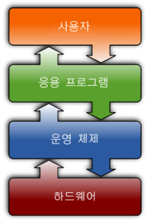

# 프로그래밍을 둘러싼 환경

> 하드웨어, 5대 장치, OS, 애플리케이션, 소프트웨어, 프로그램

## 컴퓨터를 구성하는 요소

### 하드웨어

컴퓨터는 디스플레이나 키보드, 마우스 등 다양한 기기로 구성되어 있다.

이러한 물리적인 장치를 **하드웨어** 라고 한다.

동작에 필요한 것뿐만 아니라 케이스 등을 포함한 모든 물리적인 요소를 말한다.

컴퓨터 동작에 필요한 다섯 가지 장치를 5대 장치 라고 한다.

현대의 컴퓨터는 PC나 스마트폰뿐 아니라 서버나 라우터 등 여러 가지가 있는데, 모두 이 5대 장치로 구성된다.

### OS (Operating System)

컴퓨터는 하드웨어만으로 작동하지 않는데, Windows, macOS, android, IOS 등의 OS(운영 체제)에 더해 

### 애플리케이션 

웹사이트를 볼 수 있는 웹브라우저, 음악 재생이나 카메라 기능, 계싼기나 메모, 문서 작성이나 표 계산 등의 애플리케이션이 필요하다.

### 소프트웨어

> 소프트웨어에는 OS와 애플리케이션이 있다.

이러한 하드웨어 이외의 부분은 영어 hard의 반댓말인 soft를 사용해 소프트웨어라고 한다.

같은 하드웨어라고 다른 소프트웨어를 설치하면 완전히 다르게 사용할 수 있다.

하드웨어는 완성 후 문제가 발견 시 변경이 힘들지만, 소프트웨어 오류는 수정한 프로그램을 배포함으로 변경 할 수 있다.

#### 소프트웨어와 프로그램의 차이

> 프로그램은 소프트웨어의 일부이며, 실행 파일과 라이브러리 등이 포함된다.

OS나 앱 등 소프트웨어는 실행 파일인 프로그램과 메뉴얼 등의 자료, 데이터 등으로 구성된다.

프로그램에는 실행 파일과 라이브러리 등이 있고, 프로그래밍이란 '프로그램을 작성하는 것'을 말하며, 프로그램을 작성하는 사람을 프로그래머 라고 한다.

