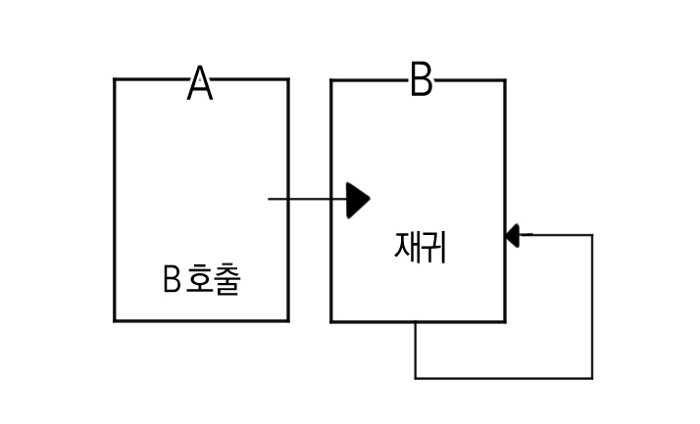
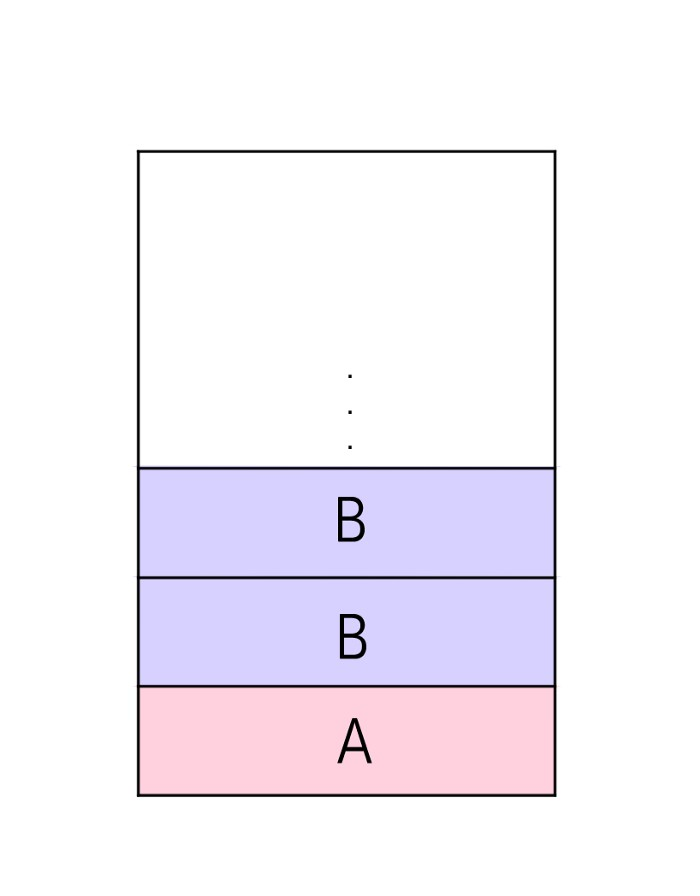

# 바인딩 (Binding)

> 프로그램의 어떤 기본 단위가 가질 수 있는 구성요소의 구체적인 값, 성격을 확정하는 것


## 바인딩이란

바인딩 (Binding) 이란 프로그램의 어떤 기본 단위가 가질 수 있는 구성요소의 구체적인 값, 성격을 확정하는 것을 말한다.


ex)

변수(프로그램의 기본 단위)

```
int num = 123;
```

위 문장은

`num` : 변수 이름

`int` : 변수 자료형

`123` : 변수 값

이라는 변수의 속성의 구체적인 값이다.


위와 같이 이름, 자료형, 자료값에 각각 `num`, `int`, `123` 이라는 구체적인 값을 할당하는 각각의 과정을 바인딩이라고 한다.


함수에서도 바인딩이 일어나는데, 이때 바인딩은 어떤 코드에서 함수를 호출할 때 그 해당 함수가 위치한 메모리 주소로 연결해주는 것을 의미한다.


일반적으로 바인딩은 일어나는 시간에 따라 크게 정적 바인딩, 동적 바인딩으로 분류 된다.


## 정적 바인딩 (Static Binding)

> 컴파일 시간에 일어나며, 실행 중 변하지 않고 유지됨


ex) `int n` : 변수 n의 자료형은 컴파일 시간에 int로 할당되고, 실행 중에도 변하지 않는 변수 n의 속성

함수의 정적 바인딩은 컴파일 시간에 호출될 해당 함수의 주소가 결정되어 바인딩 된다.

즉, 실행 파일에 호출할 함수가 위치한 메모리 주소가 이미 확정 기록된 것이다.

일반적인 함수는 정적 바인딩이 일어난다.


정적 바인딩은 컴파일 시간에 대부분 변수들의 속성이나 호출될 함수의 주소를 확정해놓기 때문에 실행시간의 속도가 빨라 효율적이다.





정적 바인딩은 각 변수 값을 컴파일 시간에 정하므로, 필요한 메모리 용량이 컴파일 시간에 확정된다.

이 때문에 같은 함수가 여러번 호출될 때마다 계속해서 또 다른 메모리 공간을 할당받아 재귀 호출의 실행이 가능하다.


ex)

`int array[50]` 은 컴파일 시간에 배열의 크기와 위치를 결정하고, 이 때 정해진 '크기'는 하나의 블록 (A 혹은 B) 실행이 완전히 끝날때까지 그대로 유지된다.


## 동적 바인딩 (Dynamic Binding)

> 실행 시간 (run time) 중에 일어나며, 프로그램 실행 도중 변경 가능


ex)

인터프리터 언어인 python을 대표적으로 `num=10` 과 같은 문장에서 보듯 실행 시간에 변수의 자료형을 결정한다.


함수의 동적 바인딩은 실행 파일을 만들 떄 호출할 함수의 메모리 주소가 확정되지 않고 보류상태로 둔다.

이후 실제 실행 시간에 호출할 삼후싀 주소가 결정되기 때문에, 이 주소를 저장할 공간을 미리 확보해둔다.(4byte)

실행될지 확정되지 않은 함수를 위해 저장공간을 빼둬야 하는 점 때문에 메모리 관리에 있어 비효율적일 수 있다.


동적 바인딩 값은 프로그램 실행 도중 변경될 수 있기 때문에 할당되는 메모리 또한 유동적이며, 동적 바인딩 되는 변수를 동적 변수라고 한다.


----

참고 사이트

바인딩(Binding) 이란 블로그 : https://medium.com/pocs/%EB%B0%94%EC%9D%B8%EB%94%A9-binding-4a4a2f641b27

