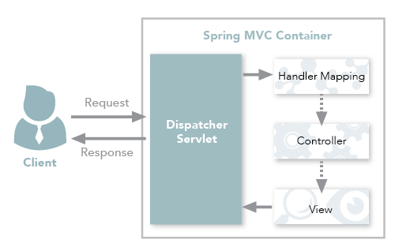

# REST

> REpresentational State Transfer, 부수적인 레이어나 세션 관리를 추가하지 않고도 HTTP 프로토콜로 데이터를 전달하는 프레임워크

## REST 특징

- 모든 것은 URI를 가지고 있어야 한다. 모든 Resource는 클라이언트가 바로 접근할 수 있는 URI가 존재한다.
- 웹 어플리케이션은 클아이언트의 상태에 대한 정보를 보관하지 않는다.
  - 모든 HTTP 요청은 완전히 독립적이다.
  - 클라이언트가 요청을 할 때 마다 필요한 모든 정보를 준다.
- 서버는 클라이언트의 time out에 대해 신경 쓰지 않아도 된다.
  - 클라이언트에게 요청할 때마다 필요한 모든 정보를 주기 때문이다.
  - REST 에서는 상태가 서버가 아닌 클라이언트에 유지된다.
- 모든 Resource는 일반적 HTTP 인터페이스인 GET, POST, PUT, DELETE로 접근되어야 한다.

## REST 장점, 단점

### 장점

- HTTP 프로토콜의 인프라를 그대로 사용하기 때문에 REST를 위한 별도의 인프라 구축이 필요 없다.
- 웹 캐시 서버를 그대로 이용할 수 있다.
  - 모든 Resource가 URI로 유니크하게 표현되기 때문에 웹 캐시 상에 보관될 수 있기 때문
- 서버와 클라이언트의 역할이 명확하게 분리된다.
- HTTP 표준 프로토콜을 따르는 모든 플랫폼에서 사용이 가능하다.
- 사용이 쉽다.

### 단점

- 표준이 존재하지 않기 댸문에 관리가 어렵다. (암암리에 생겨난 Detector 표준)
- REST적 접근과 설계가 필요하다.
  - REST는 프로토콜이 아닌 Resource 기반의 아키텍쳐이기 때문에 시스템의 설계에도 REST에 적합한 설계가 요구된다.
- 구형 브라우저는 지원을 못하는 경우가 존재한다 (PUT, DELETE, PATCH 방식 사용 불가)

## Spring MVC 컨트롤러와 REST 컨트롤러 차이점

> HTTP Response Body가 생성되는 방식이 차이점

MVC 컨트롤러는 View 기술을 사용하는 반면 

REST 컨트롤러는 객체를 반환하면 객체 데이터가 JSON / XML 형식의 HTTP응답에 직접 작성된다.

모든 경우는 아니지만, MVC 컨트롤러는 View를 반환하고,

REST 컨트롤러는 데이터를 반환한다.

MVC 컨트롤러의 경우에도 @ResponseBody 어노테이션을 사용하면 객체를 반환할 수 있다.

### 전통적인 Spring MVC 컨트롤러

MVC 컨트롤러는 요청이 들어오면 Dispatcher Servlet에서 공통 처리 작업을 수행하고 컨트롤러에게 작업을 위임하게 된다.

이후 컨트롤러는 응답을 Dispatcher Servlet으로 반환하고, Dispatcher Servlet은 View를 클라이언트에게 반환하게 된다.

### Spring MVC REST 컨트롤러

REST 컨트롤러는 Spring MVC 컨트롤러에 @ResponseBody가 결합된 것으로, @RestController는 반환 값에 자동으로 @ResponseBody가 붙게되면서 HTTP 응답 데이터를 Java 객체가 매핑되어 전달되게 된다.

이러한 방식은 전통적인 MVC 컨트롤러와는 다르게 컨트롤러에서 직접 데이터를 반환할 수 있게 한다.

*@RestController 어노테이션은 Spring 4.x 버전 이상 부터 사용가능*

*Spring 3.x 버전 이상은 @Controller, @ResponseBody 어노테이션은 나누어 작성*

