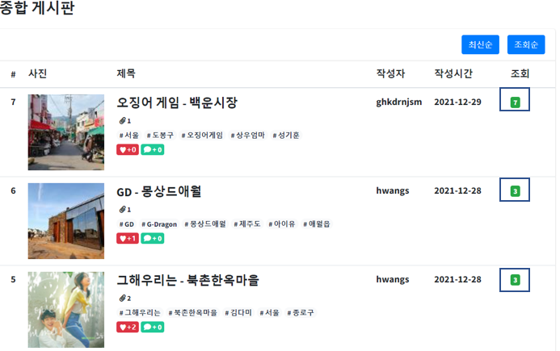

# 게시물 조회 및 트랜잭션 처리 


## 트랜잭션 (Transaction)

> 데이터의 무결성을 보장하기 위해 여러 과정을 하나의 행위로 묶을 때 사용, 한가지라도 실패하면 모든 작업이 취소


### 특징

1. 원자성 (atomicity)

   트랜잭션의 연산은 DB에 모두 반영되거나 모두 반영되지 않아야 합니다. 즉, 트랙잭션 내 모든 명령은 완벽히 수행되여야만 합니다. 그렇지 않다면 트랜잭션의 연산은 모두 취소가 됩니다.

2. 일관성 (Consistency)

   트랜잭션의 수행이 성공적으로 완료되었다면 언제나 일관성 있는 DB 상태로 변환해야 합니다. 즉, 트랜잭션 수행 전,후의 상태가 같아야합니다.

3. 독립성 (Isolation)

   동시에 2개 이상의 트랜잭션이 실행되는 경우 어느 하나의 트랜잭션 실행 중에 다른 트랜잭션의 연산이 실행될 수 없습니다. 즉, 수행 중인 트랜잭션이 완전히 완료되어야만 다른 트랙잭션이 수행 됩니다.

4. 영속성 (Durability)

   성공적으로 완료된 트랜잭션의 결과는 영구적으로 반영됩니다.


### 원리

트랜잭션은 2개 이상의 쿼리를 하나의 커넥션으로 묶어 DB에 전달하고 이 과정에서 오류 미 에러가 발생할 경우 자동으로 모든 과정을 원래 상태로 돌려 놓습니다.

이러한 과정을 구현하기 위해서는 트랜잭션은 하나 이상의 쿼리를 처리할 때 동일한 커넥션 객체를 공유합니다.


### Spring 에서 트랜잭션

코드 기반의 트랜잭션 처리, 선언적 트랜잭션 처리를 spring에서 지원합니다.

코드 기반의 트랜잭션 처리를 사용하기 위해서는 Spring에서 제공하는 트랜잭션 템플릿 클래스를 사용하는 방법이 있고,

선언적 트랜잭션 처리를 사용하기 위해서는 설정파일, 어노테이션을 이용해서 트랜잭션의 범위 및 규칙을 정의 할 수 있습니다.


### @Transactional 어노테이션

Spring에서는 주로 선언적 트랜잭션 처리를 애용합니다.

대표적인 예로 @Transactional 어노테이션이 있고, 이 어노테이션은 쿼리문을 처리하는 과정에서 오류 및 에러가 발생할 경우 자동으로 Rollback 처리를 수행합니다.

일반적으로 Spring 에서는 Service계층 (비즈니스 계층)에 @Transactional 어노테이션을 추가하는 방식을 사용합니다.


## 트랜잭션 처리 

### 설정

> pom.xml 파일에 트랜잭션 관련 라이브러리 추가 및 root-context.xml에도 내용 추가

#### pom.xml

```xml
<dependency> 
    <groupId>org.springframework</groupId> 
    <artifactId>spring-tx</artifactId> 
    <version>${org.springframework-version}</version> 
</dependency>
```

라이브러리 추가

#### root-context.xml

```xml
<bean id="transactionManager" class="org.springframework.jdbc.datasource.DataSourceTransactionManager"> 
    <property name="dataSource" ref="dataSource"/> 
</bean> 

<tx:annotation-driven/>
```


### 댓글 트랜잭션 처리

> 댓글 C UD 및 댓글 입력 수에 대한 트랜잭션


#### 게시글 테이블 및 VO 

##### DB (MySQL)

> DB에서 게시글 테이블의 댓글의 수를 의미하는 Column 추가

```sql
ALTER TABLE tb_article ADD COLUMN reply_cnt int DEFAULT 0;
```


##### ArticleVO.java

> ArticleVO Class에서 replyCnt 멤버변수 추가 및 Getter,Setter 추가

```java
private int replyCnt;
...
public int getReplyCnt() { 
		return replyCnt; 
} 
public void setReplyCnt(int replyCnt) { 
		this.replyCnt = replyCnt; 
}
...
@Override 
public String toString() { return "ArticleVO [
...
    ", replyCnt="+ replyCnt + "]" ; }
```

##### 

##### articleMapper.xml

> 전체 게시물 조회 쿼리문에 댓글 수 값 추가, 댓글 입력/삭제 시 댓글 수 수정문 추가

```xml
<select id="listSearch" resultMap="ArticleResultMap"> 
    <![CDATA[ 
SELECT 
article_no, 
title, 
content, 
writer, 
regdate, 
viewcnt, 
reply_cnt 
FROM tb_article 
WHERE article_no > 0 
	]]> 
    <include refid="search"/> 
    <![CDATA[ 
ORDER BY article_no DESC, reg_date DESC 
LIMIT #{pageStart}, #{perPageNum} 
]]> 
</select>

<update id="updateReplyCnt"> 
    UPDATE tb_article SET 
    reply_cnt = reply_cnt + #{amount} 
    WHERE article_no = #{article_no} 
</update>
```


#### DAO

##### ArticleDAO, Impl.java

> 게시물 번호와 게시물의 댓글수변화갯수를 Map 담아 쿼리문에 보내기

```java
void updateReplyCnt(Integer article_no, int amount) throws Exception;
```

```java
@Override 
public void updateReplyCnt(Integer article_no, int amount) throws Exception {
    
    	Map<String, Object> paramMap = new HashMap<String, Object>(); 
        paramMap.put("article_no", article_no); 
        paramMap.put("amount", amount); 
                                              
		sqlSession.update(NAMESPACE + ".updateReplyCnt",paramMap); 
}
```


##### ReplyDAO, Impl.java

```java
int getArticleNo(Integer reply_no) throws Exception;
```

```java
@Override 
public int getArticleNo(Integer reply_no) throws Exception {
    return sqlSession.selectOne(NAMESPACE + ".getArticleNo", reply_no); 
}
```

##### replyMapper.xml

```xml
<select id="getArticleNo" resultType="int"> 
    SELECT 
    article_no FROM tb_reply 
    WHERE reply_no = #{reply_no} 
</select>
```


#### Service

> 새로운 메소드 추가 필요없이 댓글등록 및 삭제 처리 메소드 수정 및 트랜잭션 처리함

##### ReplyServiceImpl.java

```java
private final ReplyDAO replyDAO; 
private final ArticleDAO articleDAO; 

@Inject 
public ReplyServiceImpl(ReplyDAO replyDAO, ArticleDAO articleDAO) { 
    this.replyDAO = replyDAO; 
    this.articleDAO = articleDAO; 
} 

// 댓글 등록
@Transactional // 트랜잭션 처리 
@Override public void addReply(ReplyVO replyVO) throws Exception { 
    replyDAO.create(replyVO); // 댓글 등록 
    articleDAO.updateReplyCnt(replyVO.getArticle_no(), 1); // 댓글 갯수 증가 
} 

// 댓글 삭제 
@Transactional // 트랜잭션 처리 
@Override public void removeReply(Integer reply_no) throws Exception { 
    int article_no = replyDAO.getArticleNo(reply_no); // 댓글의 게시물 번호 조회 
    replyDAO.delete(reply_no); // 댓글 삭제 
    articleDAO.updateReplyCnt(article_no, -1); // 댓글 갯수 감소 
}
```


#### View

> 전체 목록 조회 시 replyCnt 담아서 보여주기

```jsp
<span class="badge bg-teal"><i class="fas fa-comment"></i> + ${article.replyCnt}</span>
```


### 조회수 트랜잭션 처리

> 게시글 Read 시 조회수 증가 처리


#### 게시글 테이블

##### articleMapper.xml

```xml
<update id="updateViewcnt">
	 UPDATE tb_article
	 SET viewcnt = viewcnt + 1
	 WHERE article_no = #{article_no}
</update>
```


#### DAO

##### ArticleDAO, Impl.java

```java
void updateViewCnt(Integer article_no) throws Exception;
```

```java
@Override 
public void updateViewCnt(Integer article_no) throws Exception {
    sqlSession.update(NAMESPACE + ".updateViewCnt", article_no); 
}
```


#### Service

> 기존 read 문에 updateViewCnt 추가 및 Transactional 어노테이션 추가

##### ArticleServiceImpl.java

```java
@Transactional(isolation = Isolation.READ_COMMITTED)
@Override
public ArticleVO read(Integer article_no) throws Exception {
    articleDAO.updateViewcnt(article_no);
    return articleDAO.read(article_no);
}
```


#### View

> 전체 목록 조회 시 viewCnt 담아서 보여주기

```jsp
<td><span class="badge bg-success">${article.viewCnt}</span></td>
```




