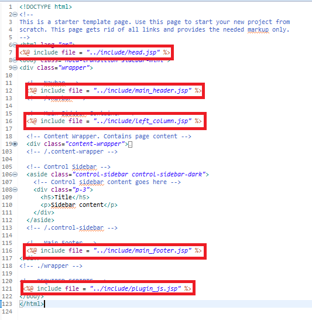

# 게시판 CRUD


## Table 생성

게시판번호, 제목, 내용, 작성자, 작성일, 조회수 생성

```sql
CREATE TABLE tb_article (
  article_no int NOT NULL AUTO_INCREMENT,
  title varchar(200) CHARACTER SET utf8 COLLATE utf8_general_ci NOT NULL,
  content text CHARACTER SET utf8 COLLATE utf8_general_ci,
  writer varchar(50) CHARACTER SET utf8 COLLATE utf8_general_ci NOT NULL,
  regdate timestamp NULL DEFAULT CURRENT_TIMESTAMP,
  viewcnt int DEFAULT 0 NULL,
  PRIMARY KEY (article_no)
) ENGINE=InnoDB AUTO_INCREMENT=1 DEFAULT CHARSET=utf8 COLLATE=utf8_general_ci;
```

 

## ArticleVO.java

> 테이블의 구조를 객체화 시키기 위해 ArticleVO 클래스

src/main/java/기본클래스/VO 패키지 내에 생성

```java
public class ArticleVO {

    private Integer article_no;

    private String title;

    private String content;

    private String writer;

    private Date regDate;

    private int viewCnt;
 
 	//Getter, Setter, toString 추가   
}
```


## ArticleDAO.java

> DB 쿼리에 접근을 위한 DAO 인터페이스 및 클래스

ArticleDAO 인터페이스

```java
public interface ArticleDAO {

    void create(ArticleVO articleVO) throws Exception;

    ArticleVO read(Integer article_no) throws Exception;

    void update(ArticleVO articleVO) throws Exception;

    void delete(Integer article_no) throws Exception;
    
    List<ArticleVO> listAll() throws Exception;
    
}
```


ArticleDAOImpl 클래스

```java
@Repository
public class ArticleDAOImpl implements ArticleDAO {

    private static final String NAMESPACE = "mc.sn.KEPL.mappers.article.ArticleMapper";

    private final SqlSession sqlSession;

    @Inject
    public ArticleDAOImpl(SqlSession sqlSession) {
        this.sqlSession = sqlSession;
    }

    @Override
    public void create(ArticleVO articleVO) throws Exception {
        sqlSession.insert(NAMESPACE + ".create", articleVO);
    }
    
    @Override
    public ArticleVO read(Integer article_no) throws Exception {
        return sqlSession.selectOne(NAMESPACE + ".read", article_no);
    }

    @Override
    public void update(ArticleVO articleVO) throws Exception {
        sqlSession.update(NAMESPACE + ".update", articleVO);
    }

    @Override
    public void delete(Integer article_no) throws Exception {
        sqlSession.delete(NAMESPACE + ".delete", article_no);
    }
    
    @Override
    public List<ArticleVO> listAll() throws Exception {
        sqlSession.delete(NAMESPACE + ".listAll");
    }
}
```


## articleMappler.xml

> 게시판 관련 쿼리문 작성

src/main/resources/mappers/aritcle 내에 articleMapper.xml 생성


주의할 점  

1. *ArticleDAOImpl 클래스의 String NAMESPACE 밗과 mapper 파일의 namespace가 일치할 것*
2. *resultMap 속성 사용 할 시, Java객체 변수와 DB Column과 일치 시키기*

```xml
<?xml version="1.0" encoding="UTF-8"?>
<!DOCTYPE mapper
        PUBLIC "-//mybatis.org//DTD Mapper 3.0//EN"
        "http://mybatis.org/dtd/mybatis-3-mapper.dtd">

<mapper namespace="mc.sn.KEPL.mappers.article.ArticleMapper">

    <insert id="create" useGeneratedKeys="true" keyProperty="article_no">
        INSERT INTO tb_article (
            article_no
        	, title
            , content
            , writer
            , regdate
        	, viewcnt
        ) VALUES (
             #{article_no}
            , #{title}
            , #{content}
            , #{writer}
            , #{regdate}
            , #{viewcnt}
        )
    </insert>
    
  <select id="read" resultMap="ArticleResultMap">
        SELECT
            article_no
            , title
            , content
            , writer
            , regdate
            , viewcnt
        FROM
            tb_article
        WHERE article_no = #{article_no}
    </select>


    <update id="update">
        UPDATE tb_article
        SET
            title = #{title}
            , content = #{content}
        WHERE
            article_no = #{article_no}
    </update>

    <delete id="delete">
        DELETE FROM tb_article
        WHERE article_no = #{article_no}
    </delete>
    
    <select id="listAll" resultMap="ArticleResultMap">
    <![CDATA[
        SELECT
            article_no,
            title,
            content,
            writer,
            regdate,
            viewcnt
        from tb_article
        WHERE article_no > 0 
    	ORDER BY article_no DESC, regdate DESC 
    ]]>
	</select>
    
	<resultMap id="ArticleResultMap" type="ArticleVO">
        <id property="article_no" column="article_no"/>
        <result property="title" column="title" />
        <result property="content" column="content" />
        <result property="writer" column="writer" />
        <result property="regDate" column="regdate" />
        <result property="viewCnt" column="viewcnt" />
    </resultMap>
    
</mapper>
```


## ArticleService.java

> Controller와 DAO 사이 Service 계층

ArticleService 인터페이스

```java
public interface ArticleService {

    void create(ArticleVO articleVO) throws Exception;

    ArticleVO read(Integer article_no) throws Exception;

    void update(ArticleVO articleVO) throws Exception;

    void delete(Integer article_no) throws Exception;
	
	List<ArticleVO> listAll() throws Exception;
}
```


ArticleServiceImpl 클래스

```java
@Service
public class ArticleServiceImpl implements ArticleService {

    private final ArticleDAO articleDAO;
    
    @Inject
    public ArticleServiceImpl(ArticleDAO articleDAO) {
        this.articleDAO = articleDAO;
    }
    
    @Override
    public void create(ArticleVO articleVO) throws Exception {
        articleDAO.create(articleVO);
    }
    
    @Override
    public ArticleVO read(Integer article_no) throws Exception {
        return articleDAO.read(article_no);
    }
    
    @Override
    public void update(ArticleVO articleVO) throws Exception {
        articleDAO.update(articleVO);
    }

    @Override
    public void delete(Integer article_no) throws Exception {
        articleDAO.delete(article_no);
    }
   
    @Override
    public List<ArticleVO> listAll() throws Exception {
        return articleDAO.listAll();
    }
    
}
```


## ArticleController.java

```java
@Controller
@RequestMapping("/article")
public class ArticleController {

    private static final Logger logger = LoggerFactory.getLogger(ArticleController.class);

    private final ArticleService articleService;
	
    @Inject
    public ArticleController(ArticleService articleService) {
        this.articleService = articleService;
    }
    
    // Write 페이지 이동
    @RequestMapping(value = "/write", method = RequestMethod.GET)
    public String writeGET() {

        logger.info("writeGET() called...");

        return "/article/write";
    }
	
    // Write 처리
    @RequestMapping(value = "/write", method = RequestMethod.POST)
    public String writePOST(ArticleVO articleVO,
                            RedirectAttributes redirectAttributes) throws Exception {

        logger.info("writePOST() called...");
       
        articleService.create(articleVO);
        redirectAttributes.addFlashAttribute("msg", "regSuccess");

        return "redirect:/article/list";
    }
    
    
    // 목록 페이지 이동
    @RequestMapping(value = "/list", method = RequestMethod.GET)
    public String list(Model model) throws Exception {

        logger.info("list() called ...");
		model.addAttribute("articles", articleService.listAll());
        
        return "article/list";
    }
    
    
	// 조회 페이지 이동
    @RequestMapping(value = "/read", method = RequestMethod.GET)
    public String read(@RequestParam("article_no") int article_no,
                       Model model) throws Exception {

        logger.info("read() called ...");
        model.addAttribute("article", articleService.read(article_no));

        return "article/read";
    }
    
 	// 수정 페이지 이동
    @RequestMapping(value = "/modify", method = RequestMethod.GET)
    public String modifyGET(@RequestParam("article_no") int article_no,
                            Model model) throws Exception {

        logger.info("modifyGet() called ...");
        model.addAttribute("article", articleService.read(article_no));

        return "article/modify";
    }
    
 	// 수정 처리
    @RequestMapping(value = "/modify", method = RequestMethod.POST)
    public String modifyPOST(ArticleVO articleVO,
                             RedirectAttributes redirectAttributes) throws Exception {

        logger.info("modifyPOST() called ...");
        articleService.update(articleVO);
        redirectAttributes.addFlashAttribute("msg", "modSuccess");

        return "redirect:/article/list";
    }
    
 	// 삭제 처리
    @RequestMapping(value = "/remove", method = RequestMethod.POST)
    public String remove(@RequestParam("article_no") int article_no,
                         RedirectAttributes redirectAttributes) throws Exception {

        logger.info("remove() called ...");
        articleService.delete(article_no);
        redirectAttributes.addFlashAttribute("msg", "delSuccess");

        return "redirect:/article/list";
    }
}
```


## View

> WEB-INF/views 내 C(write.jsp), R(read.jsp), U(modify.jsp), D, 목록조회(list.jsp) 파일 생성


공통적으로 들어가는 요소는 `<%@ include>` 태그의 file 속성으로 처리




head.jsp 

> JSTL과 EL 사용하기 위해 상단에 추가

```jsp
<%@ page contentType="text/html; charset=UTF-8" language="java" %>
<%@ taglib prefix="c" uri="http://java.sun.com/jsp/jstl/core" %>
<%@ taglib prefix="fmt" uri="http://java.sun.com/jsp/jstl/fmt" %>
<%@ taglib prefix="fn" uri="http://java.sun.com/jsp/jstl/functions" %>
<c:set var="path" value="${pageContext.request.contextPath}"/>
<head>
  <meta charset="utf-8">
  <meta name="viewport" content="width=device-width, initial-scale=1">
  <meta http-equiv="x-ua-compatible" content="ie=edge">

  <title>KEPL</title>


  <!-- Font Awesome Icons -->
  <link rel="stylesheet" href="${path}/plugins/fontawesome-free/css/all.min.css">
  <!-- Theme style -->
  <link rel="stylesheet" href="${path}/dist/css/adminlte.min.css">
  <!-- Google Font: Source Sans Pro -->
  <link href="https://fonts.googleapis.com/css?family=Source+Sans+Pro:300,400,400i,700" rel="stylesheet">
</head>
```


header.jsp

> 메뉴바

```jsp
<%@ page language="java" contentType="text/html; charset=UTF-8"
    pageEncoding="UTF-8"%>
<%@ include file = "../include/head.jsp" %>
<nav>
<div class="container">
    <header class="d-flex flex-wrap align-items-center justify-content-between"> <!--mb-4  -->
    <a href="${path}/home" class="brand-link">
      
    </a>

     <ul class="nav col-12 col-md-auto mb-2 justify-content-center mb-md-0 listcategoryfont">
        <li><strong><a href="${path}/home" class="nav-link px-2">
         &nbsp;홈</a></strong></li>
        <li><strong><a href="${path}/article/list" class="nav-link px-2">
         &nbsp;게시판</a></strong></li>
      </ul>
			    
    </header>
    </div>
  </nav>
```


wirte.jsp

```jsp
...
   <div class="content">
    <div class="col-lg-12">
    <form role="form" id="writeForm" method="post" action="${path}/article/write">
        <div class="card">
            <div class="card-header with-border">
                <h3 class="card-title">게시글 작성</h3>
            </div>
            <div class="card-body">
                <div class="form-group">
                    <label for="title">제목</label>
                    <input class="form-control" id="title" name="title" placeholder="제목을 입력해주세요">
                </div>
                <div class="form-group">
                    <label for="content">내용</label>
                    <textarea class="form-control" id="content" name="content" rows="30"
                              placeholder="내용을 입력해주세요" style="resize: none;"></textarea>
                </div>
                <div class="form-group">
                    <label for="writer">작성자</label>
                    <input class="form-control" id="writer" name="writer">
                </div>
            </div>
            <div class="card-footer">
                <button type="button" class="btn btn-primary" id="listBtn"><i class="fa fa-list"></i> 목록</button>
                <div class="float-right">
                    <button type="reset" class="btn btn-warning"><i class="fa fa-reply"></i> 초기화</button>
                    <button type="submit" class="btn btn-success"><i class="fa fa-save"></i> 저장</button>
                </div>
            </div>
        </div>
    </form>
</div>
<script>

$(document).ready(function () {

    $("#listBtn").on("click", function () {
       self.location = "${path}/article/list"
    });

});
...
```


list.jsp

```jsp
...
<div class="content">
    <div class="col-lg-12">
    <div class="card">
        <div class="card-header">
            <h3 class="card-title">게시글 목록</h3>
        </div>
        <div class="card-body">
            <table class="table table-bordered">
                <tbody>
                <tr>
                    <th style="width: 30px">#</th>
                    <th>제목</th>
                    <th style="width: 100px">작성자</th>
                    <th style="width: 150px">작성시간</th>
                    <th style="width: 60px">조회</th>
                </tr>
                <c:forEach items="${articles}" var="article">
                <tr>
                    <td>${article.article_no}</td>
                    <td><a href="${path}/article/read?article_no=${article.article_no}">${article.title}</a></td>
                    <td>${article.writer}</td>
                    <td><fmt:formatDate value="${article.regDate}" pattern="yyyy-MM-dd a HH:mm"/></td>
                    <td><span class="badge bg-red">${article.viewCnt}</span></td>
                </tr>
                </c:forEach>
                </tbody>
            </table>
        </div>
        <div class="card-footer">
            <div class="float-right">
                <button type="button" class="btn btn-success btn-flat" id="writeBtn">
                    <i class="fa fa-pencil"></i> 글쓰기
                </button>
            </div>
        </div>
    </div>
</div>
    
<!--redirect되면서 redirectAttributes.addFlashAttribute()를 통해 저장된 데이터를 가지고 요청이 정상적으로 처리 확인-->
<script>
var result = "${msg}";
if (result == "regSuccess") {
    alert("게시글 등록이 완료되었습니다.");
} else if (result == "modSuccess") {
    alert("게시글 수정이 완료되었습니다.");
} else if (result == "delSuccess") {
    alert("게시글 삭제가 완료되었습니다.");
}
$(document).ready(function () {


    $("#writeBtn").on("click", function () {
       self.location = "${path}/article/write"
    });

});
</script>
...
```


read.jsp

```jsp
...
<div class="content">
    <div class="col-lg-12">
    <div class="card">
        <div class="card-header">
            <h3 class="card-title">글제목 : ${article.title}</h3>
        </div>
        <div class="card-body" style="height: 700px">
            ${article.content}
        </div>
        <div class="card-footer">
            <div class="user-block">
                
                <span class="username">
                    <a href="#">${article.writer}</a>
                </span>
                <span class="description"><fmt:formatDate pattern="yyyy-MM-dd" value="${article.regDate}"/></span>
            </div>
        </div>
        <div class="card-footer">
            <form role="form" method="post">
                <input type="hidden" name="article_no" value="${article.article_no}">
            </form>
            <button type="submit" class="btn btn-primary" id="listBtn"><i class="fa fa-list"></i> 목록</button>
            <div class="float-right">
                <button type="submit" class="btn btn-warning" id="modBtn"><i class="fa fa-edit"></i> 수정</button>
                <button type="submit" class="btn btn-danger" id="delBtn"><i class="fa fa-trash"></i> 삭제</button>
            </div>
        </div>
        </div>
    </div>
</div>
...

<!--게시글 조회 페이지의 하단 버튼(목록, 수정, 삭제)를 제어하기 위해 아래와 같이 jQuery코드를 작성-->
<script>
$(document).ready(function () {
	
	
	var formObj = $("form[role='form']");
    console.log(formObj);

    $("#modBtn").on("click", function () {
        formObj.attr("action", "${path}/article/modify");
        formObj.attr("method", "get");
        formObj.submit();
    });

    $("#delBtn").on("click", function () {
       formObj.attr("action", "${path}/article/remove");
       formObj.submit();
    });

    $("#listBtn").on("click", function () {
       self.location = "${path}/article/list"
    });

});

</script>
...
```


modify.jsp

```jsp
  <div class="content">
    <div class="col-lg-12">
    <form role="form" id="writeForm" method="post" action="${path}/article/modify">
        <div class="card">
            <div class="card-header">
                <h3 class="card-title">게시글 작성</h3>
            </div>
            <div class="card-body">
                <input type="hidden" name="article_no" value="${article.article_no}">
                <div class="form-group">
                    <label for="title">제목</label>
                    <input class="form-control" id="title" name="title" placeholder="제목을 입력해주세요" value="${article.title}">
                </div>
                <div class="form-group">
                    <label for="content">내용</label>
                    <textarea class="form-control" id="content" name="content" rows="30"
                              placeholder="내용을 입력해주세요" style="resize: none;">${article.content}</textarea>
                </div>
                <div class="form-group">
                    <label for="writer">작성자</label>
                    <input class="form-control" id="writer" name="writer" value="${article.writer}" readonly>
                </div>
            </div>
            <div class="card-footer">
                <button type="button" class="btn btn-primary"><i class="fa fa-list"></i> 목록</button>
                <div class="float-right">
                    <button type="button" class="btn btn-warning cancelBtn"><i class="fa fa-trash"></i> 취소</button>
                    <button type="submit" class="btn btn-success modBtn"><i class="fa fa-save"></i> 수정 저장</button>
                </div>
            </div>
        </div>
    </form>
</div>
      
<script>
$(document).ready(function () {

    var formObj = $("form[role='form']");
    console.log(formObj);

    $(".modBtn").on("click", function () {
        formObj.submit();
    });

    $(".cancelBtn").on("click", function () {
        history.go(-1);
    });

    $(".listBtn").on("click", function () {
        self.location = "${path}/article/list"
    });

});
</script>
```

