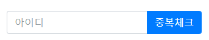

# 회원가입 유효성 검사


## 유효성 검사


### View

```jsp
<div class="card">
    <div class="card-body register-card-body">
      <p class="login-box-msg">회원가입</p>

      <form action="${path}/user/register" method="post" id="create">
        <div class="input-group mb-3">
          <input type="text" name="userId" class="form-control" placeholder="아이디" id="userId">
          <div class="input-group-append">
              <button type="button" class="btn btn-primary" id="checkId">중복체크</button>
          </div>
        </div>
        <span class="id_check" style="display: none;">아이디를 확인해주세요.</span>
        <div class="input-group mb-3">
          <input type="text" name="userName" class="form-control" placeholder="이름" id="userName">
          <div class="input-group-append">
            <div class="input-group-text">
              <span class="fas fa-user"></span>
            </div>
          </div>
        </div>
        <div class="input-group mb-3">
          <input type="email" name="userEmail" class="form-control" placeholder="이메일" id="userEmail">
          <div class="input-group-append">
            <div class="input-group-text">
              <span class="fas fa-envelope"></span>
            </div>
          </div>
        </div>
        <div class="input-group mb-3">
          <input type="password" name="userPw" class="form-control userPw" placeholder="비밀번호" id="userPw1">
          <div class="input-group-append">
            <div class="input-group-text">
              <span class="fas fa-lock"></span>
            </div>
          </div>
        </div>
        <div class="input-group mb-3">
          <input type="password" class="form-control userPw2" placeholder="비밀번호 확인" id="userPw2">
          <div class="input-group-append">
            <div class="input-group-text">
              <span class="fas fa-lock"></span>
            </div>
          </div>
        </div>
        <span class="pw_check" style="display: none;">비밀번호를 확인해주세요.</span>
        <span class="pw_input_1" style="display: none; color: green;">비밀번호가 일치합니다.</span>
        <span class="pw_input_2" style="display: none; color: red;">비밀번호가 일치하지 않습니다.</span>
        <div class="row">
          <div class="col-8">
            <div class="icheck-primary">
              <input type="checkbox" id="agreeTerms" name="terms" value="agree">
              <label for="agreeTerms">
               I agree to the <a href="#">terms</a>
              </label>
            </div>
          </div>
          <!-- /.col -->
          <div class="col-4">
            <button type="button" class="btn btn-primary btn-block" id="signUP">가입</button>
          </div>
          <!-- /.col -->
        </div>
      </form>

      <a href="${path}/user/login" class="text-center">I already have a membership</a>
    </div>
    <!-- /.form-box -->
  </div><!-- /.card -->
</div>
```


### JavaScript

```js
$(document).ready(function(){
	
	var idCheck = false;
	var pwdCheck = false;
	
	$('.userPw2').on("propertychange change keyup paste input", function(){
		
		var pw1 = $('#userPw1').val();
		var pw2 = $('#userPw2').val();
		
		if(pw1 == pw2){
			$('.pw_input_1').css('display','block');
			$('.pw_input_2').css('display','none');
			pwdCheck = true;
		}else if(pw1 == ""){
			$('.pw_input_2').css('display','block');
			$('.pw_input_1').css('display','none');
			pwdCheck = false;
		}else{
			$('.pw_input_2').css('display','block');
			$('.pw_input_1').css('display','none');
			pwdCheck = false;
		}
		
	});

	$('#checkId').click(function(){
		
		event.preventDefault();
	
		var userId = $('#userId').val();
		
		$.ajax({
	         type:"post",
	         url:"/user/checkId",
	         data :{"userId":userId},
		     success:function (data){
			 	  	if(data == 1){
						alert("중복된 아이디 입니다.");
						$('.id_check').css('display','block');
						idCheck = false;
					}else if(data == 0 && userId == ""){
						alert("아이디를 입력해주세요 입니다.")
						$('.id_check').css('display','block');
						idCheck = false;
					}else if(data == 0){
						alert("사용 가능한 아이디 입니다.")
						$('.id_check').css('display','none');
						idCheck = true
					}
				}
			}); 
	});
	
	$('#signUP').click(function(){
		var isId = $('#userId').val();
		var isName = $('#userName').val();
		var isEmail = $('#userEmail').val();
		var isPw1 = $('#userPw1').val();
		var isPw2 = $('#userPw2').val();
		
		if(isId ==""){
			alert("아이디를 입력해주세요.")
			return false;
		}
		
		if(idCheck == false){
			alert("아이디 중복을 확인해주세요.")
			return false;
		}
		
		if(isName ==""){
			alert("이름을 입력해주세요.")
			return false;
		}
		
		if(isEmail==""){
			alert("이메일 주소를 입력해주세요.")
			return false;
		}
		
		if(isPw1==""){
			alert("비밀번호를 입력해주세요.")
			return false;
		}
		if(isPw2==""){
			alert("비밀번호 확인을 입력해주세요")
		}
		
		if(idCheck==false ||pwdCheck == false){
			return false;
		}
		
		else if(idCheck&&pwdCheck){
			$("#create").submit();
		}
	});
	
});
```


## ID 중복체크


### View

```jsp
<form action="${path}/user/register" method="post" id="create">
        <div class="input-group mb-3">
          <input type="text" name="userId" class="form-control" placeholder="아이디" id="userId">
          <div class="input-group-append">
              <button type="button" class="btn btn-primary" id="checkId">중복체크</button>
          </div>
        </div>
        <span class="id_check" style="display: none;">아이디를 확인해주세요.</span>
```



### Ajax

```js

$('#checkId').click(function(){
		
		event.preventDefault();
	
		var userId = $('#userId').val();
		
		$.ajax({
	         type:"post",
	         url:"/user/checkId",
	         data :{"userId":userId},
		     success:function (data){
			 	  	if(data == 1){
						alert("중복된 아이디 입니다.");
						$('.id_check').css('display','block');
						idCheck = false;
					}else if(data == 0 && userId == ""){
						alert("아이디를 입력해주세요 입니다.")
						$('.id_check').css('display','block');
						idCheck = false;
					}else if(data == 0){
						alert("사용 가능한 아이디 입니다.")
						$('.id_check').css('display','none');
						idCheck = true
					}
				}
			}); 
	});
```


### Controller

```java
	// 아이디 중복 체크
	@ResponseBody
	@RequestMapping(value = "/checkId", method = RequestMethod.POST)
	public int checkId(@RequestParam("userId") String userId) throws Exception {
		
		System.out.println(userId);

		int result = userService.checkId(userId);

		return result;
	}
```


### Service

```java
//인터페이스 구현
@Override
public int checkId(String userId) throws Exception{
	return userDAO.checkId(userId);
}
    

```


### DAO

```java
//인터페이스 구현
@Override
public int checkId(String userId) throws Exception{
	return sqlSession.selectOne(NAMESPACE + ".checkId", 	userId);
}
```


### Mapper (SQL)

```xml
    <select id="checkId" resultType="int">
    
    	SELECT COUNT(user_id) FROM tb_user WHERE user_id = #{userId};
    
    </select>
```

