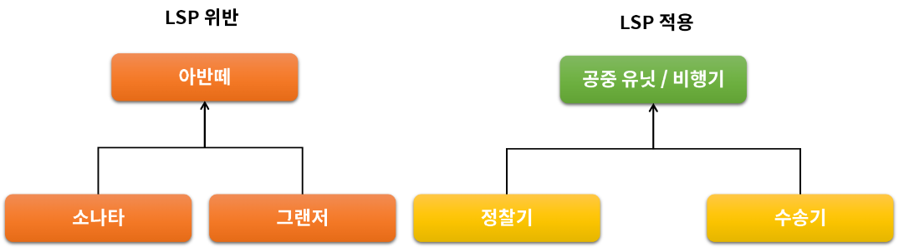

# 객체지향 설계 5원칙 (SOLID)


## 응집도와 결합도

> 좋은 소프트웨어 설계를 위해서는 결합도(coupling)는 낮추고 응집도 (cohesion)는 높여야 한다.


### 결합도

모듈(클래스) 간의 상호 의존 정도를 나타내는 지표로써

결합도가 낮으면 모듈간의 상호 의존성이 줄어들어서 객체의 재사용 및 유지보수가 유리하다.


### 응집도

하나의 모듈 내부에 존재하는 구성 요소들의 기능적 관련성으로

응집도가 높은 모듈은 하나의 책임에 집중하고 독립성이 높아져, 재사용 및 유지보수가 용이하다.


## 1. SRP (Single Responsibility Principle) 단일 책임 원칙

단일 책임 원칙 위배

```java
class Unit{
    private String name;
    private int speed;
    
    public void attack(){}
    
    public void move(){
        if(name.equals("저글링")){
            speed += 3;
        }else if(name.equals("탱크")){
            if("탱크모드"){
                speed = 0;
            }else{
                speed = 10;
            }
        }else if(name.equals("정찰기")){
            speed = 15;
            충돌 = false;
        }
    }
}
```

단일 책임 원칙 적용

```java
class 저글링 extends Unit{
    public void move(){
        this.speed += 3;
    }
}

class 탱크 extends Unit{
    public void move(){
        if("탱크모드"){
            speed = 0;
        }else{
            speed = 10;
        }
    }
}

class 정찰기 extends Unit{
    public 정찰기(){
        this.충돌 = false;
    }
    public void move(){
        speed = 15;
    }
}
```


## 2.OCP (Open Closed Principle) 개방 폐쇄 원칙

> 자신의 확장에는 열려 있고, 주변의 변화에 대해서는 닫혀 있어야 한다.

상위 클래스 또는 인터페이스를 중간에 둠으로써, 자신은 변화에 대해서는 폐쇄적이지만, 인터페이스는 외부의 변화에 대해서 확장을 개방해 줄 수 있다.

ex) 

JDBC 와 Mybatis, Hibernate

Java, Stream(Input, Out)


## 3. LSP (Liskov Substitution Principle) 리스코프 치환 원칙

> 서브 타입은 언제나 자신의 기반(상위) 타입으로 교체 할 수 있어야 한다.




## 4. ISP (Interface Segregation Principle) 인터페이스 분리 원칙

> 클라이언트는 자신이 사용하지 않는 메서드에 의존 관계를 맺으면 안된다.

프로젝트 요구 사항과 설계에 따라서 SRP (단일책임원칙) / ISP (인터페이스분리원칙)를 선택한다.


## 5. DIP (Dependency Inversion Principle) 의존 역전 원칙

> 자신 보다 변하기 쉬운 것에 의존하지 말아야 한다.

잘못된 예시


올바른 예시


# 객체지향 돌아보기

1. 내 코드에 if/else, switch가 난무 하고 있지 않은가?

2. 책임과 역할이 다른 코드가 하나의 클래스에 다 들어가 있지 않은가?

3. 절차지향적으로 한 개의 파일에 모든 코드를 넣고 있지 않은가?

4. 내가 마든 객체가 재사용이 가능한가?

   