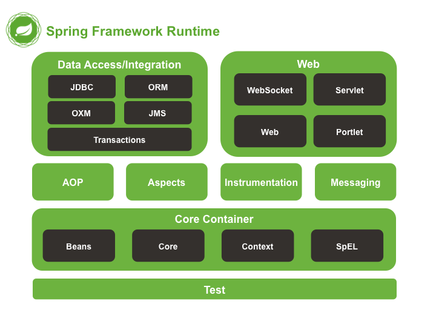

# 스프링 (Spring)

정확한 명칭은 스프링 프레임워크 (Spring Framework)


## 특징

> 결합도를 낮춰 유연한 개발이 가능

제어의 역전 (IOC), 의존성 주입 (DI), 관점 지향 프로그래밍 (AOP)


### IOC

> 프로그램의 생명주기에 대한 제어권이 웹 어플리케이션 컨테이너에 있다.

제어의 역전 (IOC : Inversion Of Control)


즉, 사용자가 직접 new 연산자를 통해 인스턴스를 생성하고 메서드를 호출하는 일련의 생명주기에 대한 작업들을 스프링에 위임할 수 있게 되는 것이다.

IOC는 직관적이지 못하기 때문에 IOC를 구현하는 방법으로는 의존성 주입 (DI) 가 있다.


초기 자바 기반 어플리케이션은 자바 객체를 생성하고 객체간의 의존관계를 연결하는 등의 제어권을 개발자가 직접 가지고 있었다. 

그러나 서블릿, EJB가 등장하면서 개발자가 독점적으로 가지고 있던 제어권이 서블릿과 EJB를 관리하는 외부의 컨테이너로 넘어갔고 객체의 생성부터 생명주기의 관리까지 모든 객체에 대한 제어권이 바뀐 것을 IOC 라고 한다.


#### IOC Container

> 모든 작업을 사용하는 쪽에서 제어하게 되면서 IoC 컨테이너에서 제어하게 되는데, 기본적으로 컨테이너는 객체를 생성하고 객체간의 의존성을 이어주는 역할을 한다.


- BeanFactory

  BeanFactory 인터페이스는 IoC 컨테이너의 기능을 정의하고 있는 인터페이스이며, Bean의 생성 및 의존성 주입, 생명주기 (lifecycle) 관리 등의 기능을 제공한다. 

  여기서 Bean 이란 IoC컨테이너에 의해 생성되고 관리되는 객체를 의미한다.

- ApplicationContext

  BeanFactory 인터페이스를 상속받는 ApplicationContext는 BeanFactory가 제공하는 기능 외에 AOP, 메세지처리, 이벤트 처리 등의 기능을 제공한다.

  모든 ApplicationContext 구현체는 BeanFactory의 기능을 모두 제공하므로, 특별한 경우를 제외하고는 ApplicationContext를 사용하는 것이 바람직하다.


### DI

> IoC를 구현하는 방법, 객체 사이에 필요한 의존 관계에 대해서 스프링 컨테이너가 자동으로 연결해주는 것

의존성 주입 (DI : Dependency Injection)

객체 사이에 필요한 의존 관계에 대해서 스프링 컨테이너가 자동으로 연결해 주는 것

스프링 컨테이너는 DI를 이용하여 빈 (Bean) 객체를 관리하며, 스프링 컨테이너에 클래스를 등록하면 스프링이 클래스의 인스턴스를 관리해준다.


#### XML 설정을 통한 DI

**applicationContext.xml**

```xml
<?xml version="1.0" encoding="UTF-8"?> 
<beans xmlns="http://www.springframework.org/schema/beans" 
       xmlns:xsi="http://www.w3.org/2001/XMLSchema-instance" xsi:schemaLocation="http://www.springframework.org/schema/beans http://www.springframework.org/schema/beans/spring-beans-4.0.xsd"> 
    
    <bean id="UserAddController" class="com.ex.web.user.UserAddController"> 
        <property name="userImpl" ref="userImpl"/>
    </bean> 
    
    <bean id="userImpl" class="com.ex.domain.logic.UserImpl"> 
        <property name="userDao" ref="userDao"/> 
        <property name="orgDao" ref="orgDao"/>
        <property name="uploadpath" value="${file.upload.path}" /> 
    </bean> 
    
    <bean id="userDao" class="com.ex.dao.ibatis.SqlMapUserDao"> 
        <property name="sqlMapClient" ref="sqlMapClient"/> 
    </bean> 
    
    <bean id="OrgDao" class="com.ex.dao.ibatis.SqlMapOrgDao"> 
        <property name="sqlMapClient" ref="sqlMapClient"/> 
    </bean> 
    
    <bean id="sqlMapClient" class="org.springframework.orm.ibatis.SqlMapClientFactoryBean"> 
        <property name="configLocation" value="WEB-INF/config/SqlMap.xml"/>
        <property name="dataSource" ref="dataSource"/> 
    </bean>

```

1~5 라인 까지는 파일 자체를 위한 내용 및 bean 태그를 사용하기 위한 선언

UserAddController 는 사용자를 등록하는 컨트롤러이며 클래스인 userImpl를 ref 태그를 사용하여 명시

userImpl는 사용자 구현체 클래스이며 해당 클래스는 인터페이스인 userDao는 ref 태그를 사용하여 명시

각각의 userDao, orgDao 인터페이스는 sql을 위한 인터페이스인 sqmMapClient를 명시


**SpringTest.java**

```java
public class SpringTest { 
    public static void main(String ar[]) { 
        ApplicationContext context = new ClassPathXmlApplicationContext("ApplicationContext.xml"); 	
        
        UserFacade userImpl = (UserImpl) ctx.getBean("userImpl"); 
        
        userImpl.사용자_정보를_조회한다(); 
        userImpl.사용자를_등록한다(); 
    } 
}
```

UserFacade 인터페이스에서 구현한 기능을 사용할 수 있다.

**소스를 수정하지 않아도 xml의 환경설정만으로 프로그램을 제어** 할 수 있다.


#### 어노테이션을 이용한 DI

@Component를 사용하여 해당 클래스를 찾아 @Autowired가 붙은 클래스를 자동적으로 객체로 만들어주고 사용할 수 있게 해준다.

또한, XML에 설정한 **auto scan**을 설정하면 해당 패키지 범위에 Component를 설정하여 사용할 수 있다.

```xml
<context:component-scan base-package="com.ex"/>
```


@Component의 확장된 어노테이션을 사용하면 스프링은 패키지 및 하위 패키지 내에서 해당 어노테이션을 찾아 인젝션을 한다.

- `@Repository` : DB에서 정보를 검색하는 DAO(Data Access Objects)에 사용
- `@Service` : 서비스 계층 클래스에 사용되며 데이터 및 비즈니스 로직 처리에 사용
- `@Controller` : UI에서 요청 처리에 사용

```java
@Controller
public class HomeContller{
    @Autowired
    private HomeServiceImpl homeService;
}

@Service("homeService")
public class HomeServiceImpl implements HomeService{
    @Autowired
    private HomeDAOImpl homeDAO;
}

@Repository("homeDAO")
public class HomeDAOImpl implements HomeDAO{
    @Autowired
    private SqlSession sqlSession;
}
```


- 의존성

  1. 의존은 변경에 의해 영향을 받는 관계를 의미한다.
  2. 한 클래스가 다른 클래스의 메서드를 실행할 때 이를 '의존한다' 라고 한다.
  3. A가 B를 사용해야만 A의 역할을 수행 할 수 있는 경우

  ex)

  CarController는 CarService에 의존한다.

  CarService의 init 메소드가 제거 혹은 이름이 변경되거나 리턴 타입이 바뀌는 등 변경이 일어나면 CarController는 영향을 받는다.

  ```java
  class CarController{
      private final CarService carService;
      private final Cars cars;
      
      private void initCars(){
          cars = carService.init();
      }
  }
  ```

  '변경에 의해 영향을 받는 관계', 의존한다는 것은 변경에 유연하지 못함을 의미한다.


		## Spring Module

> MVC 모델을 기반으로 어플리케이션을 만들려고 할 때 상당히 많은 시간을 환경설정을 위해 투자



Spring MVC 프레임워크를 사용할 때 위에 applicationContext.xml 이외의 다양한 설정을 통해 의존성을 주입한다.

Spring MVC는 DispatcherServlet, View Resolver, Interceptor, Handler, View 등으로 구성되어 있있다.


### web.xml

> DispatcherSevlet 클래스를 등록하고, url-pattern 태그에서는 요청에 대해서 응답을 받을 수 있도록 설정

인코딩 타입도 설정

```xml
<?xml version="1.0" encoding="UTF-8"?>
<web-app version="2.5" xmlns="http://java.sun.com/xml/ns/javaee"
	xmlns:xsi="http://www.w3.org/2001/XMLSchema-instance"
	xsi:schemaLocation="http://java.sun.com/xml/ns/javaee https://java.sun.com/xml/ns/javaee/web-app_2_5.xsd">

	<!-- The definition of the Root Spring Container shared by all Servlets and Filters -->
	<context-param>
		<param-name>contextConfigLocation</param-name>
		<param-value>/WEB-INF/spring/root-context.xml</param-value>
	</context-param>
	
	<!-- Creates the Spring Container shared by all Servlets and Filters -->
	<listener>
		<listener-class>org.springframework.web.context.ContextLoaderListener</listener-class>
	</listener>

	<!-- Processes application requests -->
	<servlet>
		<servlet-name>appServlet</servlet-name>
		<servlet-class>org.springframework.web.servlet.DispatcherServlet</servlet-class>
		<init-param>
			<param-name>contextConfigLocation</param-name>
			<param-value>/WEB-INF/spring/appServlet/servlet-context.xml</param-value>
		</init-param>
		<load-on-startup>1</load-on-startup>
	</servlet>
		
	<servlet-mapping>
		<servlet-name>appServlet</servlet-name>
		<url-pattern>/</url-pattern>
	</servlet-mapping>
	
	<!--한글 인코딩 설정-->
    <filter>
        <filter-name>encoding</filter-name>
        <filter-class>org.springframework.web.filter.CharacterEncodingFilter</filter-class>
        <init-param>
            <param-name>encoding</param-name>
            <param-value>UTF-8</param-value>
        </init-param>
    </filter>
    <filter-mapping>
        <filter-name>encoding</filter-name>
        <url-pattern>/*</url-pattern>
    </filter-mapping>
	
	
</web-app>
```


### servlet-context.xml (action-servlet.xml, dispatcherServlet.xml)

> 뷰 리졸버 설정 (컨트롤로에서 데이터를 받은 후 리턴할 때 뷰 이름을 지정해서 리턴)

```xml
	<!-- Resolves views selected for rendering by @Controllers to .jsp resources in the /WEB-INF/views directory -->
	<beans:bean class="org.springframework.web.servlet.view.InternalResourceViewResolver">
		<beans:property name="prefix" value="/WEB-INF/views/" />
		<beans:property name="suffix" value=".jsp" />
	</beans:bean>
```


### dataAccessContext.xml (root-context.xml)

> DB 접속 관련 정보

```xml
<?xml version="1.0" encoding="UTF-8"?>
<beans xmlns="http://www.springframework.org/schema/beans"
	xmlns:xsi="http://www.w3.org/2001/XMLSchema-instance"
	xmlns:tx="http://www.springframework.org/schema/tx"
	xmlns:context="http://www.springframework.org/schema/context"
	xsi:schemaLocation="http://www.springframework.org/schema/beans 
						http://www.springframework.org/schema/beans/spring-beans.xsd 
						http://www.springframework.org/schema/context 
						http://www.springframework.org/schema/context/spring-context.xsd
						http://www.springframework.org/schema/tx 
						http://www.springframework.org/schema/tx/spring-tx-4.1.xsd">
	
	<!-- Root Context: defines shared resources visible to all other web components -->

	<bean id="dataSource" class="org.springframework.jdbc.datasource.DriverManagerDataSource">
        <property name="driverClassName" value="net.sf.log4jdbc.sql.jdbcapi.DriverSpy"/>
        <property name="url" value="jdbc:log4jdbc:mysql://127.0.0.1:3306/kdt13?serverTimezone=UTC&amp;useSSL=false"/>
        <property name="username" value="ID" />
        <property name="password" value="PW" />
    </bean>
	
	<bean id="sqlSessionFactory" class="org.mybatis.spring.SqlSessionFactoryBean">
        <property name="dataSource" ref="dataSource"/>
        <property name="configLocation" value="classpath:/mybatis-config.xml"/>
        <property name="mapperLocations" value="classpath:mappers/**/*Mapper.xml"/>
    </bean>
    
    <bean id="sqlSession" class="org.mybatis.spring.SqlSessionTemplate" destroy-method="clearCache">
        <constructor-arg name="sqlSessionFactory" ref="sqlSessionFactory"/>
    </bean>
    
</beans>

```


### pom.xml

> 라이브러리 관리

```xml
...

<dependency>
            <groupId>org.springframework</groupId>
            <artifactId>spring-context</artifactId>
            <version>${org.springframework-version}</version>
            <exclusions>
                <!-- Exclude Commons Logging in favor of SLF4j -->
                <exclusion>
                    <groupId>commons-logging</groupId>
                    <artifactId>commons-logging</artifactId>
                </exclusion>
            </exclusions>
        </dependency>
        <dependency>
            <groupId>org.springframework</groupId>
            <artifactId>spring-webmvc</artifactId>
            <version>${org.springframework-version}</version>
        </dependency>
        <dependency>
            <groupId>org.springframework</groupId>
            <artifactId>spring-jdbc</artifactId>
            <version>${org.springframework-version}</version>
        </dependency>
        <dependency>
            <groupId>org.springframework</groupId>
            <artifactId>spring-test</artifactId>
            <version>${org.springframework-version}</version>
        </dependency>

        <!--MySQL 라이브러리-->
        <!-- https://mvnrepository.com/artifact/mysql/mysql-connector-java -->
        <dependency>
            <groupId>mysql</groupId>
            <artifactId>mysql-connector-java</artifactId>
            <version>5.1.41</version>
        </dependency>

        <!--MyBatis 라이브러리-->
        <!-- https://mvnrepository.com/artifact/org.mybatis/mybatis -->
        <dependency>
            <groupId>org.mybatis</groupId>
            <artifactId>mybatis</artifactId>
            <version>3.4.1</version>
        </dependency>

        <!--MyBatis-Spring 라이브러리-->
        <!-- https://mvnrepository.com/artifact/org.mybatis/mybatis-spring -->
        <dependency>
            <groupId>org.mybatis</groupId>
            <artifactId>mybatis-spring</artifactId>
            <version>1.3.0</version>
        </dependency>

        <!--MyBatis 로그-->
        <!-- https://mvnrepository.com/artifact/org.bgee.log4jdbc-log4j2/log4jdbc-log4j2-jdbc4 -->
        <dependency>
            <groupId>org.bgee.log4jdbc-log4j2</groupId>
            <artifactId>log4jdbc-log4j2-jdbc4</artifactId>
            <version>1.16</version>
        </dependency>

...
```


## Spring boot

> Spring 처럼 환경설정을 하지 않아도 실행 할 수 있는 것

Spring boot 공식 사이트에 나와 있는 문언

```
Spring Boot makes it easy to create stand-alone, production-grade Spring based Applications that you can "just run".
```

"단지 실행만 해라"

Spring 처럼 설정하지 않고 바로 실행 할 수 있는 것이 Spring boot


### Spring Boot Starter

>  기존에는 스프링을 사용할 때 버전까지 명시하고 버전에 맞는 설정을 했지만, 스프링부트는 버전 관리를 스프링 부트에 의해서 관리

아래처럼 spring-boot-starter-web 을 사용하면 종속된 모든 라이브러리를 알맞게 찾아서 함께 가져오기 때문에 종속성이나 호환 버전에 대해 신경 쓸 필요가 없다.

```xml
<depndency>
	<groupid>org.springframework.boot</groupid>
    <artifactld>spring-boot-starter-web</artifactld>
</depndency>
```


spring-boot-starter-web은 다음과 같은 의존성이 추가 된다.

- starter-web
- starter-webmvc
- spring-boot-starter-tomcat
  - tomcat-embed-core
  - tomcat-embed-logging-juli


spring-boot-starter-test를 쓰고 싶다면

```xml
<depndency>
	<groupid>org.springframework.boot</groupid>
    <artifactld>spring-boot-starter-web</artifactld>
</depndency>
<depndency>
	<groupid>org.springframework.boot</groupid>
    <artifactld>spring-boot-starter-test</artifactld>
    <scope>test</scope>
</depndency>
```


### Embed Tomcat

Spring boot는 내장형 톰캣을 가지고 있기 때문에 별도의 톰캣을 설정할 필요가  없으며, 그렇기 때문에 독립적으로 실행 가능한 jar로 손쉽게 배포가 가능하다.


### AutoConfigurator

공통적으로 필요한 DispatcherServlet 같은 설정을 어노테이션을 이용하여 대신할 수 있도록 해준다.

스프링 부트의 main 메서드는 @SpringBootApplication 어노테이션을 가지고 있는데 이것은

ComponentScan + configuration + EnableAutoConfiguration을 합친 어노테이션이다.


