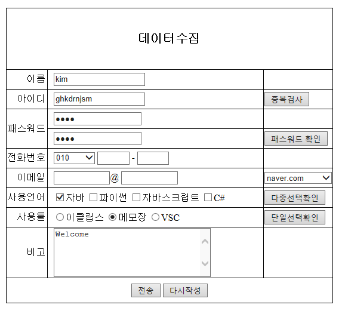

# HTML, CSS 활용

## mystyle.css

```CSS
	table{
		border : solid 1px black;
		border-collapse : collapse;
		margin : 50px auto;
	}

	td{
		border : solid 1px black;
		border-collapse : collapse;
	}
	
	#action_btn{
		text-align:center;
		height : 40px;
	}
	.title{
		text-align:right;
		padding-right: 3px;
	}
	
	th{
		height : 100px;
		font-size : 20px;
	}
	.data{
		width : 350px;
		height : 30px;
		padding-left : 10px;
	}
```


## data_coolection.html

```html
<!DOCTYPE html>
<html>
<head>
<meta charset="UTF-8">
<title>Data Collection</title>

<link rel="stylesheet" href="../css/mystyle.css">


</head>
<body>

<!--  3(column) X (row) 10 테이블 생성 -->
<form action="" method="">
	<table>
		<tr>
			<th colspan=3>데이터수집</th>
		</tr>
		
		<tr>
			<td class="title">이름</td>
			<td class="data"><input type='text' name="user_name" value="kim"></td>
			<td></td>
		</tr>
		
		<tr>
			<td class="title">아이디</td>
			<td class="data"><input type='text' name="user_id" value="ghkdrnjsm"></td>
			<td><input type="button" value="중복검사"></td>
		</tr>
		
		<tr>
			<td class="title" rowspan="2">패스워드</td>
			<td class="data"><input type='password' name="password" value="1234"></td>
			<td></td>
		</tr>
		
		<tr>
			<td class="data"><input type='password' name="password2" value="1234"></td>
			<td>
				<button>패스워드 확인</button>
			</td>
		</tr>
		
		<tr>
			<td class="title">전화번호</td>
			<td class="data">
			<!-- <input type='text' size="3" name="phone_no1"> - -->
			<select name="phone_no1">
				<option>--선택--</option>
				<option selected="selected">010</option>
				<option>051</option>
				<option>02</option>
			</select>
			 
			<input type='text' size="3" name="phone_no2"> - 
			<input type='text' size="3" name="phone_no3">
			</td>
			<td></td>
		</tr>
		
		<tr>
			<td class="title">이메일</td>
			<td class="data">
				<input type='text' size="10" name="email1">@
				<input type='text' size="10" name="email1">
			</td>
			<td>
				<select name="email">
					<option>--이메일 선택--</option>
					<option>nate.com</option>
					<option selected="selected">naver.com</option>
					<option>google.com</option>
				</select>
			</td>
		</tr>
		
		<tr>
			<td class="title">사용언어</td>
			<td class="data">
				<input type='checkbox' name="langs" checked="checked">자바
				<input type='checkbox' name="langs">파이썬
				<input type='checkbox' name="langs">자바스크립트
				<input type='checkbox' name="langs">C#
			</td>
			<td><button>다중선택확인</button></td>
		</tr>
		
		<tr>
			<td class="title">사용툴</td>
			<td class="data">
				<input type='radio' name="tools">이클립스
				<input type='radio' name="tools" checked="checked">메모장
				<input type='radio' name="tools">VSC
			</td>
			<td><button>단일선택확인</button></td>
		</tr>
		
		<tr>
			<td class="title">비고</td>
			<td class="data">
				<textarea rows="5" cols="30" name="etc">Welcome</textarea>
			</td>
			<td></td>
		</tr>
		
		<tr>
			<td colspan=3 id="action_btn">
				<input type="submit" value="전송">
				<input type="reset" value="다시작성">
			</td>
	
		</tr>
		
	</table>
</form>

<br>
<a href="./form_copy.html">Page</a>

</body>
</html>
```


